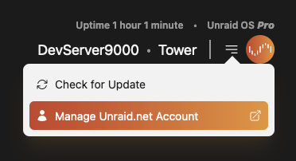
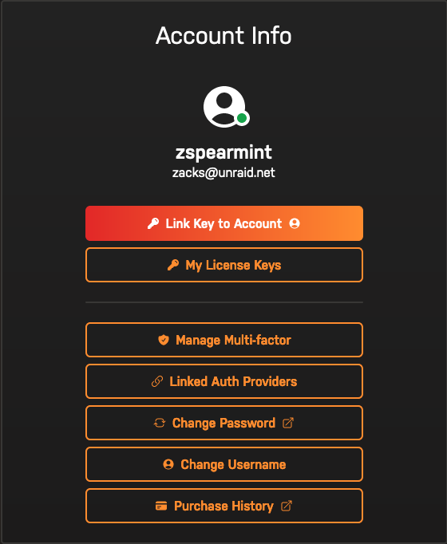
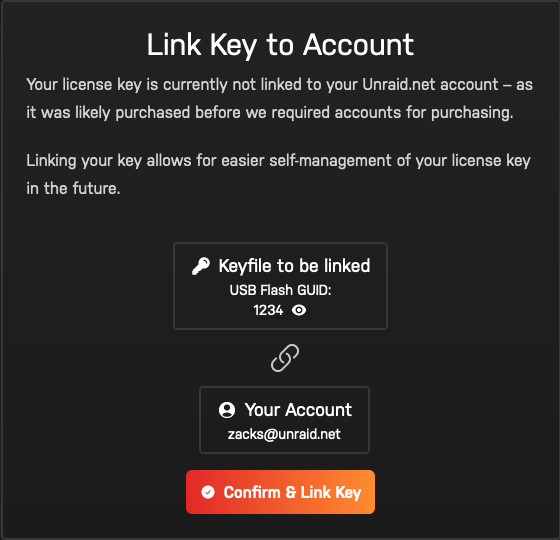
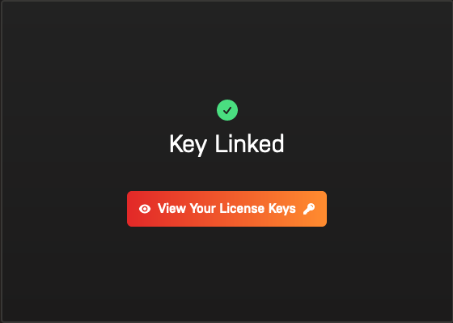
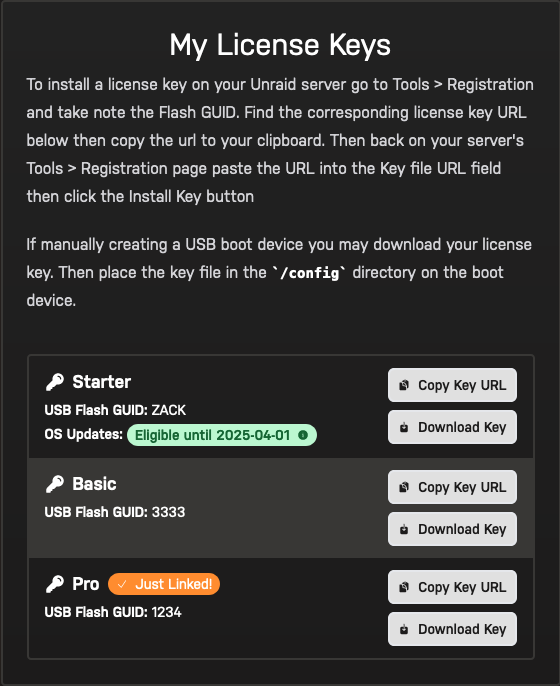

# Link a license key to an Unraid.net account

:::important

This process requires Unraid 6.12.8 or higher, or the [Unraid Connect](/connect/index.md) plugin.

Trial keys are not eligible to be linked.

:::

1. Go to your Unraid server, open the dropdown in the top-right and click **Manage Unraid.net Account**

   

2. On the next page click **Link Key to Account**

   

3. Then **Confirm & Link Key** to link your license key to your account

   
   

4. Moving forward you'll be able to find the linked license key on the [My License Keys](https://account.unraid.net/keys) page of your [Unraid.net account](https://account.unraid.net/).

   

:::tip

Questions about the linking process? Please [contact us](https://unraid.net/contact)

:::
