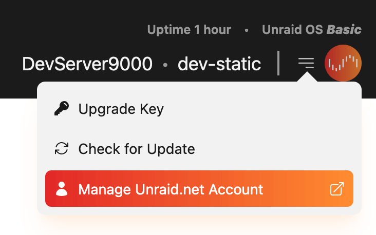
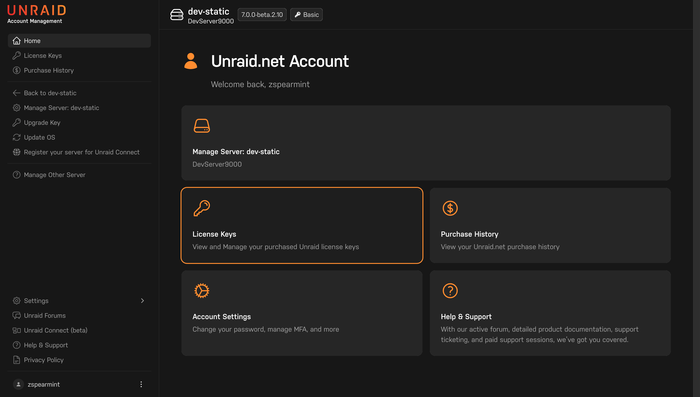
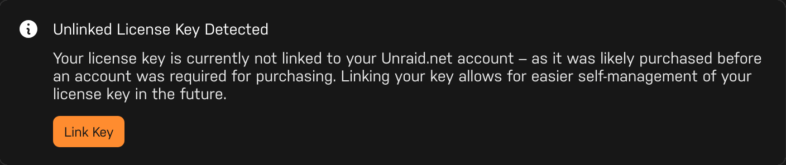
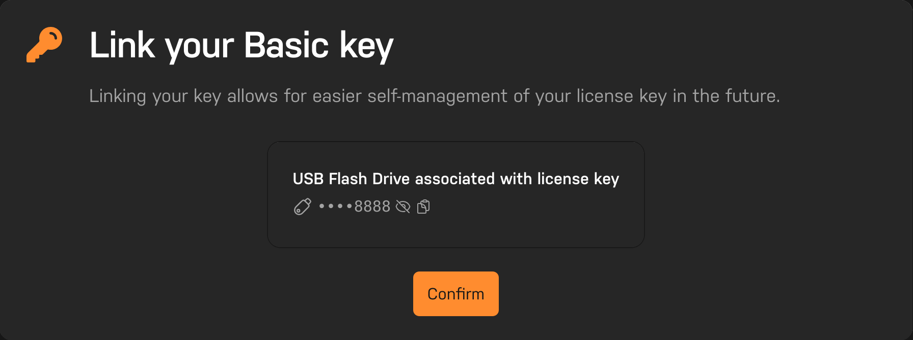

# Link a license key to an Unraid.net account

:::important

This process requires Unraid 6.12.8 or higher, or the [Unraid Connect](/connect/index.md) plugin.

Trial keys are not eligible to be linked.

:::

1. Go to your Unraid server, open the dropdown in the top-right and click **Manage Unraid.net Account**

   

2. On the next page click **License Keys**

   

3. Then **Link Key** in the "Unlinked License Key Detected" section.

   

4. Lastly, confirm by clicking the **Confirm** button on the Link Key page

   

5. Once your key has successfully been linked to you account you'll be able to find the linked license key on the [License Keys](https://account.unraid.net/keys) page of your [Unraid.net account](https://account.unraid.net/).

:::tip

Questions about the linking process? Please [contact us](https://unraid.net/contact)

:::
