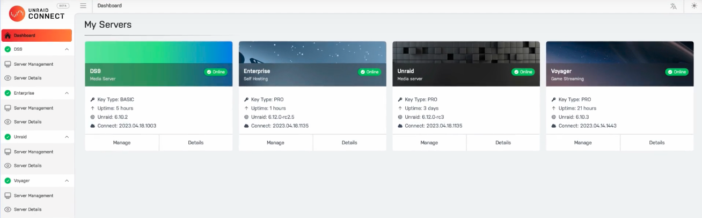
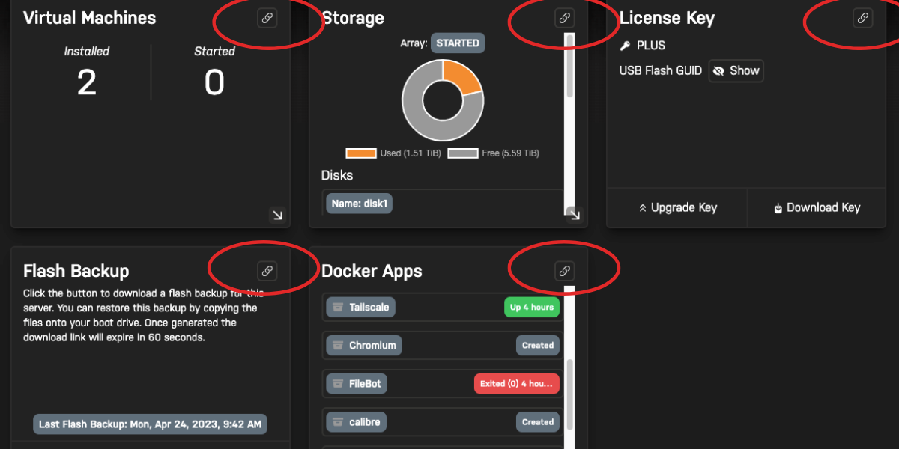

# Unraid Connect Help

## [**How to Install**](https://connect.myunraid.net/help)

1. Please make a local backup of your USB flash drive. This can be done
   from the Main \> Flash page. In the event you need to revert to your
   previous stable installation, you can use the USB Flash Creator from
   our website to restore this backup zip file to your flash drive.
2. Download Connect from Community Applications
3. Sign In With Your Unraid.net Account Credentials - Click the top
   right corner of your Unraid server, and click Sign In. Follow the
   prompts to sign in with your Unraid.net credentials, or create a new
   account.
   
4. Register Your Server with Unraid Connect by following the
   prompts
5. Come Back to [This Page](https://connect.myunraid.net/help) and
   Click Continue.

## **Unraid Connect Dashboard**

Sign in to the Unraid Connect Dashboard:

> <https://connect.myunraid.net>

for a comprehensive overview of your Unraid server's online/offline status,
available storage, license type, uptime, Unraid OS version, and more.

If you have multiple servers, you will see each one listed in the
left-side pane and a tile for each server.

From here, you can get more details about each server by clicking on
"Details".

### **Manage Your Server From Within the Connect UI**

Servers equipped with a myunraid.net certificate can be managed directly
from within the Connect web UI.

You can even manage multiple servers from your phone, tablet, laptop, or
PC in the same browser window.

To install a myunraid.net certificate, head to the _Settings -\>
Management Access_ page of the Unraid webgui and click "Provision" in
the Certificate section, if applicable.

### A note regarding DNS Rebinding Protection

If you see this
message after clicking the **Provision** button, click **OK**, try
waiting 2-5 minutes, then click **Provision** again. If that doesn't
work, keep reading.

Many routers have a security feature known as DNS Rebinding Protection.
This feature prevents public DNS entries from pointing to local IP
addresses on your network. Unfortunately, this _feature_ prevents us
from providing proper SSL access when connecting to the webGui locally.
As such, users must either disable this feature on their router or set
their router to allow DNS rebinding for the myunraid.net domain (if the
certificate was provisioned in Unraid 6.10) or unraid.net domain (if the
certificate was provisioned in 6.9) Depending on your router, how this
feature is described and whether or not it is available to configure may
vary. In addition, once you have DNS rebinding disabled on your router,
when you go to provision your certificate, you may still see the DNS
rebinding error message the first time. This is due to the time it takes
for DNS records to propagate once provisioned.

### How to access your server when DNS is down

Once you enable local SSL per the instructions above, you will access
your server through a Fully Qualified Domain Name:

`https://ip.yourpersonalhash.myunraid.net` or
`https://ip.yourpersonalhash.myunraid.net:`<https_port> (if your https
port is not the default of 443)

This is required in order to utilize a fully valid SSL certificate. A
downside is if you temporarily lose Internet access and your browser has
not cached the DNS for yourpersonalhash.unraid.net, you will be unable
to access the webgui.

If the Internet goes down and you lose access to DNS, do the following:

- If **Use SSL/TLS** is set to **Yes**, then you can access your server
  using: [`https://[servername]`](https://%5Bservername%5D)`.[localTLD]`
  or
  [`https://[servername]`](https://%5Bservername%5D)`.[localTLD]:`<https_port>
  (if your https port is not the default of 443)
- If that doesn't work, or if **Use SSL/TLS** is set to **Strict**, then
  using telnet, SSH or local keyboard/monitor log in to the server and
  type: `use_ssl no`
- Now you will be able to access your server's webgui via:
  [`http://`](http://)<ip_address> (note: http not https) or
  [`http://`](http://)<server_ip>`:`<http_port> (if your http port is
  not the default of 80)
- When the Internet comes back, navigate to Settings -\> Management
  Access and set **Use SSL/TLS** back to **Strict** to re-enable local
  SSL.

### How to disable SSL for local access

(If you currently cannot access the webgui, scroll up to the previous
topic.) If you decide you would rather not use the secure
`https://ip.yourpersonalhash.myunraid.net` url for local access, you can
disable SSL. There is no need to uninstall the Unraid Connect plugin, in
fact that will have no effect on SSL as this is a core feature of Unraid
and not the plugin.

Navigate to Settings -\> Management Access, set **Use SSL/TLS** to
**No** and hit Apply. In Unraid 6.9 this will also disable the Remote
Access feature at the same time.

## **Automated Flash Backup**

Unraid Connect offers users the ability to automatically back up your OS
configuration settings to our cloud. In the event of flash device
failure, you can download a zip file of your latest backup and restore
it to a new flash drive using the USB Flash Creator.

Note: Flash Backup is an optional feature, not required to use the rest
of Unraid Connect.

### Enabling Flash Backup (optional)

Until we are able to fully encrypt the flash backups on our servers, we
exclude all sensitive data owned by the OS from the backups, including
Unraid account passwords and WireGuard encryption keys. However, the
backups do include docker template XML files, which may contain
application-specific passwords and other private data. We are actively
working on solutions to encrypt the backups.

1. Navigate to Settings -\> Management Access -\> Connect and under
   **Flash backup** click the **Activate** button.
2. Wait for the activation and initial backup job to complete (once
   done, it will show **Activated: Up-to-date**.

Once activated, any changes to the OS configuration will automatically
be replicated to the backup in our cloud servers (within 1-2 minutes of
the change).

**Important**: Backups from the flash device do not include the
config/shadow or config/smbpasswd files. User accounts are preserved,
but their passwords are not. This means that when you restore from
backup, you will need to set passwords for your users including root. We
also don't store any of your WireGuard keys.

This flash backup service backs up your configuration, it is not a 1:1
backup of the contents of your flash drive. If you have custom scripts
that you want to include in the backup, please put them in
/boot/config/custom/. Also note that we backup the plugin configuration
files but not the application files, as those will automatically be
downloaded when you reboot.

### Restoring Flash Backup

1. Login to Unraid Connect.
2. Select Details.
3. Click **Generate flash backup** from the Flash backup tile.
4. This will combine your OS configuration data with the OS release
   version you were running and put them both into a zip file that can
   be used with our flash creator tool to restore the backup to a new
   flash device.
5. After the backup has been generated, you can click **Download flash
   backup** to obtain it.
6. Use the Unraid USB Flash Creator to restore your backup to a new
   flash drive.

===Additional Steps Required=== Once you boot the OS, there are only a
few things you will need to reconfigure:

1. On the Settings -\> Management Access -\> Unraid.net page, click to
   Activate your flash backup again.
2. On the Users page, for each user (including root), you will need to
   reset your passwords.
3. On the Settings \> VPN Manager page, for each tunnel and peer:
   - Click the key icon. Click "Generate Keypair" and "Generate Key",
     start each tunnel, then download the new client configuration to
     each associated client device.
4. If your server does not have Internet access when you reboot then
   you will need to go to Community Apps -\> Previous Apps and
   reinstall your plugins once you have Internet access. The
   configuration files will be on your system ready to use once the
   application files have been installed.

## **Server Deep Linking**

Deep linking allows you to manage relevant sections of the Unraid webgui
in one click. Click any of the circled link buttons to take you right to
the relevant page in the Unraid webgui:

## **Customizable Dashboard, Server Banner Image and Themes**

Set custom server tiles how you like and automatically display your
server's banner image on your Connect Dashboard.

Under Server Details, there is a hamburger button on each tile for east
drag and drop arranging.

To toggle between dark and light mode, click the Sun or Moon icon in the
far right of the Connect UI.

## **License Management**

Manage your license keys at any time via the My Keys section. You can
even upgrade right from the Connect UI.

## **Language Localization**

Unraid OS has a global user base so be sure to enjoy Unraid Connect in
English, German, French, Spanish or Chinese!

## Signing Out

In the event that you wish to sign out of the Unraid Connect program on
your system, you can do so from the Settings-\> Management Access -\>
Unraid Connect -\> Account Status and click the Sign Out button.

**NOTE**: Signed-out servers will still be displayed on the Unraid
Connect Dashboard, but you will only be able to download their
registration key(s).

## Uninstalling the plugin

Note: if your goal is to change your url from
`https://yourpersonalhash.unraid.net` back to `http://computername`, see
[How to disable SSL for local access](#how-to-disable-ssl-for-local-access).
Uninstalling the plugin will have no effect on your url!

Uninstalling the plugin will automatically:

- Deactivate and delete the backup files from your flash drive. We will
  provide a way to remove them from our server later.
- Disable Remote Access and delete the corresponding DDNS entry. Please
  remember to disable any port forward that you configured in your
  router related to this feature.
- Sign Out from Unraid.net.

## Privacy

Maintaining your data integrity, security, and privacy are of the utmost
importance to us at Lime Technology. Below is a disclosure of what we
store and relay when you use Unraid Connect. For more information,
please see our [policies](https://unraid.net/policies) page.

### Data We Store

When a server signs in to Unraid.net, it opens a secure connection to
our hosted infrastructure and sends just enough data so we can give you
a meaningful overview of your servers in the [Unraid Connect
Dashboard](https://connect.myunraid.net). We do not keep
historical data, just the most recent update from your server which
includes:

- Your server's hostname, description, and icon
- Your server's keyfile details and flash GUID
- Your server's Local Access URL
- Your server's LAN IP, if an unraid.net certificate is installed
- Your server's Remote Access URL and WAN IP, if Remote Access is
  enabled
- The version of Unraid that is installed, and its uptime
- The version of the Unraid Connect plugin that is installed, and
  version / uptime of the unraid-api
- The size of your array and the amount used (just numbers, no details
  about what is stored on the array)
- The number of Docker Containers and VMs installed and started

Separate and unrelated to the Unraid Connect Dashboard, the Flash Backup
service stores your server's configuration data.

This data is stored solely for the purpose of providing services to you
through our platform and is not publicly accessible. To remove this data
from our servers you must follow the procedure listed in the
"Uninstalling the plugin" section as well as remove all SSL certificates
generated for you through our Let's Encrypt partnership.

### Flash Backups are Not Encrypted

It is important to note that at this time, all backups of your flash
device are stored in our cloud in a non-encrypted format. This is why we
do not store the sensitive data mentioned below.

### Sensitive Data

Until we are able to fully encrypt the flash backups on our servers, to
ensure absolute privacy and integrity we have a few hard and strict
policies regarding the storing of sensitive data. We do not store:

- Unraid root or user account passwords
- Public, private, or shared WireGuard keys

## Connect Troubleshooting

It should be rare, but if you see any connection error messages in the
UPC please open a terminal window and type:

`unraid-api restart`

If you have other Unraid Connect Support related questions, please see
our [Unraid Connect user forum](https://forums.unraid.net/) or [contact
us](https://unraid.net/contact) to open a support ticket.
