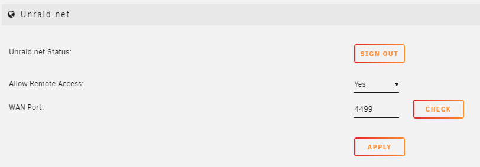
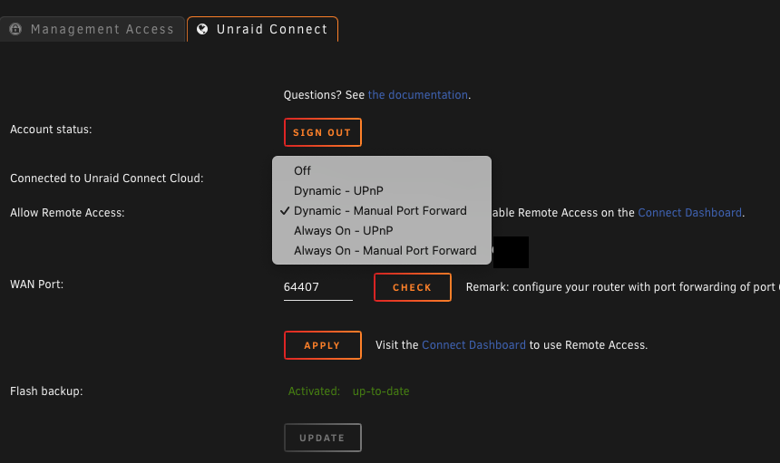
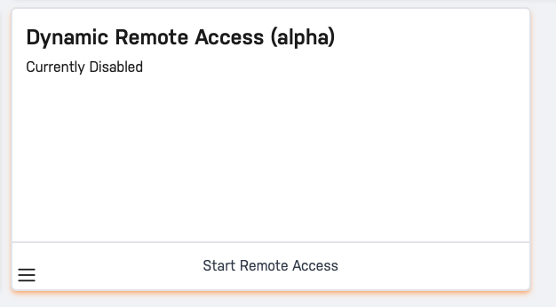
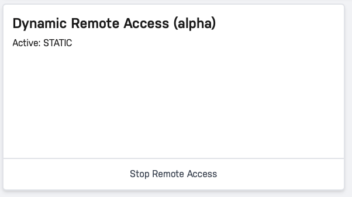

# Remote Access

The Remote Access feature
allows you to access your Unraid webgui from the Internet. If you need
access to Docker containers, network drives, or other devices on your
network, you'll want to [setup a
VPN](/unraid-os/manual/security.md#vpn) instead.

**Note: Before enabling remote access, consider your root password. Is
it sufficiently complex? Update your root password on the Users page.**

Also note: **Remote Access is an optional feature**, and is not required
to use the rest of Unraid Connect.

## Remote Access - **Initial Setup**

1. From Unraid webGUI Navigate to **Settings** → **Management Access**
2. Note the **HTTPS port**, it defaults to port 443. If you have Docker
   containers running on this port, choose an unused port over 1000
   such as 3443, 4443, 5443, etc.
3. If you changed any of the above settings, hit **Apply** for them to
   take effect.
4. In the **CA-signed certificate file** area, click **Provision**

### Remote Access - **Choose Remote Access Type**

There are two kinds of Remote Access provided through Unraid Connect:
**Dynamic Remote Access** and **Static Remote Access**

**Dynamic Remote Access** enables access to your webGUI from the
internet only when needed, and leaves the webGUI inaccessible from WAN
otherwise. This feature works with both UPNP as well as static port
forwarding and uses an API call through the Unraid Connect plugin to
open your webGUI to internet traffic, closing it automatically when not
needed. This helps to prevent automated attacks.

**Static Remote Access** enables your server to listen to WAN traffic at
all times, allowing your server to be accessed from the internet.

## **Dynamic Remote Access**

To use Dynamic Remote access, first set the type you would like to use
in the **Management Access → Unraid Connect** settings page. Choose one
of the Dynamic settings in the Remote Access dropdown:

1. **Dynamic - UPNP**
   - This option enables dynamic access through the Connect dashboard,
     as well as automatically opening and closing a random port on
     network with UPNP. To use this option your router must have UPNP
     enabled.
2. **Dynamic - Manual Port Forward**
   - This option enables dynamic access through the Connect dashboard,
     but requires manual port forwarding.

#### Dynamic Remote Access Usage

1. Navigate to [Unraid Connect](/connect/help.md#unraid-connect-dashboard), then to
   either the management page or the server details view
2. You will be presented with a new **Dynamic Remote Access** card,
   with a button that will be enabled if your server is not accessible
   from your current
   location.

   

3. Clicking the button will trigger your server to enable wan access,
   and if using UPNP, create a new UPNP port forward lease on your
   router. This can take up to a minute to complete
   - When using UPNP, a 30 minute lease will be created, which will be
     renewed automatically while Dynamic Remote Access is enabled.
4. After enabling, the card will report the status of the enabling
   process, and what the current state of UPNP is.
5. After ten minutes of inactivity, or clicking "Disable Remote
   Access", your server will automatically turn off access from WAN
   traffic.
   - When using UPNP, your server will also attempt to remove the UPNP
     lease from your router.

### Configuring **UPNP** (Applies to Dynamic - UPNP / Always On - UPNP)

1. Ensure your router supports UPNP and has it enabled.
2. Navigate to Settings -\> Management Access and set "Use UPnP" to
   Yes.
3. On the Unraid Connect settings page, set the remote access option to
   UPNP (either Dynamic or Always On) and Apply.
4. **(Always on Forwarding Only)** : Press the **Check** button. If the
   port is forwarded correctly you will see a message saying "Your
   Unraid Server is reachable from the Internet"
   - Note: When using Dynamic forwarding, you will not be able to
     access your server from this manual port forward unless you click
     the Enable Dynamic Remote access button in [Unraid
     Connect](/connect/help.md#unraid-connect-dashboard).
5. Note: If the setting changes from UPnP to "Manual Port Forward" when
   you reload the page, then we were not able to communicate with your
   router to enable UPnP. It may need to be enabled on your router, or
   perhaps the router needs a firmware update to use it.

### Configuring **Manual Port Forwarding** (Applies to Dynamic - Manual Port Forward / Always On - Manual Port Forward)

1. Set the **WAN port** you want to use. We highly recommend you choose
   a random port over 1000 rather than using the default of 443. i.e.
   something like 13856, 48653, etc
2. Click **Apply**
3. Setup your router to port forward the **WAN port** you specified to
   the **HTTPS port** used by the server. There is a note on the screen
   telling you the exact ports and IP to use.
   - Note: some routers require that the **WAN port** match the **HTTPS
     port**. In that case, we'd recommend setting both to the same high
     random number.
4. **(Always on Forwarding Only)** : Press the **Check** button. If the
   port is forwarded correctly you will see a message saying "Your
   Unraid Server is reachable from the Internet"
   - Note: When using Dynamic forwarding, you will not be able to
     access your server from this manual port forward unless you click
     the Enable Dynamic Remote access button in [Unraid
     Connect](/connect/help.md#unraid-connect-dashboard)
5. To access your server using Remote Access, login to [Unraid
   Connect](/connect/help.md#unraid-connect-dashboard) and click the Manage link

===Optional step for secure local access=== If you want to use secure
https for local access to your server as well, navigate to Settings -\>
Management Access. In the CA-signed certificate area, if there are no
warnings about DNS Rebinding then go ahead and set **Use SSL/TLS** to
**Strict**. If there are warnings about DNS Rebinding see [A note
regarding DNS Rebinding
Protection](/connect/help.md#a-note-regarding-dns-rebinding-protection).

Note that once SSL is set to Strict, your client computers will need
access to DNS in order to access your server. This means if your
Internet connection drops you will likely lose access to your server's
webgui. See [How to access your server when DNS is
down](/connect/help.md#how-to-access-your-server-when-dns-is-down).
