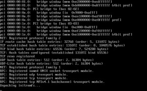

# Advanced BIOS configuration guide

Configuring your motherboard BIOS (as well as your storage controller) correctly is an important step to ensuring a solid experience using Unraid. The basic guidelines are as follows:

* You must configure the USB flash device as the primary boot device (most motherboards support this).
* Your storage controller should support AHCI and SATA connections and be configured in standard HBA mode (not RAID mode).
* Enable any and all virtualization support in your BIOS if your hardware supports it or you wish to create virtual machines (Intel
  VT-x / AMD-V).
* Enable IOMMU support in your BIOS if your hardware supports it or you wish to assign physical PCI devices (GPUs, media controllers, USB controllers, etc.) to virtual machines.
* Avoid using front panel USB ports in favor of ports available directly on the motherboard I/O panel.

If after configuring your BIOS you cannot get Unraid to boot properly, try the following:

* Set the boot order to as follows: Forced-FDD, USB-HDD, USB-ZIP
* Try disabling USB 2.0/3.0 support (this will default to USB 1.1).
* Try switching on or off any Fast Boot feature.
* Try switching on or off USB keyboard support.

If you are still unable to boot the OS, please post a message in our [general support](https://forums.unraid.net/forum/index.php?board=71.0) forum.

:::important

Many motherboards support only up to 12 hard drives for purposes of boot selection. This is normally not an issue for Unraid® OS. However, if your Flash device is recognized by the bios as a hard drive, you may not be able to boot from the Flash after installing your 12th “real” hard drive. To avoid this, if possible set up your bios so that the Flash is treated as a removable device.

:::

## Boot Mode Selector (Syslinux)

After configuring your BIOS and booting from the Unraid flash drive, you will be prompted with the Unraid Server OS boot menu on a directly-attached monitor (or via IPMI if your server supports that feature).

There are a number of standard options available for you to select:

* **Unraid OS (Headless)**

The standard boot mode for Unraid Server OS, headless mode utilizes less memory than desktop mode but relies on the use of another device capable of running a web browser to access the WebGUI for management. If a monitor is attached then a console login will be displayed that can be used to access the Linux command line on the server.

* **Unraid OS GUI Mode**

Loads a lightweight desktop interface on a directly attached monitor with a quick-launch menu for accessing the WebGUI, product documentation, and useful Linux utilities including a bash shell, midnight commander, and htop. This mode may be helpful for users trying to diagnose network connectivity problems or for users that don't have a separate device to use for connecting to the WebGUI.

The management interface presented in this mode is the same one that is displayed when running the system in [headless mode](https://en.wikipedia.org/wiki/Headless_software) and accessing the server remotely using a web browser.

* **Unraid OS Safe Mode (no plugins, no GUI)**

In this mode, Unraid suppresses loading any plugins that the user may have installed. Use this boot mode to diagnose if plugins are causing stability issues on your system.

* **Unraid OS GUI Safe Mode (no plugins)**

In this mode, Unraid suppresses loading any plugins that the user may have installed. Use this boot mode to diagnose if plugins are causing stability issues on your system.

* **MemTest86+**

If you suspect faulty RAM on your system, you can use MemTest86+ to test it. Please post in the [general support](https://forums.unraid.net/forum/index.php?board=71.0) forum for assistance in using this tool.

The MemTest86+ tool supplied with Unraid will only work correctly if you are booting in non-UEFI (legacy) mode. If you want a version that can be run when booting in UEFI mode then you need to download your own copy from the MemTest86+ [web site](http://www.memtest.org/).

:::note

If you use Error-Checking and Correcting RAM (ECC) RAM in your Unraid server then MemTest86+ will not normally detect faulty RAM modules unless you have disabled the ECC feature in the BIOS (since the ECC feature automatically corrects any RAM error it detects).

:::

The user can change the boot menu to add additional options or amend existing ones by editing the `syslinux/syslinux.cfg` file on the flash drive or by clicking on the flash drive on the Main tab within the Management interface and using the **Syslinux Configuration** section on the resulting dialog.
