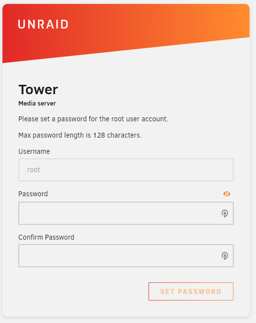
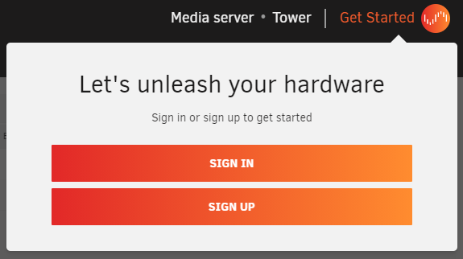
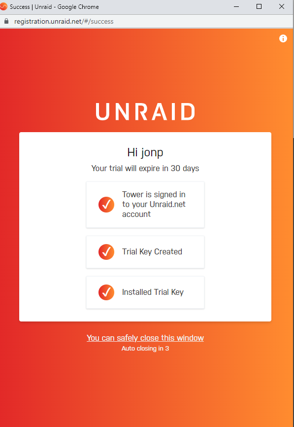

# Quick install guide

## Create your bootable media with Unraid OS

1. Insert a quality USB flash device into your Mac or PC.
2. Download the [USB Flash Creator](https://unraid.net/download) and use it to install Unraid OS onto your USB flash device, or use the [Manual install method](./manual-install-method.md).
3. Remove the flash device from your PC and plug it into your server.
4. Boot into your server's BIOS settings and make the following changes:
    * Configure the system to boot from the USB flash device.
    * Enable hardware virtualization-specific features (including IOMMU).  
    You can find more details on BIOS configuration in the [Advanced BIOS configuration](./advanced-bios-config.md) guide.
5. Save your BIOS configuration changes and exit to boot Unraid OS.

## Setting up the Unraid OS

Once Unraid OS has booted, you can now bring up the browser-based management utility, a.k.a. the WebGUI, and complete your system configuration.

### Connecting to the Unraid WebGUI

There are two methods to connect to the WebGUI in Unraid, and you can always:

* Boot Unraid in GUI mode and login (username is `root`, no password by default).
* Open a web browser from your Mac or PC and navigate to `http://tower.local`

:::important

Note that as soon as the Unraid server is booted up, it will be available on your local area network. This means you can simply type  the IP address of the computer hosting the Unraid server in a browser address bar.

Also, if you configured a different host name in the USB Flash Creator, use that name instead of `tower`.

:::

### Setting a root password

Once you are connected to the WebGUI, you will immediately be prompted to set a strong root password.  

Strong passwords are unique (not reused), have at least 8 characters (the more the better), are a combination of alphabetic, numeric, and special characters, and are not common dictionary words. Better yet, use a 3rd party password manager.

<!-- Later on, if you need to change the password, you can follow [these instructions]()-->

:::tip

If you happen to forget your root password, the steps to reset it can be found [here](../guides/reset-password.md).

:::

### Registering and installing your license key

Once a root password is set, you will be logged into the WebGUI. Now you need to sign in to Unraid.net and obtain a license key.

1. **Sign in** or **Sign up**, in the **Get Started** section in the top-right of the WebGUI.
  
2. Upon signing in, a trial key will be downloaded and installed to your system automatically.  
    
The purpose of the sign-in is to provide a way for you to manage your license keys for Unraid OS (obtain a trial key, purchase a paid key, recover a lost key, replace your key with a new flash device, or upgrade a key from one edition to another).

:::important

In Unraid versions 6.9 and earlier, registering for a Trial, installing a key, or purchasing a key is done from ***Tools > Registration***.

:::

### Assigning Devices to the Array and Pool(s)

After installing a registration key, you are ready to begin assigning devices for Unraid to manage.

You assign devices in the ***Main*** tab from the Unraid WebGUI. On this page, you can see a list of Array device and Pool device assignments, as well as any unassigned devices and the boot device.  

Unraid OS uses drives for different functions:

* **Array devices** are your general storage in Unraid. They fall in two categories: parity and non-parity. Parity devices provide fault tolerance in case your array suffers data loss. If you need to replace a faulty drive, these are used to rebuild your array. You can have up to two parity drives.  Your non-parity devices contain your custom shares and folders, as well as any files you add to them, like media files.
* **Pool Devices** are your cache storage, usually a high-performing device which can read and write at speeds far greater than an HDD. Pool devices are used to temporarily store files until they are offloaded to the array.
* The **Boot Device** is the USB flash device used to boot Unraid OS from.

Use the dropdowns to select disks for your array (parity and non-parity drives) and pool devices.

Follow these recommendations when assigning disks:

* **Always pick the largest storage device available to act as your parity device(s)**. When expanding your array in the future (adding more devices to data disk slots), you cannot assign a data disk that is larger than your parity device(s). For this reason, it is highly recommended to purchase the largest HDD available for use as your initial parity device, so future expansions aren’t limited to small device sizes. If assigning dual parity disks, your two parity disks can vary in size, but the same rule holds true that no data disk in the array can be larger than your smallest parity device.

* **SSD support in the array is experimental**. Some SSDs may not be ideal for use in the array due to how TRIM / Discard may be implemented. Using SSDs as data/parity devices may have unexpected/undesirable results. This does not apply to the cache / cache pool.

* **Using a pool as a cache will improve array performance**. It does this by redirecting write operations to a dedicated disk (or pool of disks in Unraid) and moves that data to the array on a schedule that you define (by default, once per day at 3:40 AM). Data written to a cache pool is still presented through your user shares, making use of this function completely transparent. You control at the User Share level which shares should use a pool for cache purposes and which pool that should be.

* **Creating a multi-device pool adds protection for cached data**. If you only assign one device to the cache pool, data residing there before being moved to the array on a schedule is not protected from data loss. To ensure data remains protected at all times (both on data and cache disks), you must assign more than one device to the pool, creating what is typically called a cache-pool. Cache pools can be expanded on demand, similar to the array.

* **SSD-based pools are ideal for applications and virtual machines**. Apps and VMs benefit from SSDs as they can leverage their raw IO potential to perform faster when interacting with them. Use SSDs in a pool for the ultimate combination of functionality, performance, and protection.

:::important

Your array will not start if you have attached more storage devices than your [license key](https://unraid.net/pricing) allows.

:::

### Starting the Array and Formatting Your Devices

Once you have all your devices assigned, you can select the **Start** button under **Array Operation**. This will mount your devices and start the array.

New devices added to disk or cache device slots will appear as 'Unformatted' and will be unusable for storing files until you format them. Unraid defaults to using the XFS filesystem for all devices, but if you define a cache pool then BTRFS will automatically be used for those devices. You can change the default file system under ***Settings > System Settings > Disk Settings***.

To format your devices for use, you must select the **Format** check box under **Array Operation**, acknowledge the resulting prompt (read it carefully), and then select the **Format** button.

Even before the devices are formatted, a parity sync will be performed in the background to initialize the protection of the array. Until the sync is completed, the array will operate but in an unprotected state. It is recommended to wait until the initial parity sync completes before adding data to the array.

### Stopping the array, shutting down, and rebooting

In order to perform one of these operations, in ***Main*** scroll down to the section titled **Array Operation** and select the button appropriate to the operation you wish to carry out.

### Managing your server with Unraid Connect

[Unraid Connect](/connect/about.md) is a plugin for Unraid, available through Community applications. Using Unraid Connect you can manage all your server instances through a unified [Unraid Connect Dashboard](https://connect.myunraid.net/).

Unraid connect uses your Unraid.net credentials for access management, while communicating with our cloud servers through a secure connection. For a better understanding of how we handle this, read the [Privacy section](../../connect/help.md#privacy) in our Unraid Connect documentation.

### Getting help

If you're struggling with some stage of the Unraid installation, check out our [Installation FAQ](../faq/installation.md)!
