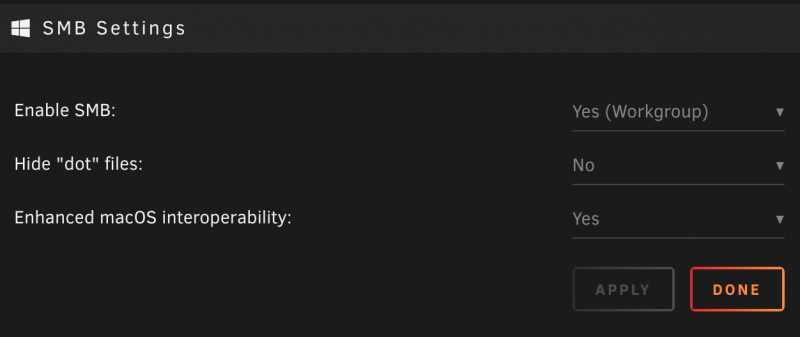
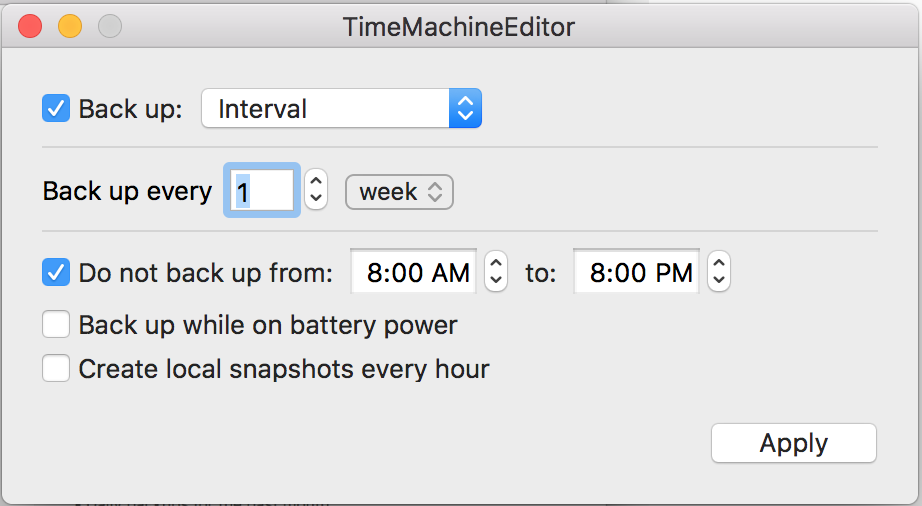

# Apple Time Machine

## Guide: Setting up a Time Machine Share on your Unraid Server

Apple's Time Machine is a built-in backup feature for your Mac that will
automatically backup all of your files, apps, music, photos, emails,
documents, and system files. When you complete a backup, you can even
restore files from your backup if the original files are deleted from
your Mac or the hard disk (or SSD) in your Mac is erased or replaced.
With Unraid, you can now use Time Machine with the SMB protocol and
store your Time Machine backups on your Unraid server!

**Note: This guide works with MacOS High Sierra.**

## Create a Time Machine Backup on your Unraid Server

To create backups with Time Machine and store them on your Unraid
server, all you'll need to do is connect it to your Unraid server and
then Time Machine will automatically make:

- Hourly backups for the past 24 hours
- Daily backups for the past month
- Weekly backups for all previous months
- The oldest backups are deleted when your backup disk is full

If you want to control when backups are completed, we suggest you use a
tool such as [Time Machine
Editor](https://tclementdev.com/timemachineeditor/) so you can customize
when backups are made and select a host of other options not available
in Time Machine itself.

## Unraid and Time Machine Setup

Before you begin, make sure **SMB** is enabled in the Unraid webgui by
going to:

1. Settings \--\> SMB under "Network Services"
2. Set "Enable SMB" to "Yes" and click "Apply" (Array must be stopped
   to change this).
3. Also, set "Enhanced macOS interoperability" to Yes as well.

Now:

1. In the Unraid webGUI, go to "Shares" and click "Add Share".
2. Name the share (Ex: Time Machine).
3. Set your minimum free space or leave default. This is the minimum
   free space available to allow writing to any disk belonging to the
   share.
4. Under "Included disk(s)" select the disk in the array that you'd
   like to use for your Time Machine share. You can still use this same
   disk for other shares.
5. Keep "Enable Copy-on-write" on "Auto".

- Under SMB Security Settings.

1. Under "Export" select "Yes (Time Machine)"
2. Set your "TimeMachine volume size limit". This limits the reported
   volume size, preventing Time Machine from using the entire real disk
   space for backup. Example: setting this value to "1024" would
   limit the reported disk space to 1GB.
3. Set your Security parameters to what you prefer.
4. Click Apply/Done.

From here, there are just a few more steps:

- Connect to your Time Machine share by connecting to it through the
  Finder.

1. Next: go to Time Machine Preferences on your Mac and "Select Disk".
2. Your newly mounted Time Machine share should show up. Select this
   share, enable encryption if desired and click "Use Disk".
3. Now, Time Machine will say it's trying to connect to your share.
   _Before clicking connect, it's recommended to eject your mounted
   share from your desktop and then connect._
4. Time Machine immediately begins making periodic
   backups---automatically and without further action by you.

_Note: The first backup may take a long time, depending on how many
files you have and the size of your Mac's harddrive._ Thereafter, Time
Machine backs up only the files that changed since the previous backup,
so future backups should be faster.

_Reminder: We suggest you use a 3rd party tool such as [Time Machine
Editor](https://tclementdev.com/timemachineeditor/) so you can customize
when backups are made and select a host of other options not available
in the Time Machine program itself._

That's it. Now, all of your Time Machine backups will be stored on your
Unraid server and if something bad happens to your Mac, you will be able
to restore files, settings, and apps from these backups!

## Creating Multiple Time Machine Shares for Different People/Macs

So, say you want to create multiple time machine backups for different
people/Macs in the house? You will need to create a separate share for
each Time Machine backup and separate users in Unraid. For example, say
the Stooges want to backup their Macs. If the username on each of the
Macs is larry, curly, and moe, you would create Unraid users larry,
curly, and moe. Once the users are set up then you would create the
individual Time Machine shares (ex: tm-larry, tm-curly, tm-moe). From
there, simply follow the instructions above!

For more info on Time Machine shares, be sure to also check out Space
Invader One's excellent video on [Unraid Shares and
MacOS!](https://www.youtube.com/watch?v=5J955nNIdo0&feature=youtu.be)
