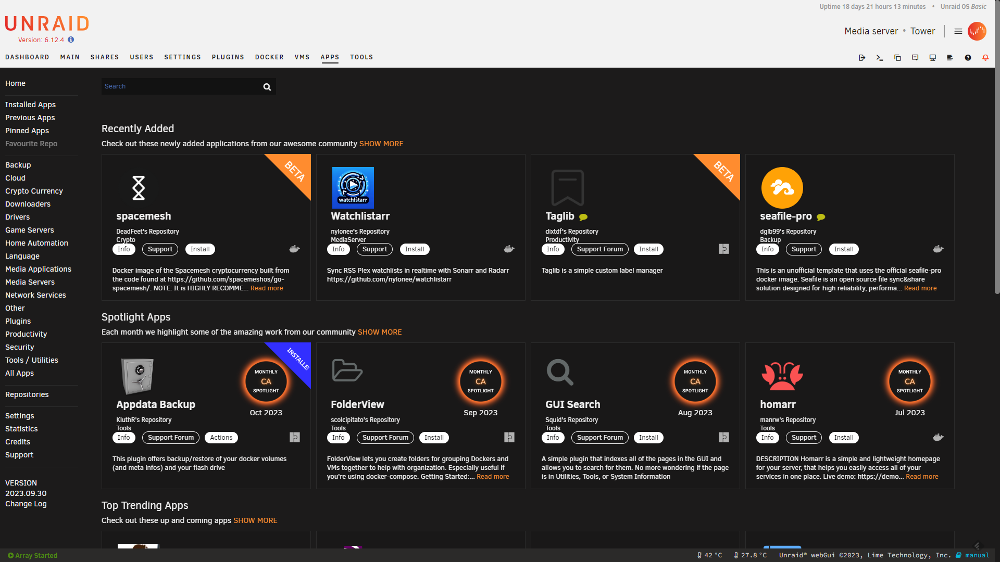

# Community Applications

This section discusses running applications on an Unraid server or extending the base capabilities.

## Overview

One of the greatest strengths of Unraid is the ability to expand its functionality and operate as more than a simple NAS system.

Community Applications (CA) provides two mechanisms to extend the functionality of the Unraid server:

* Plugins - these software components extend the base functionality of Unraid OS.
* Docker containers - these lightweight, standalone, executable packages of software include everything needed to run an application, in addition to the base OS functionality, for example, an email server, or a Dynamic DNS client app.

:::important

Limetech does not supply the applications or functionality that can be implemented using these mechanisms. it is up to the end-user to satisfy themselves to the suitability of any particular application.

:::

There are currently more than 2000 containers and plugins for Unraid, all of which are free to install and use by the community.

## Installing the Community Applications plugin

Although it is not part of the standard Unraid distribution the CA plugin is the recommended way for installing applications on an Unraid server whenever the application is implemented via a plugin or as a docker container. This does not stop users from installing applications that are not handled by CA, but using CA provides a useful level of curation that is of particular value to new Unraid users.

Once you have installed Unraid and started up an array, you can install Community Applications directly from ***Apps***.

### Navigating Community Applications

  

In the ***Apps*** tab you can find a large catalog of applications to install and use on your Unraid server. By default, the system will display the most recent apps in the catalog but you can use the quick filters on the left hand side or use the search box to find what you are looking for.

Search results display in a grid of tiles, where each tile represents a plugin - marked by two puzzle pieces - or a container - marked by Docker's Moby Dock. You can use the tile to see more info on the app, see what support options the author has enabled, or install the app.

Each app may also be tagged with a label to highlight its status:

* Beta - The application is a work in progress, and while it may contain most of its functionality, bugs and other issues may show up. We recommend you provide feedback and bug reports to the developer, if they appear. See [Support for applications](#support-for-applications), below.
* Installed - The application in question is installed on your Unraid server.
* Updated - This application has a newer version available and you can update it.
* Monthly CA Spotlight - This means the CA moderators have singled out this app due to its usefulness, quality, or popularity.

Selecting a tile displays detailed information for that application and allows additional actions.

### Installing applications

From any given application's tile or information panel, select the **install** button. This will trigger an installation script for the application. Do not close the installation window until it is complete.  

### Removing applications

Use the **Installed Applications** filter to see all Docker containers and plugins installed on your Unraid server. These are displayed in grid of tiles. To remove an application, select **Actions**, then **Uninstall**.

### Reinstalling Applications

If you ever need to re-install any plugins or docker container then this can be easily achieved via Community Applications.

A common reason for wanting to reinstall applications is when the `docker.img` file has been corrupted for some reason. In such a case the docker containers can be reinstalled with all their settings intact in just a few minutes.

CA stores an XML template for each application that it installs at `/boot/config/plugins/dockerMan/templates-user`. If you go to the **Apps** tab in the Unraid WebGUI then there is a **Previous Apps** filter. This can be used to reinstall applications using their saved settings. These are retrieved automatically from the saved XML templates so it is a
relatively painless process.

### Support for applications

Usually, each plugin or docker container has a forum thread that is dedicated to providing support and answering questions from end users. It is also common for the developer responsible for each of these types of applications to create a forum thread that they monitor. There are a number of easy ways to get to the appropriate support thread from the Unraid WebGUI:

* On the **Apps** tab - use the **Installed Applications** filter to find an application, then select **Actions** and **Support**.
* On the **Dashboard** and **Docker** tabs - select the icon for the docker container, then select the **Support** option.
* On the **Plugins** tab - each plugin will have a short summary and beneath it, a hyperlink to the **Support Thread**.

Virtual Machines do not have the same level of targeted support as they can be running almost any OS, and then within that OS any application supported by the OS. Having said that there are several areas within the forums that are dedicated places for asking questions about VMs and it is likely that you will find appropriate threads for the most common OSes.

### Action center

Applications are regularly updated by their authors. While most of the time these updates improve performance, stability, and overall functionality of the plugin or docker container, some milestone updates to Unraid OS may require the author to update their app.

The **Action center** displays currently installed apps that require updates. Select the **Actions** button to show a list of possible actions, then **Update** the app, to run an update script.

## Plugins

This mechanism allows code to be loaded into the core Unraid OS and run at that level. Before Unraid 6, it was the only way to extend Unraid functionality.

:::important

Limetech does not supply the applications or functionality that can be implemented through plugins. it is up to the end user to determine the suitability of any particular application for their Unraid OS setup.

:::

### Pros and cons

Here are some of the benefits of plugins:

* The plugin developer can access any part of the Unraid system without restriction.
* The plugin can load new code modules into the core Unraid OS.
* The plugin can add/amend the Unraid WebGUI.
* The plugin can add functionality that many deem important to allowing Unraid to function as a NAS.
* Plugins are normally published as Open Source so end users can check that they do not attempt to do anything malicious. However, the plugin mechanism does not enforce this.

Here are some of the disadvantages of plugins:

* **Plugins can make an Unraid system unstable**.
   * Plugins can load code modules that overwrite the versions supplied as part of a standard Unraid release. Any new Unraid release can include many upgraded/added modules. This means that it is important that if the plugin installs new code modules that the plugin author keeps the plugin up-to-date and aware of the release of Unraid on which it is being installed.
   * Unraid has the ability to boot a system in Safe Mode that suppresses plugins loading to help with diagnosing problems caused by plugins. This should be one of the first things to
    try if a system becomes unstable after installing a new Unraid release.
   * If there is a choice between a plugin and a docker container-based solution to add a feature to an Unraid system the docker container approach is always the recommended way to
    go as it does not introduce the same risk of causing instability.
* Plugins will have full access to all the data on the Unraid system.
* If a plugin is not maintained by the developer or the Unraid user does not keep the plugin up-to-date then when a new Unraid release is installed the plugin may make that release misbehave in unexpected ways.

Plugins are installed as part of the Unraid boot process after loading Linux completes and before the GUI and/or array is started.

The current recommendation is that plugins should only be used for functionality that cannot be added using a Docker container. This helps maintain system stability across Unraid releases. Plugins should therefore be adding system-level services and not end-user applications.

The Unraid WebGUI has a **Plugins** tab that can show what plugins are installed and provides capabilities for upgrading the installed plugins to new releases. It also provides the ability to install plugins from this tab, but it is recommended that if the plugin is known to Community Applications that plugins are instead installed from the **Apps** tab.

:::important

As part of the evolving nature of Unraid OS, a plugin's functionality may sometimes be incorporated into a new Unraid release, making its installation unnecessary (and possibly even harmful to system stability). **Community Applications** will only offer to install plugins that are believed to be compatible with that release. It will not, however, remove plugins that are already installed but no longer known to be compatible with the current release.

:::

## Docker containers

Unraid includes support for the technology known as [Docker](https://www.docker.com/resources/what-container/) for allowing Linux-based applications. Docker provides a mechanism for running Linux applications in a manner that allows them to be isolated both from the host system (Unraid) and also from each other. This means that docker applications are independent of the release of Unraid that is hosting them. The user can also configure which resources on the host system any particular Docker container can access.

Key points of the Unraid implementation are:

* The files that make up a Docker container are stored within a virtual disk image (i.e. a single file at the Unraid level).
   * The average user does not need to understand this type of detail but it can help with troubleshooting and making sense of log messages.
   * The default name of the virtual disk images is `docker.img`. Users can over-ride this but it is rarely done as no advantage.
    is gained by doing this.
   * Internally the `docker.img` file is formatted using the **BTRFS** file system and is mounted at the Unraid level as **/dev/loop2**.
   * The `docker.img` file will internally contain the binaries.
    associated with each installed docker container.
* Unraid provides a GUI-based method for easy installation and configuration of Docker containers. This acts as a front-end to the **docker run** command-line tool.
   * When a docker container is installed the parameters provided by the user (which are then used to build up the docker run command for a container) are stored on the flash drive as an XML file so it is easy to re-install a container without having to re-create its settings from scratch.
   * Unraid users can provide prepopulated templates for common applications that minimize (or even completely eliminate) the amount of configuration the average user will have to do to get any particular container running.
* The default location for the `docker.img` file is within the `system` share. The `system` share is set up with the **Use Cache** set to *Prefer* as having the `docker.img` file on the cache (if the user has one) helps maximize the performance of Docker containers.
* Unraid does not have built-in support for the **Docker compose** command line utility.

### Technology Stack

Unraid OS features a number of key technologies to simplify the creation and management of localized VMs running on an Unraid host:

* **KVM**
   * [KVM](https://www.linux-kvm.org/page/Main_Page) is a hypervisor responsible for monitoring and managing the resources allocated to virtual machines.
    : KVM is a component in the Linux kernel that allows it to act as a hypervisor. Simply put, hypervisors are responsible for monitoring and managing the resources allocated to virtual machines. Virtual machines are emulated computers that run on top of a physical computer. Ever wanted to run three operating systems on one computer all at the same time? Hypervisors make this possible. Examples of other hypervisors include Xen, VMWare (ESX/ESXi), VirtualBox, and Microsoft Hyper-V
   * Unlike other hypervisors, KVM is the only one that is built directly into and supported by the Linux kernel itself.
    : All other type-1 hypervisors out there will load before Linux does, and then Linux runs in an underprivileged state to that hypervisor.
    : By leveraging a hypervisor that is part of the Linux kernel itself, it means better support, less complexity, and more room for optimization improvements.
* **QEMU**
   * [QEMU](https://www.qemu.org/) is the component in the kernel that manages / monitors resources allocated to virtual machines.
   * QEMU is responsible for the emulation of hardware components such as a motherboard, CPU, and various controllers that make up a virtual machine.
   * KVM can't work without QEMU, so you'll often times see KVM referred to as KVM/QEMU.
* **HVM**
   * When virtual machine technology was first starting to grow in adoption, it wasn't directly supported by the chipset manufacturers directly. As such, there was a significant amount
    of overhead associated with virtual machines due to software emulation. Later, Intel and AMD built support for virtualization directly into their hardware (Intel VT-x and AMD-v), reducing overhead for emulation, monitoring, and security. These technologies allow for the creation of hardware-assisted virtual machines (referred to as HVMs).
   * While Xen offers a way to eliminate the overhead associated with traditional emulation without the need for VT-x, this paravirtualization method only works with Linux-based guests,
    and for that, Docker Containers are a better solution anyway. As such, HVMs are best suited for virtual machines where more than just basic Linux applications are needed.
   * HVM is required to be able to run a VM on Unraid. Most modern systems will have HVM support. You can see if your Unraid server has HVM support by clicking on the _info_ button at the top right of the Unraid GUI. If it shows as disabled then you might want to check your motherboard's BIOS to see if it needs to be enabled there.
* **VFIO**

   * [VFIO](https://www.linux-kvm.org/images/b/b4/2012-forum-VFIO.pdf) (**V**irtual **F**unction **IO**) allows us to assign a physical device, such as a graphics card, directly to a virtual machine that in turn will provide driver support for the device directly.
    : We can also prevent the device from accessing spaces in memory that are outside of that VM. This means that if something goes wrong with the device or its driver, the impact of such an event is limited to the virtual machine and not the host.
   * VFIO prevents assigned devices from accessing spaces in memory that are outside of the VM to which they are assigned. This limits the impact of issues pertaining to device drivers and memory space, shielding Unraid OS from being exposed to unnecessary risk.
   * VFIO usage requires **IOMMU** capable hardware (your CPU must have Intel VT-d or AMD-Vi support)[1](https://www.kernel.org/doc/Documentation/vfio.txt).
   * IOMMU is required to be able to pass through hardware to a VM on Unraid. You can see if your Unraid server has IOMMU support by clicking on the _info_ button at the top right of the Unraid GUI. If it shows as disabled then you might want to check your motherboard's BIOS to see if it needs to be enabled there.
   * IOMMU support requires support in the CPU, motherboard, and BIOS to all be present.
     * IOMMU is often referred to as _hardware pass-through_ in the context of a VM.
     * IOMMU allows a VM to get direct access to hardware and thus tends to give better performance in using that hardware and also may allow capabilities of the hardware to be accessed by the VM that is not possible in the host OS.

* **VirtIO**
   * [VirtIO](https://www.linux-kvm.org/page/Virtio) is a virtualization standard for network and disk device drivers where just the guest's device driver "knows" it is running in
    a virtual environment and cooperates with the hypervisor.
   * This enables guests to get high-performance network and disk operations, and gives most of the performance benefits of paravirtualization[2](http://wiki.libvirt.org/page/Virtio).
   * Using VirtIO in a guest OS requires that guest OS have virtIO drivers installed for the devices specified to use VirtIO in the VM definition.
   * If the guest does not haveVirtIO drivers then the VM will have to be specified to emulate a device for which the guest OS **does** have drivers. This will be less efficient but does allow OS that are not VirtIO aware to be run in a VM. Examples might be to emulate SCSI or SATA for disk drives and e1000 for network adapters.
* **VirtFS**
   * Also referred to as the 9p filesystem, [VirtFS](https://www.kernel.org/doc/ols/2010/ols2010-pages-109-120.pdf) allows us to easily pass through file system access from a
    virtualization host to a guest.
   * VirtFS is the equivalent of Docker Volumes for KVM, but requires a mount command to be issued from within the guest[3](http://wiki.qemu.org/Documentation/9psetup). VirtFS
    works with Linux-based virtual machines _only_.
* **Libvirt**
   * [Libvirt](https://libvirt.org/) is a collection of software that provides a convenient way to manage virtual machines and other virtualization functionality, such as storage and network interface management.
   * These software pieces include an API library, a daemon (libvirtd), and a command-line utility (virsh)[4](http://wiki.libvirt.org/page/FAQ#What_is_libvirt.3F).
* **VNC**
   * [VNC](https://en.wikipedia.org/wiki/Virtual_Network_Computing) is a method that allows the screen/mouse/keyboard of a VM to be visible across the network from another device.
   * VNC clients are available for most OS
   * VNC can be used to view _emulated_ GPUs.
   * VNC does **not** support sound emulation.
   * One can get better performance emulating a GPU by having appropriate software installed directly into a guest OS. Such software also often provides sound emulation as well.

It is worth understanding what technologies are being used for virtualization by Unraid as documentation on these technologies will not be Unraid specific. Also, many issues relating to these technology components can be common across all Linux systems using a particular technology component so often answers can be found in places other than the Unraid forums.

Particulars of the Unraid implementation of VM support are:

* **KVM**: Unraid makes use of the Linux
  [KVM](https://en.wikipedia.org/wiki/Kernel-based_Virtual_Machine) (**K**ernel **V**irtual **M**achine) facility to allow other operating system to run as guests on an Unraid system.
   * QEMU
* Unraid provides GUI support for managing VMs.
* **Libvirt:** The XML definitions needed by libvirt are stored as a disk image file (typically called _libvirt.img_ although the user can change this name)
* Unraid sets up some standard shares to provide a level of consistency to users:
  * **domains**: This the default location for storing VM vdisk images associated with a VM
  * **isos**: This is the default location for storing iso images for use with VMs.
  * **system**: This is the default location for storing the libvirt.img file (that contains the XML definitions for VMs.
  *  The users can override any of these settings if so desired when creating individual VMs but for most users, the defaults are a good option.
  *  All these shares have a default **Use Cache** setting of _prefer_. Having VM files (particularly disk images) on the cache will give much better performance than having them on an array drive.
* **VNC**
  * Unraid has the NoVNC web-based client built into its GUI and it can be used to access all VMs without the need to install specialist software into the guest OS.
  * Alternative VNC clients can be used to access the VMs hosted by Unraid. The port to be used for such clients is displayed in the Unraid GUI on the VM tab when a VM is running. Using such an alternative client can work in cases where the NoVNC client does not work correctly for some reason.

## Contributing your own applications

**Community Applications** was built around a community of dedicated enthusiasts and developers whose interest in Unraid has led them to contribute their own plugins and containers for all users to use and enjoy.

If you are interested in developing your own applications, we have laid out guidance for submitting your containers or plugins in an [Unraid forum post](https://forums.unraid.net/topic/87144-ca-application-policies-notes/).
