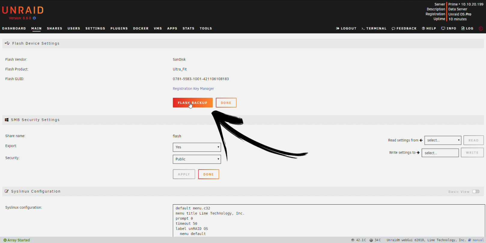
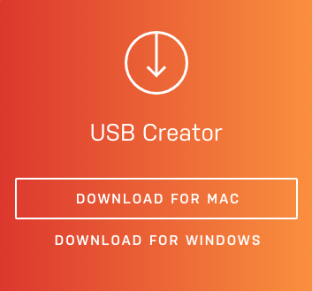
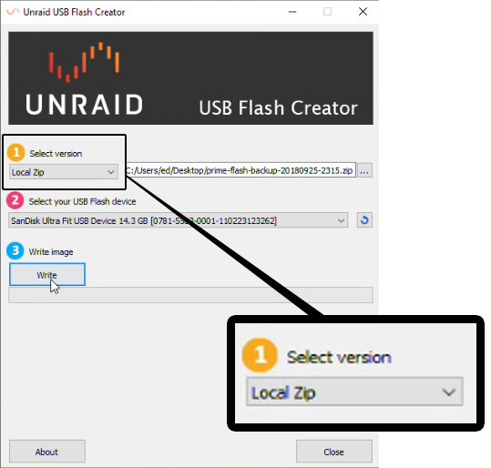
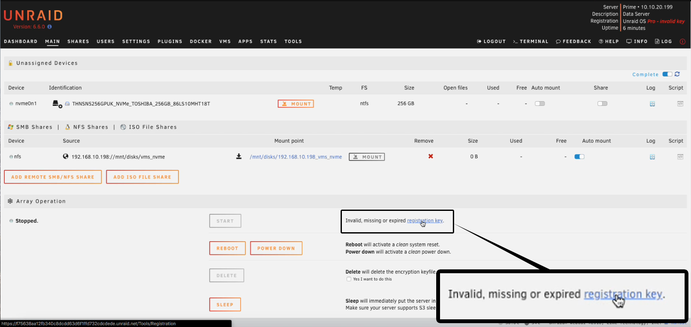
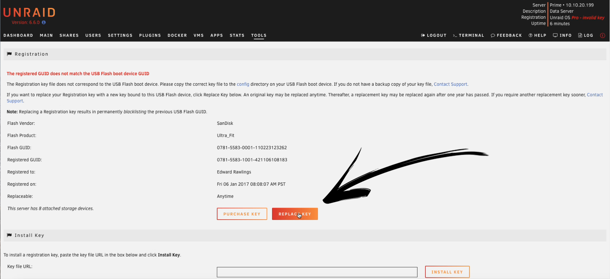

# Changing the Flash Device

There are two ways to swap out your USB flash device. If you are using a
PC or Mac, you should use the [USB Flash Creator
tool](https://unraid.net/download) for the easiest and most streamlined
experience.

Alternatively, if you are using a Linux system or if the USB Flash
Creator tool is not working for some reason, [please use the legacy
method](https://docs.unraid.net/unraid-os/manual/changing-the-flash-device/#manual-method).

In either case, you will first need to have a full backup of your
original Unraid OS USB flash boot device. It is **highly recommended**
that you always have an up-to-date backup of your Unraid USB flash
device.

- This is done via the 'Main' tab in the Unraid webGui then clicking
  on 'Flash'.
- From here you will see the option 'FLASH BACKUP', click this and a
  full zipped backup of your current flash drive will be downloaded to
  your Mac or PC.

NOTE: All the information that is specific to your Unraid installation
is contained in the **config** folder on the flash drive.

## Why replace your USB Flash boot device?

**IMPORTANT:** Replacing your Unraid USB Flash Device transfers the
license to a new USB Flash Device. Once this is done, the previous Flash
device is _blacklisted and cannot be used with Unraid going forward.
This action cannot be undone._

There are a number of different reasons that you may wish to replace
your USB flash device running Unraid OS including:

- Current device is failing or has failed.
- Current device has been lost.
- Current device is physically too large.
- Current device is too slow or does not have enough storage.

- Current device is old.

In practice, speed is not normally an issue as Unraid runs from RAM once
booted, and since they tend to be more reliable, _USB2 devices are
typically recommended_ over USB3.

Do you want to select the _best Flash device for Unraid?_ [See this
video!](https://www.youtube.com/watch?v=jjkaidlZmgs)

Prior to replacing the current flash, it may be worthwhile to shut down
your server, remove the flash, and insert it into a Windows or Mac
computer. Using Windows scandisk or Disk Utilities in Mac, you should be
able to try to "repair" the existing flash. If this operation works,
you may want to consider continuing the use of the flash. If you've
done this before and are still having issues with your flash, then
replacement is probably necessary.

**IMPORTANT:** Replacing your Unraid USB Flash Device transfers the
license to a new USB Flash Device. Once this is done, the previous Flash
device is _blacklisted and cannot be used with Unraid going forward.
This action cannot be undone._

## What if I can't backup my device?

In the event that your flash device has failed and you do not have a
backup, you can still reconfigure Unraid onto a new flash device and
transfer your registration key to that device. Simply install Unraid to
a new flash drive using the normal process and then either 'Install'
your old key file, or equivalently, copy it to the 'config' directory
on your USB flash device. The server will then notice a GUID mismatch
and offer a Replace Key button on the Tools/Registration page.

To ensure no data loss after the server is booted, you will need to make
sure you assign each disk to the array / cache exactly as it was prior
to the failure. If you do not know which disks were assigned where,
create a post in the forum for further assistance.

## Changing a Flash Device Before Purchasing

If you're currently using a Trial key and you're ready to purchase,
you may want to use a better flash drive for your paid key. Perform the
same steps in this guide for replacing the flash and when done, purchase
a registration key from the Tools \> Registration page.

**NOTE**: Once you transfer a Trial configuration to a new flash device,
you will be unable to start the array until you purchase a valid
registration key (Trial keys can only work on the original device to
which they were registered).

**IMPORTANT:** Replacing your Unraid USB Flash Device transfers the
license to a new USB Flash Device. Once this is done, the previous Flash
device is _blacklisted and cannot be used with Unraid going forward.
This action cannot be undone._

## Using the Flash Creator

- Once you have a backup of your Unraid flash device, you will need to
  use the Unraid USB Flash Creator tool to restore your backup to the
  new USB flash device. This can be downloaded for Windows or macOS
  here \-\--\> [Download USB Creator](https://unraid.net/download)

- Obtain a new good quality USB flash device. This should be at least
  1 GB and a max of 32GB (8GB or 16GB seem to be popular choices).
  USB2 is fine and anecdotally has proved more reliable.
- Plug it into your computer and then run the Unraid USB Creator
  software.
- Select the version 'Local Zip' then browse to the location of the
  backup that you created earlier and open that.
- Next, make sure that you select your new USB Flash device for the
  destination, then click '**Write**' and your backup will be
  restored to the new USB flash device.

- Shutdown the server. Remove the original USB flash device and
  replace it with the new one created above. Power on the server.
- Once booted the array will not start and you will see the message
  'Invalid, missing or expired registration Key' Click
  'Registration Key'

- if you are not restoring from a backup (which would contain a copy
  of your licence key file) then copy your existing licence key file
  into the 'config' folder on the flash drive so that Unraid knows you
  want to switch your licence to this new flash drive.
- Click on the option to 'REPLACE KEY' then enter the email
  address to which you would like to have the new key delivered to.
- Click 'REPLACE KEY'
- **IMPORTANT:** Replacing your Unraid USB Flash Device transfers the
  license to a new USB Flash Device. Once this is done, the previous
  Flash device is _blacklisted and cannot be used with Unraid going
  forward. This action cannot be undone._

- Once you have received the email, copy the key file URL, then paste
  it into the box and click 'INSTALL KEY
- Finished! You have replaced the USB flash device and the
  registration key. You will see a screen showing the date this key
  was registered and the next date on which your registration key will
  be eligible to be replaced again. Click 'DONE'.

## Manual Method

Prepare a new flash device using the procedure documented in the
[Getting Started](https://docs.unraid.net/unraid-os/manual/getting-started/) guide.

- Before removing the flash from the PC, copy the 'config' folder
  from the backup you made into the flash drive, overwriting existing
  files.
- Shutdown the server. Remove the original USB flash device and
  replace it with the new one created above. Power on the server.
- Once booted the array will not start and you will see the message
  'Invalid, missing or expired registration Key' Click
  'Registration Key'

- Click on the option to 'REPLACE KEY' Then enter the email
  address to which you would like to have the new key delivered to.
- Click 'REPLACE KEY'

**IMPORTANT:** Replacing your Unraid USB Flash Device transfers the
license to a new USB Flash Device. Once this is done, the previous Flash
device is _blacklisted and cannot be used with Unraid going forward.
This action cannot be undone._

- Once you have received the email, copy the key file URL, then paste
  it into the box and click 'INSTALL KEY
- Finished! You have replaced the USB flash device and the
  registration key. You will see a screen showing the date this key
  was registered and the next date on which your registration key will
  be eligible to be replaced again. Click 'DONE'

## Notes About Replacing your Registration Key

You may replace your original registration key at any time. After
replacing your license key once, you may replace your key using the
online automated method after a further period of 12 months.

Should you need to replace it again within that 12 month period, please
send an email to <licensing@support.unraid.net> to discuss your options.
For expedited service, please email in with your old and new USB GUIDs
and purchasing email.

**NOTE:** We strive to manually replace licenses ASAP. If you cannot
replace your registration key yourself (having done so more than once
per year) and you need access to your server right away, it is
recommended that you first [set up a new Unraid
trial](https://unraid.net/download) with a new USB drive and then
contact us to manually transfer your license.

**IMPORTANT:** Replacing your Unraid USB Flash Device transfers the
license to a new USB Flash Device . Once this done, the previous (old)
Flash device is _blacklisted and cannot be used with Unraid going
forward. This action cannot be undone._

## Warning on Sandisk Brand USBs

Please see the forum announcement below regarding an unfortunate level
of counterfeit SanDisk USBs on the market:

[PSA on SanDisk
USBs](https://forums.unraid.net/topic/119052-psa-on-sandisk-usbs/)

At this time, we cannot officially recommend SanDisk USBs due to the
issue of generic GUIDs found in knock off/counterfeit units.

## What to do if you have no backup and do not know your disk assignments

If your Unraid boot device has failed, you have no recent backup and are
not sure of their disk assignments it is very important that you do not
assign a data disk as a parity drive as this will cause data loss as
Unraid overwrites it with parity data thus destroying its contents. It
can also happen if you accidentally use an old backup and have increased
the size of your parity drive and have re-used the old parity drive from
that time as a data drive.

The procedure below exploits the fact that:

- Any parity drive will not have a mountable file system so if you can
  identify which drive(s) have unmountable file systems then these are
  probably your parity drives.
- Data drives previously used by Unraid will not have their contents
  wiped if you reset the array configuration.

If you find you have more unmountable drives than you had parity drives
then you should ask for help in the Unraid forums.

In such a case the following steps can help you get your array drives
back without data loss:

- Create a fresh install of the Unraid flash drive as shown earlier.
- Edit the file _config/disk.cfg_ on the flash drive and if necessary
  change the `startArray="yes"` entry to `startArray="no"`

This is to avoid any accidents that might result in a data drive getting over-written with parity information.
You can achieve the same effect from the Unraid GUI via the
_Settings-\>Disk Settings_ option.

- Go to Tools -\> New Config and select the option to create a new
  array configuration.

At this point there are two ways to proceed:

### Option 1

- Assign ALL drives as data drives.
- Start the array
- Make a note of the serial numbers of drives showing as unmountable
  as these are probably our parity drives.

### Option 2 If you have the Unassigned Devices plugin installed

- Try to Mount each drive in turn to see which ones fail to mount.
- Make a note of the serial numbers of drives showing as unmountable
  as these are probably our parity drives.

Now that you have identified the parity drives then:

- Go to Tools -\> New Config and select the option to create a new
  array configuration. This time it is advisable to use the option to
  retain all currently configured drives as this avoids the need to
  rearrange all drives (and thus reduces the chances of error).
- Go to the Main tab and assign the drives as required with the
  correct drive(s) assigned as parity.
- If you only had a single (parity1) drive then the order of the data
  drives is not important as far as parity is concerned so you can
  probably safely tick the "Parity is Valid" checkbox. With dual
  parity then since the parity1 and parity2 drives use different
  calculations they are **not** interchangeable so you will need to
  generate parity from scratch on both drives.
- Start the array to commit the drive assignments and you should see
  all your data drives have mounted and their contents are intact.
- If you ticked the "Parity is Valid" checkbox then run a correcting
  parity check to make sure this was a valid assumption.

The above process will not necessarily mean the data drives are in the
same order so if you have any shares that have specific drive
include/exclude then you will need to look at the contents of the
individual data drives to make sure these are as you want them (and
correct them if not).
