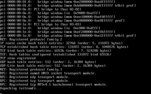

# Getting Started

In this guide, we will be covering how to prepare your flash device,
boot the system, and configure your first array. The entire process
should take less than 15 minutes.

## Prerequisites

Before we begin:

- You should have your server assembled and connected via power and
  Ethernet.
- You should have a monitor and keyboard attached for the initial
  configuration and to be ready to alter configuration settings in your
  BIOS.
- You will also need a high-quality, name brand USB flash device that is
  2GB or larger that must contain a unique GUID (Globally Unique
  Identifier).
- Your system must be capable of booting from a USB device.

For full hardware requirements, visit our [product
page](https://unraid.net/product).

## Quick Install Guide

- Insert a quality USB flash device into your Mac or PC.
- Download the [USB Flash Creator](https://unraid.net/download) and use
  it to install Unraid OS onto your USB flash device, or use the
  [Manual Install method](#manual-install-method).
- Remove the flash device from your PC and plug it into your server.
- Boot into your server's BIOS settings and make the following changes:
  - Configure the system to boot from the USB flash device.
  - Enable virtualization-specific features (including IOMMU).

<!-- -->

- Save your BIOS configuration changes and exit to boot Unraid OS.

## Initial Setup

Once Unraid OS has booted, you can now bring up the browser-based
Management Utility, a.k.a., the _webGui_, and complete the process of
configuring your system.

### Connecting to the Unraid webGui

There are two methods to connect to the webGui in Unraid:

- Boot Unraid in GUI mode and login (username is `root`, no password by
  default); or
- Open a web browser from your Mac or PC and navigate to
  `http://tower.local` Note: if you configured a different host name in
  the USB Flash Creator, use that name instead of `tower`.

## Setting a Root Password

Once you are connected to the webGui, you will immediately be prompted
to set a strong root password (as of version 6.10):

Strong passwords are unique (not reused), have at least 8 characters (the more the better),
are a combination of alphabetic, numeric, and special characters, and
are not common dictionary words. Better yet, use a password manager.

If you happen to forget your root password, the steps to reset it can be
found [here](https://unraid.net/blog/unraid-new-users-blog-series).

### Registering and Installing Your Key

Once a root password is set, you will be logged into the webGui. Now you
need to sign in to Unraid.net and obtain a key.

- Sign in or Sign up under the Get Started section in the top-right of
  the webGui.
  

- Upon signing in, a registration key will be downloaded and installed
  to your system automatically.

The purpose of the sign-in is to provide a way for you to manage your registration
keys for Unraid OS (obtain a Trial key, purchase a paid key, recover a
lost key, replace your key with a new flash device, or upgrade a keybo
from one edition to another).

When signing up we **highly recommend** you enable 2FA for your
Unraid.net Account. Click
[here](https://forums.unraid.net/topic/104007-enhanced-forum-account-security-2fa/)
for how to set this up.

_Note: On versions 6.9 and earlier, registering for a Trial, installing
a key, or purchasing a key is done from the webGui Tools \> Registration
page._

## Utilizing Unraid Connect

Once you have installed the [Unraid Connect](/connect/about.md) plugin
and signed in with your Unraid.net account, you will be able to manage
your server through the [Unraid Connect Dashboard](https://connect.myunraid.net/).

## Assigning Devices to the Array and Pool(s)

 After installing a
registration key, you are ready to begin assigning devices for Unraid to
manage. Click on the **Main** tab from the Unraid webGui and follow
these guidelines when assigning disks:

- **Always pick the largest storage device available to act as your
  parity device(s)**. When expanding your array in the future (adding
  more devices to data disk slots), you cannot assign a data disk that
  is larger than your parity device(s). For this reason, it is highly
  recommended to purchase the largest HDD available for use as your
  initial parity device, so future expansions aren’t limited to small
  device sizes. If assigning dual parity disks, your two parity disks
  can vary in size, but the same rule holds true that no data disk in
  the array can be larger than your smallest parity device.

<!-- -->

- **SSD support in the array is experimental**. Some SSDs may not be
  ideal for use in the array due to how TRIM/Discard may be implemented.
  Using SSDs as data/parity devices may have unexpected/undesirable
  results. This does NOT apply to the cache / cache pool.

<!-- -->

- **Using a pool as a cache will improve array performance**. It does
  this by redirecting write operations to a dedicated disk (or pool of
  disks in Unraid 6) and moves that data to the array on a schedule that
  you define (by default, once per day at 3:40AM). Data written to a
  cache pool is still presented through your user shares, making use of
  this function completely transparent. You control at the User Share
  level which shares should use a pool for cache purposes and which pool
  that should be.

<!-- -->

- **Creating a multi-device pool adds protection for cached data**. If
  you only assign one device to the cache pool, data residing there
  before being moved to the array on a schedule is not protected from
  data loss. To ensure data remains protected at all times (both on data
  and cache disks), you must assign more than one device to the pool,
  creating what is typically called a cache-pool. Cache pools can be
  expanded on demand, similar to the array.

<!-- -->

- **SSD-based pools are ideal for applications and virtual machines**.
  Apps and VMs benefit from SSDs as they can leverage their raw IO
  potential to perform faster when interacting with them. Use SSDs in a
  pool for the ultimate combination of functionality, performance, and
  protection.

_NOTE: Your array will not start if you have attached more storage
devices than your license key allows._

## Starting the Array and Formatting Your Devices

Once you have all your devices assigned, you can click the **Start**
button under Array Operation. This will mount your devices and start the
array. New devices added to disk or cache device slots will appear as
'Unformatted' and will be unusable for storing files until you format
them. Unraid 6 defaults to using the XFS filesystem for all devices, but
if you define a cache pool then BTRFS will automatically be used for
those devices (you can change the default file system under
_Settings-\>System Settings-\>Disk Settings_).

To format your devices for use, you must click the check box under
‘Array Operation’ that says **Format**, acknowledge the resulting prompt
(read it carefully), and then click the **Format** button.

Even before the devices are formatted, a _parity sync_ will be performed
in the background to initialize the protection of the array. Until the
sync is completed, the array will operate but in an unprotected state.
It is recommended to wait until the initial parity sync completes before
adding data to the array.

## Stopping Array, Shutting Down, and Rebooting

In order to perform one of these operations, visit the **Main** tab and
scroll down to the section titled _Array Operation_ and click on the
button appropriate to the operation you wish to carry out.

## Important Considerations

Once you've completed your initial setup, there are a few more things
you should know how to do on your server.

### Backing Up the Flash Drive

It is a good idea to have your Unraid flash device backed up any time
you make a significant configuration change. Regular flash backups are
highly recommended:

- On the **Main** tab, click on your Flash and Click **Flash Backup**.
  Please make sure to store your backups off of your Unraid array so it
  is easily accessible even if the array is not operational.
- If you are running Unraid 6.10.0 (or later) install the [Unraid Connect](/connect/about.md)
  plugin which provides for automated backups of the flash drive to
  LimeTech cloud-based servers.

### Using the built-in help

Unraid has extensive help text for all major settings built into the
webGui. When enabled the Help text will be displayed under the relevant
setting.

The help text can be toggled on/off at the global level by clicking the
"**?"** icon at the top right of the Unraid GUI. It can be switched
on/off at the individual field level by clicking on the name of the
field.

It is **strongly** recommended that you make use of this feature as the
information available via that route is likely to be more extensive and
up-to-date than any documentation.

### Security Best Practices

Your Unraid server is likely to end up containing data that is valuable
to you so it can be a good idea to review the [Security Good
Practices](security.md) part of the documentation to
ensure you are not doing something that may leave your system open to
attack while leaving your valuable data at risk.

## Manual Install Method

If for some reason the USB Flash Creator tool cannot be used, or your USB flash device is not detected,
it is possible to manually format and prepare a bootable USB flash device.
device. **Note: this method only works for devices 32GB and _smaller_.**

- Plug the USB flash device into your Mac or PC.
- Format the device using the FAT32 file system. It must **not** be
  ex-FAT or NTFS. If your drive is larger than 32GB then you need to use
  a 3rd party tool (e.g. Rufus) to format it to FAT32 as Windows will
  not give this as an option on drives larger than 32GB.
- Set the ‘volume label’ to `UNRAID` (case-sensitive, use all caps).
- [Go to the downloads page.](http://lime-technology.com/download/) to
  get the zip file for the release you want to use.
- Choose a version and download it to a temporary location on your
  computer (e.g. a “downloads” folder).
- Extract the contents of the newly downloaded ZIP file onto your USB
  flash device.
- Browse to the USB flash device to see the newly extracted contents
  from your Mac or PC.
- If you need to enable UEFI boot, rename the `EFI-` directory to `EFI`
- Run the _make bootable_ script appropriate to the OS you are using:
  - **Windows XP**
    - double-click the **make_bootable** file.
  - **Windows 7 or later**
    - right-click the **make_bootable** file and select _Run as
      Administrator_.
  - **Mac**
    - double-click the file **make_bootable_mac** file and enter your
      admin password when prompted.
  - **Linux**:
    - copy **make_bootable_linux** file to hard drive
    - unmount (not eject) USB drive
    - run the following command from wherever you unpacked it to on your
      Linux system:
    - sudo bash ./make_bootable_linux

**NOTE**: during the process of running this script, the flash device
may seem to disappear and reappear on your workstation a few times –
this is expected behavior.

## Advanced BIOS Configuration Guide

Configuring your motherboard BIOS (as well as your storage controller) correctly is an important step to
ensuring a solid experience using Unraid. The basic guidelines are as
follows:

- You must configure the USB flash device as the primary boot device
  (most motherboards support this).
- Your storage controller should support AHCI and SATA connections and
  be configured in standard HBA mode (not RAID mode).
- Enable any and all virtualization support in your BIOS if your
  hardware supports it or you wish to create virtual machines (Intel
  VT-x / AMD-V).
- Enable IOMMU support in your BIOS if your hardware supports it or you
  wish to assign physical PCI devices (GPUs, media controllers, USB
  controllers, etc.) to virtual machines.
- Avoid using front panel USB ports in favor of ports available directly
  on the motherboard I/O panel.

If after configuring your BIOS you cannot get Unraid to boot properly,
try the following:

- Set the boot order to as follows: Forced-FDD, USB-HDD, USB-ZIP
- Try disabling USB 2.0/3.0 support (this will default to USB 1.1).
- Try switching on or off any _Fast Boot_ feature.
- Try Switching on or off _USB keyboard_ support.

If you still are unable to boot the OS, please post a message in our
[general support](https://forums.unraid.net/forum/index.php?board=71.0)
forum.

_NOTE: Many motherboards support only up to 12 hard drives for purposes
of boot selection. This is normally not an issue for Unraid® OS;
however, if your Flash device is recognized by the bios as a hard drive,
you may not be able to boot from the Flash after installing your 12th
“real” hard drive. To avoid this, if possible set up your bios so that
the Flash is treated as a removable device._

## Boot Mode Selector (Syslinux)

After configuring your BIOS and booting from the Unraid flash drive, you
will be prompted with the Unraid Server OS boot menu on a directly
attached monitor (or via IPMI if your server supports that feature).

There are a number of standard options available for you to select:

- **Unraid OS (Headless)**

The standard boot mode for Unraid Server OS, headless mode utilizes less
memory than desktop mode but relies on the use of another device capable
of running a web browser to access the webGui for management. If a
monitor is attached then a console login will be displayed that can be
used to access the Linux command line on the server.

- **Unraid OS GUI Mode**

Loads a lightweight desktop interface on a directly attached monitor
with a quick-launch menu for accessing the webGui, product
documentation, and useful Linux utilities including a bash shell,
midnight commander, and htop. This mode may be helpful for users trying
to diagnose network connectivity problems or for users that don't have a
separate device to use for connecting to the webGui.

The management interface presented in this mode is the same one that is
displayed when running the system in _headless_ mode and accessing the
server remotely using a web browser.

- **Unraid OS Safe Mode (no plugins, no GUI)**

In this mode, Unraid suppresses loading any plugins that the user may
have installed. Use this boot mode to diagnose if plugins are causing
stability issues on your system.

- **Unraid OS GUI Safe Mode (no plugins)**

In this mode, Unraid suppresses loading any plugins that the user may
have installed. Use this boot mode to diagnose if plugins are causing
stability issues on your system.

- **Memtest86+**

If you suspect faulty RAM on your system, you can use Memtest86+ to test
it. Please post in the [general
support](https://forums.unraid.net/forum/index.php?board=71.0) forum
for assistance in using this tool.

The _memtest86+_ tool supplied with Unraid will only work correctly if
you are booting in non-UEFI (legacy) mode. If you want a version that
can be run when booting in UEFI mode then you need to download your own
copy from the memtest86+ [web site](http://www.memtest.org/).

**Note:** If you use EEC RAM in your Unraid server then memtest86+ will
not normally detect faulty RAM modules unless you have disabled the EEC
feature in the BIOS (since the EEC feature automatically corrects any
RAM error it detects).

The user can change the boot menu to add additional options or amend
existing ones by editing the _syslinux/syslinux.cfg_ file on the flash
drive or by clicking on the _flash_ drive on the Main tab within the
Management interface and using the _Syslinux Configuration_ section on
the resulting dialog.

## Privacy

Signing in with your Unraid.net account from the webGui sends the
following information using a secure connection to our cloud servers:

- Your email address and password used to sign in to Unraid.net.
- The GUID of your flash device.
- The key file on your flash device if present.
- The server's hostname and description.
- The server's LAN IP address.
- The version number of Unraid OS you are running.

## F.A.Q

**I'm unable to get the USB Flash Creator to install Unraid to my flash
device. What do I do?**

In the event the flash creator doesn't see or can't install Unraid to
the device, it could be for one of many reasons. The simplest solution
would be to try an alternate device, but if that is not an option for
you, you can try installing Unraid using the legacy [manual method
documented
here](#manual-install-method).

**I can't seem to connect to the webGui using <http://tower> or
<http://tower.local>. What do I do?**

Sometimes your local DNS server won't resolve by hostname and if that is
the case here, you can try connecting to the server by IP address. You
can discover the IP address of the server in multiple ways (by manually
setting it during the creation of the flash device, reviewing your
router/switch DHCP address pool, or by connecting a monitor to the
server).

**How do I change the hostname of my server?**

You can change the name used for your Unraid server from the webGui by
going to Settings-\>System Settings-\>Identification

**My flash drive is reporting an invalid GUID. What do I do?**

The USB Flash device **must** be one that has a unique hardware GUID
(serial number) built into it. Some manufacturers re-use the same GUID
on the drives they manufacture, use a GUID that is all zeroes, or use an
obviously made-up number. These drives are not able to be used as an
Unraid boot device. Although it is difficult to generalize, drives from
most major manufacturers **do** satisfy the requirement of having a
unique GUID.

Note: SSDs, USB card readers, SD card readers, or other devices cannot
be used to boot Unraid at this time.

**The USB flash creator tool isn't detecting my flash drive. What do I
do?**

In the event this tool doesn't work for you, we have additionally
documented a manual process by which you can also create your flash
device. As an FYI, the manual method only works for devices 32GB and
_smaller_.

USB flash devices and the Flash Creator tool are discussed further in
this New Users Blog.

**I need to configure my system to boot using UEFI. How do I do this?**

UEFI boot mode can be configured in 3 ways. When creating the flash
device using the flash creator, there is an option to enable UEFI boot
mode. After booting in legacy mode, you can change to UEFI boot from the
Flash Device Settings page. And lastly, you can always rename the folder
on the flash drive called **efi~** to **efi** (i.e. removing the
trailing **~** character).

**I'm having issues using my web browser with the Unraid webGui. What
can I do?**

Unraid's management interface (the webGui) is incompatible with most
ad-blocker solutions. It is for this reason that we strongly suggest
that users leveraging an ad-blocker in their browser first add the
Unraid server to the ad-blocker whitelist to ensure the ad-blocker
doesn't affect the webGui. Failure to do so is likely to result in parts
of the webGui not displaying correctly.

**How Do I Extend My Unraid Trial?**

Did you know that you can extend the [30 day free
trial](https://unraid.net/download) of Unraid? Hardware can be
ill-suited. Things break. Life happens. We get it. To try out Unraid a
little longer, once your original trial shows "expired" in the upper
left of the header, _Stop the array_.

Next, go to the _Registration_ page, and now a button shows up where you
can click for a 15 day extension. You can do this a total of two times
before you must decide if you would like to purchase Unraid or not.

_Note: You cannot change the USB flash device for Unraid Trials if you
wish to continue where you left off._
