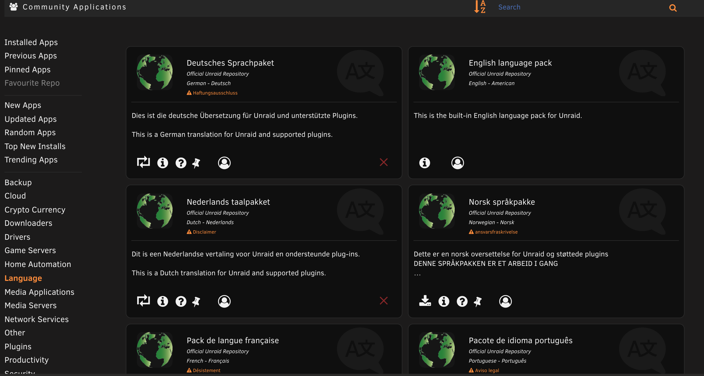
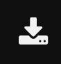

# Multi-Language Support

## Introduction

[Unraid 6.9](https://unraid.net/blog/unraid-6-9-multi-language-support)
introduced the mechanism to [support multiple
languages](https://unraid.net/blog/unraid-6-9-multi-language-support) in
the Unraid webGUI.

You can now download, install, and use the Unraid OS in the following
languages:

  **Arabic, Chinese, Dutch, French, German, Portuguese, Polish and Spanish.**

There are also multiple other languages that are in the process of being translated. To check if your language is available, [see here.](https://github.com/unraid?q=lang&type=all&language=&sort=)

### A note about all translations

- Translations are believed to be accurate to the best of Limetech's
  knowledge but the [English
  text](https://github.com/unraid/lang-en_US) is always the go to
  reference point.

- Translations are maintained in public
  [Github](https://github.com/unraid) repositories. If you would like
  to inform us of errors and/or participate in translation
  corrections, please write a post in the [respective language forum
  sections](https://forums.unraid.net/forum/75-multi-language-section/)
  and tag `@SpencerJ`. You can also submit Pull Requests in the respective public language repos.

- If you would like to see a new language added, please write a post
  in [this forum thread](https://forums.unraid.net/forum/77-general/).

## How to Load a Language pack

Language packs are downloaded and installed via the [Community
Applications
plugin](https://forums.unraid.net/topic/38582-plug-in-community-applications/).
As long as you are on Unraid 6.9.0 or later and _CA version 2020.05.12
or later,_ look for a new category along the left hand side titled
**Language**. This will allow you to load the current language pack selected.

You can also search for languages via the Search bar in CA.

**Note:** There is currently no automated mechanism for updating
language packs as users enhance or add to the translations held on
gitHub. Unraid users who will need to periodically download the latest
language pack manually for new and improved translations.

## How to Activate a Language

Via Community Applications → Language, click the download button on the
language pack you would like to download and use.

## How to Switch Back to English?

To switch back to English, you can always click the Switch back toggle button located in the top right of the webGui.

## Developer Requirements for Multi-Language Support

It is necessary for plugin developers to take appropriate action within
their plugins to enable them to utilize the multi-language support. The
details on what is required are covered in the design guide [here](https://wiki.unraid.net/images/5/5e/Multi-language_Support_Design_Guide.pdf).

Once plugin developers have made the necessary changes within their
plugin to add the multi-language support mechanisms provided by Unraid
then they will typically produce the English translations master file
for their plugin and rely on Unraid community members to provide
appropriate translation text for languages which they know how to speak.

**Note**: There is no requirement for any given plugin to support
Multi-language. However it is a good idea for every plugin author to at
least consider supporting Multi-Language. Even if such support is not
added a plugin will still work as-is on 6.9+ with no changes required
albeit only with text in English (or whatever language the developer has
embedded into the plugin).

## Multi-Language Forums

In the Unraid forum, there are also many active [language-specific
forums](https://forums.unraid.net/forum/75-multi-language-section/) to
get help or help others in your mother tongue.

Please see the [Multi-Language
Section](https://forums.unraid.net/forum/75-multi-language-section/) to
take part in these growing communities!
