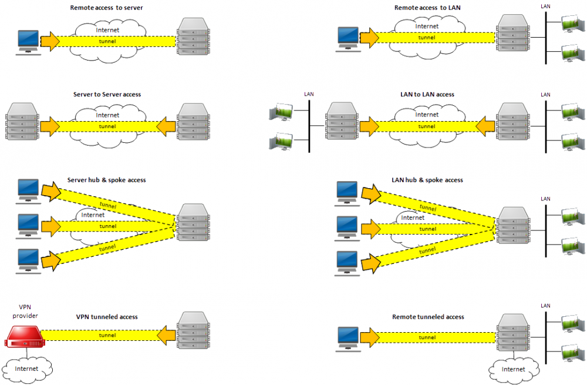
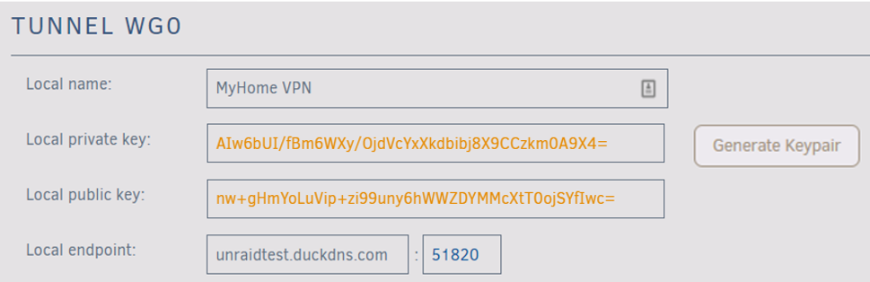
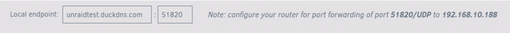
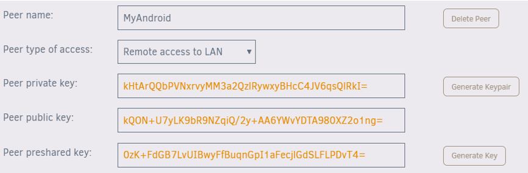
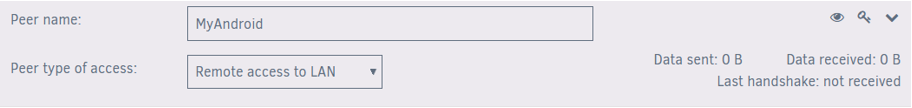
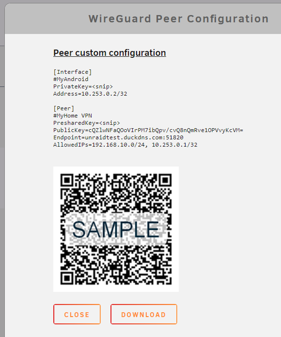

# VPN

:::caution

Unraid servers are not hardened against attack via the network so should never be exposed to the internet without use of a VPN.

:::

If you want to make secure connections between an Unraid server and the Internet, then you want to use a technology known as VPN (Virtual Private Network). VPN works on a client/server model where you have a server that accepts incoming connections and a client that initiates such connections.

In short, the idea behind VPN connections is to set up an encrypted 'tunnel' between the client and server ends so that no malicious players can intercept or eavesdrop on your interactions. Such tunnels are set up so that only authorized users are able to make such connections. More information on VPN as a technology can be found in [this wiki article](https://en.wikipedia.org/wiki/Virtual_private_network)

There are 2 common use cases that Unraid users are likely to have:

* **Remote Access to Unraid from the Internet**: This is by far the most common use case, as many users want to be able to safely access their Unraid servers (and potentially their whole home LAN) when away from home. When running in this mode the server end of the VPN link will either be running on the user's router (if it supports such a feature) or will be hosted on the Unraid server.
* **Remote Access from Unraid to the Internet**: This is used when you want applications running on Unraid to access the internet. This could be to access generic internet content or to access another server located remotely to the Unraid server. If it is generic access to the internet then it is highly likely that the server end of such a connection will be via a commercial VPN provider. When running in this mode Unraid will be acting as the client end of any VPN link.

There are a wide variety of VPN solutions available both free and commercial.

Unraid has built-in support for the WireGuard VPN service to provide secure access to/from the internet. However, if you are running Docker containers and exposing them to the internet, then their security needs to be assessed on a case-by-case basis. In that scenario, you may need to contact the developer of the container to determine how safe it is to expose it to the internet.

There is a level of protection as a docker container runs in a 'sandboxed' environment so the level of access to the content of your disks is constrained to what you allow in the path mapping settings for the container. If running VMs that are exposed to the internet then you need to apply the same security to these that you would apply to a physical PC attached to the local LAN.

## Router

Most modern routers have a built-in VPN server as standard (typically based on OpenVPN).

Using your router to provide the VPN support has the great advantage of not needing any other component on your home LAN to be operational for the VPN to function. Once set up it should allow you to access all devices on your home LAN in a similar manner to when you are directly connected to the LAN.

## OpenVPN

Historically, this has been the method advocated to establish connections between an Unraid server and the internet.

OpenVPN is a well-established solution so if you want to use OpenVPN then you can search Community Applications for a plugin or docker container that meets your requirements. You may also find the [SpaceInvaderOne YouTube video](https://www.youtube.com/watch?v=fpkLvnAKen0) of use when setting it up.

## WireGuard

### Overview

Unraid has built-in support for WireGuard VPN connections. The intention is to make it as easy as possible for Unraid users to set up VPN connections to/from their Unraid servers.

Some points to note about the Unraid WireGuard implementation are:

* The WireGuard service is built into Unraid so there is no need to add 3rd party software to achieve a VPN connection.
* The WireGuard service can be set to auto-start as part of the Unraid boot process.
* The WireGuard service is available even if the array is not started.
* WireGuard uses a light-weight protocol so performance tends to be better than OpenVPN.
* The interface is available under ***Settings > VPN Manager***.

More information about WireGuard can be found on the [WireGuard website](https://www.wireguard.com/).

What can you do with WireGuard? Let's walk you through each of the connection types:

* **Remote access to server**: Use your phone or computer to remotely access your Unraid server, including:
  * Unraid administration via the WebGUI.
  * Access Docker containers, VMs, and network shares as though you were physically connected to the network.
* **Remote access to LAN**: Builds on "Remote access to server", allowing you to access your entire LAN as well.
* **Server to server access**: Allows two Unraid servers to connect to each other.
* **LAN to LAN access**: Builds on "Server to server access", allowing two entire networks to communicate. May require additional settings.
* **Server hub & spoke access**: Builds on "Remote access to server", except that all of the VPN clients can connect to each other as well. Note that all traffic passes through the server.
* **LAN hub & spoke access**: Builds on "Server hub & spoke access", allowing you to access your entire LAN as well.
* **VPN tunneled access**: Route traffic for specific Docker containers and VMs through a commercial WireGuard VPN provider.
* **Remote tunneled access**: Securely access the Internet from untrusted networks by routing all of your traffic through the VPN and out Unraid's Internet connection.

The following diagram attempts to show these different connection types in a graphical format

### Incoming VPN Connections

This section will walk you through how to set up WireGuard, so that your trusted devices can VPN into your home network to access Unraid and the other systems on your network.

#### Implementation considerations

* Understand that giving someone VPN access to your LAN is just like giving them physical access to your LAN, except they have it 24x7 when you aren't around to supervise. Only give access to people and devices that you trust, and make sure that the configuration details (particularly the private keys) are not passed around insecurely. Regardless of the "connection type" you choose, assume that anyone who gets access to this configuration information will be able to get full access to your network.
* This guide works great for simple networks. But if you have Docker containers with custom IPs or VMs with strict networking requirements, please see the [Complex Networks](#complex-networks) section.
* Unraid will automatically configure your WireGuard clients to connect to Unraid using your current public IP address, which will work until that IP address changes. To future-proof the setup, you can use a Dynamic DNS service instead. There are many ways to do this, probably the easiest is described in this [2 minute video from SpaceInvaderOne](https://www.youtube.com/watch?v=9FkQ0wYpCV0).
* If your router has UPnP enabled, Unraid will be able to automatically forward the port for you. If not, you will need to know how to configure your router to forward a port.
* You will need to install WireGuard on a client system. It is available for many operating systems as mentioned at [WireGuard clients](https://www.wireguard.com/install/). Android or iOS make good first client systems because you can get all the details via QR code.

#### Setting up the Unraid side of the VPN tunnel

:::info

Before you start, check if UPnP is enabled on your router and whether you want to use it in Unraid. Go to ***Settings > Management Access*** and confirm **Use UPnP** is set to *Yes*. If not, you will have to set up port forwarding manually.

:::

1. In Unraid go to ***Settings > VPN Manager***

2. Give the **VPN Tunnel** a name, for example *MyHome VPN*.
3. Select **Generate Keypair**. This will generate a set of public and private keys for Unraid. Take care not to share the private key by accident (such as in a screenshot like this).
4. Configure the **Local endpoint**:

    * If you chose to set up a DDNS service earlier, in the **Local endpoint** field replace the IP address with the URL provided by the DDNS service, for example `http://myhome.duckdns.org`.
    * Unraid will recommend a port to use. You typically won't need to change this unless you already have another instance of WireGuard running on your network.

5. Select **Apply**. After you select **Apply**, the public and private keys are removed from view. If you ever need to access them, select the key icon on the top right-hand side.

6. Set up port forwarding. Port forwarding routes incoming connections to your Unraid server address on the LAN:
    * If Unraid detects that your router supports UPnP, and the option is active in Unraid, it will automatically set up port forwarding for you. 
    * If you see a note that says "configure your router for port forwarding\...", log in to your router and set up the port forwarding as directed by the note. 

:::tip

Some tips for setting up port forwarding on your router:

* Both the external (source) and internal (target/local) ports should be set to the value Unraid provides. If your router interface asks you to put in a range, use the same value for both the starting and ending ports. Be sure to specify that it is a UDP port and not a TCP port.
* For the internal (target/local) address, use the IP address of your Unraid system shown in the note.
* Google can help you find instructions for your specific router, i.e. "how to port forward Asus RT-AC68U".
* You can access other advanced settings by pressing the "down chevron" on the right-hand side. These settings are beyond the scope of this guide, but you can turn on help to see what they do.

:::

7. In the top-right corner of the page, change the **Inactive** toggle to **Active** to start WireGuard. Optionally, you can set the tunnel to autostart when Unraid boots by toggling on **Autostart**.

#### Defining a Peer (client)

1. Select **Add Peer**.
  
2. Give it a name, such as *MyAndroid*.
3. For the initial connection type, choose *Remote access to LAN*. This will give your device access to Unraid and other items on your network.
4. Select **Generate Keypair** to generate public and private keys for the client. The private key will be given to the client/peer, but take care not to share it with anyone else (such as in a screenshot like this)
5. For an additional layer of security, select **Generate Key** to generate a preshared key. Again, this should only be shared with this client/peer.
6. Select **Apply**.

Technically, the peer should generate these keys and not give the private key to Unraid. You can do that, but it is less convenient as the config files Unraid generates will not be complete and you will have to finish configuring the client manually.

:::caution

It can be a little risky to add a new client ("peer") to WireGuard. If you are already connected remotely using WireGuard, adding a new peer sometimes toggles the WireGuard tunnel off which will render you unable to reconnect. This is because a configuration change is made effective by disabling the tunnel with the current (old) configuration and then activating it with the updated (new) configuration. If there is any sort of configuration conflict at this point, the tunnel remains inactive, and you can no longer connect to the Unraid server.

:::

#### Configuring a Peer (client)

1. Select the eye icon to view the peer configuration. If the button is not selectable, you must first apply or reset your unsaved changes.

  * If you are setting up a mobile device, choose the **Create from QR code** option in the mobile app and take a picture of the QR code. Give the connection a name and connect. The VPN tunnel starts almost instantaneously. Once it is up you can open a browser and connect to Unraid or another system on your network. Be careful not to share screenshots of the QR code with anyone, or they will be able to use it to access your VPN.
  * If you are setting up another type of device, download the file and transfer it to the remote computer via trusted email or dropbox, etc. Then unzip it and load the configuration into the client. Protect this file, anyone who has access to it will be able to access your VPN.

#### About DNS

Everything discussed so far should work if you access the devices by IP address or with a Fully Qualified Domain Name such as yourpersonalhash.unraid.net.

Short names such as "tower" probably won't work, nor any DNS entries managed by the router.

To get those to work over the tunnel, return to the VPN Manager page in Unraid, switch from **Basic** to **Advanced** mode, and add the IP address of your desired DNS server into the **Peer DNS Server** field (don't forget to put the updated config file on the client after saving it!) You may want to use the IP address of the router on the LAN you are connecting to, or you could use a globally available IP like `8.8.8.8`

This is particularly important for **Remote tunneled access** mode if the client's original DNS server is no longer accessible after all traffic is routed through the tunnel.

Note that mDNS addresses such as `tower.local` are designed to work on the local network only and not over a WireGuard connection.

#### Complex Networks

The instructions above should work out of the box for simple networks. With the **Use NAT** option defaulted to *Yes*, all network traffic on Unraid uses Unraid's IP, and that works fine if you have a simple setup. However, if you have Docker containers with custom IPs or VMs with strict networking requirements, you'll need to make a few changes:

1. In the WireGuard tunnel config, set **Use NAT** to *No*
2. On your router, add a static route that lets your network access the WireGuard *Local tunnel network pool* through the IP address of your Unraid system. For instance, for the default pool of `10.253.0.0/24` you should add this static route:
    * **Destination Network**: `10.253.0.0/24` (aka `10.253.0.0` with subnet `255.255.255.0`)
    * **Gateway / Next Hop**: IP address of your Unraid system
    * **Distance**: *1* (your router may not have this option)
    * If you use a firewall such as pfSense on your network, you may also need to check the box for **Static route filtering - bypass firewall rules for traffic on the same interface**
3. Navigate to ***Settings > Docker Settings*** and set **Host access to custom networks** to *Enabled*

#### Configurations to avoid

There are some configurations you'll want to avoid, here is how a few key settings interact:

* With **Use NAT** set to *Yes* and **Host access to custom networks** set to *disabled (static route optional)*
  * server and dockers on bridge/host - accessible!
  * VMs and other systems on LAN - accessible!
  * dockers with custom IP - NOT accessible  
  (this is the "simple network" setup assumed by the guide above)
* With **Use NAT** set to *Yes* and **Host access to custom networks** set to *enabled (static route optional)*
  * server and dockers on bridge/host - accessible!
  * VMs and other systems on LAN - NOT accessible
  * dockers with custom IP - NOT accessible  
  (avoid this config)
* With **Use NAT** set to *No*and no static route
  * server and dockers on bridge/host - accessible!
  * VMs and other systems on LAN - NOT accessible
  * dockers with custom IP - NOT accessible  
  (avoid this, if **Use NAT** = *No*, you really need to add a static route in your router)
* With **Use NAT** set to *No* and **Host access to custom networks** set to *disabled and static route*
  * server and dockers on bridge/host - accessible!
  * VMs and other systems on LAN - accessible!
  * dockers with custom IP - NOT accessible  
  (You've come this far, just set **Host access to custom networks** to *enabled* and you're set)
* With "Use NAT" = No and "Host access to custom networks" = enabled and static route
  * server and dockers on bridge/host - accessible!
  * VMs and other systems on LAN - accessible!
  * dockers with custom IP - accessible!  
  (Bingo! This is the recommended setup for complex networks)

#### Troubleshooting WireGuard

WireGuard is not a chatty protocol, in fact, it is designed to be invisible! There aren't really any error messages if things aren't working, it either works or it doesn't. It cannot be detected by a port scanner.

If you can't connect, it will mainly be an exercise in double-checking your work and crossing off items on a list:

* Confirm that the tunnel is active on both the Unraid side and the client side. Note that "active" does not mean "connected". It simply means that the tunnel has started from that end. If DDNS/port forwarding/etc are setup correctly, then the two ends will connect and the Unraid dashboard will show a "handshake" and data being transferred.
* Confirm that your DDNS URL is pointed at your current public IP address, and is assigned to your **Local endpoint**.
* Confirm that you forwarded the correct UDP port through your router to Unraid, and assigned that same port to the **Local endpoint**.
* If you made any changes to your configuration after setting up your clients, you will need to set the clients up again so they have the latest config.
* Be sure you save your changes before you select **View Peer Config**, otherwise your QR codes/files will not have the latest data.

A few other troubleshooting ideas:

* For your first client, set up a phone using its data connection, not Wi-Fi, to eliminate issues related to the client network. The QR code is also the easiest way to transfer settings. Once you have it working from your phone, move on to other client devices.
* If you are unable to get a handshake between the client and the server, try doing something that actually uses the tunnel. The client may be waiting for traffic before it starts the connection.
* Disable any energy saving features on the client, phones in particular may not use VPNs properly when in low power mode. Also, you may need to disable any "Data Saver" or "Battery saver" features on the phone so that data is not restricted in the background and the VPN is not throttled.
* If you are connecting from another network over the Internet, be sure that the networks on both sides use different subnets. You can't connect two networks that both use 192.168.1.0/24, for instance.
* If you are using Cloudflare for DDNS, be sure to configure the Cloudflare **Proxy status** to *DNS only* and not *Proxied*. Note that this change takes some time to take effect.
* If you can connect from some locations but not others, keep in mind that the "broken" remote locations may have a firewall that blocks UDP traffic. Hopefully, WireGuard will support TCP in the future but, at the moment, there is no workaround for this.
* If nothing is working properly, switch to **Advanced** mode and confirm that the **Local tunnel network pool** is not already in use on your network or on one of the networks you are connecting to. If there is a conflict, you will need to change it to a different private network (`10.0.0.0` to `10.255.255.255` \| `172.16.0.0` to `172.31.255.255` \| `192.168.0.0` to `192.168.255.255`).
* If you can't reach the Unraid WebGUI for some reason and you need to prevent a WireGuard tunnel from automatically starting, delete this file from your flash drive and reboot:
  `/boot/config/wireguard/autostart`.
* Note that if you have Docker containers with custom IPs or VMs with strict networking requirements, you will likely have issues. Please see the [Complex Networks](#complex-networks) section above.

### Outgoing VPN Connections

This section explains how to make an outgoing WireGuard VPN connection from an Unraid server to a commercial VPN provider. If you are trying to access your Unraid network from a remote location, see the section on making inbound connections. There is a [forum thread](https://forums.unraid.net/topic/84316-wireguard-vpn-tunneled-access/) discussing making an outbound VPN connection using WireGuard.

#### Commercial VPN Providers

Several commercial VPN providers now support WireGuard. The community has had success with the options listed below but this is not intended to be an exhaustive list. No endorsement is implied. You need to research and determine which one meets your needs.

* [VPN Jantit](https://www.vpnjantit.com/free-wireguard)
* [Azire VPN](https://www.azirevpn.com/cfg/wireguard)
* [Mullvad](https://mullvad.net/en/guides/category/wireguard/)
* [IVPN](https://www.ivpn.net/wireguard/)
* [OVPN](https://www.ovpn.com/en/wireguard)
* [Windscribe](https://blog.windscribe.com/introducing-wireguard-76a1670700a6/)

Any provider that requires a custom WireGuard client will not work with Unraid.

:::caution

Note that VPN providers cannot guarantee the same amount of privacy (not security) as they can with OpenVPN, see [here](https://restoreprivacy.com/wireguard/) for detail. Typically the objections are not around security, but around the fact that it is harder for them to guarantee that they cannot track you.

:::

#### Configuring VPN tunneled access for Docker

:::important

You do not need to forward any ports through your router for this type of connection

:::

1. Download a config file from your preferred commercial VPN provider
2. In ***Settings > VPN Manager*** , select **Import Config** and upload the file from your computer. This will create a new tunnel specific to this provider.
3. The **Peer type of access** will default to *VPN tunneled access for docker*. There are no settings to change, but you may give it a local name.
4. Select **Apply**.
5. Change the **Inactive** toggle to **Active**

:::tip

Write down the name of this tunnel, it will be wg0, wg1, wg2, and so on. You'll need this later when setting up your containers.
Also note that any DNS setting the Commercial VPN provides is not imported. Open their config file and see if there is a "DNS" entry, make note of the server they provided, you will use it below. If they didn't provide one, you may want to use Google's at 8.8.8.8.

:::

#### Testing the Docker tunnel

The **VPN tunneled access for docker** tunnel includes a kill switch - if the tunnel drops then any containers using that tunnel will lose access to the Internet.

:::caution

Important! Prior to Unraid 6.11.2, you must take care to start the WireGuard tunnel *before* the Docker container in order for the kill switch to work. If the docker container is started first, it will use the server's default Internet connection.  That is no longer an issue for tunnels created/updated after installing Unraid 6.11.2.

:::

1. Using Community Applications, install a [Firefox](https://unraid.net/community/apps?q=Firefox) Docker container.
2. Set up the container, set the **Network Type** to *Custom: wg2* (or whatever the name of the tunnel was in the previous step).
3. Switch to **Advanced** view and add your preferred DNS provider to the **Extra Parameters**. For example `--dns=8.8.8.8`.  
  If you don't set this, the container may leak your ISP's DNS server.
4. Apply the changes and start the container.
5. Launch Firefox and visit https://whatismyipaddress.com/ you should see that your IP address is in the country you selected when you signed up with the provider.
6. Visit https://www.dnsleaktest.com/ and run a test, confirm that it only finds IPs related to the DNS provider you specified.

Feel free to add more containers to this same tunnel, or create multiple tunnels if desired.

#### Configuring “VPN tunneled access for system”

1. Download a config file from your preferred commercial VPN provider.
2. In ***Settings > VPN Manager*** , select **Import Config** and upload the file from your computer. This will create a new tunnel specific to this provider.
3. There are no settings to change, except perhaps to give it a name.
4. Select **Apply**.  
   Note: You do not need to forward any ports through your router for this type of connection.
5. Change the **Inactive** toggle to **Active**.  
Now all of your Unraid traffic will go through the commercial VPN tunnel.

:::note

* You may need to disable the tunnel in order to check for plugin updates or perform other Unraid administrative tasks.
* Since all traffic is routed through this tunnel, you cannot start a second tunnel while this one is enabled.
* Note that currently Unraid will ignore any DNS server that is specified in the downloaded config file. Unraid's DNS should be set to something that will work whether the tunnel is up or down, such as 8.8.8.8 and 8.8.4.4

:::

##### Testing the System tunnel

* Using Community Applications, install a [Firefox](https://unraid.net/community/apps?q=Firefox) Docker container.
* Accept all defaults.
* Launch Firefox and visit https://whatismyipaddress.com you should see that your IP address is in the country you selected when you signed up with the provider.

### Support

The forum is the best place to ask questions and get the most up-to-date information on using WireGuard with Unraid. The threads most likely to be of interest are:

* [forum thread](https://forums.unraid.net/topic/84229-dynamix-wireguard-vpn/) on the original Dynamix WireGuard plugin
* [forum thread](https://forums.unraid.net/topic/84226-wireguard-quickstart/) covering setting up incoming connections.
* [Forum thread](https://forums.unraid.net/topic/84316-wireguard-vpn-tunneled-access/) covering setting up outgoing connections.

["WireGuard" and the "WireGuard" logo are registered trademarks of Jason A. Donenfeld.](https://www.wireguard.com/)
