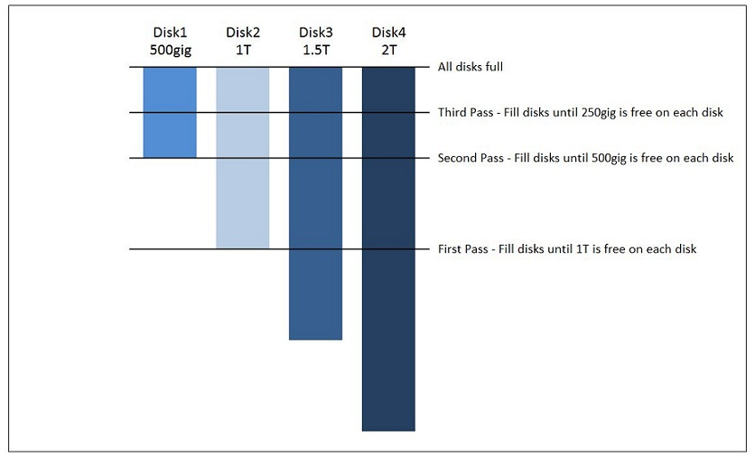
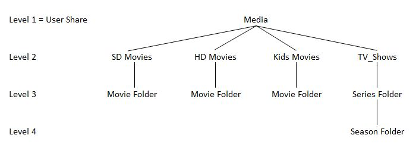
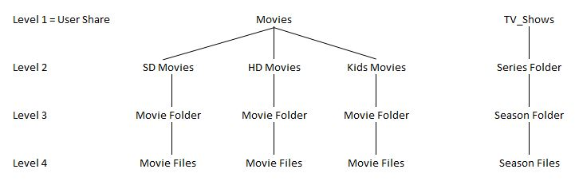
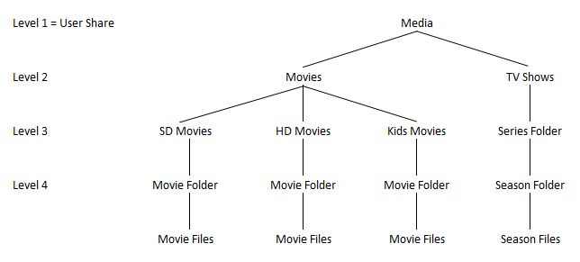
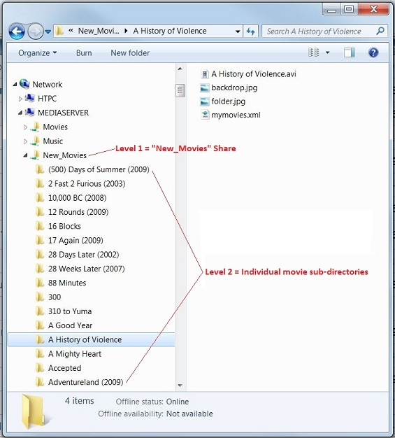
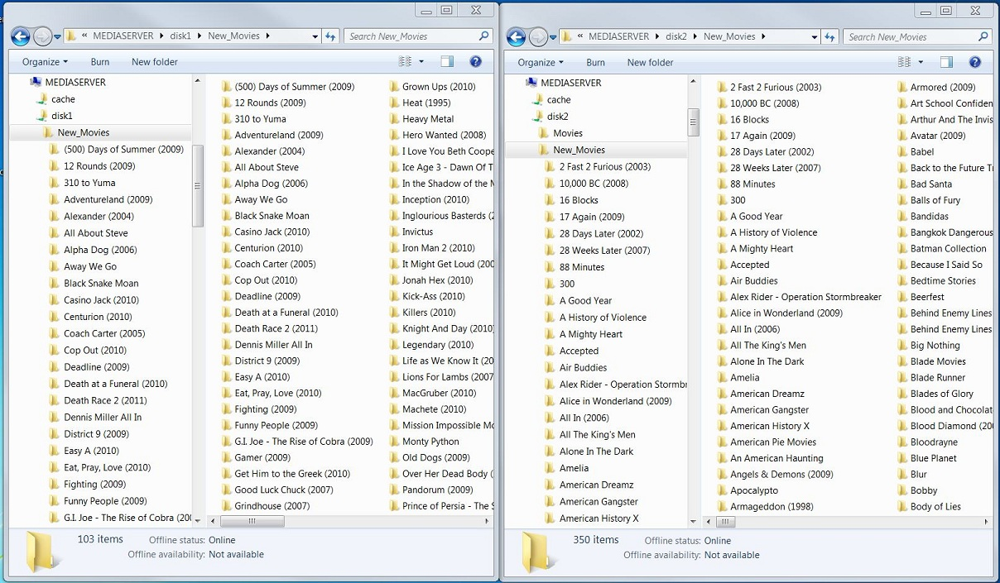
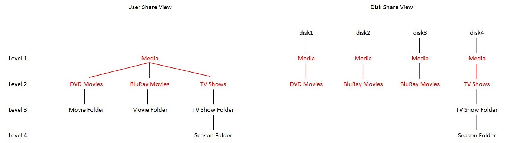

# Shares

Once you have assigned some devices to Unraid and started the array, you
can create _shares_ to simplify how you store data across multiple disks
in the array. Unraid will automatically create a handful of shares for
you that it needs to support common plugins, containers, and virtual
machines, but you can also create your own shares for storing other
types of data. Unraid supports 2 types of share:

- User Shares
- Disk Shares

You can control which of these types of shares are to be used under
Settings-\>Global Share Settings. The default on Unraid is to have User
Shares enabled but Disk Shares disabled.

It is sometimes important to realize that these are two different views
of the **same** underlying file system. Every file/folder that appears
under a User Share will also appear under the Disk Share for the
physical drive that is storing the file/folder.

## User Shares

User Shares can be enabled/disabled via Settings-\>Global Share
Settings.

From the **Shares** tab, you can either _create_ a new share or _edit'
an existing share. Click the **Help** icon in the top-right of the
Unraid webGui when configuring shares for more information on the
settings available._

User Shares are implemented by using Linux Fuse file system support.
What they do is provide an aggregated view of all top level folders of
the same name across the cache and the array drives. The name of this
top level folder is used as the share name. From a user perspective this
gives a view that can span multiple drives when viewed at the network
level. Note that no individual file will span multiple drives - it is
just the directory level that is given a unified view.

When viewed at the Linux level then User Shares will appear under the
path **_/mnt/user_**. This includes the files on the main array and also
any for the share on any pool. It is important to note that a User Share
is just a logical view imposed on top of the underlying physical file
system so you can see the same files if you look at the physical level
(as described below for Disk Shares.

- Current releases of Unraid also include the mount point
  **_/mnt/user0_** that shows the files in User Shares OMITTING any
  files for a share that are on any pool. This is just a different
  view of the files on your server. _However This mount point is now
  deprecated and may stop being available in a future Unraid release._

Normally one creates User Shares using the Shares tab. However if you
manually create a top level folder on any drive the system will
automatically consider this to be a user Share and give it default
settings.

Which physical drive in the main array is used to store a physical file
is controlled by a number of settings for the share:

- **Allocation method**: This has various options:
  - **Most Free**: This option means that new files should go to the
    disk with the most free space. It has the downside that one is
    continually switching drives which keeps the drive involved spun
    up.
  - **Fill Up**: This option means simply fill up drives in disk
    order until the free space falls below the Minimum Free Space
    setting, and when that happens move onto the next disk. Many
    users like this setting because their content is static in
    nature to they find this a simple way to manage their storage.
  - **High Water**: (default) This option attempts to provide a
    compromise between continually switching drives as is caused by
    the **Most Free** setting and filling up disks in a sensible
    manner, but not fill each drive to capacity before using the
    next one. The aim is to allow related files do be kept together
    on the same drive and to let unused drives be spun down.

:

    :   It works with switch points based by continually halving the
        size of the largest drive in the array.
    :   Many people find this confusing (particularly in an array with
        drives of varying size). so as an example if you had an array
        consisting of drives of 8TB, 3Tb and 2TB
        -   The largest drive is 8TB so the switch points are 4TB, 2TB,
            1Tb etc.
        -   The 4TB switch point is active so The 8TB Drive one would be
            filled to 4TB free space left.
        -   The 2TB switch point becomes active so the 8TB and 3TB
            drives each gets used in disk order until it they have 2TB
            free space
        -   The 1TB switch point becomes active so each drive now gets
            used in disk order until it only has 1TB free space.
        -   etc

- **Included** or **excluded** drives: These settings allow you to
  control which array drives can hold files for the share. Never set
  both values, set only the one that is most convenient for you. If no
  drives are specified under these settings then all drives allowed
  under _Settings \>\> Global Share settings_ are allowed.
- **Split level**: This setting controls how files should be grouped.

: **Important**: in the event of there being contentions between the
**Minimum free space**, **Split Level** and the **Allocation
method** settings in deciding which would be an appropriate drive to
use the **Split level** setting always wins. This means that you can
get an out-of-space error even though there is plenty of space on
other array drives that the share can logically use.

Changing any of these settings for a share only affects where any new
files are put. Any files already present in the share are left where
they are located when a setting is changed. It takes Manual action to
move existing files.

**Important**: The Linux file system used by Unraid are case sensitive
while the SMB share system is not. As an example this means that a
folder at the Linux level a folder called 'media' is different to one
called 'Media'. However at the network level case is ignored so for
example 'media', Media', 'MEDIA' would all be the same share.
However to take this example further you would only get the content of
one of the underlying 'media' or 'Media' folders to appear at the
network share level - and it can be non-obvious which one this would be.

The following sections proved more detail on how these settings work:

### Allocation method

When a new User share is created, or when any object (file or directory)
is created within a User share, the system must determine which data
disk the User share or object will be created on. In general, a new User
share, or object within a User share, will be created on the data disk
with the most free space. However there are a set of share configuration
parameters available to fine tune disk allocation.

The basic allocation strategy for a share is defined by the Allocation
method configuration parameter. You may select one of three allocation
methods for the system to use.

#### High Water

The high water allocation method attempts to step fill each disk so at
the end of each step there is an equal free space left on each disk. The
idea is to progressively fill each disk but not constantly go back and
forth between disks each time new data is written to the array. Most
times, only a single disk will be needed when writing a series of files
to the array so the array will only spin-up the needed disk. The high
water level is initially set equal to one-half of the size of the
largest disk. A new high water level is again set to one-half of the
previous high level once all the disks have less free space than the
current high water level.

The above example shows what will occur when there is a mix of 4 disks
varying is size from 500gig to 2T in size.

First Pass - The high water level is set to one-half of the size of the
2T drive or 1T. Each disk will be filled until it has \<1T of free space
remaining. This means no data is stored on disk1 or disk2 since both
already have \<1T of free space. 500gig of data will be stored on disk3
followed by 1T of data being stored on disk4.

Second Pass - The high water level is reset to one-half of the previous
level or 500gig. Each disk will be filled until it has \<500gig of free
space remaining. This means no data is stored on disk1 since it already
has \<500gig of free space. 500gig of data will be stored on disk2 and
then 500gig of data will be stored on disk3 and finally 500gig of data
will be stored on disk4.

Third Pass - The high water level is again reset to one-half of the
previous level or 250gig. Each disk will be filled until it has \<250gig
of free space remaining. 250gig of data will be stored on disk1 and then
250gig of data will be stored on disk2 and then 250gig of data will be
stored on disk3 and finally 250gig of data will be stored on disk4. An
interesting note is that the 500gig disk does not get used at all until
the third pass. Don't be concerned if the smaller sized disks don't
immediately get used with this method.

This pattern will continue with progressively smaller high water levels
until the disks are full.

#### Most Free

The most free allocation method simply picks the disk with the most free
space and writes the data to that disk. Each time a file is written
Unraid will check the free space on the disks and pick the one with the
most free space.

#### Fill-Up

The fill-up allocation method simply attempts to fill each disk in order
from the lowest numbered disk to the highest numbered disk. The fill-up
allocation method must be used in conjunction with the minimum free
space setting. Otherwise, Unraid will begin to give disk full errors and
not allow any more transfers once the first disk gets close to being
full.

### Min. Free Space

The minimum free space setting is used with the allocation method and
split level. The Minimum Free space setting doesn't control how much
space is kept free, but instead it controls how much space must be free
for a drive to be chosen for a new file. The minimum free space setting
therefore tells Unraid to stop putting new content onto the disk when
the free space falls below the level you set (as long as the Split Level
setting indicates it can be split to a new disk). This must be used with
the fill-up allocation method or disk full errors will occur when there
is not enough space to fit a file you are trying to write to the array.

First a brief explanation of how Unraid will typically receive a file.
Unraid typically receives data in this manner. First, Unraid receives
the request to store a file, named for example "file.eg". At this
time, Unraid has no idea how big "file.eg" is so Unraid will pick a
spot to place "file.eg" and begin to store the file data as the data
is transferred over the network. Now, this is important because Unraid
may pick a storage disk that does not have enough space to store the
complete "file.eg". Unraid doesn't know there is not enough space
when it first places the file so Unraid will only find out the disk
doesn't have enough space when the disk is full. At this point, the
transfer will fail with a disk full error.

So, Unraid will write to a different disk if the minimum free space is
set to a value larger than the biggest file size you will ever transfer.
The recommended setting is 2 times the largest file size you will ever
transfer. For example, if the largest file you have is 8gig in size then
set the minimum free space to 16gig. This allows you to transfer files
that may vary in size somewhat and not accidentally transfer one too
large. The minimum free space is set in kilo-bytes.

Here are some examples of the minimum free space setting;

---

**Free Space** **Value**
500 meg 500000
20 gig 20000000
40 gig 40000000

---

Note that unRAID will still place files on the disk if the split level
does not allow the files to be placed on another disk with more free
space.

Also note that Unraid will typically not move a file onto a new disk if
you're over-writing or updating it. For example, a backup file that
grows in size over time could end up filling a disk and causing a disk
full error.

IMPORTANT; There is also a Minkmum Free Space setting for cache pools.
This is used to determine when a new file for a User Share with the Use
Cache setting having a value of Yes or Prefer should be written to the
cache or instead bypass the cache and go directly to the array. This
needs to be set if you want to avoid filling a cache pool which can
cause problems. As for this value when used with a User Share hare it
should be larger than the largest file you intend to write, and some
people like to make it significantly larger. You get to this setting by
clicking on a pool on the Main tab.

### Split level

The split level setting tells Unraid how many folder levels are allowed
to be created on multiple disks. The split level can be used to ensure
that the contents of a folder are kept on the same disk. The split level
numbering starts with the user share being the top level and given the
number 1.

**IMPORTANT**: in the event of there being contention between the
various settings for a share over which array drive to select for a file
the Split Level setting always takes precedence. This means the
Allocation Method and Minimum Free Space settings end up being
over-ridden. This can mean Unraid chooses a drive which does not have
enough space for the file so that an out-of-space error subsequently
occurs for the file.

**_The Split level setting is one that many users find confusing to here
is a more detailed description of how it works._**

Here is an example showing a possible directory structure for a user
share called "Media".

**Note:** I (the original author of this section) consider combining
media types into a single large share a poor way to store media. I use a
share for each media type. Movies is a share and TV shows is a share. I
combined the movies and TV shows to show the pitfalls in the split
levels when doing this as explained after the figure.

Here is an explanation of the different split levels, referenced to the
folder structure above;

1. Level 1
   - This is what you have if in the GUI you select the
     "Automatically split only the top level directory as required"
     option.
   - The top level Media share can be created on every disk.
   - Every other folder under the Media share must remain on a single
     disk.
   - This setting does not allow the SD Movies, HD Movies, Kids
     Movies or TV Shows folders to spread to multiple disks.
   - This setting is too low for all the media.
2. Level 2
   - this is what you have if in the GUI you select the
     "Automatically split only the top two directory levels as
     required" option.
   - The top level Media share can be created on every disk.
   - The SD Movies, HD Movies, Kids Movies and TV Shows folders can
     be created on every disk.
   - Each Movie Folder and TV Show Folder must remain on a single
     disk.
   - This setting may work well. It will keep each movie and each TV
     series together on a single disk.
   - This setting may give issues because it keeps each TV series on
     a single disk. So, a disk may fill as new TV seasons are added
     to a TV show which is on a disk which is close to full.
3. Level 3
   - This is what you have if in the GUI you select "Automatically
     split only the top three directory levels as required".
   - The top level Media share can be created on every disk.
   - The SD Movies, HD Movies, Kids Movies and TV Shows folders can
     be created on every disk.
   - Each Movie Folder and TV Show Folder can be created on every
     disk.
   - Each Season Folder must remain on a single disk.
   - This setting will allow the contents stored in each Movie Folder
     to be spread out onto multiple disks.
   - This setting is too high for the different movie types.
4. Level 4
   - This is what you have if in the GUI you select "Automatically
     split only the top four directory levels as required".
   - The top level Media share can be created on every disk.
   - The SD Movies, HD Movies, Kids Movies and TV Shows folders can
     be created on every disk.
   - Each Movie Folder and TV Show Folder can be created on every
     disk.
   - Each Season Folder can be created on every disk.
   - This setting is too high because it will allow the contents of
     every folder to be spread out onto multiple disks. The split
     level is not being used to keep similar content together.

The only valid split level for the above example is 2. This causes a
split level limitation which forces each complete TV series to a single
disk. This can force a new TV season to be placed on a disk which is
almost full and result in out of space errors once new episodes
completely fill the disk. The split level can't be increased to 3
because each individual movie would not be contained to a single disk.

The first way to fix this split level mismatch issue is to create
separate shares for the movies and the TV shows. This way, the movies
can be set to use a split level of 2 and the TV shows can use a split
level of 3.

For Movies use a split level = 2. This allows the "SD Movies", "HD
Movies" and "Kids Movies" folders to be placed on every disk and it
keeps each individual movie folder on a single disk. This way, any
single movie folder and the contents of the movie folder will remain on
a single disk.

For TV_Shows use a split level of either 1 or 2. A split level of 1 will
keep each TV series on a single disk and split level of 2 will keep each
season on a single disk. The split level of 2 means that the complete TV
series can be stored on multiple disks, however each individual season
of that TV series will be on a single disk.

The second way to fix the issue is to add another folder level to the
movies, starting first with a Movies folder in the Media share and then
placing the different movie types below this.

This user share structure must use split level = 3. SD Movies, HD
Movies, Kids Movies and each TV series can exist on multiple disks. This
structure means each TV season can be on a different disk. This has the
opposite issue compared to the first example. You can not use split
level 2 to force each complete TV series to remain on a single disk
without messing up the ability of the movies to split to every disk.

Some things to keep in mind.

- The above examples are to demonstrate the use of the split level. It
  is not necessary to store your media sorted in the same format as
  the above example illustrates. You may want to use a Movies share
  and then just place a "Movie Name" folder for each movie directly
  into the share without sorting the movies by type.

- It is completely valid to force each complete TV series to stay on a
  single disk. Just understand that a continuing TV series will keep
  filling the disk where it is first placed. This may require manual
  intervention to shift some TV series from an almost full disk to an
  empty disk. Using the Most Free allocation method can help eliminate
  the issue since a completely new TV series would be placed on the
  disk with the most free space.

- The above TV example applies to any similar share. It could apply to
  a Pictures share where you store the pictures in folders based on
  the year (2010, 2011, 2012 etc) or it could apply to a Music share
  where you store the music in a folder for each artist. In these
  cases, a split level of 1 would keep a whole year of pictures on a
  single disk or it would keep all the music by an artist on a single
  disk.

##### **Disable Split Level**

It is also possible to disable the split level by setting a high split
level. A file copy or move will fail if a folder is locked to a full
disk and an attempt is made to add more files into that folder. Setting
a high split level will ensure each file will get written to the server
as long as a disk has space for it.

##### **Split Level = 1 Example**

The following example demonstrates how the share behaves when the split
level is set to 1. The Share name is New_Movies. Each movie stored in
this share has its own folder. Inside the movie folder is the movie file
as well as some metadata files used by MediaBrowser.

The above Windows Explorer screen shot shows the file structure of the
New_Movies share on the left and the contents of the `<u>`{=html}A
History of Violence`</u>`{=html} movie folder on the right. The levels
for this share are labeled on the example. This is what split level = 1
means:

- A New_Movies folder can be created on each disk allowed by the
  include and exclude disk settings. A new New_Movies folder will be
  created on the next disk in line when the allocation method calls
  for Unraid to begin filling the next disk. Note that the New_Movies
  folder will only be created on the next disk in line when it is
  necessary and not when the share is created.

- The `<u>`{=html}A History of Violence`</u>`{=html} folder can only
  exist on one disk. Once it is created on the disk, all of the
  contents will remain on the same disk. Any changes or additions to
  this folder will remain on the same disk. For example, a new file
  called movie.nfo for the XBMC metadata might be created in this
  folder in the future. The movie.nfo file will be created in the
  existing `<u>`{=html}A History of Violence`</u>`{=html} folder. A
  duplicate `<u>`{=html}A History of Violence`</u>`{=html} folder will
  not be created on another disk to store this new file.

You will notice that the movie folders `<u>`{=html}500 Days of Summer
(2009)`</u>`{=html} and `<u>`{=html}2 Fast 2 Furious (2003)`</u>`{=html}
both appear in the New_Movies share. The next screen shot will show how
each of these files is stored on a separate disk.

The above screen shot shows side by side Window Explorer views of the
file structure stored on disk1 and disk2. On the left is disk1 and on
the right is disk2. The left Explorer window shows the contents of
disk1. The New_Movies share is a folder stored at the top level or the
root of disk1 with the individual movie directories stored in this
directory. The right Explorer window shows the contents of disk2. The
New_Movies share is a folder stored at the top level or the root of
disk2 with the individual movie folders stored in this directory. As
files were being moved into the New_Movies share, Unraid created the
New_Movies folder on both disk1 and disk2 to store these files.

The windows side by side can be used to examine the contents of the
New_Movies share on a disk by disk basis. You will notice that the movie
folder `<u>`{=html}500 Days of Summer (2009)`</u>`{=html} is stored on
disk1 and the movie folder `<u>`{=html}2 Fast 2 Furious
(2003)`</u>`{=html} is stored on disk2. As previously noted, Unraid
combines the movies stored on disk1 and disk2 into one network share
called New_Movies and both movies appear in the New_Movies network
share.

Take note that a share called Movies is also visible on disk2.

##### **Split Level 0**

this is what you have if in the GUI you select "Manual: do not
Automatically split directories".

Split level 0 is a special case. Split level 0 requires you to create
the desired top level or parent folder structure. Unraid will
unconditionally create an object on the disk that contains the parent
folders. Unraid will choose which disk to use according to the
allocation method if the parent folders exist on multiple disks.

If you set the Split level to 0, then all directories/files created
under that share will be on the same disk where the directory within
that share share was originally created. In other words, use level 0 to
not allow the share to split automatically across disks

**NOTE:** If you create the same folder structure on multiple disks then
Unraid will apply the other share settings to decide which disk to use.

**Example**

The server has 4 disks. A user share called Media is desired. Different
types of media will be stored in this share. The desired structure is;

- disk1 - will hold the DVD movies.
- disk2 - will hold the BluRay movies.
- disk3 - will hold the BluRay movies.
- disk4 - will hold the TV series.

The desired structure is illustrated below.

On the left side is how the user share will appear and on the right side
is the folder structure on each disk. The user will go to each disk and
create the folders shown in red to create the storage as listed above.
Then, the Media folder as well as the DVD Movies, BluRay Movies and TV
Shows folders become the parent folders for everything stored in the
Media share. The media will be sorted by disk as follows;

- Movies placed in the DVD Movies folder will go to disk1.
- Movies placed in the BluRay Movies folder will go to disk2 or disk3.
  The disk is selected by the allocation method.
- TV shows placed in the TV Shows folder will go to disk4.

Say one day that disk1 is full and disk5 is added to the server to hold
new DVD Movies. The same folders on disk1 must be created on the new
disk5. In other words, the folder Media and sub-folder DVD Movies must
be created on disk5. Then, Unraid can use either disk1 or disk5 to store
DVD Movies.

##### **Split By Character**

Specify a character in the split level box to use this method. Then,
Unraid will not allow any folder name containing the character to split.
For example, set the split level to an opening square bracket ( [ )
instead of a number. Then, create each movie folder with the year
encased in square brackets after the title in this manner - Iron Man 2
[2010]. Unraid will see the opening square bracket ( [ ) and it will
not split this folder or any content stored inside this folder.

This type of split level can allow different levels of sub-folders to be
specified as not splitting simply by inserting the character into the
folder name which should not split. This can overcome the limitation of
having a fixed split level for a share.

### Included and Excluded disk(s)

The included disk(s) and excluded disk(s) parameters control which disks
are allowed to be used by each user share. These parameters can be used
separately or together to define the group of disks allowed for writing
files to each user share. The disks are entered by disk number with a
comma separating each disk, for example "disk2,disk5".

Unraid will first check the included disks(s) set and then the Excluded
disk(s) set when deciding which disk to place a file on. Then, Unraid
will use the split level and allocation method to pick a disk which is
allowed to hold the file.

**Note:** The Include/Exclude settings at the individual share level
only control which disks new files can be written to. Files on other
disks that are in a folder corresponding to the share name will still
show up under that share for read purposes.

**Included disk(s)**

The included disks(s) parameter defines the set of disks which are
candidates for allocation to that share. All disks may be used by the
user share when the Included disk(s) parameter is left blank. Specify
the disks to include here. For example, set the included disk(s) to
"disk1,disk2,disk3" to allow the share to only use disk1, disk2 and
disk3.

**Excluded disk(s)**

The excluded disk(s) parameter defines the set of disks which are
excluded from use by the user share. No disks are excluded from use by
the user share when the excluded disk(s) parameter is left blank.
Specify the disks to exclude here. For example, set the excluded disk(s)
to "disk1,disk2" to restrict a share from using disk1 and disk2.

### Default Shares

If you have Docker or VMs enabled then a number of default shares are
set up to support their use. It is not mandated that you use these
shares (and the system will let you remove them if you do not want to
use them for their standard purpose) but it is recommended as it tends
to make it easier to support users who encounter problems.

The shares that fall into this category are:

- **appdata**: this is the default location for storing working files
  associated with docker containers. Typically there will be a
  sub-folder for each docker container.
- **system**: this is the default location for storing the docker
  application binaries, and VM XML templates
- **domains**: this is the default location for storing virtual disk
  images (vdisks) that are used by VMs.
- **isos**: this is the default location for storing CD iso images for
  use with VMs.

### Unraid 6.12

The Unraid 6.12 release has introduced some new terminology to make it
clearer to new users where files are initially placed and where they
will end up. The same functionality is present in earlier releases, but
has often been misunderstood by new users.

#### **Primary Storage:**

This is the location to which **new** files will be written.

If Primary storage is below the Minimum Free Space setting then new
files and folders will be created in Secondary storage, if configured

For the Primary storage drop-down:

- this option is mandatory. ie, Primary storage must be selected
- any named pool can be selected
- "Array" can be selected (meaning the Unraid array)

#### **Secondary Storage:**

This is the location where files will be moved to if appropriate.

For the Secondary storage drop-down:

- None: This means that there is no secondary storage set for this
  share i.e Secondary storage is optional
- if Primary storage is a pool name, then the only options are
  "none" and "Array"
- if Primary storage is "Array", then only "none" appears as an
  option
-

### Unraid 6.11 and earlier

The following settings are only found in Unraid 6.11 and earlier. They
achieve the same functionality as the settings available in 6.12 but are
presented differently.

#### **Use Cache (and Mover Behavior with User Shares)**

**Note**: Starting with Unraid 6.9.0 multiple pools can exist and they
can have any name the user chooses. Any of these pools can act act as a
cache in the way Unraid uses the term. The word cache therefore is
referring to this functionality and not necessarily to the pool name.

Unraid includes an application called **mover** that is used in
conjunction with User Shares. It's behavior controlled by the "Use Cache
for new files" setting under each User Share. The way these different
settings operate is as follows

- **Yes**: Write new files to the cache as long as the free space on
  the cache is above the _Minimum free space_ value. If the free space
  is below that then by-pass the cache and write the files directly to
  the main array.

: When _mover_ runs it will attempt to move files to the main array as
long as they are not currently open. Which array drive will get the
file is controlled by the combination of the _Allocation method_,
_Split level_, and Minimum Free Space setting for the share.

- **No**: Write new files directly to the array. Which array drive
  will get the file is controlled by the combination of the
  _Allocation method_, _Split level_, and Minimum Free Space setting
  for the share.

: When _mover_ runs it will take **no** action on files for this share
even if there are files on the cache that logically belong to this
share.

- **Only**: Write new files directly to the cache. If the free space
  on the cache is below the _Minimum free space_ setting for the cache
  then the write will fail with an out-of-space error.

: When _mover_ runs it will take **no** action on files for this share
even if there are files on the main array that logically belong to
this share.

- **Prefer**: Write new files to the cache if the free space on the
  cache is above the _Minimum free space_ setting for the share, and
  if the free space falls below that value then write the files to the
  main array instead.

: When _mover_ runs it will attempt to move any files for this share
that are on the main array back to the cache as long as the free
space on the cache is above the _Minimum free space_ setting for the
cache
: It is the default setting for the _appdata_ and _System_ Shares that
are used to support the Docker and VM sub-systems. In typical use
you want the files/folders belonging to these shares to reside on
the cache as you get much better performance from Docker containers
and VMs if their files are not on the main array (due to the cost of
maintaining parity on the main array significantly slowing down
write operations).
: This setting works for a share even if you do not have (yet) a
physical cache drive(s) as then files will simply be written
directly to the array. If at a later date you add a cache drive
mover will now automatically try and move the files in any share set
to Prefer to the pool defined as the cache for the share to improve
performance. This is why it is the default for shares that are
typically located on the cache rather than _Only_ as it caters for
those who do not (yet) have a cache drive.

##### **Moving Files from a Pool (cache) to the Array**

This is the more traditional usage of a pool for caching where one wants
the files for a particular share initially written to a pool acting as a
cache to maximise write speed, but later you want it to be moved to the
main array for long term storage. Most of the time all that is required
is to set the Use Cache setting for the share to Yes and the default
behaviour handles the rest with no further user interaction.

Sometimes for one reason or another users find that the files seem to be
'stuck' on a pool. The way to proceed in such a case to get the files
belonging to a share from a pool onto the main array is:

- Disable **Docker/VM** services if they are enabled (as files open in
  these services cannot be moved).
- Change the Use Cache setting for the share to **Yes**
- Manually run **mover** from the _Main_ tab to get it to move _Yes_
  type shares from array to the pool (cache).
- When **mover** finishes you can re-enable the Docker and/or VMs
  services you use if you disabled them earlier.
- (optional) change the **Use Cache** setting to _Only_ to say files
  for this share can never be written to the array.

##### **Moving Files from the Array to a Pool (cache)**

One typically wants files associated with running Docker containers or
VMs on a pool to maximise performance. It is not unusual for one reason
or another to find that one has files on the main array which you really
want to be on a pool. In particular this is likely to happen for the
appdata or system shares

The way to proceed to get the files belonging to a share from the main
array onto a pool is:

- Disable **Docker/VM** services if they are enabled (as files open in
  these services cannot be moved)
- Change the Use Cache setting for the share to **Prefer**
- Manually run **mover** from the _Main_ tab to get it to move
  _Prefer_ type shares from array to the pool (cache).
- When **mover** finishes you can re-enable the Docker and/or VMs
  services you use.
- (optional) change the **Use Cache** setting to _No_ to say files for
  this share can never be cached on a pool.

## Disk Shares

These are shares that relate to individual array drives or pools within
the Unraid system and that are visible over the network. By default if
User Shares are enabled then Disk Shares are not enabled (see the
IMPORTANT section below for the reason why this is the case). If you
want the Disk Shares to be enabled then this is done under
Settings-\>Global Share Settings. The Disk Shares will then appear in
the Unraid GUI under a Disk Shares section on the Shares tab. You will
want to modify the user permissions to restrict network user access if
desired, just like User Shares.

When viewed at the Linux level the physical devices or pools will appear
directly under _/mnt_ with a name corresponding to the array drive or
pool. (This happens regardless of whether Disk Shares are enabled) .
Examples of such names are:

_/mnt/diskX:_ these are array drives where X corresponds to the disk
number that shows in the Unraid GUI. The corresponding Disk Share at the
network level would be _diskX_

_/mnt/pool-name:_ These are pools. A single pool can actually consist of
multiple drives but Unraid treats them as if they were one drive. The
commonest example of a pool-name is _'cache'_ but it can be any name
defined by the user. The corresponding Disk Share at the network level
would be _pool-name._

The Unraid flash device that is used to boot Unraid and store all user
settings is also a physical device, but is not normally considered to be
a Disk Share. If you want it visible on the network then you can click
on it in the Main tab and set it to appear at the network level as the
'_flash_' share. At the Linux level it is mounted at /_boot_

+----------------------------------------------------------------------+
| **IMPORTANT** |
+======================================================================+
| If you have both _Disk Shares_ and _User Shares_ enabled then there |
| is an important restriction that you must observe if you want to |
| avoid potential data loss. What you must **NEVER** do is copy |
| between a **User Share** and a **Disk Share** in the same copy |
| operation where the folder name on the Disk Share corresponds to the |
| User Share name. This is because at the base system level Linux does |
| not understand _User Shares_ and therefore that a file on a _Disk |
| Share_ and a _User Share_ can be different views of the **same** |
| file. If you mix the share types in the same copy command you can |
| end up trying to copy the file to itself which results in the file |
| being truncated to zero length and its content thus being lost.\ |
| \ |
| There is no problem if the copy is between shares of the same type, |
| or copying to/from a disk mounted as an Unassigned Device.. |
+----------------------------------------------------------------------+
| |
+----------------------------------------------------------------------+

There is another quirk of the interaction between Linux and the Unraid
User Share system that users can encounter if they are working at the
Disk Share level. The Linux command for Move is implemented by first
trying a rename on the file (which is fast) and only if that fails does
it do a copy then delete operation. This can mean that under some
circumstances when working locally on the server (e.g. from the command
line when you try to move files from one user share to another, Linux
will often simply rename the files so they have a different path on the
same disk, in violation of any user share settings such as included
disks. The workaround for this is to instead explicitly copy from source
to destination so that new files get created following the user share
settings, then deleting from the source.

## Network access

You can control what protocols should be supported for accessing the
Unraid server across the network. Click on Settings-\>Network Services
to see the various options available.. These options are:

- **SMB**: This the standard protocol used by Windows systems. It is
  widely implemented on other YS.
- **NFS**: **N**etwork **F**ile **S**ystem. This is a protocol widely
  used on Unix compatible system.
- **AFP**: **A**pple **F**ile **P**rotocol. This is the protocol that
  has historically been used on Apple Mac system. It is now a
  deprecated option as the latest versions of MacOS now use SMB as the
  transferred protocol for accessing files and folders over the
  network.
- **FTP**: **F**ile **T**ransfer **P**rotocol.

When you click on the name of a share on the Shares tab then there is a
section that allows you to control the visibility of the share on the
network for each of the protocols you have enabled. The setting is
labelled **Export** and has the following options:

- **Yes**: With this setting the share will be visible across the
  network.
- **Yes (Hidden)**: With this setting the share can be accessed across
  the network but will not be listed when browsing the shares on the
  server. Users can still access the share as long as they know the
  name and the user is prepared to enter in manually.
- **No**: With this option selected then it is not possible to access
  the share across the network.

## Access Permissions

When you click on the name of a share on the Shares tab then there is a
section that allows you to control the access rights of the share on the
network for each of the protocols you have enabled. The setting is
labelled **Security** and has the following options:

- **Public**: All users have both read and write access to the
  contents of the share
- **Secure**: All users including guests have read access, you select
  which of your users have write access
- **Private**: You select which of your users have access and for each
  user whether that user has read/write or read-only access.

**Windows 'Gotcha'**

There is an issue with the way Windows handles network shares that many
users fall foul of:

- This is the fact that Windows only allows a **single** username to
  be used to connect to a specific server at any given time. All
  attempts to then connect to a different share on the same server
  that are not public shares put up a Username/Password prompt and
  this fails as though you have entered an incorrect password for this
  username. If you have any shares on the server set to **Private** or
  **Secure** access it can therefore be important that you connect to
  such a share first before any shares set for **Public** access which
  may connect as a guest user and make subsequent attempts to connect
  with a specific user fail.
- A workaround that can help with avoiding this issue is the fact that
  if you access a server both by it's network name and via it's IP
  address then Windows will treat it a two separate servers as far as
  authentication is concerned.
