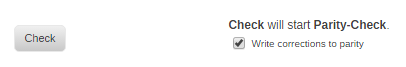

# Storage Management


To assign devices to
the array and/or cache, first login to the server's WebGUI. Click on
the **Main** tab and select the devices to assign to slots for parity,
data, and cache disks. Assigning devices to Unraid is easy! Just
remember these guidelines:

- **Always pick the largest storage device available to act as your
  parity device(s)**. When expanding your array in the future (adding
  more devices to data disk slots), you cannot assign a data disk that
  is larger than your parity device(s). For this reason, it is highly
  recommended to purchase the largest HDD available for use as your
  initial parity device, so future expansions aren't limited to small
  device sizes. If assigning dual parity disks, your two parity disks
  can vary in size, but the same rule holds true that no disk in the
  array can be larger than your smallest parity device.

- **SSD support in the array is experimental**. Some SSDs may not be
  ideal for use in the array due to how TRIM/Discard may be
  implemented. Using SSDs as data/parity devices may have
  unexpected/undesirable results. This does NOT apply to the cache /
  cache pool. Most modern SSDs will work fine in the array, and even
  NVMe devices are now supported, but know that until these devices
  are in wider use, we only have limited testing experience using them
  in this setting.

- **Using a cache will improve array performance**. It does this by
  redirecting write operations to a dedicated disk (or pool of disks
  in Unraid 6) and moves that data to the array on a schedule that you
  define (by default, once per day at 3:40AM). Data written to the
  cache is still presented through your user shares, making use of
  this function completely transparent.

- **Creating a cache-pool adds protection for cached data**. If you
  only assign one cache device to the system, data residing there
  before being moved to the array on a schedule is not protected from
  data loss. To ensure data remains protected at all times (both on
  data and cache disks), you must assign more than one device to the
  cache function, creating what is called a cache-pool. Cache pools
  can be expanded on demand, similar to the array.

- **SSD-based cache devices are ideal for applications and virtual
  machines**. Apps and VMs benefit from SSDs as they can leverage
  their raw IO potential to perform faster when interacting with them.
  Use SSDs in a cache pool for the ultimate combination of
  functionality, performance, and protection.

- **Encryption is disabled by default**. If you wish to use this
  feature on your system, you can do so by adjusting the file system
  for the devices you wish to have encrypted. Click on each disk you
  wish to have encrypted and toggle the filesystem to one of the
  encrypted options. Note, however, that using encryption can
  complicate recovering from certain types of failure so do not use
  this feature just because it is available if you have no need for
  it.

Unraid recognizes disks by their serial number (and size). This means
that it is possible to move drives between SATA ports without having to
make any changes in drive assignments. This can be useful for
troubleshooting if you ever suspect there may be a hardware-related
issue such as a bad port or a think a power or SATA cable may be
suspect.

_NOTE: Your array will not start if you assign or attach more devices
than your license key allows._

# Starting and stopping the array

Normally following system boot up the array (complete set of disks) is
automatically started (brought on-line and exported as a set of shares).
But if there's been a change in disk configuration, such as a new disk
added, the array is left stopped so that you can confirm the
configuration is correct. This means that any time you have made a disk
configuration change you must log in to the WebGUI and manually start
the array. When you wish to make changes to disks in your array, you
will need to stop the array to do this. Stopping the array means all of
your applications/services are stopped, and your storage devices are
unmounted, making all data and applications unavailable until you once
again start the array. To start or stop the array, perform the following
steps:

1. Log into the Unraid WebGUI using a browser (e.g. `http://tower`;
   `http://tower.local` from Mac)
2. Click on **Main**
3. Go to the _Array Operation_ section
4. Click **Start** or **Stop** (you may first need to click the "Yes I
   want to do this" checkbox)

## Help! I can't start my array!

If the array can't be started, it may be for one of a few reasons which
will be reported under the _Array Operation_ section:

- Too many wrong and/or missing disks
- Too many attached devices
- Invalid or missing registration key
- Cannot contact key-server
- This Unraid Server OS release has been withdrawn

### Too many disks missing from the array


If you have no parity disks, this message won't appear.

If you have a single parity disk, you can only have up to one disk
missing and still start the array, as parity will then help simulate the
contents of the missing disk until you can replace it.

If you have two parity disks, you can have up to two disks missing and
still start the array.

If more than two disks are missing / wrong due to a catastrophic
failure, you will need to perform the New Config procedure.

### Too many attached devices


Storage devices are any
devices that present themselves as a block storage device EXCLUDING the
USB flash device used to boot Unraid Server OS. Storage devices can be
attached via any of the following storage protocols:
IDE/SATA/SAS/SCSI/USB. This rule only applies prior to starting the
array. Once the array is started, you are free to attach additional
storage devices and make use of them (such as USB flash devices for
assignment to virtual machines). In Unraid Server OS 6, the attached
storage device limits are as follows:

### Invalid or missing key


#### Missing key

A valid registration key is required in order to start the array. To
purchase or get a trial key, perform the following steps:

1. Log into the Unraid webGui using a browser (e.g. http://tower from
   most device, http://tower.local from Mac devices)
2. Click on **Tools**
3. Click on **Registration**
4. Click to **Purchase Key** or **Get Trial Key** and complete the
   steps presented there
5. Once you have your key file link, return to the **Registration** and
   paste it in the field then click **Install Key**.

#### Expired trial

If the word "expired" is visible at the top left of the WebGUI, this
means your trial key has expired. Visit the registration page to request
either an extension to your trial or purchase a valid registration key.

#### Blacklisted USB flash device

If your server is connected to the Internet and your trial hasn't
expired yet, it is also possible that your USB flash device contains a
GUID that is prohibited from registering for a key. This could be
because the GUID is not truly unique to your device or has already been
registered by another user. It could also be because you are using an SD
card reader through a USB interface, which also tends to be provisioned
with a generic GUID. If a USB flash device is listed as blacklisted,
this is a permanent state and you will need to seek an alternative
device to use for your Unraid Server OS installation.

### Cannot contact key-server

This message will only occur if you are using a Trial license. If you
are using a paid-for license then the array can be started without the
need to contact the Unraid license server.

If your server is unable to contact our key server to validate your
Trial license, you will not be able to start the array. The server will
attempt to validate upon first boot with a timeout of 30 sec. If it
can't validate upon first boot, then the array won't start, but each
time you navigate or refresh the WebGUI it will attempt validation again
(with a very short timeout). Once validated, it won't phone-home for
validation again unless rebooted.

### This Unraid Server OS release has been withdrawn

If you receive this message, it means you are running a beta or release
candidate version of Unraid that has been marked disabled from active
use. Upgrade the OS to the latest stable, beta, or release candidate
version in order to start your array.

# Array operations

There are a number of operations you can perform against your array:

- Add disks
- Replace disks
- Remove disks
- Check disks
- Spin disks up/down
- Reset the array configuration

_NOTE: In cases where devices are added/replaced/removed, etc., the
instructions say "Power down" \... "Power up". If your server's
hardware is designed for hot/warm plug, Power cycling is not necessary
and Unraid is designed specifically to handle this. All servers built by
LimeTech since the beginning are like this:_ **no power cycle
necessary.**

## Adding disks

### Configuring Disks

TBD

### Clear v Pre-Clear

Under Unraid a 'Clear disk is one that has been completely filled with
zeroes and contains a special signature to say that it is in this state.
This state is needed before a drive can be added to a parity-protected
array without affecting parity. If Unraid is in the process of writing
zeroes to all of a drive then this is referred to as a 'Clear'
operation. This Clear operation can take place as a background operation
while using the array, but the drive in question cannot be used to store
data until the Clear operation has completed and the drive been
formatted to the desired File System type.

_A disk that is being added as a parity drive or one that is to be used
to rebuild a failed drive does **not** need to be in a 'Clear' state
as those processes overwrites every sector on the drive with new
contents as part of carrying out the operation. In addition, if you are
adding an additional data drive to an array that does not currently have
a parity drive there is no requirement for the drive to be clear before
adding it._

You will often see references in the forum or various wiki pages to
'Preclear'. This refers to getting the disk into a 'Clear' state
before adding it to the array. The Preclear process requires the use of
a third-party plugin. Prior to Unraid v6, this was highly desirable as
the array was offline while Unraid carried out the 'Clear' operation.
but Unraid v6 now carries out 'Clear' as a background process with the
array operational while it is running so it is now completely optional.
Many users still like to use the Preclear process as in addition to
putting the disk into a clear state it also performs a level of 'stress
test' on the drive which can be used as a confidence check on the
health of the drive. The Preclear as a result takes **much** longer than
Unraid's more simplistic 'clear' operation. Many users like to
Preclear new disks as an initial confidence check and to reduce the
chance of a drive suffering from 'what is known as infant mortality'
where one of the most likely times for a drive to fail is when it is
first used (presumably due to a manufacturing defect).

_It is also important to note that after completing a 'Preclear' you
must **not** carry out any operation that will write to the drive (e.g.
**format** it) as this will destroy the 'Clear' state._

### Data Disks

This is the normal case of expanding the capacity of the system by
adding one or more new hard drives.

The capacity of any new disk(s) added must be the same size or smaller
than your parity disk. If you wish to add a new disk that is larger than
your parity disk, then you must instead first replace your parity disk.
(You could use your new disk to replace parity, and then use your old
parity disk as a new data disk).

The procedure is:

1. Stop the array.
2. Power down the server.
3. Install your new disk(s).
4. Power up the server.
5. Assign the new storage device(s) to a disk slot(s) using the Unraid
   WebGUI.
6. Start the array.
7. If your array is parity protected then Unraid will now automatically
   begin to clear the disk as this is required before it can be added
   to the array.
   - This step is omitted if you do not have a parity drive.
   - If a disk has been pre-cleared before adding it Unraid will
     recognize this and go straight to the next step.
   - The clearing phase is necessary to preserve the fault tolerance
     characteristic of the array. If at any time while the new
     disk(s) is being cleared, one of the other disks fails, you will
     still be able to recover the data of the failed disk.
   - The clearing phase can take several hours depending on the size
     of the new disks(s) and although the array is available during
     this process Unraid will not be able to use the new disk(s) for
     storing files until the clear has completed and the new disk has
     been formatted.
   - The files on other drives in the array will be accessible during
     a clear operation, and the clear operation should not degrade
     performance in accessing these other drives.
8. Once the disk has been cleared, an option to format the disk will
   appear in the WebGUI. At this point, the disk is added to the array
   and shows as unmountable and the option to format unmountable disks
   is shown.
   - Check that the serial number of the disk(s) is what you expect.
     You do not want to format a different disk (thus erasing its
     contents) by accident.
9. Click the check box to confirm that you want to proceed with the
   format procedure.
   - A warning dialog will be given warning you of the consequences
     as once you start the format the disks listed will have any
     existing contents erased and there is no going back. This
     warning may seem a bit like over-kill but there have been times
     that users have used the format option when it was **not** the
     appropriate action.
10. The format button will now be enabled so you can click on it to
    start the formatting process.
11. The format should only take a few minutes and after the format
    completes the disk will show as mounted and ready for use.
    - You will see that a small amount of space will already show as
      used which is due to the overheads of creating the empty file
      system on the drive.

You can add as many new disks to the array as you desire at one time,
but none of them will be available for use until they are all cleared
and formatted with a filesystem

### Parity Disks

It is not mandatory for an Unraid system to have a parity disk, but it
is normal to provide redundancy. A parity disk can be added at any time,
Each parity disk provides redundancy against one data drive failing.

Any parity disk you add must be at least as large as the largest data
drive (although it can be larger). If you have two parity drives then it
is not required that they be the same size although it is required that
they both follow the rule of being at least as large as the largest data
drive.

The process for adding a parity disk is identical to that for adding a
data disk except that when you start the array after adding it Unraid
will start to build parity on the drive that you have just added.

While parity is being rebuilt the array will continue to function with
all existing files being available, but the performance in accessing
these files will normally be degraded due to contention with the parity
build process.

**NOTE:**

You cannot add a parity disk(s) and data disk(s) at the same time in a
single operation. This needs to be split into two separate steps, one to
add parity and the other to add additional data space.

### Upgrading parity disk(s)

You may wish to upgrade your parity device(s) to a larger one(s) so you
can start using larger sized disks in the array or to add an additional
parity drive

**CAUTION:** If you take the actions below and only have a **single**
parity drive then you need to bear the following in mind:

- The array will be unprotected until the parity rebuild occurs. This
  means that if a data drive fails during this process you are likely
  to suffer loss of the data on the failing drive.
- If you already have a failed data drive then this will remove the
  ability to rebuild that data drive. In such a situation the **Parity
  Swap** procedure is the correct way to proceed.

The procedure to remove a parity drive is as follows:

1. Stop the array.
2. Power down the server.
3. Install new larger parity disks. Note if you do this as your first
   step then steps 2 & 4 listed here are not needed.
4. Power up the server.
5. Assign the larger disk to the parity slot (replacing the former
   parity device).
6. Start the array.

When you start the array, the system will once again perform a parity
build to the new parity device and when it completes the array will once
again be in a protected state. It is recommended that you keep the old
parity drives contents intact until the above procedure completes as if
an array drive fails during this procedure so you cannot complete
building the contents of the new parity disk, then it is possible to use
the old one for recovery purposes (ask on the forum for the steps
involved). If you have a dual parity system and wish to upgrade both of
your parity disks, it is recommended to perform this procedure one
parity disk at a time, as this will allow for your array to still be in
a protected state throughout the entire upgrade process.

Once you've completed the upgrade process for a parity disk, the former
parity disk can be considered for assignment and use in the array as an
additional data disk (depending on age and durability)

## Replacing disks

There are two primary reasons why you may wish to replace disks in the
array:

- A disk needs to be replaced due to failure or scheduled retirement
  (out of warranty / support / serviceability).
- The array is nearly full and you wish to replace existing data
  disk(s) with larger ones (out of capacity).

In either of these cases, the procedure to replace a disk is roughly the
same, but one should be aware of the risk of data loss during a disk
replacement activity. Parity device(s) protect the array from data loss
in the event a disk failure. A single parity device protects against a
single failure, whereas two parity devices can protect against losing
data when two disks in the array fail. This chart will help you better
understand your level of protection when various disk replacement
scenarios occur.

Data Protection During Disk Replacements

---

**Replacing a single disk**
**Replacing two disks**

### Replacing a disk to increase capacity

With modern disks rapidly increasing in capacity you can replace an
existing data drive with a larger one to increase the available space in
the array without increasing the total count of drives in the array.

Points to note are:

- If a disk is showing as unmountable then you should resolve this
  before attempting to upgrade the drive as the rebuild process does
  not clear an unmountable status
- If you have single parity then you are not protected against a
  different drive failing during the upgrade process. If this happens
  then post to the forums to get advice on the best way to proceed to
  avoid data loss.
- If you have dual parity and you are upgrading a single data drive
  then you are still protected against another data drive failing
  during the upgrade process.
- If you have dual parity you can upgrade two drives simultaneously
  but you would then not be protected against another drive failing
  while doing the upgrade. If this happens then post to the forums to
  get advice on the best way to proceed to avoid data loss. It is up
  to you to decide on whether to take the route of upgrading two
  drives one at a time or taking the faster but riskier route of doing
  them at the same time.
- Keep the disk that you are replacing with its contents unchanged
  until you are happy that the upgrade process has gone as planned.
  This gives a fallback capability if the upgrade has gone wrong for
  any reason.

To perform the upgrade proceed as follows:

- Run a parity check if you have not done so recently and make sure
  that zero errors are reported. Attempting an upgrade if parity is
  not valid will result in the file system on the upgraded disk being
  corrupt.
- Stop the array.
- Unassign the disk you want to upgrade.
- Start the array to commit this change and make Unraid 'forget' the
  current assignment.
  - Unraid will now tell you that the missing disk is being
    emulated. It does this using the combination of the remaining
    data drives and a parity drive to dynamically reconstruct the
    contents of the emulated drive. From a user perspective the
    system will act as if the drive was still present albeit with a
    reduced level of protection against another drive failing.
  - If you started the array in Maintenance mode then this will
    ensure no new files can be written to the drive during the
    upgrade process
  - If you started the drive in Normal mode then you will be able to
    read and write to the Emulated drive as if it was still physically
    present
- Stop the array.
  - At this point the array is in the same state as it would be if
    the drive you have stopped using had failed instead of being
    unassigned as part of the upgrade process.
- Assign the (larger) replacement drive to the slot previously used
  for the drive you are upgrading.
- Start the array to begin rebuilding the contents of the emulated
  drive on to the upgraded drive.
  - Since the replacement drive is larger than the one it is
    replacing when the contents of the emulated drive have been put
    onto the replacement drive Unraid will automatically expand the
    file system on the drive so the full capacity of the drive
    becomes available for storing data.

### Replacing failed/disabled disk(s)


As noted previously, with a single parity disk, you can replace up to
one disk at a time, but during the replacement process, you are at risk
for data loss should an additional disk failure occur. With two parity
disks, you can replace either one or two disks at a time, but during a
two disk replacement process, you are also at risk for data loss.
Another way to visualize the previous chart:

#### Array Tolerance to Disk Failure Events

| | Without Parity | With Single Parity | With Dual Parity |
| ----------- | ----------- | ----------- | ----------- |
| **A single disk failure** | Data from that disk is lost | Data is still available and the disk can be replaced | Data is still available and the disk can be replaced |
| **A dual disk failure** | Data on both disks are lost | Data on both disks are lost | Data is still available and the disks can be replaced |


_NOTE: If more disk failures have occurred than your parity protection
can allow for, you are advised to post in the General Support forum for
assistance with data recovery on the data devices that have failed._

#### What is a 'failed' (disabled) drive

It is important to realize what is meant by the term failed drive:

- It is typically used to refer to a drive that is marked with a red
  'x' in the Unraid GUI.
- It does NOT necessarily mean that there is a physical problem with
  the drive (although that is always a possibility). More often than
  not the drive is OK and an external factor caused the write to fail.

If the syslog shows that resets are occurring on the drive then this
is a good indication of a connection problem.

The SMART report for the drive is a good place to start.

The SMART attributes can indicate a drive is healthy when in fact it
is not. A better indication of health is whether the drive can
successfully complete the SMART extended test without error. If it
cannot complete this test error-free then there is a high likelihood
that the drive is not healthy.

CRC errors are almost invariably cabling issues. It is important to
realize that this SMART attribute is never reset to 0 so if it stops
increasing that is what you should be aiming to achieve.

- If you have sufficient parity drives then Unraid will emulate the
  failed drive using the combination of the parity drive(s) and the
  remaining 'good' drives. **From a user perspective, this results
  in the system reacting as if the failed drive is still present**.

This is one reason why it is important that you have enabled
notifications to get alerted to such a failure. From the end-user
perspective, the system continues to operate and the data remain
available. Without notifications enabled the user may blithely
continue using their Unraid server not realizing that their data may
now be at risk and they need to take some corrective action.

When a disk is marked as disabled and Unraid indicates it is being
emulated then the following points apply:

- **Unraid will stop writing to the physical drive**. Any writes to
  the 'emulated' drive will not be reflected on the physical drive
  but will be reflected in parity so from the end-user perspective
  then the array seems to be updating data as normal.
- When you rebuild a disabled drive the process will make the physical
  drive correspond to the emulated drive by doing a
  _sector-for-sector_ copy from the emulated drive to the physical
  drive. You can, therefore, check that the emulated drive contains
  the content that you expect before starting the rebuild process.
- **If a drive is being emulated then you can carry out recovery
  actions on the emulated drive before starting the rebuild process**.
  This can be important as it keeps the physical drive untouched for
  potential data recovery processes if the emulated drive cannot be
  recovered.
- If an **emulated** drive is marked as **unmountable** then a rebuild
  will **not** fix this and the rebuilt drive will have the same
  unmountable status as the emulated drive. The correct handling of
  unmountable drives is described in a later section. It is
  recommended that you repair the file system before attempting a
  rebuild as the repair process is much faster that the rebuild
  process and if the repair process is not successful the rebuilt
  drive would have the same problem.

A replacement drive does not need to be the _same_ size as the disk it
is replacing. It cannot be smaller but it can be larger. If the
replacement drive is not larger than any of your parity drives then the
simpler procedure below can be used. In the special case where you want
to use a new disk that is larger than at least one of your parity drives
then please refer to the **Parity Swap** procedure that follows instead.

If you have purchased a replacement drive, many users like to pre-clear
the drive to stress test the drive first, to make sure it's a good
drive that won't fail for a few years at least. The Preclearing is not
strictly necessary as replacement drives don't have to be cleared since
they are going to be completely overwritten., but Preclearing new drives
one to three times provides a thorough test of the drive, eliminates
'infant mortality' failures. You can also carry out stress tests in
other ways such as running an extended SMART test or using tools
supplied by the disk manufacturer that run on Windows or macOS.

#### Normal replacement

This is a normal case of replacing a failed drive where the replacement
drive is **not** larger than your current parity drive(s).

It is worth emphasizing that Unraid must be able to reliably read every
bit of parity PLUS every bit of ALL other disks in order to reliably
rebuild a missing or disabled disk. This is one reason why you want to
fix any disk-related issues with your Unraid server as soon as possible.

To replace a failed disk or disks:

1. Stop the array.
2. Power down the unit.
3. Replace the failed disk(s) with a new one(s).
4. Power up the unit.
5. Assign the replacement disk(s) using the Unraid WebGUI.
6. Click the checkbox that says _Yes I want to do this_
7. (optional) Tick the box to start in Maintenance mode. If you start
   the array in Maintenance mode you will need to press the **Sync**
   button to trigger the rebuild. The advantage of doing this in
   Maintenance mode is that nothing else can write to the array while
   the rebuild is running which maximises speed. The disadvantage is
   that you cannot use the array in the meantime and until you return
   to normal mode cannot see what the contents of the disk being
   rebuilt will look like.
8. Click **Start** to initiate the rebuild process.and the system will
   reconstruct the contents of the emulated disk(s) onto the new
   disk(s) and, if the new disk(s) is/are bigger, expand the file
   system.

##### Notes

- **IMPORTANT**: If at any point during the replacement process Unraid
  appears to offer an option to format a drive do **not** do so as
  this will result in wiping all files belonging to the drive you are
  trying to replace and updating parity to reflect this.
- **A 'good' rebuild relies on all the other array disks being
  read without error.** If during the rebuild process any of the other
  array disks start showing read errors then the rebuilt disk is going
  to show corruption (and probably end up as unmountable) with some
  data loss highly likely.
- You must replace a failed disk with a disk that is as big or bigger
  than the original and not bigger than the smallest parity disk.
- If the replacement disk has been used before then remove any
  existing partitions. In theory this should not be necessary but is
  has been known to sometimes cause problems so it is better to play
  safe.
- The rebuild process can never be used to change the format of a
  disk - it can only rebuild to the existing format.
- The rebuild process will not correct a disk that is showing as
  _unmountable_ when being emulated (as this indicates there is some
  level of file system corruption present) - it will still show as
  _unmountable_ after the rebuild as the rebuild process simply makes
  the physical disk match the emulated one.

#### Rebuilding a drive onto itself

There can be cases where it is determined that the reason a disk was
disabled is due to an external factor and the disk drive appears to be
fine. In such a case you need to take a slightly modified process to
cause Unraid to rebuild a 'disabled' drive back onto the same drive.

1. Stop array
2. Unassign disabled disk
3. Start array so the missing disk is registered
4. **Important**: If the drive to be rebuilt is a data drive then check
   that the emulated drive is showing the content you expect to be
   there as the rebuild process simply makes the physical drive match
   the emulated one. If this is not the case then you may want to ask
   in forums for advice on the best way to proceed.
5. Stop array
6. Reassign disabled disk
7. (optional) Tick the box to start in Maintenance mode. If you start
   the array in Maintenance mode you will need to press the **Sync**
   button to trigger the rebuild. The advantage of doing this in
   Maintenance mode is that nothing else can write to the array while
   the rebuild is running which maximises speed. The disadvantage is
   that you cannot use the array in the meantime and until you return
   to normal mode cannot see what the contents of the disk being
   rebuilt will look like.
8. Click **Start** to initiate the rebuild process and the system will
   reconstruct the contents of the emulated disk.

This process can be used for both data and parity drives that have been
disabled.

#### Parity Swap

This is a special case of replacing a disabled drive where the
replacement drive is larger than your current parity drive. This
procedure applies to both the parity1 and the parity2 drives. If you
have dual parity then it can be used on both simultaneously to replace 2
disabled data drives with the 2 old parity drives.

**NOTE**: It is **not** recommended that you use this procedure for
upgrading the size of both a parity drive and a data drive as the array
will be offline during the parity copy part of the operation. In such a
case it is normally better to first upgrade the parity drive and then
afterward upgrade the data drive using the drive replacement procedure.
This takes longer but the array remains available for use throughout the
process, and in addition, if anything goes wrong you have the just
removed drive available intact for recovery purposes

**Why would you want to do this? To replace a data drive with a larger
one, that is even larger than the Parity drive.**

Unraid does not require a replacement drive to be the same size as
the drive being replaced. The replacement drive CANNOT be smaller
than the old drive, but it CAN be larger, much larger in fact. If
the replacement drive is the same size or larger, UP TO the same
size as the smallest parity drive, then there the simple procedure
above can be used. If the replacement drive is LARGER than the
Parity drive, then a special two-step procedure is required as
described here. It works in two phases: - The larger-than-existing-parity drive is first upgraded to
become the new the parity drive - The old parity drive replaces the old data drive and the data of
the failed drive is rebuilt onto it.

As an example, you have a 1TB data drive that you want to replace
(the reason does not matter). You have a 2TB parity drive. You buy a
4TB drive as a replacement. The 'Parity Swap' procedure will copy
the parity info from the current 2TB parity drive to the 4TB drive,
zero the rest, make it the new parity drive, then use the old 2TB
parity drive to replace the 1TB data drive. Now you can do as you
wish with the removed 1TB drive.

##### Important Notes

- If you have purchased a replacement drive, we always recommend many
  users to pre-clear the drive to stress test the replacement drive
  first, to make sure it's a good drive that won't fail for a few
  years at least. The Preclearing is not strictly necessary, as
  replacement drives don't have to be cleared, they are going to be
  completely overwritten. But Preclearing new drives one to three
  times provides a thorough test of the drive, eliminates 'infant
  mortality' failures.
- **If your replacement drive is the same size or smaller than your
  current Parity drive, then you don't need this procedure. Proceed
  with the [Replacing a Data Drive](/legacy/FAQ/replacing-a-data-drive.md)
  procedure.**
- This procedure is strictly for replacing data drives in an Unraid
  array. If all you want to do is replace your Parity drive with a
  larger one, then you don't need the Parity Swap procedure. Just
  remove the old parity drive and add the new one, and start the
  array. The process of building parity will immediately begin. (If
  something goes wrong, you still have the old parity drive that you
  can put back!)
- **IMPORTANT!!!** This procedure REQUIRES that the data drive being
  replaced MUST be disabled first. If the drive failed (has a red
  ball), then it is already 'disabled', but if the drive is OK but
  you want to replace it anyway, then you have to force it to be
  'failed', by unassigning it and starting and stopping the array.
  Unraid only forgets a drive when the array is started without the
  drive, otherwise it still associates it with the slot (but
  'Missing'). The array must be started once with the drive
  unassigned or disabled. Yes, it may seem odd, but is required before
  Unraid will recognize that you are trying to do a 'Parity Swap'.
  It needs to see a disabled data disk with forgotten ID, a new disk
  assigned to its slot that used to be the parity disk, and a new disk
  assigned to the parity slot.
- Obviously, it's very important to identify the drives for
  assignment correctly! Have a list of the drive models that will be
  taking part in this procedure, with the last 4 characters of their
  serial numbers. If the drives are recent Toshiba models, then they
  may all end in **GS** or **S**, so you will want to note the
  preceding 4 characters instead.

The steps to carry out this procedure are:

Note: these steps are the general steps needed. The steps you take
may differ depending on your situation. If the drive to be replaced
has failed and Unraid has disabled it, then you may not need steps 1
and 2, and possibly not steps 3 and 4. If you have already installed
the new replacement drive (perhaps because you have been Preclearing
it), then you would skip steps 5 through 8. Revise the steps as
needed.

1. Stop the array _(if it's started)_
2. Unassign the old drive _(if it's still assigned)_
   _If the drive was a good drive and notifications are enabled, you
   will get error notifications for a missing drive! This is normal._
3. Start the array (put a check in the **Yes I want to do this**
   checkbox if it appears (older versions: **Yes, I'm sure**))
   _Yes, you need to do this. Your data drive should be showing as
   **Not installed**._
4. Stop the array again
5. Power down
6. _[ Optional ]_ Pull the old drive
   _You may want to leave it installed, for Preclearing or testing or
   reassignment._
7. Install the new drive (preclear STRONGLY suggested, but formatting
   not needed)
8. Power on
9. Stop the array

   _\*If you get an "Array Stopping•Retry unmounting disk
   share(s)\..." message, try disabling Docker and/or VM in Settings
   and stopping the array again after rebooting._
10. Unassign the parity drive
11. Assign the new drive in the parity slot
    _You may see more error notifications! This is normal._
12. Assign the old parity drive in the slot of the old data drive being
    replaced
    _You should now have blue drive status indicators for both the
    parity drive and the drive being replaced._
13. Go to the **Main** → **Array Operation** section
    _You should now have a **Copy** button, with a statement indicating
    "**Copy** will copy the parity information to the new parity
    disk"._
14. Put a check in the **Yes I want to do this** checkbox (older
    versions: **Yes, I'm sure**), and click the **Copy** button
    _Now patiently watch the copy progress, takes a long time (\~20
    hours for 4TB on a 3GHz Core 2 Duo). All of the contents of the old
    parity drive are being copied onto the new drive, then the remainder
    of the new parity drive will be zeroed.

    **The array will NOT be available during this operation!**

    _\*If you disabled Docker and/or VM in settings earlier, go ahead
    and re-enable now._

    When the copy completes, the array will still be stopped
    ("**Stopped**. Upgrading disk/swapping parity.").

    The **Start** button will now be present, and the description will
    now indicate that it is ready to start a Data-Rebuild._
15. Put a check in the **Yes I want to do this** checkbox (older
    versions: **Yes, I'm sure**), and click the **Start** button
    _The data drive rebuild begins. Parity is now valid, and the array
    is started.

    Because the array is started, you can use the array as normal, but
    for best performance, we recommend you limit your usage.

    Once again, you can patiently watch the progress, it takes a long
    time too! All of the contents of the old data drive are now being
    reconstructed on what used to be your parity drive, but is now
    assigned as the replacement data drive._

**That's it!** Once done, you have an array with a larger parity
drive and a replaced data drive that may also be larger!

_Note: many users like to follow up with a parity check, just to
check everything. It's a good confidence builder (although not
strictly necessary)!_

### A disk failed while I was rebuilding another

If you only have a single parity device in your system and a disk
failure occurs during a data-rebuild event, the data rebuild will be
cancelled as parity will no longer be valid. However, if you have dual
parity disks assigned in your array, you have options. You can either

- let the first disk rebuild complete before starting the second, or
- you can cancel the first rebuild, stop the array, replace the second
  failed disk, then start the array again

If the first disk being rebuilt is nearly complete, it's probably
better to let that finish, but if you only just began rebuilding the
first disk when the second disk failure occurred, you may decide
rebuilding both at the same time is a better solution.

## Removing disks

There may be times when you wish to remove drives from the system.

### Removing parity disk(s)

If for some reason you decide you do not need the level of parity
protection that you have in place then it is always possible to easily
remove a parity disk.

1. Stop the array.
2. Set the slot for the parity disk you wish to remove to _Unassigned_.
3. Start the array to commit the change and 'forget' the previously
   assigned parity drive.

**CAUTION:** If you already have any failed data drives in the array be
aware that removing a parity drive reduces the number of failed drives
Unraid can handle without potential data loss.

- If you started with **dual** parity you can still handle a single
  failed drive but would not then be able to sustain another drive
  failing while trying to rebuild the already failed drive without
  potential data loss.
- If you started with **single** parity you will no longer be able to
  handle any array drive failing without potential data loss.

### Removing data disk(s)

Removing a disk from the array is possible, but normally requires you to
once again sync your parity disk(s) after doing so. This means that
until the parity sync completes, the array is vulnerable to data loss
should any disk in the array fail.

To remove a disk from your array, perform the following steps:

1. Stop the array
2. (optional) Make note if your disk assignments under the main tab
   (for both the array and cache; some find it helpful to take a
   screenshot)
3. Perform the [Reset the array
   configuration](#reset-the-array-configuration)
   procedure. When doing this it is a good idea to use the option to
   preserve all current assignments to avoid you having to re-enter
   them (and possibly make a mistake doing so).
4. Make sure all your previously assigned disks are there and set the
   drive you want removed to be Unassigned
5. Start the array without checking the 'Parity is valid' box.

A parity-sync will occur if at least one parity disk is assigned and
until that operation completes, the array is vulnerable to data loss
should a disk failure occur.

### Alternative method

It is also possible to remove a disk without invalidating parity if
special action is taken to make sure that the disk only contains zeroes
as a disk that is all zeroes does not affect parity. There is no support
for this method built into the Unraid GUI so. it requires manual steps
to carry out the zeroing process. It also takes much longer than the
simpler procedure above.

_There is no official support from Limetech for using this method so you
are doing it at your own risk._

### Notes

1. This method preserves parity protection at all times.
2. This method can only be used if the drive to be removed is a good
   drive that is completely empty, is mounted and can be completely
   cleared without errors occurring.
3. While this method allows for removing multiple drives at once, make
   sure that you are not clearing multiple drives at the same time.
   Trying to clear multiple drives in parallel is slower than doing
   them sequentially due to the contention that arises for updating
   the parity drive.
4. As stated above, the drive must be completely empty as this process
   will erase all existing content. If there are still any files on it
   (including hidden ones), they must be moved to another drive or
   deleted.
   - One quick way to clear a drive of files is to reformat it! To
     format an array drive, you stop the array, and then on the Main
     page click on the link for the drive and change the file system
     type to something different than it currently is, then restart
     the array. You will then be presented with an option to format
     it. Formatting a drive removes all of its data, and the parity
     drive is updated accordingly, so the data cannot be easily
     recovered.
   - Explanatory note: "Since you are going to clear the drive
     anyway, why do I have to empty it?" Yes, it seems a bit draconian to
     require the drive to be empty since we're about to clear and
     empty it in the script, but we're trying to be absolutely
     certain we don't cause data loss. In the past, some users
     misunderstood the procedure, and somehow thought we would
     preserve their data while clearing the drive! This way, by
     requiring the user to remove all data, there cannot be any
     accidents or misunderstandings and data loss.

The procedure is as follows:

1. Make sure that the drive you are removing has been removed from any
   inclusions or exclusions for all shares, including in the global
   share settings.
2. Make sure the array is started, with the drive assigned and mounted.
3. Make sure you have a copy of your array assignments, especially the
   parity drive.
   - In theory you should not need this but it is a useful safety net
     in case if the "Retain current configuration" option under New
     Config doesn't work correctly (or you make a mistake using it).
4. It is highly recommended to turn on reconstruct write, as the write
   method (sometimes called 'Turbo write'). With it on, the script
   can run 2 to 3 times as fast, saving hours!
   - However when using 'Turbo Write' all drives must read without
     error so do not use it unless you are sure no other drive is
     having issues.
   - To enable 'turbo Write' in _Settings → Disk Settings_, change
     Tunable (md_write_method) to reconstruct write
5. Make sure ALL data has been copied off the drive; drive MUST be
   completely empty for the clearing script to work.
6. Double check that there are no files or folders left on the drive.
   - Note: one quick way to clean a drive is to reformat it! (once
     you're sure nothing of importance is left of course!)
   - Another way to check is by running `ls -al /mnt/diskX` in the
     Unraid console. Replace `X` with the disk number.
7. If you're going to be running the commands through ssh or the
   web based Unraid console, you probably need to run them in `screen`
   or `tmux` so that if the session is disconnected, the process
   continues to run in the background. To avoid that issue, it is
   recommended that you run the following commands on the main Unraid
   console (not through the gui, but on the physical machine).
9. Unmount the disk you are planning to remove (replace `X` with the
   drive number)
   ```shell
   umount /mnt/diskX
   ```
10. Clear the drive (replace `X` with the drive number)
    ```shell
    dd bs=1M if=/dev/zero of=/dev/mdXp1 status=progress
    ```
    - On Unraid 7 and later, the parity protected drives are mounted
      at the path `/dev/mdXp1` but on older versions, they are mounted
      at the path `/dev/mdX`. Double check that you're using the
      correct path.
    - Clearing takes a loooong time! Progress info will be displayed.
    - For best performance, make sure there are no reads/writes
      happening to the array. It is recommended that you stop the
      Docker and VM Manager services, and temporarily disable the mover
      prior to clearing.
    - While the script is running, the Main screen may show invalid
      numbers for the drive, ignore them. Important! Do not try to
      access the drive, at all!
11. When the clearing is complete, stop the array
12. On Unraid 7 and later, stopping the array may get stuck with the
    message `Retry unmounting disk share(s)...`. That's because we
    manually unmounted the cleared drive and Unraid does not like it.
    If you get that error, perform the following steps on the Unraid
    console to create and mount a mock disk that Unraid can unmount
    and continuw with stopping the array (replace `X` with the drive
    number):
    ```shell
    # Create a mock disk to mount
    dd if=/dev/zero of=/tmp/mockdisk bs=1M count=310
    # Create a filesystem on the mock disk
    mkfs -t xfs /tmp/mockdisk
    # Mount the mock disk so Unraid can unmount it and continue
    # Replace X with the drive number
    mount /tmp/mockdisk /mnt/diskX
    ```
    Once you run those commands, Unraid will be able to unmount the
    drive and successfully stop the array. You can then remove the mock
    disk by running the following command on the Unraid console:
    ```shell
    rm /tmp/mockdisk
    ```
13. Follow the procedure for resetting the array making sure you elect
    to retain all current assignments.
14. Return to the Main page, and check all assignments. If any are
    missing, correct them. Unassign the drive(s) you are removing.
    Double-check all of the assignments, especially the parity drive(s)!
15. Click the check box for Parity is already valid, make sure it is
    checked!
16. Start the array! Click the Start button then the Proceed button (on
    the warning popup that will pop up)
17. (Optional) Start a correcting parity check to ensure parity really
    is valid and you did not make a mistake in the procedure. If
    everything was done correctly this should return zero errors.

**Important!!!** It is VITAL you use the correct drive number, or you
will wipe clean the wrong drive!

## Checking array devices



When the array is started,
there is a button under **Array Operations** labelled _Check_. Depending
on whether or not you have any parity devices assigned, one of two
operations will be performed when clicking this button.

It is also possible to schedule checks to be run automatically at
User-defined intervals under **Settings → Scheduler**. It is a good idea
to do this as an automated check on array health so that problems can be
noticed and fixed before the array can deteriorate beyond repair.
Typical periods for such automated checks are monthly or quarterly and
it is recommended that such checks should be **non-correcting**.

### Parity check

If you have at least one parity device assigned, clicking _Check_
will initiate a Parity-check. This will march through all data disks in
parallel, computing parity and checking it against stored parity on the
parity disk(s).

You can continue to use the array while a parity check is running but
the performance of any file operations will be degraded due to drive
contention between between the check and the file operation. The parity
check will also be slowed while any such file operations are active.

By default, if an error is found during a Parity-check the parity disk
will be updated (written) with the computed data and the Sync Errors
counter will be incremented. If you wish to run purely a check without
writing correction, uncheck the checkbox that says **Write corrections
to parity** before starting the check. In this mode, parity errors will
be notated but not actually fixed during the check operation.

A _correcting_ parity check is started automatically when starting the
array after an "Unsafe Shutdown". An "Unsafe Shutdown" is defined as
any time that the Unraid server was restarted without having previously
successfully stopped the array. The most common cause of Sync Errors is
an unexpected power-loss, which prevents buffered write data from being
written to disk. It is highly recommended that users consider purchasing
a UPS (uninterruptable power supply) for their systems so that Unraid
can be set to shut down tidily on power loss, especially if frequent
offsite backups aren't being performed.

It is also recommended that you run an automatic parity check
periodically and this can be done under _Settings-\>Scheduler_. The
frequency is up to the user but monthly or quarterly are typical
choices. It is also recommended that such a check is set as
**non-correcting** as if a disk is having problems there is a chance of
you corrupting your parity if you set such a check to be correcting. The
only acceptable result from such a check is to have **0 errors**
reported. If you do have errors reported then you should take
pre-emptive action to try and find out what is causing them. If in doubt
ask questions in the forum.

### Read check


If you configure an array
without any parity devices assigned, the _Check_ option will start a
_Read check_ against all the devices in the array. You can use this to
check disks in the array for unrecoverable read errors, but know that
without a parity device, data may be lost if errors are detected.

A _Read Check_ is also the type of check started if you have disabled
drives present and the number of disabled drives is larger than the
number of parity drives.

### Check history

Any time a parity or read check is performed, the system will log the
details of the operation and you can review them by clicking the
_History_ button under **Array Operations**. These are stored in a text
file under the config directory on your Unraid USB flash device.

## Spin up and down disks

If you wish to manually control the spin state of your rotational
storage devices or toggle your SSD between active and standby mode,
these buttons provide that control. Know that if files are in the
process of being accessed while using these controls, the disk(s) in use
will remain in an active state, ignoring your request.

When disks are in a spun-down state, they will not report their
temperature through the WebGUI.

## Reset the array configuration


If you wish to remove a disk from the array or you simply wish to start
from scratch to build your array configuration, there is a tool in
Unraid that will do this for you. To reset the array configuration,
perform the following steps: 

1. Navigate to the **Tools** page and click _New Config_
2. You can (optionally) elect to have the system preserve some of the
   current assignments while resetting the array. This can be very
   useful if you only intend to make a small change as it avoids you
   having to re-enter the details of the disks you want to leave
   unchanged.
3. Click the checkbox confirming that you want to do this and then
   click apply to perform the operation
4. Return to the **Main** tab and your configuration will have been
   reset
5. Make any adjustments to the configuration that you want.
6. Start the array to commit the configuration. You can start in Normal
   or Maintenance mode.

Notes:

- Unraid will recognize if any drives have been previously used by
  Unraid, and when you start the array as part of this procedure the
  contents of such disks will be left intact.
- There is a checkbox next to the Start button that you can use to say
  'Parity is Valid'. Do not check this unless you are sure it is the
  correct thing to do, or unless advised to do so by an experienced
  Unraid user as part of a data recovery procedure.
- Removing a data drive from the array will always invalidate parity
  unless special action has been taken to ensure the disk being
  removed only contains zeroes
- Reordering disks after doing the New Config without removing drives
  does not invalidate parity1, but it **DOES** invalidate parity2.

_Undoing a reset_

If for any reason after performing a reset, you wish to undo it, perform
the following steps:

1. Browse to your flash device over the network (SMB)
2. Open the **Config** folder
3. Rename the file _super.old_ to _super.dat_
4. Refresh the browser on the **Main** page and your array
   configuration will be restored

## Notifications

TBD

### Status Reports

Unraid can be configured to send you status reports about the state of
the array.

An important point about these reports is:

- They only tell you if the array currently has any disks disabled or
  showing read/write errors.
- The status is reset when you reboot the system, so it does not tell
  you what the status was in the past.
- **IMPORTANT**: The status report does not take into account the
  SMART status of the drive. You can therefore get a status report
  indicating that the array appears to be healthy even though the
  SMART information might indicate that a disk might not be too
  healthy.

## SMART Monitoring

Unraid can be configured to report whether SMART attributes for a drive
are changing. The idea is to try and tell you in advance if drives might
be experiencing problems even though they have not yet caused read/write
errors so that you can take pre-emptive action before a problem becomes
serious and thus might potentially lead do data loss. You should have
notifications enabled so that you can see these notifications even when
you are not running the Unraid GUI.

SMART monitoring is currently only supported for SATA drives and is not
available for SAS drives.

Which SMART attributes are monitored can be configured by the user, but
the default ones are:

- 5: Reallocated Sectors count
- 187: Reported uncorrected errors
- 188: Command timeout
- 197: Current / Pending Sector Count
- 198: Uncorrectable sector count
- 199: UDMA CRC error count

If any of these attributes change value then this will be indicated on
the Dashboard by the icon against the drive turning orange. You can
click on this icon and a menu will appear that allows you to acknowledge
that you have seen the attribute change, and then Unraid will stop
telling you about it unless it changes again.

You can manually see all the current SMART information for a drive by
clicking on its name on the Main tab in the Unraid GUI.

# Pool (cache) Operations

Prior to Unraid 6.9.0 there was only one pool supported and it was
always called **cache**. Starting with Unraid 6.9.0 multiple pools are
supported and the names of these pools are user defined. When multiple
pools are present then any (or all) of them can have the functionality
that was available with the cache in earlier Unraid releases.

If you are running Unraid 6.9.0 or later then any reference you find in
documentation to cache can be considered as applying to any pool, not
just one that is actually named cache.

## Why use a Pool?

There are several reasons why a user might want to use a pool in Unraid.

It is worth pointing out that these uses are not mutually exclusive as a
single pool can be used for multiple Use Cases.

UnRaid 6.9 (or later) also supports multiple pools so it is possible to
have individual pools dedicated to specific Use Cases.

### Cache

The way that Unraid handles parity means that the speed of writing to a
parity protected array is lower than might be expected by the raw speed
of the array disks. If a pool is configured to act as a cache for a User
Share then the perceived speed of writing to the array is that supported
by the pool rather than the speed of writing directly to the array.

A particular User Share can only be associated with one pool at a time,
but it is not necessary for all User Shares to be associated with the
same pool.

### Docker application Storage

Docker containers basically consist of 2 parts - the binaries that are
typically stored within the docker.img file that are static and only
updated when the container updates, and the working set that is meant to
be mapped to be external to the docker container (typically as a
container specific subfolder within the appdata share. There are good
reasons to hold both categories on a Pool for several reasons:

- Writes are much faster than when held on the array as they are not
  slowed down by the way in which UnRaid updates parity for a parity
  protected array
- The working set can be accessed and updated faster when stored on a
  Pool.
- It is not necessary to have array disks spun up when a container is
  accessing its binaries or using its working set.

### VM vdisks

Most VM's will have one (or more) vdisk files used to emulate a hard
disk or iso files to emulate a CD-ROM.

Performance of VMs is much better if such files are on a Pool rather
than on an array drive.

## Pool Modes

There are two primary modes of operating a pool in Unraid:

### Single device mode

When the number of disk slots for the pool is set to one, this is
referred to as running in single device mode. In this mode, you will
have no protection for any data that exists on the pool, which is why
multi-device mode is recommended. However, unlike in multi-device mode,
while in single device mode, you are able to adjust the filesystem for
the cache device to something other than BTRFS. It is for this reason
that there are no special operations for single mode. You can only add
or remove the device from the system.

_NOTE: If you choose to use a non-BTRFS file system for your pool device
operating in single mode, you will not be able to expand to a
multi-device pool without first reformatting the device with BTRFS. It
is for this reason that BTRFS is the default filesystem for a pool, even
when operating in single device mode._

### Multi-Device mode

When more than one disk is assigned to the pool, this is referred to as
running in multi-device mode. This mode utilizes a BTRFS specific
implementation of RAID 1 in order to allow for any number of devices to
be grouped together in a pool. Unlike a traditional RAID 1, a BTRFS
RAID1 can mix and match devices of different sizes and speeds and can
even be expanded and contracted as your needs change. To calculate how
much capacity your BTRFS pool will have, check out this handy [btrfs
disk usage calculator](http://carfax.org.uk/btrfs-usage/). Set the
Preset RAID level to RAID-1, select the number of devices you have, and
set the size for each. The tool will automatically calculate how much
space you will have available.

Here are typical operations that are likely to want to carry out on the
pool:

- Back up the pool to the array
- Switch the pool to run in multi-device mode
- Add disks
- Replace a disk

## Backing up the pool to the array

The procedure shown assumes that there are at least some dockers and/or
VMs related files on the cache disk, some of these steps are unnecessary
if there aren't.

1. Stop all running Dockers/VMs
2. Settings → VM Manager: disable VMs and click apply
3. Settings → Docker: disable Docker and click apply
4. Click on Shares and change to "Yes" all User Shares with "Use
   cache disk:" set to "Only" or "Prefer"
5. Check that there's enough free space on the array and invoke the
   mover by clicking "Move Now" on the Main page
6. When the mover finishes check that your pool is empty

Note that any files on the pool root will not be moved as they
are not part of any share and will need manual attention

You can then later restore files to the pool by effectively reversing
the above steps:

1. Click on all shares whose content you want on the pool and set "Use
   cache:" option to "Only" or "Prefer" as appropriate.
2. Check that there's enough free space on the pool and invoke the
   mover by clicking "Move Now" on the Main page
3. When the mover finishes check that your pool now has the expected
   content and that the shares in question no longer have files on the
   main array
4. Settings → Docker: enable Docker and click apply
5. Settings → VM Manager: enable VMs and click apply
6. Start any Dockers/VMs that you want to be running

## Switching the pool to multi-device mode

If you want a multi-device pool then the only supported format for this
is BTRFS. If it is already in BTRFS format then you can follow the
procedure below for adding an additional drive to a pool

If the cache is NOT in BTRFS format then you will need to do the
following:

1. Use the procedure above for backing up any existing content you want
   to keep to the array.
2. Stop the array
3. Click on the pool on the Main tab and change the format to be BTRFS
4. Start the array
5. The pool should how show as **unmountable** and offer the option to
   format the pool.
6. Confirm that you want to do this and click the format button
7. When the format finishes you now have a multi-device pool (albeit
   with only one drive in it)
8. If you want additional drives in the pool you can (optionally) do it
   now.
9. Use the restore part of the previous procedure to restore any
   content you want on the pool

## Adding disks to a pool

Notes:

- You can only do this if the pool is **already** formatted as BTRFS

If it is not then you will need to first follow the steps in the
previous section to create a pool in BTRFS format.

To add disks to the BTRFS pool perform the following steps:

1. Stop the array.
2. Navigate to the **Main** tab.
3. Scroll down to the section labeled _Pool Devices_.
4. Change the number of **Slots** to be at least as many as the number
   of devices you wish to assign.
5. Assign the devices you wish to the pool slot(s).
6. Start the array.
7. Click the checkbox and then the button under **Array Operations** to
   format the devices.

Make sure that the devices shown are those you expect - you do not
want to accidentally format a device that contains data you want to
keep.

## Removing disks from a multi-device pool

Notes:

- You can only do this if your pool is configured for redundancy at
  both the data and metadata level.
- You can check what raid level your pool is currently set to by
  clicking on it on the Main tab and scrolling down to the Balance
  Status section.
- You can only remove one drive at a time

1. Stop the array
2. Unassign a pool drive.
3. Start the array
4. Click on the pool drive
5. If you still have more than one drive in the pool then you can
   simply run a Balance operation
6. If you only have one drive left in the pool then switch the pool
   RAID level to single as described below

## Change Pool RAID Levels

BTRFS can add and remove devices online, and freely convert between RAID
levels after the file system has been created.

BTRFS supports raid0, raid1, raid10, raid5, and raid6 (but note that
raid5/6 are still considered experimental so use with care i.e. make
sure you have good backups if using these modes), and it can also
duplicate metadata or data on a single spindle or multiple disks. When
blocks are read in, checksums are verified. If there are any errors,
BTRFS tries to read from an alternate copy and will repair the broken
copy if the alternative copy succeeds.

By default, Unraid creates BTRFS volumes in a pool with data=raid1 and
metadata=raid1 to give redundancy.

For more information about the BTRFS options when using multiple devices
see the [BTRFS wiki
article](https://btrfs.wiki.kernel.org/index.php/Using_Btrfs_with_Multiple_Devices).

You can change the BTRFS raid levels for a pool from the Unraid GUI by:

- If the array is not started then start it in normal mode
- Click on the Pool name on the Main tab
- Scroll down to the Balance section
- At this point information (including current RAID levels) will be
  displayed.
- **If using UnRaid 6.8.3 or earlier** then add the appropriate
  additional parameters added to the _Options_ field.

As an example, the following screenshot shows how you might convert
the pool from the RAID1 to the SINGLE profile.


- **If using UnRaid 6.9.0 or later** this has been made even easier by
  giving you a drop-down list of the available options to simply
  selecting the one you want
- Start the Balance operation.
- Wait for the Balance to complete
- The new RAID level will now be fully operational.

## Replace a disk in a pool

**Notes:**

- You can only do this if the pool is formatted as BTRFS **AND** it is
  set up to be redundant.
- You can only replace up to one disk at a time from a pool.

To replace a disk in the redundant pool, perform the following steps:

1. Stop the array.
2. (optional) Physically detach the disk from your system you wish to remove.
3. Attach the replacement disk (must be equal to or larger than the
   disk being replaced).
4. Refresh the Unraid WebGUI when under the **Main** tab.
5. Select the pool slot that previously was set to the old disk and
   assign the new disk to the slot.
6. Start the array.
7. If presented with an option to **Format** the device, click the
   checkbox and button to do so.

## Remove a disk from a pool

There have been times when users have indicated they would like to
remove a disk from a pool they have set up while keeping all the data
intact. This cannot be done from the Unraid GUI but is easy enough to do
from the command line in a console session.

**Note**: You need to maintain the minimum number of devices for the
profile in use, i.e., you can remove a device from a 3+ device raid1
pool but you can't remove one from a 2 device raid1 pool (unless it's
converted to a single profile first), also make sure the remaining 
devices have enough space for the current used pool space, or the 
removal will fail.

With the array running type on the console:

`btrfs device remove /dev/sdX1 /mnt/cache`

Replace X with the correct letter for the drive you want to remove from
the system as shown on the Main tab (don't forget the 1 after it).

If the device is encrypted, you will need slightly different syntax:

`btrfs device remove /dev/mapper/sdX1 /mnt/cache`

If the drive is an NVMe device, use `nvmeXn1p1` in place of `sdX1`

Wait for the device to be deleted (i.e., until the command completes and
you get the cursor back).

The device is now removed from the pool, you don't need to stop the
array now, but at the next array stop you need to make Unraid forget the
now-deleted member, and to achieve that:

- Stop the array
- Unassign all pool devices
- Start the array to make Unraid "forget" the pool config

If the docker and/or VMs services were using that pool best to
disable those services before start or Unraid will recreate the
images somewhere else, assuming they are using /mnt/user paths)

- Stop array (re-enable docker/VM services if disabled above)
- Re-assign all pool member except the removed device
- Start array

Done

You can also remove multiple devices with a single command (as long as
the above rule is observed):

`btrfs device remove /dev/sdX1 /dev/sdY1 /mnt/cache`

but in practice this does the same as removing one device, then the
other, as they are still removed one at a time, just one after the other
with no further input from you.

## Minimum Free Space for a Pool

This setting is used to help avoid the issue of a pool that is being
used for a User Share running out of free space and this then causing
errors to occur. The Minimum Free Space setting for a pool tells Unraid
when to stop putting new files onto the pool for User Shares that have a
_Use Cache_ setting of **Yes** or **Prefer**. Unraid does **not** take
into account file size when selecting a pool and once Unraid has
selected a pool for a file it will not change its mind, and if the file
does not fit you get an out-of-space error. The purpose of the Minimum
Free Space value is that when the free space falls below the level you
set Unraid will start bypassing the pool and writing directly to the
array for any new files. You should therefore set this setting to be
larger than the biggest file you intend to be cached on the pool. In
many ways it is analogous to the setting of the same name for User
Shares but it applies to the pool rather than the array disks. It is
ignored for User Shares which have a _Use Cache_ setting of **Only**,
and is not relevant if the setting is **No**.

For **Unraid 6.8.3** (and earlier) which only supported a single pool
(that was always called cache) this setting can be found under
_Settings → Global Share Settings_.

For **Unraid 6.9.0** (and later) which supports multiple pools (with the
names being user defined) this setting can be found by clicking on the
pool name on the Main tab.

## Moving files between a Pool and the array

A topic that seems to come up with some frequency is what is the process
for getting files that belong to shares (e.g. _appdata_, _system_) that
it is normally recommended are held on a pool device for performance
reasons moved to or from the array if the need arises.

### Moving files from pool to array

A typical Use Case for this action is to get files off the pool so that
you can safely perform some action that you are worried might end up
losing any existing contents. The steps are:

- Disable the Docker and VM services under _Settings_. This is done to
  ensure that they will not hold any files open as that would stop
  _mover_ from being able to move them.
- Go to the Shares tab and for each share you want to be moved from
  the cache to the array ensure that the _Use Cache_ setting is set to
  **Yes**.
- Go to the Main tab and manually start the **mover** process so that
  it starts transferring the files from the cache to the array.
- When moves completes the files should now be on the array. You can
  validate there are no files left behind by clicking on the
  'folder' icon at the right side of the cache entry on the Main
  tab.

### Moving files from array to pool

The commonest Use Cases for this is when you have either used the above
steps to get files off the cache and now want them back there or if you
have newly added a cache drive and want the files for selected shares
(typically _appdata_ and _system_) to be moved to the cache. The steps
are:

- Disable the Docker and VM services under Settings. This is done to
  ensure that they will not hold any files open as that would stop
  _mover_ from being able to move them.
- Go to the Shares tab and for each share you want to be moved from
  the array to the cache ensure that the _Use Cache_ setting is set to
  **Prefer**.
- Go to the Main tab and manually start the **mover** process so that
  it starts transferring the files from the array to the cache.
- When moves completes the files should now be on the cache.
- Re-enable the Docker and/or VM services under _Settings_ (if you use
  them).
- (optional) Go to the Shares tab and for each share you want all
  files always be on the cache set the _Use Cache_ setting to **Only**
  to stop any new files for this share being created on the array in
  the future.

## Multiple Pools

As of version 6.9, you can create multiple pools and manage them
independently. This feature permits you to define up to 35 named pools,
of up to 30 storage devices per pool.  Pools are created and managed via
the Main page.

- Note: A pre-6.9.0 cache disk/pool is now simply a pool named
  "cache".  When you upgrade a server which has a cache disk/pool
  defined, a backup of `config/disk.cfg` will be saved to
  `config/disk.cfg.bak`, and then cache device assignment settings are
  moved out of `config/disk.cfg` and into a new file,
  `config/pools/cache.cfg`.  If later you revert back to a pre-6.9.0
  Unraid OS release you will lose your cache device assignments and
  you will have to manually re-assign devices to cache.  As long as
  you reassign the correct devices, data should remain intact.

When you create a user share or edit an existing user share, you can
specify which pool should be associated with that share.  The assigned
pool functions identically to the current cache pool operation.

Something to be aware of: when a directory listing is obtained for a
share, the Unraid array disk volumes and all pools which contain that
share are merged in this order:

> pool assigned to share
>
> disk1
>
> `:`
>
> disk28
>
> all the _other_ pools in
> [strverscmp()](https://man7.org/linux/man-pages/man3/strverscmp.3.html)
> order.

A single-device pool may be formatted with either xfs, btrfs, or
(deprecated) reiserfs.  A multiple-device pool may only be formatted
with btrfs.

Note: Something else to be aware of: Let's say you have a 2-device
btrfs pool. This will be what btrfs calls "raid1" and what most people
would understand to be "mirrored disks". Well, this is mostly true in
that the same data exists on both disks but not necessarily at the
block-level.  Now let's say you create another pool, and what you do is
un-assign one of the devices from the existing 2-device btrfs pool and
assign it to this pool.  Now you have x2 single-device btrfs pools.
Upon array Start user might understandably assume there are now x2 pools
with exactly the same data.  However, **this is not the case**. Instead,
when Unraid OS sees that a btrfs device has been removed from an
existing multi-device pool, upon array Start it will do a `wipefs` on
that device so that upon mount it will not be included in the old pool.
This of course effectively deletes all the data on the moved device.

### Moving files between pools

There is no built-in support for moving files between pools. In the
event one wants to do this you can do it using the **mover** application
using the techniques mentioned during earlier by doing it in two steps

- Move the files from pool1 to the main array
- move the files from the array to pool2

The alternative is to it manually in which case you can move files
directly between the pools.

**Do not forget that if any the files belong to a Docker container
and/or VM then the services must be disabled for the files to be moved
successfully**.

# File System Management

## Selecting a File System type

Each array drive in an Unraid system is set up as a self-contained file
system. Unraid currently supports the following file system types:

- **XFS**: This is the default format for array drives on a new
  system. It is a well-tried Linux file system and deemed to be the
  most robust.

  - XFS is better at recovering from file system corruption than
    BTRFS or ZFS (which can happen after unclean shutdowns or system
    crashes).
  - If used on an array drive then each XFS format drive is a single
    self-contained file system.

- **ZFS**: This is a newer file system introduced with Unraid 6.12
  that supports advanced features not available with XFS.

  - It supports detecting file content corruption (often
    colloquially known as bit-rot) by internally using checksum
    techniques
  - If used on array drives then each ZFS format drive is an
    individual free-standing BTRFS file system.
  - It can support a single file system spanning multiple drives.
    Normally each drive would be of the same size, but if not then
    only the amount of space equivalent to that on the smallest
    drive will be used.
  - In multi-drive mode various levels of RAID can be supported. The
    default in Unraid for a cache pool is RAID1 so that data is
    stored redundantly to protect against drive failure.
  - It is an option supported when using a cache pool spanning multiple
    drives that need to run as a single logical drive as this needs
    the multi-drive support.
  - In multi-drive mode in the cache pool the usable space is always
    a multiple of the smallest drive (if they are not the same
    size).
  - It is thought to be better at recovering from file system
    corruption than BTRFS, although not as good as XFS.

- **BTRFS**: This is a newer file system that supports advanced
  features not available with XFS. It is considered not quite as
  stable as XFS but many Unraid users have reported in seems as robust
  as XFS when used on array drives where each drive is a
  self-contained file system. Some of its features are:
  - It supports detecting file content corruption (often
    colloquially known as bit-rot) by internally using checksum
    techniques.
  - If used on array drives then each BTRFS format drive is an
    individual free-standing BTRFS file system.
  - It can support a single file system spanning multiple drives,
    and in such a case it is not necessary that the drives all be of
    the same size. It is better than ZFS at making use of available
    space in a multi-drive pool where the drives are of different
    sizes.
  - In multi-drive mode various levels of RAID can be supported
    (although these are a BTRFS specific implementation and not
    necessarily what one expects). The default in Unraid for a cache
    pool is RAID1 so that data is stored redundantly to protect
    against drive failure.
  - It is an option supported when using a cache pool spanning
    multiple drives that need to run as a single logical drive as
    this needs the multi-drive support.
  - In multi-drive mode in the cache pool the available space is
    always a multiple of the smallest drive size.
- **ReiserFS**: This is supported for legacy reasons for those
  migrating from earlier versions of Unraid where it was the only
  supported file system type.
  - There is only minimal involvement from Linux kernel developers
    on maintaining the ReiserFS drivers on new Linux kernel versions
    so the chance of a new kernel causing problems with ReiserFS is
    higher than for other Linux file system types.
  - **It has a hard limit of 16TB on a ReiserFS file system and
    commercial grade hard drives have now reached this limit.**
  - Write performance can degrade significantly as the file system
    starts getting full.
  - It is extremely good at recovering from even extreme levels of
    file system corruption
  - **It is now deprecated for use with Unraid and should not be
    used by new users.** Support for ReiserFS is due to be removed
    from the Linux kernel by 2025 and at that point Unraid will also
    likely stop supporting ReiserFS so existing users should be looking
    to move off using ReiserFS in their Unraid system.

These formats are standard Linux formats and as such any array drive can
easily be removed from the array and read on any Linux system. This can
be very useful in any data recovery scenario. Note, however, that the
initial format needs to be done on the Unraid system as Unraid has
specific requirements around how the disk is partitioned that are
unlikely to be met if the partitioning is not done on Unraid.
Unfortunately, these formats cannot be read as easily on Windows or
macOS systems as these OS do not recognize the file system formats
without additional software being installed that is not freely
obtainable.

A user can use a mixture of these file system types in their Unraid
system without it causing any specific issues. In particular, the Unraid
parity system is file system agnostic as it works at the physical sector
level and is not even aware of the file system that is in use on any
particular drive.

In addition drives can be
[encrypted](/unraid-os/manual/security/data-encryption.md). **_A point to
note about using encryption is that if you get any sort of file system
corruption then encryption can make it harder (and sometimes impossible
to recover data on the corrupted file system._**

If using a cache pool (i.e multiple drives) then the supported types are
BTRFS or ZFS and the pool is formatted as a single entity. By default,
this will be a version of RAID1 to give redundancy, but other options
can be achieved by running the appropriate _btrfs_ command.

Additional file formats are supported by the **Unassigned Devices** and
**Unassigned Devices Plus** plugins. There can be useful when you have
drives that are to be used for transfer purposes, particularly to
systems that do not support standard Linux formats.

## Setting a File System type

The File System type for a new drive can be set in 2 ways:

1. Under _Settings → Disk Settings_ the default type for array drives
   and the cache pool can be set.
   - On a new Unraid system this will be XFS for array drives and
     BTRFS for the cache.
2. Explicitly for individual drives by clicking on a drive on the Main
   tab (with the array stopped) and selecting a type from those
   offered.
   - When a drive is first added the file system type will show as
     **auto** which means use the setting specified under
     _Settings → Disk Settings_.
   - Setting an explicit type over-rides the global setting
   - The only supported format for a cache containing more than one
     drive is BTRFS.

## Creating a File System (Format)

Before a disk can be used in Unraid then an empty file system of the
desired type needs to be created on the disk. This is the operation
commonly known as "format" and it **erases** any existing content on
the disk.

**WARNING:**

If a drive has already been formatted by Unraid then if it now shows as
**unmountable** you probably do **NOT** want to format it again unless
you want to **erase** its contents. In such cases, the appropriate
action is usually instead to use the _File System check/repair process_
detailed later.

The basic process to format a drive once the file system type has been
set is:

- Start the array
- Any drives where Unraid does not recognize the format will be shown
  as **unmountable** and there will be an option to format unmountable
  drives
- Check that **ALL** the drives shown as unmountable are ones you want
  to format. You do not want to accidentally format another drive and
  erase its contents
- Click the check box to say you really want to format the drive.
- Carefully read the resulting dialog that outlines the consequences
- The **Format** button will now be enabled so if you want to go ahead
  with the format click on it.
- The format process will start running for the specified disks.
  - If the disk has not previously been used by Unraid then it will
    start by rewriting the partition table on the drive to conform
    to the standard Unraid expects.
- The format should only take a few minutes but if the progress does
  not automatically update you might need to refresh the Main tab.

Once the format has completed then the drive is ready to start being
used to store files.

## Drive shows as unmountable

A drive can show as **unmountable** in the Unraid GUI for two reasons:

- The disk has never been used in Unraid and you have just added is
  new a new disk slot in the array. In this case, you want to follow
  the format procedure shown above to create a new empty file system
  on the drive so it is ready to receive files.

- File system corruption has occurred. This means that the file system
  driver has noticed some inconsistency in the file system control
  structures. This is not infrequent if a write to a disk fails for
  any reason and Unraid marks the disk as disabled, although it can
  occur at other times as well.

**Note:** If a disk is showing as both **unmountable and disabled**
(has a red 'x' against in in the GUI) then the check/repair
process can be carried out on the disk that is being 'emulated' by
Unraid prior to carrying out any rebuild process. It is always worth
doing the repair before any rebuild as if a disk is showing as
**unmountable** while being emulated then it will also show as
**unmountable** after the rebuild (as all the rebuild process does
is make the physical disk match the emulated one). The process for
repairing a file system is much faster than the rebuild process so
there is not much point in wasting time on a rebuild if the repair
is not going to work. Also if there are any problems running the
repair process on the emulated disk then the physical disk is still
untouched giving a fall back data recovery path.

**IMPORTANT**: You do **not** want to format the drive in this case
as this will write an empty file system to the drive update parity
accordingly and you would therefore lose the contents of the drive.

It is worth noting that an Unmountable disk caused by file system
corruption is not something that can be repaired using the parity drive
as it is basically not a result of a write to a disk failing but of
incorrect data being written (apparently successfully) to the data drive
and parity updated accordingly. Such corruption can be due to either a
software issue, or something like bad RAM corrupting the in-memory data
before it is written.

The file system has a level of redundancy in the control structures so
it is normally possible to repair the damage that has been detected.
Therefore when you have an unmountable disk caused by file system
corruption then you want to use the file system check/repair process
documented below to get the disk back into a state where you can mount
it again and see all its data.

If you are at all unsure on the best way to proceed it is often a good
idea to make a post in the forums and attach your system's diagnostics
zip file (obtained via Tools → Diagnostics) so you can get feedback on
your issue.

## Checking a File System

If a disk that was previously mounting fine suddenly starts showing as
**unmountable** then this normally means that there is some sort of
corruption at the file system level. This most commonly occurs after an
unclean shutdown but could happen any time a write to a drive fails or
if the drive ends up being marked as **disabled** (i.e. with a
red ',' in the Unraid GUI). If the drive is marked as disable and
being emulated then the check is run against the emulated drive and not
the physical drive.

**IMPORTANT:** At this point, the Unraid GUI will be offering an option
to format unmountable drives. This will **erase** all content on the
drive and **update parity** to reflect this making recovering the data
impossible/very difficult so do **NOT** do this unless you are happy to
lose the contents of the drive.

To recover from file system corruption then one needs to run the tool
that is appropriate to the file system on the disk. Points to note that
users new to Unraid often misunderstand are:

- Rebuilding a disk does **not** repair file system corruption
- If a disk is showing as being emulated then the file system check
  and/or repair are run against the emulated drive and not the
  physical drive.

### Preparing to test

The first step is to identify the file system of the drive you wish to
test or repair. If you don't know for sure, then go to the Main page of
the WebGUI, and click on the name of the drive (Disk 3, Cache, etc).
Look for **File system type**, and you will see the file system format
for your drive (should be **xfs**, **btrfs** or **reiserfs**).

If the file system is **XFS** or **ReiserFS** then you must start the
array in _Maintenance mode_, by clicking the Maintenance mode check box
before clicking the Start button. This starts the Unraid driver but does
not mount any of the drives.

If the file system is **BTRFS**, then frequently you want to run a
**scrub** rather than a repair as that both checks the BTRFS file system
and can also fix many BTRFS errors. A scrub operation is run with the
array started in Normal mode and NOT in _Maintenance_ mode. If you want
to run a repair then you will need to start the array in _Maintenance_
mode.

**Note:** Details will need to be added for **ZFS** file systems after
Unraid 6.12 is release with ZFS support built in.

### Running the Test using the WebGUI

The process for checking a file system using the Unraid GUI is as
follows:

1. Make sure that you have the array started in the correct mode. If
   necessary stop the array and restart in the correct mode by
   clicking/unclicking the Maintenance Mode checkbox next to the Start
   button.
2. From the Main screen of the WebGUI, click the name of the disk that
   you want to test or repair. For example, if the drive of concern is
   Disk 5, then click on **Disk 5**. If it's the Cache drive, then
   click on **Cache**. If in Maintenance mode then The disks will not
   be mounted but the underlying _/dev/mdX_ type devices that
   correspond to each _diskX_ in the Unraid GUI will have been created.
   This is important as any write operation against one of these 'md'
   type devices will also update parity to reflect that write has
   happened.
3. You should see a page of options for that drive, beginning with
   various partition, file system format, and spin down settings.
4. The section following that is the one you want, titled **Check
   Filesystem Status**. There is a box with the 2 words _Not available_
   in it. This is the command output box, where the progress and
   results of the command will be displayed. Below that is the
   **Check** button that starts the test, followed by the options box
   where you can type in options for the test/repair command.
5. The tool that will be run is shown and the status at this point will
   show as _Not available_. The _Options_ field may include a parameter
   that causes the selected tool to run in _check-only_ mode so that
   the underlying drive is not actually changed. For more help, click
   the **Help** button in the upper right.
6. Click on the Check button to run the file system check
7. Information on the check progress is now displayed. You may need to
   use the _Refresh_ button to get it to update.
8. If you are not sure what the results of the check mean you should
   copy the progress information so you can ask a question in the
   forum. When including this information as part of a forum post
   mark them as _code_ (using the **\<?\>** icon) to preserve the
   formatting as otherwise it becomes difficult to read.

### Running the Test using the command line

#### XFS and ReiserFS

You can run the file system check from the command line for ReiserFS and
XFSxfs as shown below if the array is started in Maintenance mode by
using a command of the form:

`xfs_repair -v /dev/mdX`

or

`reiserfsck -v /dev/mdX`

where X corresponds to the diskX number shown in the Unraid GUI. Using
the /dev/mdX type device will maintain parity. If the file system to be
repaired as an encrypted XFS one then the command needs to be modified
to use the /dev/mapper/mdX device

If you ever need to run a check on a drive that is not part of the array
or if the array is not started then you need to run the appropriate
command from a console/terminal session. As an example for an XFS disk
you would use a command of the form:

`xfs_repair -v /dev/sdX1`

where X corresponds to the device identifier shown in the Unraid GUI.
Points to note are:

- The value of X can change when Unraid is rebooted so make sure it is
  correct for the current boot
- Note the presence of the '1' on the end to indicate the partition
  to be checked.
- The reason for not doing it this way on array drives is that
  although the disk would be repaired parity would be invalidated
  which can reduce the chances of recovering a failed drive until
  valid parity has been re-established.
- if you run this form of the command on an array disk you will
  invalidate parity so it is not recommended except in exceptional
  circumstances.

#### BTRFS

A BTRFS file systems will automatically check the data as part of
reading it so often there is no need to explicitly run a check. If you
do need to run a check you do it with the array started in _Normal_ mode
using the **scrub** command that is covered in more detail in the
[Scrub](/unraid-os/manual/storage-management.md#scrub) section.

You can run the file system check from the command line for BTRFS as
shown below if the array is started in Maintenance mode by using
commands of the form:

`btrfs check --readonly /dev/mdX1`

where X corresponds to the diskX number shown in the Unraid GUI. Using
the /dev/mdX type device will maintain parity. If the file system to be
repaired is an encrypted XFS one then the command needs to be modified
to use the /dev/mapper/mdX device.

If you ever need to run a check on a drive that is not part of the
array, if the array is not started, or the disk is part of a pool then
you need to run the appropriate command from a console/terminal session.
As an example you would use a command of the form:

`btrfs check --readonly /dev/sdX1`

for pools which are outside the Unraid parity scheme

where X corresponds to the device identifier shown in the Unraid GUI.
Points to note are:

- The value of X can change when Unraid is rebooted so make sure it is
  correct for the current boot
- Note the presence of the '1' on the end to indicate the partition
  to be checked.
- The reason for not doing it this way on array drives is that
  although the disk would be repaired parity would be invalidated
  which can reduce the chances of recovering a failed drive until
  valid parity has been re-established.
- if you run this form of the command on an array disk you will
  invalidate parity so it is not recommended except in exceptional
  circumstances.

#### ZFS

This section should be completed once Unraid 6.12 has been
released with ZFS support included as a standard feature.

## Repairing a File System

You typically run this just after running a check as outlined above, but
if skipping that follow steps 1-4 to get to the point of being ready to
run the repair. It is a good idea to enable the Help built into the GUI
to get more information on this process.

If the drive is marked as disabled and being emulated then the repair is
run against the emulated drive and not the physical drive. It is
frequently done before attempting to rebuild a drive as it is the
contents of the emulated drive that is used by the rebuild process.

1. Remove any parameters from the _Options_ field that would cause the
   tool to run in _check-only_ mode.
2. Add any additional parameters to the _Options_ field required that
   are suggested from the check phase. If not sure then ask in the
   forum.
   - The Help built into the GUI can provide guidance on what options
     might be applicable.
3. Press the Check button to start the repair process. You can now
   periodically use the _Refresh_ button to update the progress
   information
4. If the repair does not complete for any reason then ask in the forum
   for advice on how to best proceed if you are not sure.
   - If repairing an XFS formatted drive then it is quite normal for
     the _xfs_repair_ process to give you a warning saying you need
     to provide the **_-L_** option to proceed. Despite this ominous
     warning message this is virtually always the right thing to do
     and does not result in data loss.
   - When asking a question in the forum and when including the
     output from the repair attempt as part of your post use
      option to preserve the formatting
     as otherwise it becomes difficult to read
5. If the repair completes without error then stop the array and
   restart in normal mode. The drive should now mount correctly.

After running a repair you may well find that a **lost+found** folder is
created on the drive with files/folders with cryptic names (this will
then show as a User Share of the same name). These are folders/files for
which the repair process could not determine the name. If you have good
backups then it is often nor worth trying to sort out the contents of
the lost+found folder but instead restore from the backups. If you
really need to sort out the contents then the linux **file** command can
be used on a file to help determine what kind of data is in the file so
you can open it. If there are a lot of content in lost+found it may not
be worth the trouble unless it is important.

If at any point you do not understand what is happening then ask in the
forum.

### Preparing to repair

If you are going to repair a **BTRFS**, **XFS** or **ReiserFS** file
system then you always want the array to be started in Maintenace mode

### Running the Repair using the WebGUI

#### XFS and ReiserFS

The process for repairing a file system using the Unraid GUI is as
follows:

1. Make sure that you have the array started in the correct mode. If
   necessary stop the array and restart in the correct mode by
   clicking/unclicking the Maintenance Mode checkbox next to the Start
   button.
2. From the Main screen of the WebGUI, click the name of the disk that
   you want to test or repair. For example, if the drive of concern is
   Disk 5, then click on **Disk 5**. If it's the Cache drive, then
   click on **Cache**. If in Maintenance mode then The disks will not
   be mounted but the underlying _/dev/mdX_ type devices that
   correspond to each _diskX_ in the unRaid GUI will have been created.
   This is important as any write operation against one of these 'md'
   type devices will also update parity to reflect that write has
   happened.
3. You should see a page of options for that drive, beginning with
   various partition, file system format, and spin down settings.
4. The section following that is the one you want, titled **Check
   Filesystem Status**. There is a box with the 2 words _Not available_
   in it. This is the command output box, where the progress and
   results of the command will be displayed. Below that is the
   **Check** button that starts the repair
5. This is followed by the options box where you can type in options.
   To run a repair you need to remove the **-n** option. If repairing a
   XFS system you often get prompted to also use the **-L** option and
   if that happens you rerun the repair adding that option here.
6. The tool that will be run is shown and the status at this point will
   show as _Not available_. The _Options_ field may include a parameter
   that causes the selected tool to run in _check-only_ mode so that
   the underlying drive is not actually changed. For more help, click
   the **Help** button in the upper right.
7. Click on the Check button to run the file system check
8. Information on the check progress is now displayed. You may need to
   use the _Refresh_ button to get it to update.
9. If you are not sure what the results of the check means you should
   copy the progress information so you can ask a question in the
   forum. When including this information as part of a forum post
   mark them as _code_ (using the **\<?\>** icon) to preserve the
   formatting as otherwise it becomes difficult to read.

#### BTRFS

A lot of the time running the Scrub operation will be able to detect
(and correct if you have a redundant pool) many errors.

In the event that you need more than this you need the array to be
started in Maintenance mode and then the **Check** option can be used to
run the _btrfs check_ program to check file system integrity on the
device.

The _Options_ field is initialized with _\--readonly_ which specifies
check-only. If repair is needed, you should run a second Check pass,
setting the _Options_ to _\--repair_; this will permit _btrfs check_ to
fix the file system.

The BTRFS documentation suggests that its `--repair` option be used only
if you have been advised by "a developer or an experienced user". As
of August 2022, the SLE documentation recommends using a Live CD,
performing a backup and only using the repair option as a last resort.

After starting a Check, you should Refresh to monitor progress and
status. Depending on how large the file system is, and what errors might
be present, the operation can take **a long time** to finish (hours).
Not much info is printed in the window, but you can verify the operation
is running by observing the read/write counters increasing for the
device on the Main page

There is another tool, named `btrfs-restore`, that can be used to
recover files from an unmountable filesystem, without modifying the
broken filesystem itself (i.e., non-destructively) but that is not
supported by the Unraid GUI.

### Running the Repair using the command line

#### XFS and ReiserFS

You can run the file system check from the command line for ReiserFS and
XFS as shown below if the array is started in Maintenance mode by
using a command of the form:

`xfs_repair /dev/mdX`

or

`reiserfsck /dev/mdX`

where X corresponds to the diskX number shown in the Unraid GUI. Using
the /dev/mdX type device will maintain parity. If the file system to be
repaired is an encrypted XFS one then the command needs to be modified
to use the /dev/mapper/mdX device

If you ever need to run a check on a drive that is not part of the array
or if the array is not started then you need to run the appropriate
command from a console/terminal session. As an example for an XFS disk
you would use a command of the form:

`xfs_repair /dev/sdX1`

where X corresponds to the device identifier shown in the Unraid GUI.
Points to note are:

- The value of X can change when Unraid is rebooted so make sure it is
  correct for the current boot
- Note the presence of the '1' on the end to indicate the partition
  to be checked.
- The reason for not doing it this way on array drives is that
  although the disk would be repaired parity would be invalidated
  which can reduce the chances of recovering a failed drive until
  valid parity has been re-established.
- if you run this form of the command on an array disk you will
  invalidate parity so it is not recommended except in exceptional
  circumstances.

#### BTRFS

You can run the file system check from the command line for BTRFS as
shown below if the array is started in Maintenance mode by using a
command of the form:

`btrfs check --readonly /dev/sdX1`

where X corresponds to the device identifier shown in the Unraid GUI.
Points to note are:

- The value of X can change when Unraid is rebooted so make sure it is
  correct for the current boot
- Note the presence of the '1' on the end to indicate the partition
  to be checked.

In the event that you want to continue to try and actually repair the
system you can run

`btrfs check --repair /dev/sdX1`

but you are advised to only do this after getting advice in the forum as
sometimes the _\--repair_ option can damage a BTRFS system even further.

#### ZFS

This section should be completed once Unraid 6.12 has been released with
ZFS support included as a standard feature.

## Changing a File System type

There may be times when you wish to change the file system type on a
particular drive. The steps are outlined below.

IMPORTANT: These steps will **erase any existing content** on the drive
so make sure you have first copied it elsewhere before attempting to
change the file system type if you do not want to lose it.

1. Stop the array
2. Click on the drive whose format you want to change
3. Change the format to the new one you want to use. Repeat if
   necessary for each drive to be changed
4. Start the array
5. There will now be an option on the main tab to format unmountable
   drives and showing what drives these will be. Check that only the
   drive(s) you expect show.
6. Check the box to confirm the format and then press the Format
   button.
7. The format will now start. It typically only takes a few minutes.
   There have been occasions where the status does not update but
   refreshing the Main tab normally fixes this.

If anything appears to go wrong then ask in the forum to add your system
diagnostics zip file (obtained via Tools → Diagnostics) to your post.

Notes:

- For SSDs you can erase the current contents using

  `blkdiscard /dev/sdX`

  at the console where 'X' corresponds to what is currently shown in
  the Unraid GUI for the device. Be careful that you get it right as
  you do not want to accidentally erase the contents of the wrong
  drive.

## Converting to a new File System type

There is the special case of changing a file system where you want to
keep the contents of the drive. The commonest reason for doing this is
those users who ran an older version of Unraid where the only supported
file system type was reiserFS (which is now deprecated) and they want to
switch the drive to using either XFS or BTRFS file system instead.
However, there may be users who want to convert between file system
types for other reasons.

In simplistic terms the process is:

1. Copy the data off the drive in question to another location. This
   can be elsewhere on the array or anywhere else suitable.
   - You do have to have enough free space to temporarily hold this
     data
   - Many users do such a conversion just after adding a new drive to
     the array as this gives them the free space required.
2. Follow the procedure above for changing the file system type of the
   drive. This will leave you with an empty drive that is now in the
   correct format but that has no files on it.
3. Copy the files you saved in step 1 back to this drive
4. If you have multiple drives that need to be converted then do them
   one at a time.

This is a time-consuming process as you are copying large amounts of
data. However, most of this is _computer time_ as the user does not need
to be continually present closely watching the actual copying steps.

## Reformatting a drive

If by any chance you want to reformat a drive to erase its contents
keeping the existing file system type then many users find that it may
not be obvious how to do this from the Unraid GUI.

The way to do this is to follow the above process for [changing the file
system type](#changing-a-file-system-type)
twice. The first time you change it to any other type, and then once it
has been formatted to the new type repeat the process this time setting
the type back to the one you started with.

This process will only take a few minutes, and as you go parity is
updated accordingly.

## Reformatting a cache drive

There may be times when you want to change the format used on the cache
drive (or some similar operation) and preserve as much of its existing
contents as possible. In such cases the recommended way to proceed that
is least likely to go wrong is:

1. Stop array.
2. Disable docker and VM services under Settings
3. Start array. If you have correctly disabled these services there
   will be NO Docker or VMstab in the GUI.
4. Set all shares that have files on the cache and currently don't
   have a Use Cache:Yes to BE Cache:Yes. Make a note of which shares
   you changed and what setting they had before the change
5. Run mover from the Main tab; wait for completion (which can take
   some time to complete if there are a lot of files); check cache
   drive contents, should be empty. If it's not, STOP, post
   diagnostics, and ask for help.
6. Stop array.
7. Set cache drive desired format to XFS or BTRFS, if you only have a
   single cache disk and are keeping that configuration, then XFS is
   the recommended format. XFS is only available as a selection if
   there is only 1 (one) cache slot shown while the array is stopped.
8. Start array.
9. Verify that the cache drive and ONLY the cache drive shows
   unformatted. Select the checkbox saying you are sure, and format the
   drive.
10. Set any shares that you changed to be Cache: Yes earlier to Cache:
    Prefer if they were originally Cache: Only or Cache: Prefer. If any
    were Cache: No, set them back that way.
11. Run mover from the Main tab; wait for completion; check cache drive
    contents which should be back the way it was.
12. Change any share that was set to Use Cache:Only back to that option
13. Stop array.
14. Enable docker and VM services.
15. Start array

There are other alternative procedures that might be faster if you are
Linux aware, but the one shown above is the one that has proved most
likely to succeed without error for the average Unraid user.

## BTRFS Operations

If you want more information BTRFS then the
[Wikipedia BTRFS article](https://en.wikipedia.org/wiki/Btrfs) is a
good place to start

There are a number of operations that are specific to BTRFS formatted
drives that do not have a direct equivalent in the other formats.

### Balance

Unlike most conventional filesystems, BTRFS uses a two-stage allocator.
The first stage allocates large regions of space known as chunks for
specific types of data, then the second stage allocates blocks like a
regular filesystem within these larger regions. There are three
different types of chunks:

- Data Chunks: These store regular file data.
- Metadata Chunks: These store metadata about files, including among
  other things timestamps, checksums, file names, ownership,
  permissions, and extended attributes.
- System Chunks: These are a special type of chunk which stores data
  about where all the other chunks are located.

Only the type of data that the chunk is allocated for can be stored in
that chunk. The most common case these days when you get a -ENOSPC error
on BTRFS is that the filesystem has run out of room for data or metadata
in existing chunks, and can't allocate a new chunk. You can verify that
this is the case by running btrfs fi df on the filesystem that threw the
error. If the Data or Metadata line shows a Total value that is
significantly different from the Used value, then this is probably the
cause.

What btrfs balance does is to send things back through the allocator,
which results in space usage in the chunks being compacted. For example,
if you have two metadata chunks that are both 40% full, a balance will
result in them becoming one metadata chunk that's 80% full. By
compacting space usage like this, the balance operation is then able to
delete the now-empty chunks and thus frees up room for the allocation of
new chunks. If you again run btrfs fi df after you run the balance, you
should see that the Total and Used values are much closer to each other,
since balance deleted chunks that weren't needed anymore.

The BTRFS balance operation can be run from the Unraid GUI by clicking
on the drive on the Main tab and running scrub from the resulting
dialog. The current status information for the volume is displayed. You
can optionally add parameters to be passed to the balance operation and
then start the scrub by pressing the Balance button.

### Scrub

Scrubbing involves reading all the data from all the disks and verifying
checksums. If any values are not correct and you have a redundant BTRFS
pool then the data can be corrected by reading a good copy of the block
from another drive. The scrubbing code also scans on read automatically.
It is recommended that you scrub high-usage file systems **once a week**
and all other file systems **once a month**.

You can initiate a check of the entire file system by triggering a file
system scrub job. The scrub job scans the entire file system for
integrity. It automatically attempts to report and repair any bad blocks
that it finds along the way. Instead of going through the entire disk
drive, the scrub job deals only with data that is actually allocated.
Depending on the allocated disk space, this is much faster than
performing an entire surface scan of the disk.

The BTRFS scrub operation can be run from the Unraid GUI by clicking on
the drive on the Main tab and running scrub from the resulting dialog.

# Unassigned Drives

Unassigned drives are drives that are present in the server running
Unraid that have not been added to the array or to a cache pool.

_It is important to note that all such drives that are plugged into the
server at the point you start the array count towards the Unraid
Attached Devices license limits._

Typical uses for such drives are:

- Plugging in removable drives for the purposes of transferring files
  or backing up drives.
- Having drives dedicated to specific use (such as running VMs) where
  you want higher performance than can be achieved by using array
  drives.

It is strongly recommended that you install the Unassigned Devices (UD)
plugins via the **Apps** tab if you want to use Unassigned Drives on
your system. There are 2 plugins available:

1. The basic **Unassigned Devices** plugin provides support for file
   system types supported as standard in Unraid.
2. The **Unassigned Devices Plus** plugin extends the file system
   support to include options such as ExFat ant HFS+.

You should look at the Unassigned Devices support
[thread](https://forums.unraid.net/topic/92462-unassigned-devices-managing-disk-drives-and-remote-shares-outside-of-the-unraid-array/)
for these plugins to get more information about the very
extensive facilities offered and guidance on how to use them.

# Performance

## Array Write Modes

Unraid maintains real-time parity and the performance of writing to the
parity protected array in Unraid is strongly affected by the method that
is used to update parity.

There are fundamentally 2 methods supported:

- Read/Modify/Write
- Turbo Mode (also known as _reconstruct write_)

These are discussed in more detail below to help users decide which
modes are appropriate to how they currently want their array to operate.

### Setting the Write mode

The write mode is set by going _Settings → Disk Settings_, and look for
the **Tunable (md_write_method**) setting. The 3 options are:

- **Auto**: Currently this operates just like setting the
  read/modify/write option but is reserved for future enhancement
- **read/modify/write**
- **reconstruct write** (a.k.a.Turbo write)

To change it, click on the option you want, then the Apply button. The
effect should be immediate so you can change it at any time

The different modes and their implications are discussed in more detail
below

### Read/Modify/Write mode

Historically, Unraid has used the "read/modify/write" method to update
parity and to keep parity correct for all data drives.

Say you have a block of data to write to a drive in your array, and
naturally you want parity to be updated too. In order to know how to
update parity for that block, you have to know what is the difference
between this new block of data and the existing block of data currently
on the drive. So you start by reading in the existing block and
comparing it with the new block. That allows you to figure out what is
different, so now you know what changes you need to make to the parity
block, but first, you need to read in the existing parity block. So you
apply the changes you figured out to the parity block, resulting in a
new parity block to be written out. Now you want to write out the new
data block, and the parity block, but the drive head is just past the
end of the blocks because you just read them. So you have to wait a long
time (in computer time) for the disk platters to rotate all the way back
around until they are positioned to write to that same block. That
platter rotation time is the part that makes this method take so long.
It's the main reason why parity writes are so much slower than regular
writes.

To summarize, for the "read/modify/write" method, you need to:

- read in the parity block and read in the existing data block (can be
  done simultaneously)
- compare the data blocks, then use the difference to change the
  parity block to produce a new parity block (very short)
- wait for platter rotation (very long!)
- write out the parity block and write out the data block (can be done
  simultaneously)

That's 2 reads, a calc, a long wait, and 2 writes.

The advantages of this approach are:

- Only the parity drive(s) and the drive being updated need to be spun
  up.
- Minimises power usage as array drives can be kept spun down when not
  being accessed
- Does not require all the other array drives to be working perfectly

### Turbo write mode

More recently Unraid introduced the Turbo write mode (often called
"reconstruct write")

We start with that same block of new data to be saved, but this time we
don't care about the existing data or the existing parity block. So we
can immediately write out the data block, but how do we know what the
parity block should be? We issue a read of the same block on all of the
_other_ data drives, and once we have them, we combine all of them
plus our new data block to give us the new parity block, which we then
write out! Done!

To summarize, for the "reconstruct write" method, you need to:

- write out the data block while simultaneously reading in the data
  blocks of all other data drives
- calculate the new parity block from all of the data blocks,
  including the new one (very short)
- write out the parity block

That's a write and a bunch of simultaneous reads, a calc, and a write,
but no platter rotation wait! The upside is it can be much faster.

The downside is:

- ALL of the array drives must be spinning, because they ALL are
  involved in EVERY write.
- Increased power draw due to the need to keep all drives spinning
- All drives must be reading without error.

### Ramifications

So what are the ramifications of this?

- For some operations, like parity checks and parity builds and drive
  rebuilds, it doesn't matter, because all of the drives are spinning
  anyway.
- For large write operations, like large transfers to the array, it
  can make a big difference in speed!
- For a small write, especially at an odd time when the drives are
  normally sleeping, all of the drives have to be spun up before the
  small write can proceed.
- And what about those little writes that go on in the background,
  like file system housekeeping operations? EVERY write at any time
  forces EVERY array drive to spin up. So you are likely to be
  surprised at odd times when checking on your array, and expecting
  all of your drives to be spun down, and finding every one of them
  spun up, for no discernible reason.
- So one of the questions to be faced is, how do you want your various
  write operations to be handled. Take a small scheduled backup of
  your phone at 4 in the morning. The backup tool determines there's
  a new picture to back up, so tries to write it to your Unraid
  server. If you are using the old method, the data drive and the
  parity drive have to spin up, then this small amount of data is
  written, possibly taking a couple more seconds than Turbo write
  would take. It's 4am, do you care? If you were using Turbo write,
  then all of the drives will spin up, which probably takes somewhat
  longer spinning them up than any time saved by using Turbo write to
  save that picture (but a couple of seconds faster in the save).
  Plus, all of the drives are now spinning, uselessly.
- Another possible problem if you were in Turbo mode, and you are
  watching a movie streaming to your player, then a write kicks into
  the server and starts spinning up ALL of the drives, causing that
  well-known pause and stuttering in your movie. Who wants to deal
  with the whining that starts then?

Currently, you only have the option to use the old method or the new
(currently the Auto option means the old method). The plan is to add the
true Auto option that will use the old method by default, \*unless\* all
of the drives are currently spinning. If the drives are all spinning,
then it slips into Turbo. This should be enough for many users. It would
normally use the old method, but if you planned a large transfer or a
bunch of writes, then you would spin up all of the drives - and enjoy
faster writing.

The auto method has the potential of the system automatically
switching modes depending on current array activity but this has not
happened so far. The problem is knowing when a drive is spinning, and
being able to detect it without noticeably affecting write performance,
ruining the very benefits we were trying to achieve. If on every write
you have to query each drive for its status, then you will noticeably
impact I/O performance. So to maintain good performance, you need
another function working in the background keeping near-instantaneous
track of spin status, and providing a single flag for the writer to
check, whether they are all spun up or not, to know which method to use.

Many users would like tighter and smarter control of which write mode is
in use. There is currently no official way of doing this but you could
try searching for "Turbo Write" on the Apps tab for unofficial ways to
get better control.

### Using a Cache Drive

It is possible to use a Cache Drive/Pool to improve the **perceived**
speed of writing to the array. This can be done on a share-by-share
basis using the Use Cache setting available for each share by clicking
on the share name on the Shares tab in the GUI. It is important to
realize that using the cache has not really sped up writing files to the
array - it is just that such writes now occur when the user is not
watching them

Points to note are:

- The **Yes** setting for _Use Cache_ causes new files for the share
  to initially be written to the cache and later moved to the parity
  protected array when _mover_ runs.
- Writes to the cache run at the full speed the cache is capable of.
- It is not uncommon to use SSDs in the cache to get maximum
  performance.
- Moves from cache to array are still comparatively slow but since
  mover is normally scheduled to run when the system is otherwise idle
  this is not visible to the end-user.
- There is a **Minimum Free Space** setting under _Settings → Global
  Share settings_ and if the free space on the cache falls below this
  value Unraid will stop trying to write new files to the cache. Since
  when Unraid first creates a file it does not know the final size it
  is recommended that the value for this setting should be as large
  (or larger) as the biggest file you expect to write to the share as
  you want to stop Unraid selecting the cache for a file that will not
  fit in the space available. This will stop the write failing with an
  'out of space' error when the free space gets exhausted.
- If there is not sufficient free space on the cache then writes will
  start by-passing the cache and revert to the speeds that would be
  obtained when not using the cache.

## Read Modes

Normally read performance is determined by the maximum speed that a file
can be read off a drive. Unlike some other forms of RAID an Unraid
system does not utilize striping techniques to improve performance as
every file is constrained to a single drive.

If a disk is marked as disabled and being emulated then Unraid needs to
reconstruct its contents on the fly by reading the appropriate sectors
of all the good drives and the parity drive(s). In such a case the read
performance is going to be determined primarily by the slowest drives in
the system.

It is also worth emphasizing that if there is any array operation going
on such as a parity check or a disk rebuild then read performance will
be degraded significantly due to drive head movements caused by disk
contention between the two operations.

## (Cache) Pools

Unraid supports the use of (cache pools) that are separate from the main
array and work differently from a performance perspective and these
should be considered when performance is a prime criteria. If a pool
consists of multiple drives then Unraid mandates that is is formatted
using the BTRFS file system.

BTRFS supports a variety of RAID profiles and these will perform more
like a traditional RAID system giving much higher throughput than the
main Unraid array.

Recovery after drive failure tends to be harder and more prone to lead
to data loss which is one disadvantage of using pools for everything.
