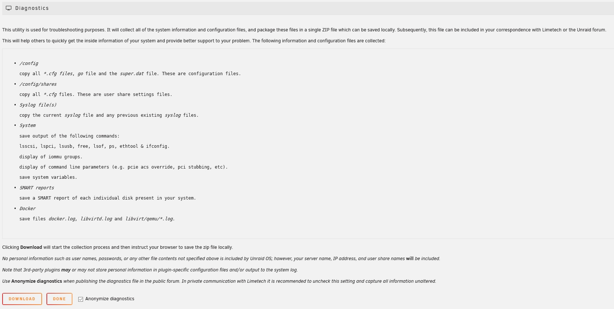
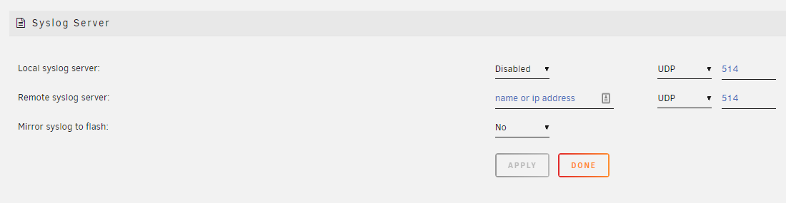
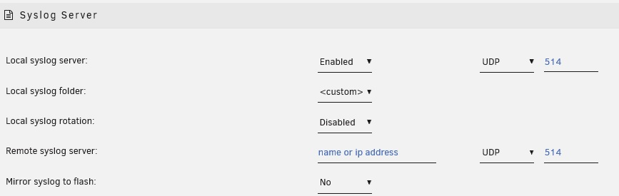
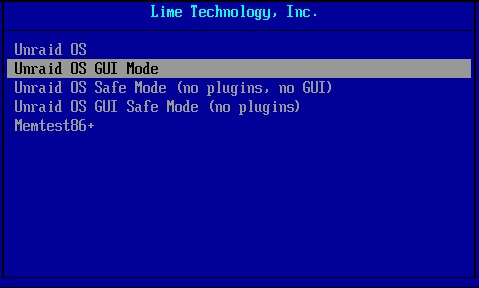

# Troubleshooting

_THIS SECTION IS STILL UNDER CONSTRUCTION_

_More detail still needs to be added_

Most of the time Unraid systems function with minimal problems. This
section is intended to help with resolving issues that are most commonly
encountered.

There are some important general guidelines that it is recommended that
a user follows that will help with any troubleshooting that may be
required:

- **Use the built-in Help**: The Unraid GUI has extensive built-in
  Help for most fields in the GUI. This can be accessed at the
  individual field level by clicking on the field name, or toggled
  on/off for the whole page by clicking on the
   icon at the top right of the GUI.
- **Use the online documentation**: There is extensive online
  documentation that can be accessed via the **Manual** link at the
  bottom of the Unraid webGUI.
- **Enable Notifications**: Unraid has a notification system that can
  be used to keep you informed about the health of your Unraid system.
  This can be enabled and the level of notifications you receive tuned
  under Settings-\>User Preferences-\>Notification Settings. Since
  Unraid systems often function for very long times without needing
  any user oversight it can be important that you are informed of
  problems when they first occur as if left unresolved they can grow
  into more serious ones.
- **Proactively fix any reported issues**:
- **Ask for help in the forums**: Unraid has a vibrant user community
  and many knowledgeable users who are active in the Unraid forums.
  Any time you encounter a problem and you are not sure how to proceed
  it is a good idea to ask questions in the forums. There is nothing
  worse than rushing into trying to fix a problem using a process you
  do not understand and as a result making a problem that was
  initially easy to resolve into something more serious
- **Capture diagnostics**: If you want to ask a question in the forums
  about a problem you are encountering you are frequently going to be
  asked to provide your system diagnostics file. You need to do so
  BEFORE YOU REBOOT so that the logs show went wrong BEFORE the reboot
  (because once you reboot, it's lost)!

## Capturing Diagnostic Information

When you encounter any sort of problem it is always recommended that you
attempt to capture as much information as possible to help with
pinpointing the cause. If you want to ask questions in the forum such
information will typically be requested as it will speed up the process
of getting meaningful and accurate feedback.

### System Diagnostics

Unraid has a GUI option under **_Tools-\>Diagnostics_** to capture a lot
of information about the state of your system that can be helpful when
trying to diagnose any issues. Using this tool will result in a zip file
being produced that can be downloaded and then attached to forum posts.

If the GUI cannot be accessed, then use SSH, telnet, or a keyboard/monitor attached to the server
to login and type `diagnostics`.  This will save the diagnostics.zip file to the "logs" folder on your flash drive.

The Diagnostics should if at all possible cover the period when the
problem occurred and be captured BEFORE you reboot (logs are reset on a
reboot) so that the logs show what happened leading up to the problem
occurring. The zip file produced can then be attached to a forum post
when asking for help on a problem in the Unraid forums. It is preferred
that you attach them to a new post if you have already started a thread
on your issue so that other forum users are notified that there has been
something added to the thread.



These system diagnostics include configuration information, state
information, and key system logs. When creating the diagnostics from the
GUI then details of the sort of information that will be included are
listed. There is an option (set by default) to say that the diagnostics
should be anonymized to try and avoid including any information that
might be deemed sensitive.

**_All the files in the diagnostics are text files so a user is free to
examine them to check for themselves exactly what information is
present_.**

In most cases it is preferable that the diagnostics are captured after
the array has been started in Normal mode as this gives the maximum
information about the state of your Unraid system, in particular if any
drives are having any problems. There will be times, however, when this
is not possible, or you will be advised to capture the diagnostics in a
different state as a result of feedback in a forum thread. It is still
better to have some level of diagnostics rather than nothing.

**IMPORTANT:** The diagnostics are a single zip file containing multiple
files. If it seems to you that the diagnostics is a lot of files and
folders, it is because your computer automatically opens zip files. Do
not upload all those files individually to a forum post but instead find
that single diagnostics zip file in your downloads and attach that
single diagnostics zip file to your NEXT post in the relevant forum
thread.

**_Note on anonymization of the diagnostics_**

It has been pointed out that the diagnostics are not completely
anonymized if you have enabled _mover_ logging under _Settings-\>Mover
Settings_ as the _syslog_ will give details of files that mover is
operating on. This is a bit of a catch-22 scenario as when one has
enabled mover logging it is normally to investigate a problem where as
much detail as possible is captured so attempting to anonymize such
information may well be counter-productive. Since mover logging is
disabled by default and recommended practice is to only have it enabled
when investigating why mover is not giving the expected results this is
probably acceptable.

### Persistent Logs (Syslog server)

The main system log is the **_syslog_** file and it is the contents of
this file that is displayed when you click the  icon at
the top right of the Unraid GUI. Note that when posting to the forums
extracted fragments of the syslog are rarely helpful as they do not show
what lead up to a problem occurring.

Normally the logs are only written to RAM so do not survive the system
being rebooted. If you are investigating a system crash then as long as
you are running Unraid 6.7.2 or later there is built-in syslog server
support



- Go to _Settings-\>Network Services-\>Syslog Server_

- You can click on the 'Help' icon on the Toolbar and get more
information for all of the options.

#### **Mirror to Flash**: This is the simplest to set up. You select
  'Yes' from the dropdown box and click on the 'Apply' button and
  the syslog will be mirrored to the logs folder/directory of the
  flash drive and is appended to on a reboot. There is one principal
  disadvantage to this method. If the condition, that you are trying
  to troubleshoot, takes days to weeks to occur, it can do a lot of
  writes to the flash drive. Some folks are hesitant to use the flash
  drive in this manner as it may shorten the life of the flash drive.

  - The advantage of this approach is that it captures everything from
  the start of the boot process which can be important if trying to
  diagnose boot problems.

#### **Remote Syslog Server**: This is used when you have another machine
  on your network that is acting as a syslog server. This can be
  another Unraid server. You can also use virtually any other
  computer. You find the necessary software by googling for the syslog
  server of that computer's operating system. After you have set up the
  computer/server, you fill in the computer/server name or the IP
  address. (I prefer to use the IP address as there is never any
  confusion about what it is.) Then click on the 'Apply' button and
  your syslog will be mirrored to the other computer.

  - The other computer has to be left on continuously until the problem
  occurs.
  - The events captured will only start with the point at which the
  syslog daemon is started during the boot process thus missing the
  very start of the boot process.



#### **Local Syslog Server**: Set this to **Enabled** to setup this
  Unraid server to act as a network syslog server. When this is
  enabled then some extra options are offered. The built-in Help gives
  guidance /n suitable settings.
  - **Local syslog folder**: This will be a share on your server but
    chose it with care. Ideally, it will be a 'cache only' or a
    'cache preferred' share. This will minimize the spinning up of
    disks due to the continuous writing of new lines to the syslog.
    A cache SSD drive would be the ideal choice here using a _cache
    preferred_ share. The syslog will be in the root of that
    folder/share.
  - **Local syslog rotation**: These settings allow you to control
    how much space the syslog is allowed to use.
    - **Local syslog maximum file size**:
    - **Local syslog number of files**:

  - If you click the 'Apply button at this point, you will have this
  server setup to serve as a Remote Syslog Server. It can now capture
  syslogs from several computers if the need should arise.

#### **Logging to file local to Unraid server** Using a bit of trickery
  we can use the Unraid server with the problem as the Local syslog
  server. This is appropriate if you want to continue to keep a
  permanent copy of the syslog but the file will not be as easy to
  access if the Unraid system is crashing. It also has the advantage
  of avoiding lots of writes to the flash drive. To achieve this you
  now add the IP address of this server as the Remote syslog server
  (Remember the mention of trickery). So basically, you send data
  out-of-the-server and it comes-right-back-in.

Notes:

- The standard system diagnostics include the RAM copy of the _syslog_
  so there is no need to provide this separately. You **will** need to
  do so to provide the logs captured by the syslog server as these are
  not included in the standard system diagnostics.

### Docker Containers

The standard system diagnostics do not contain much that will help with
diagnosing issues with specific docker containers.

_MORE DETAIL NEEDED_

### VMs

The standard system diagnostics do not contain much that will help with
diagnosing issues with specific VMs.

_MORE DETAIL NEEDED_

## Boot Issues

### Preparing the flash drive

This is covered under the [Getting
Started](getting-started/getting-started.md) section of the
documentation.

If for any reason you decide that you need to redo the flash drive then
it is a good idea to make sure you first backup the current flash drive
(or have a recent backup) as all user specific settings (including the
licence key) are held in the **config** folder on the flash drive.
Copying the **config** folder (and all its contents) back to the flash
drive after redoing it will preserve all current settings.

### Enabling UEFI boot

You get asked if you want UEFI mode boot support when using initially
creating the flash drive. However it is always possible to enable UEFI
mode booting at a later stage by renaming the folder on the flash drive
called **efi\~** to **efi** (i.e. removing the trailing **\~**
character).

### Boot Process

Most of the time the Unraid boot process runs seamlessly and the user
needs no awareness of the various stages involved. However, when things
go wrong it can be useful to know how far the boot process managed to
get as this will be of use in knowing what remedial action to take.

Resolving boot issues will typically need either a locally attached
monitor+keyboard or (if the motherboard supports it) an IPMI connection
to carry out equivalent functionality. This can then be used to set any
required BIOS stings and to monitor the booting process.

The boot process for Unraid proceeds through a number of stages

1. **Bios boot**: This is the stage at which the motherboard BIOS
   recognizes the presence of the Unraid bootable flash drive
   - The way that the Unraid flash drive is set as the default boot
     device is BIOS dependent so you may need to consult your
     motherboard's User Manual to determine the correct way to do
     this.
   - The Unraid flash drive supports booting in Legacy mode (also
     sometimes known as CSM mode) for older BiOS's and UEFI for more
     recent ones. Many recent BIOS's support both modes.
   - If you want UEFI boot mode to be used then the EFI folder on the
     flash drive must not have trailing tilde (\~) character.
2. **Syslinux loader**

   

   - The entries that appear on the boot menu are specified by the
     _syslinux/syslinux.cfg_ file on the flash drive. Although in
     theory this file can be edited manually as it a text file it is
     recommended that it is done via the GUI by clicking on the flash
     drive on the _Main_ tab and going to the _Syslinux
     configuration_ section
   - The Memtest86+ option only works if booting in Legacy mode. If
     booting in UEFI mode it will typically simply cause a reboot. If
     you want a version that will work in UEFI boot mode then you
     need to download it for yourself from either
     [www.memtest.org](https://www.memtest.org/) or
     [www.memtest86.com](https://www.memtest86.com/)
   - If the user does not select a specific option then after a
     timeout period the default option will be used. If Unraid is
     running in headless mode this is the option that will be run.

3. **Linux core**: This is the stage at which the _syslinux_ boot
   loader takes over from the BIOS and starts loading the files
   specified in the _syslinux.cfg_ file.
   - This is when the core Linux system is loaded from the flash
     drive and unpacked into RAM.
   - There will be messages on the console about the various bz\*
     types being loaded into RAM.
   - If there are any error messages displayed while loading these
     files then it normally indicates a problem with the flash drive.
   - There will then be messages displayed as Linux starts up and
     detects the hardware environment.
4. **Flash dependent services**: At this stage, the flash drive is
   mounted at _/boot_ so that the process can continue

   - If the mount of the flash fails it is still possible to get the
     login prompt displayed. However, this does not necessarily mean
     the whole boot process completed correctly.
   - If this stage of the boot process has not completed then typical
     symptoms are that the webGUI and network are not started

   - One way to see if this has happened is to login and use the
   **df** command. If the flash drive was mounted successfully then
   you will see it as /boot in the resulting list of mount points.
     - The output should have something like following mount points:
     - `/dev/sdb1 15413232 826976 14586256 6% /boot`\
       `/dev/loop0 9344 9344 0 100% /lib/modules`\
       `/dev/loop1 7424 7424 0 100% /lib/firmware`

   - One reason the flash drive may fail to mount is that it is not
     labelled as **UNRAID** (all capitals).
   - Additional drivers and firmware are now available on the above
     mount points.
   - Configuration information is read into RAM from the flash drive.
   - Standard Linux services are started. Examples would be
     networking and (if enabled) WireGuard VPN.

5. **Plugins**
   - If the user has installed plugins then they are normally loaded
     at this stage.
   - If one of the Safe Boot options was selected from the Unraid
     Boot menu then the loading of plugins is suppressed.

6. **Web GUI**
   - The Unraid web GUI is started.
   - The webGUI is actually done via an entry in the _config/go_ file
     on the flash drive so it is possible for user-supplied commands
     to also be run from there either before starting the webGUI or
     just after doing so.

7. **Array**

   If the user has set the array to be auto-mounted then the
   following will start. If array auto-start is not set then they
   happen when the user elects to start the array.

   - **Drives mounted**

     Mount points will now be created of the form _/dev/diskX_ and
     _/mnt/cache_ (if you have a cache).

   - **File Share Services**

     Shares will now become available on the network.

     At the Linux level the shares will now appear as paths like
     _/mnt/user/sharename_

   - **Docker Containers**

     If the user has enabled the docker services then the Docker
     containers will be started using the order on the Docker tab.

     The order of the containers and delays between starting the
     containers can be set on the Docker tab.

   - **VMs**

     Any VMs the user has set to auto-start will now be started

By this stage, the Unraid server will be fully operational.

### Boot Failures

The following are some actions that can be taken to try and pin down the
cause of a boot failure:

1. **if possible use a USB2 port in preference to a USB3 one as they
   seem to be more reliable for booting purposes. In addition USB2
   drives also seem less prone to failure than USB3 ones. Many modern
   motherboards no longer have USB2 ports directly exposed but there is
   normally a USB2 header on the motherboard that can be used via an
   appropriate adapter.**
   - USB3 **does** work with no problems for many people
   - After initial load Unraid runs from RAM so gains no significant
     performance advantage from using USB3.
   - USB2 drives tend to run cooler than USB3 ones which probably
     explains why they tend to last longer.
   - USB2 drives are typically cheaper than USB3 ones- so why pay
     more if not needed
2. Check that the BIOS on the Unraid server still has the flash drive
   set as the boot device. It has been known to get reset for no obvious
   reason.
3. On a windows 10 PC or a Mac run a check on the flash drive
   - This will determine if something is wrong physically or
     logically with the flash drive
   - If you do not already have one make sure you have a copy of the
     config folder of the flash drive as this contains all your
     current configuration information.
4. Download the zip version of the release from Limetech and extract
   all the bz\* type files over-writing those on the flash drive
   - This will determine if these files were not written correctly
     for some reason or are corrupt.
5. Rewrite the flash drive with a clean copy of Unraid and copy across
   just the key file from your backup to the config folder
   - This can determine if the flash drive itself is OK
   - Copy across the remaining contents of the config folder to the
     flash drive
     - If this goes well you are back up and running with your
       previous configuration intact.
     - If this fails then try booting in Safe Mode. If this works
       then a plugin is causing problems
6. If the original flash drive cannot be made to boot try a brand new
   flash drive and clean copy of Unraid (with the default configs)
   - This can determine if something is wrong with the server's
     hardware (mobo, cpu, ram, usb port, etc.)
7. Install a clean/new copy of Unraid on a new flash drive and then
   copy the _config_ folder over from the old one.
   - If this works then the licence will need to be transferred to
     this new flash drive.

### Lost root Password

Occasionally users lose their password for managing Unraid via the
Unraid webGUI or console. This may be that they simply forgot the
password, but corruption of the flash drive can also result in the
password not being recognized.

_Passwords for shares can be changed/reset from the Unraid webGUI._

To reset the management password use the following process:

1. Shutdown server and then plug the USB boot flash device into a PC or
   Mac
2. While there it is a good idea to run a check on the flash drive and
   make a backup of its contents
3. Delete these files:
   - config/passwd
   - config/shadow
   - config/smbpasswd

4. Plug the flash back into the server and start up again.

Note that this will reset **all** user passwords including 'root' user
to null (blank).

There is an alternative procedure that can be used for just resetting
the root password (but is a little more prone to error):

1. Plug the USB drive into another computer
2. Bing up an editor (such as Notepad++) on the following file:

   - /boot/config/shadow

3. On the first line you should see something such as:

   `root:\$&\$&%\*1112233484847648DHD\$%.:15477:0:99999:7:::`

4. Change that line to the following (essentially delete the content
   between the first and second colons):

   `root::15477:0:99999:7:::`

5. Plug flash back into server and start up again.

### Lost boot drive and do not know which are the parity drives

Occasionally users get the scenario where they have the following
combination of circumstances:

- Unraid boot drive has failed
- There is no recent backup of the boot drive that can be used to
  restore the drive configuration
- There is uncertainty about which drives are the parity drives.

The issue is how to get the Unraid system operational again on a new
boot drive without data loss. You can exploit the fact that Unraid will
recognise any data disk previously used by Unraid as containing a valid
file system compatible with Unraid, and that the parity drives do not
contain a valid file system

The basic approach is:

- Create a new Unraid boot drive.
- Boot the Unraid server off this new drive. At this point no drives
  will be assigned.
- Get the new drive licenced. This can be using either a trial licence
  or by following the procedure for transferring an existing licence
  to a new boot drive.
- Identify which drives are the parity drives. There are 2 ways to do
  this as shown below.
- Use _Tools -\> New Config_ to reset the array. It is normally
  easiest to use the option to retain previous assignments but this is
  not mandatory.
- Return to the main tab and now that you know which are the array
  disks and which are the parity disk(s) correct the assignments to
  reflect this. You can (optionally) re-order the data drives at this
  point but be aware this will always invalidate parity2
- Start the array to commit the drive assignments. If you have used an
  approach that has not invalidated parity you can now tick the
  "Parity is Already Valid" checkbox to avoid rebuilding parity. If
  in doubt do **not** tick this checkbox.
- Make any corrections that assume a specific array drive order. For
  instance If you had any includes/excludes set for a User Share you
  may want to check them against the current assignments and correct
  if needed.
- If you did not rebuild parity you may well want to run a parity
  check at this point to ensure that parity really was valid. If you
  used method 2) below to identify the parity drives then there
  **will** be at least a small number of parity errors so you should
  run a correcting check as soon as possible.

**Identifying the parity Drives**

There are two slightly different approaches that can be used to identify
the parity drives. If you get unexpected results then you should ask for
help in the forums before proceeding.

**1) Using the Unassigned Devices plugin**

This approach uses a 3rd party plugin. It has the advantage that it will
not automatically invalidate parity drives.

The process is:

- Install the **Unassigned Devices** plugin via the **Apps** tab if
  you have not already done so.
- Mount all the disks read-only in turn. You need to use the Read-only
  mode to avoid any changes to the drive that will invalidate parity.
- Any disk that will not mount should be a parity drive (although you
  cannot tell if it is parity1 or parity2 if you have dual parity).
- While the drive is mounted you might want to look quickly at the
  contents if the order of the data drives matters to you to see if
  you can identify the order for the data drives

**2) Using Unraid built-in capability**

This approach does not need to use a 3rd party plugin and will
invalidate parity so that it need so be rebuilt.

The process is:

- Assign **ALL** data drives to the array and start the array. Unraid
  will recognise any drives that have previously been used by Unraid
  and leave their contents intact

- At this point any parity drives will show as **unmountable** since
  the parity drives contain no file system. You should have the same
  number of unmountable drives as you had parity drives and as long as
  this is the case make a note of their serial numbers. If this is not
  the case ask for help in the Unraid forums on the best way to
  proceed.
- While the drives are mounted you might want to look quickly at the
  contents if the order of the data drives matters to you to see if
  you can identify the order for the data drives.

### Backing Up Boot Drive

Since the Unraid boot drive contains all user specific settings in the
'config' folder You should ideally always make a backup of the Unraid
boot drive any time you make any significant configuration changes.

There are various ways of achieving this:

- From the Unraid GUI via Main -\> Boot -\> Device -\> Flash -\> Flash
  Backup. This will create a zip file that you then download.
- by Installing [Unraid Connect](/connect/about.md), which provides for automated
  backups to cloud servers managed by Limetech.
- by plugging the flash drive into a PC/Mac and copying the full
  contents to a local folder on the PC/Mac

### Manually Upgrading (or Downgrading) an Unraid release

Follow the same process as laid out in the section below for handling
bzimage checksum errors.

### Bzimage checksum error/failure reading flash drive

Sometimes when booting you get a message displayed on a locally attached
monitor indicating that something has gone wrong when trying to load the
Unraid OS files into RAM from the flash drive. There are two typical
manifestations of this

- An explicit message stating that a read error has occurred
- A message stating that there is a checksum failure on a bz\* type
  file (most commonly bzimage). This most commonly happens after
  updating the Unraid OS (which is one time a lot of data is written
  to the flash drive in one go), although it can happen at any time.

**Note: _This procedure can also be used to upgrade or downgrade an
Unraid release_**

The normal recovery action is:

- Plug the flash drive into a PC/Mac and make sure it is able to read
  the flash drive (and let it repair any corruption it finds). If the
  flash drive cannot be read then this indicates the flash drive had
  probably failed and you need to follow the procedure for
  transferring your settings to a new flash drive.
- (optional) Make a backup of the flash drive. Although not strictly
  necessary at this point it is always a good idea to have an
  up-to-date backup of the flash drive. All your settings are in the
  **config** folder on the flash drive and this procedure leaves that
  unchanged.
- Download the zip file for the release. The last few Stable releases
  will have the download link on the Download page on the Unraid web
  site. Every forum page will have a Download link at the top right to
  take you to that page. For beta/rc test releases you can normally
  get the link by asking in the Bug reports-\>Preleases section of the
  Unraid forums.
- Extract all the bz\* type files from the zip file and overwrite the
  corresponding files on the flash drive.
- Extract the _changes.txt_ file and overwrite the one on the flash to
  ensure you have one that corresponds to the bz\* type files you have
  just placed on the flash drive. The system will work if you do not
  copy this file but it is good practice to keep it in sync with the
  release that is currently active.
- Tidily eject the flash drive from the PC/Mac.
- Boot the Unraid server of the freshly written flash drive.

If the above does not help then it is advisable to post in the Unraid
forums stating what you have tried and what are your current symptoms.

## Unclean Shutdowns

Sometimes on booting up the system and starting the array a parity check
is automatically started due to an _Unclean Shutdown_. An Unclean
shutdown occurs when Unraid thinks that the array was not successfully
stopped when the system was last powered off. This can be caused by a
wide variety of issues:

- The most obvious cause is unexpected power loss. The best protection
  against this type of issue is to have an Uninterruptible Power
  Supply (UPS) that is set up to initiate a controlled shutdown of
  Unraid initiated by the UPS when the amount of power left in the UPS
  reaches a trigger level.
- The status of the array is stored on the flash drive, so if for any
  reason the status on the flash drive cannot be updated due to the
  flash drive either dropping offline or going into read-only state
  for some reason then Unraid will not be able to update this status
  even if the array is stopped successfully.
- Another common reason for an unclean shutdown is having a terminal
  session open.  Unraid will not force them to shut down, but instead
  waits for them to be terminated while the shutdown timer is running.
   After the overall shutdown timer runs out, the server is forced to
  shutdown.  If you have the **_Tips and Tweaks_** plugin installed,
  you can specify that any **bash** or **ssh** sessions be terminated
  so Unraid can be gracefully shutdown and won't hang waiting for
  them to terminate (which they won't without human intervention).

There are various timeouts that are started when a shutdown of the array
is started that run in parallel and many users find the defaults are too
low for their particular workload:

- There is a timer in the **_Settings-\>VM Manager-\>VM Shutdown_**
  _(in advanced view)_ that needs to be set to a high enough value to
  allow your VMs time to completely shutdown.   Windows VMs will
  sometimes have an update that requires a shutdown to perform.  These
  can take quite a while and the default setting of 60 seconds in the
  VM Manager is not long enough.  If the VM Manager timer setting is
  exceeded on a shutdown, your VMs will be forced to shutdown.  This
  is just like pulling the plug on a PC. A reasonable value is
  something like 300 seconds (5 minutes) in order to insure your
  Windows 10 VMs have time to completely shutdown.
- There is a timer for stopping Docker Containers under **_Settings
  -\> Docker_** _(in advanced view)_. If this timeout is reached then
  docker containers still running will be Force Stopped.
- If you have remote SMB or NFS mounts in Unassigned Devices you need
  to account for time for them to time out if the remote server has
  gone off-line when unmounting.  You should allow something like 45
  seconds for each remote mount.  They are unmounted sequentially, so
  you need to account for 45 seconds for each one.
- There is an final timer used for shutdowns under the
  **_Settings-\>Disk Settings-\>Shutdown time-out_**.  This is the
  overall shutdown timer and when this timer is exceeded, an unclean
  shutdown will occur.  This timer has to be more than the VM and
  docker shutdown timers.  A reasonable value might be something like
  420 seconds (7 minutes) to give the system time to completely shut
  down all VMs, Dockers, and plugins.

It can be useful to use the **Stop** option on the Main tab with your
normal workload running and time how long it takes. The overall shutdown
timer should be set to at least this value plus a small extra margin to
allow for variability.

If you server seems hung and nothing responds, try a quick press of the
power button.  This will initiate a shutdown that will attempt a
graceful shutdown of the server.  If you have to hold the power button
to do a hard power off, you will get an unclean shutdown.

If an unclean shutdown does occur because the overall "Shutdown
time-out" was exceeded, Unraid will attempt to write diagnostics to the
**/log** folder on the flash drive.  When you ask for help in the Unraid
forums with an unclean shutdown, post the **/log/diagnostics.zip** file.
 There is information in the log that shows why the unclean shutdown
occurred.

It can also be good idea to activate the **_Settings-\>Syslog Server_**
to get logs that can survive a reboot as by default the syslog is only
in RAM and lost after a reboot.

## Crash Issues

_THIS SECTION IS STILL UNDER CONSTRUCTION_

### RAM Issues

It is known that RAM degrades over time. RAM issues can be
elusive to track down and cause unpredictable errors. A somewhat common
effect is unexpected file system level corruption.

The Unraid boot menu includes a version of memtest for testing RAM. This
version will only work if booting in Legacy mode. If you try to run this
when running in UEFI mode it will immediately reboot again.

If you want a version that can be used in UEFI mode then you can
download a newer version from memtest's website. Note that the version
of memtest built into Unraid is a much older version that doesn't have
the newer testing capabilities of the current version located on
memtest's website. This is no fault of Unraid, the people behind
memtest won't allow anything newer to be installed by 3rd parties.

### Over-clocking RAM

Many people want to run their RAM at the maximum rated speed quoted in
the specification of the RAM they have purchased. They tend to forget
that many motherboard/CPU combinations have a max speed at which they
can reliably drive RAM regardless of the fact that the RAM may be rated
for a higher theoretical maximum clock rate.

## Windows Connection Issues

_THIS SECTION IS STILL UNDER CONSTRUCTION_

The majority of users have no problem making connections to Unraid
shares. Having said that Microsoft is continually tweaking the network
security model via Windows Update and this can cause problems for some
users.

If you encounter problems then your first port of call should probably
be the [Windows issues with
Unraid](https://forums.unraid.net/topic/53172-windows-issues-with-unraid/)
forum thread. This thread is rather long so you probably want to start
near the end.

_COMMONEST ISSUES AND SOLUTIONS TO BE ADDED HERE_

### Name Resolution

### Stored Credentials

### Multiple Sign-ons

## Data Recovery

_THIS SECTION IS STILL UNDER CONSTRUCTION_

_A lot more detail still needs to be added_

This section is about recovering your data when Unraid reports problems
with one or more drives.

There are some important points to bear in mind about securing your
data

- **Backup critical data:** Unraid will protect you against most types
  of simple hardware failure, but not catastrophic failure. You should
  **ALWAYS** have backups of any critical data that you cannot afford
  to lose. Ideally one of those copies should be offsite or on the
  cloud to protect yourself against unforeseen issues such as fire,
  theft, flood, etc.
  - Each user has to make their own determination of what they deem
    critical and make an assessment of the level of risk they are
    prepared to take.
  - Personal data such as photographs & documents tend to always be
    deemed critical. Luckily these tend to be relatively small so
    easy to back up.
  - Media files are often deemed non-critical and are relatively
    large so a user may well decide these do not merit being backed
    up
  - Personal video that can never be replaced should fall into the
    critical category regardless of its size
  - Remember that there are things such as _ransomware_ around so
    there should be at least one copy of critical files that cannot
    be accessed online and corrupted if you are unfortunate enough
    to suffer from such an attack!
- _Be proactive_ about resolving any issues that are detected by
  Unraid. Make sure that notifications are enabled under
  _Settings-\>Notifications_ so that you get told as soon as issues
  are detected. For many users, Unraid operates in a _fire-and-forget_
  mode so that they will not be actively checking for problems so need
  such reminders.
- **Ask for Advice:**
  - The Unraid forums have lots of knowledgeable users who can help
    guide you through what needs doing to get your data back into a
    standard if you are not sure what are the best steps to take.
  - Unraid is very good about protecting your data against typical
    hardware failures, but it is not immune to users taking
    inappropriate steps to recover their data after a failure
    occurs.

### Unmountable Disk(s)

If a disk that was previously mounting fine suddenly starts showing as
**unmountable** then this normally means that there is some sort of
corruption at the file system level. This most commonly occurs after an
unclean shutdown but could happen any time a write to a drive fails or
if the drive ends up being marked as 'disabled' (i.e. with a red ','
in the Unraid GUI).

**IMPORTANT:** At this point, the Unraid GUI will be offering an option
to format unmountable drives. This will erase all content on the drive
and update parity to reflect this making recovering the data
impossible/very difficult so do **NOT** do this unless you are happy to
lose the contents of the drive.

The correct way to proceed in such a case is to follow the procedure for
[checking and
repairing](storage-management.md#checking-a-file-system)
the file system. The vast majority of the time this will repair the disk
that was previously showing as unmountable and now it will mount
correctly and all your data will be intact. If you are not sure how to
proceed then ask a question in the Unraid forums.

### Lost Array Configuration

If you have lost the array configuration and do not have a current
backup of the flash drive the data will still be intact on the drives.

All configuration information is stored on the flash drive in the
_config_ folder. In particular, the Unraid array configuration is stored
in the _config/super.dat_ file.

- _Do not attempt to use an out-of-date backup that may have incorrect
  drive assignments._

If you know which drives were the parity drives then you can simply
reassign the drives. However, if you do not know which were the parity
drives then you have to be more careful as incorrectly assigning a drive
to parity that is really a data drive will result in you losing its
contents.

When you do not know which were your parity drives the following steps
can get your array back into operation:

1. Assign all drives as data drives
2. Start the array
3. All the genuine data drives should show as mounted and the parity
   drive(s) show as _unmountable_. If this is not the case and too many
   drives show as unmountable then stop and ask for help in the forums
   giving details of what happened.
4. Make a note of the serial numbers of the parity drives.
5. Stop the array
6. Go to Tools-\>New Config. Select the option to retain current
   assignments (as it reduces the chance of error). Click the yes I
   want to do this and then Apply.
7. Go back to the Main tab and correct the assignments of the parity
   drives. Double-check you have the right drives now assigned as
   parity drives as assigning a data drive to parity will lose its
   contents. You can move any other drives around at this stage as
   well.
8. Start the array and the system will start building parity based on
   the current assignments.

All your User Shares will re-appear (as they are simply the aggregation
of the top-level folders on each drive) but with default settings, so
you may need to re-apply any customization you want.

You can now go configure any other customization that is appropriate and
add any plugins you normally use.

At this point, it is strongly recommended that you click on the flash
drive on the Main tab and select the option to download a backup of
the flash drive. It is always good practice to do this any time you make
a significant change.

### Using _ddrescue_ to recover data from a failing disk

In normal use, a tailed/disabled disk is recovered under Unraid using
the [Replacing
Disks](storage-management.md#replacing-disks) procedure.

Occasionally it can happen due to a variety of reasons, like a disk
failing while parity is invalid or two disks failing with single parity,
a user having a failing disk with pending sectors and no way to rebuild
it using parity, the normal Unraid recovery processes cannot be used. In
such a case you can try using **ddrescue** to salvage as much data as
possible.

To install _ddrescue_ install the Nerd Pack plugin then go to Settings
-\> Nerd Pack and install _ddrescue_.

You need an extra disk (same size or larger than the failing disk) to
clone the old disk to, using the console/SSH type:

`ddrescue -f /dev/sdX /dev/sdY /boot/ddrescue.log`

Both source and destination disks can't be mounted, replace X with
source disk, Y with destination disk, always triple-check these, if the
wrong disk is used as destination it will be overwritten deleting all
data.

It's also possible to use an array disk as the destination, though only
if it's the same size as the original, but to maintain parity you can
only clone the partition, so the existing array disk needs to be a
formatted Unraid disk already in any filesystem, still to maintain
parity you need to use the md# device and the array needs to be started
in maintenance mode, i.e., not accessible during the copy, by using the
command:

`ddrescue -f /dev/sdX1 /dev/md# /boot/ddrescue.log`

Replace X with source disk (note the 1 in the source disk identifier), \#
with destination disk number. It is recommend to enable turbo write
first or it will take much longer.

Example output during the 1st pass:

```
GNU ddrescue 1.22
ipos:  926889 MB, non-trimmed:    1695 kB,  current rate:  95092 kB/s
opos:  926889 MB, non-scraped:        0 B,  average rate:  79236 kB/s
non-tried:    1074 GB,  bad-sector:        0 B,    error rate:       0 B/s
rescued:  925804 MB,   bad areas:        0,        run time:  3h 14m 44s
pct rescued:   46.28%, read errors:       54,  remaining time:      3h 18m
time since last successful read:          0s
Copying non-tried blocks... Pass 1 (forwards)
```

After copying all the good blocks ddrescue will retry the bad blocks,
forwards and backwards, this last part can take some time depending on
how bad the disk is, example:

```
GNU ddrescue 1.22
ipos:   17878 MB, non-trimmed:        0 B,  current rate:       0 B/s
opos:   17878 MB, non-scraped:   362496 B,  average rate:  74898 kB/s
non-tried:        0 B,  bad-sector:    93696 B,    error rate:     102 B/s
rescued:    2000 GB,   bad areas:      101,        run time:  7h 25m  8s
pct rescued:   99.99%, read errors:      260,  remaining time:         25m
time since last successful read:         10s
Scraping failed blocks... (forwards)
```

After the clone is complete you can mount the destination disk manually
or using for example the UD plugin (if the cloned disk is unmountable
run the appropriate filesystem repair tool, it might also be a good idea
to run a filesystem check even if it mounts OK) and copy the recovered
data to the array. Some files will likely be corrupt and if you have
checksums or are using BTRFS you can easily find out which ones. If not
see below.

If you don't have checksums for your files (or use btrfs) there's a
way you can still check which files were affected:

Create a temporary text file with a text string not present on your
data, e.g.:

`printf "Unraid " >~/fill.txt`

Then fill the bad blocks on the destination disk with that string:

`ddrescue -f --fill=- ~/fill.txt /dev/sdY /boot/ddrescue.log`

Replace Y with the cloned disk (not the original) and use the existing
ddrescue mapfile.

Finally mount the disk, manually or for example using the UD plugin and
search for that string:

`find /mnt/path/to/disk -type f -exec grep -l "Unraid" '{}' ';'`

Replace /path/to/disk with the correct mount point, all files containing
the string "Unraid" will be output and those are your corrupt files,
this will take some time as all files on the disks will be scanned, the
output is only displayed in the end, and if there's no output then the
bad sectors were in areas without any files.

## Docker

_THIS SECTION IS STILL UNDER CONSTRUCTION_

_A lot more detail still needs to be added_

### Docker Image Full

Unraid expects docker containers to be configured so that only the
binaries for the container are held in the _docker.img_ file. All
locations within the container that write variable data are then
expected to be mapped to locations external to the docker.img file.

The default size of 20GB is enough for all but the most demanding users
so if you find that your _docker.img_ file is running out of space it
definitely sounds as if you have at least one container incorrectly
configured so it is writing internally to the docker image rather than
to storage external to the image.

Common mistakes are:

- Leaving off the leading / on the container side of a path mapping so
  it is relative rather than absolute
- Case mismatch on either side of a path mapping as Linux pathnames
  are case-significant.

If you cannot spot the error then you can try:

- Go to the docker tab and click the Container size button. often this
  will highlight the problem docker container(s) so you now know where
  to look.

If that is not enough to identify the culprit then:

- Make sure all containers are stopped and not set to auto-start
- Stop docker service
- delete current docker image and set a more reasonable size (e.g.
  20G)
- Start docker service
- Use Apps-\>Previous apps to re-install your containers (with
  all their settings intact).
- Go to docker tab and click the Container size button

: This will give you a starting point for the space each container is
using.

- Enable one container, let it run for a short while, and then press
  the Container size button again to see if that particular container
  is consuming space when it runs.
- Repeat the above step until you track down the rogue container(s)

### How do I move docker.img?

The normal reason for wanting to move the _docker.img_ file is because
it has ended up on a drive that is not the one you want it to use.

**Note:** In many cases it is easier to just recreate the _docker.img_
file from scratch rather than to try and move it.

The way to move _docker.img_ is:

- Go to _Settings -\> Docker -\> Enable Docker_, and set to **No**,
  then click the **Apply** button  (this disables Docker support).
  This is required because othewise the Docker service will keep this
  file open which stops you from moving it elsewhere.
- Using mv or any file manager or the command line, move docker.img to
  the desired location (/mnt/cache/docker.img is recommended)
- In Settings -\> Docker, change the path for _docker.img_ to the
  exact location you just copied to
- Set Enable Docker back to Yes, and click the Apply button again
   (re-enabling Docker support)

### How do I recreate docker.img?

The commonest reason for wanting to recreate the _docker.img_ file is
because it has been corrupted. This is typically indicated by seeing
error messages in the syslog relating to the _loop2_ device (which is
the mount point for the _docker.img_ file).

Other common reasons for recreating the _docker.img_ file is because you
want to change the amount of space that you have allocated to it or to
change its location.

- Go to _Settings -\> Docker -\> Enable Docker_, and set to **No**,
  then click the **Apply** button  (this disables Docker support)
- Switch to Advanced View, then check off the box and press **Delete**
- Make sure that the settings for the size and location are what you
  want them to be.
- Now set Enable Docker back to **Yes**, and click the **Apply**
  button again  (re-enabling Docker support) and a new empty
  _docker.img_ file will be created.

### Restoring your Docker Applications

It is very easy to reinstall the binaries for all your Docker containers
and get back your containers with their settings intact if you have
installed them via Community Applications.

- Go to the **Apps** Tab
- Select the **Previous Apps** Section.
- Check off all of your previous applications that you want to be
  reinstalled and hit **Instal**l.

This will download the binaries for all of your Docker containers into
the _docker.img_ file and reinstate them with their settings intact.

### Further Information

A wealth of further information and some common problems with docker
(and the solutions) can be found in the [Docker
FAQ](https://forums.unraid.net/topic/57181-docker-faq/) on the forum

## UDMA CRC Errors

Users frequently see that they are getting UDMA CRC errors (SMART
attribute 199) reported for some drives.

A CRC error indicates that the drive has noted that it has not correctly
received the data from the host, and typically indicates a connection
issue of some sort. This will normally trigger Unraid to attempt a
recovery by resending the data. If this resend succeeds then Unraid will
continue as normal, but the retry will have the end effect of slowing
down the perceived write speed due to the delay caused by the retry.
These retry attempts will show up as entries in the syslog.

If the recovery attempt fails then after several retries Unraid will
decide it has a Read error on the drive. If the array is parity
protected this will then trigger Unraid to attempt to rewrite the
problem sector with the correct data based on the parity data and the
corresponding sector on all the 'good' data drives. If this write
succeeds then Unraid will continue as normal, but if the write fails
Unraid will disable the drive and stop using it. This disabled state is
indicated in the GUI by the fact that the drive is flagged with a red
'x'.

Possible causes of such errors are:

- Badly seated SATA cables. The SATA connector is not a very robust
  connector and can easily work slightly loose due to vibration or
  tension on the cables. It is also a good idea to avoid 'bundling'
  the cables together in an attempt to tidy up the cabling as this can
  result in cross-talk interference between the cables.
- Bad SATA cables.
- Insufficient power to the drive. Quite frequently associated with
  splitter cables on the power lines, but also possible if the power
  supply is insufficient to power all drives simultaneously so that
  power dips occur.
- Badly seated disk controller
- Genuine disk problem (least likely but not unknown).

The first guidance that is always given in the forum when a user reports
CRC errors is to first carefully check the SATA and Power cabling to the
drives as this is by far the commonest cause of such issues.

Points to note are:

- Occasional CRC errors are not really a cause for concern but if they
  are happening regularly or in large numbers then this definitely
  needs looking into to determine the cause and fix the issue.
- It is not unusual for the **Current pending sector count** (SMART
  attribute ) 197 to also be incremented when getting a lot of CRC
  errors. This is more of a cause for concern as it means these
  sectors may not be read reliably if another disk fails and a
  recovery action needs to be performed as error-free recovery
  requires all 'non-failed' drives to be read without error.
- The CRC count is stored internally in the drive's SMART information
  and never resets to zero - it can only ever increase.
- A CRC error will result in the Dashboard page indicating a SMART
  related issue has happened by an orange 'thumbs-down' symbol
  against the drive.
- The user can acknowledge they have seen such an error by clicking on
  the orange symbol and choosing the 'Acknowledge' option from the
  resulting menu that is displayed. This will result in the icon
  turning green again and Unraid will only prompt you again if the
  value of the CRC count increases.

## Cache/Pool issues

### Mover is not moving files

The commonest cause for this is simply new users misunderstanding the
_Use_ _Cache_ setting for a share and getting the **Yes** and **Prefer**
settings back-to-front. If you want files to initially be written to the
cache and later moved to the array then you ned to use the **Yes**
setting and not the **Prefer** setting.

Another common mis-conception is that changing the _Use Cache_ setting
to **Only** or **No** will trigger mover to transfer files to/from their
current location to match the new _Use Cache_ setting. In fact mover
takes no action on shares that have this setting so the files are left
in their current location.

Another point is not realizing that the Docker and VM services keep
certain files permanently open (particularly in the **system**,
**domains**, and **appdata** shares) and this can stop mover acting on
those files. It is not enough to simply stop all running containers
and/or VMs - you actually need to disable the services themselves to
allow such files to be moved.

###Files end up on a pool (cache) despite Use Cache=No setting for a share

This behaviour is the one that new users find most perplexing.

It arises when a 'move' action is attempted at the Linux level. (This
can be either from the command line or within a container (since all
container are Linux based).) It arises from the fact that Linux is not
aware of _User Shares_ combined with the way that Linux implements a
'move' operation. If Linux thinks that both source and target are on
the same mount point (and all _User Shares_ are under the **/mnt/user**
mount point) then it first tries a _rename_ command and for speed and
only if that fails does it revert to trying a _copy + delete_ operation.
In the case of a cache/pool this 'rename' succeeds so the file is left
on the same drive but under a new folder name corresponding to the
target share name. Since User Shares are simply an amalgamated view of
the top level folders on all drives this means that suddenly the file(s)
in question can end up on a drive that has the _Use Cache=No_ setting.
Since _mover_ ignores shares with the _Use Cache_ setting of _No_ or
_Only_ this will result in the files being left stranded on a pool that
the target share has not been configured to use for caching purposes.

**\*This behaviour can also occur if you try and move files between two
User Shares that are set to use different Pools for caching purposes**.\*
Once again this can result in the files ending up on the wrong pool.

Workarounds to this issue are by doing any of the following:

- Manually move the file(s) in question to the drive where you want it
  to be finally located.
- Set the share that the file has ended up in to have the _Use
  Cache=Yes_ setting and then when mover runs the file will get
  transferred to the array following the rules for that share to pick
  the array drive. You can either start mover manually from the Main
  tab or wait until it runs automatically at its next scheduled time.
  Once mover has been run you can either leave the _Use Cache_ setting
  as _Yes_ or change it to the setting you want to use long term.
- Do an explicit copy + delete operation.
- Do the move over the network as at the network level two different
  User Share will never appear to be on the same mount point so a
  copy + delete is done automatically.
- Make sure the mount points for source and target appear to be
  different at the Linux level.
- Move between physical drives rather than at the User Share level.
