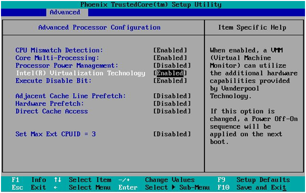
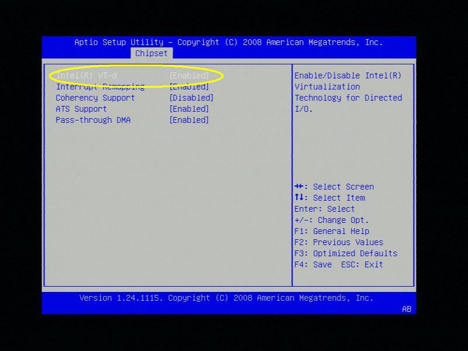
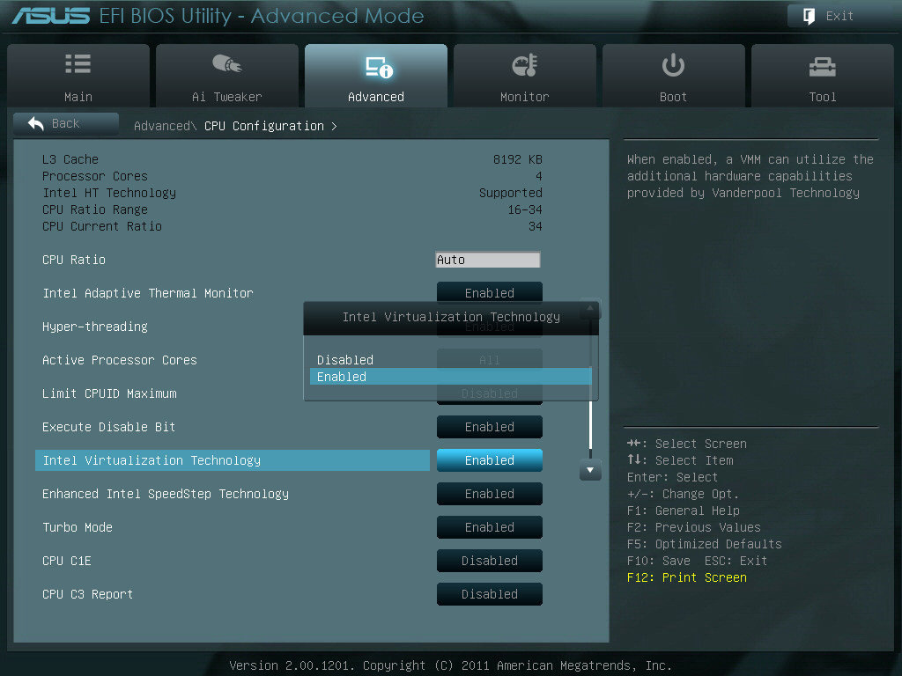

# Managing VMs

## Overview

While Docker Containers are the preferred mechanism for running
Linux-based applications such as media servers, backup software, and
file sharing solutions, virtual machines add support for non-Linux
workloads and the ability to utilize devices that the host cannot (think
graphics pass through, USB pass through/assignment, etc). _Localized
Virtualization_ is our method of supporting VMs where all resources
assigned to the guest are local to the host.

For information on what operating systems have been tested for use with
Unraid Server OS, please see the [VM Support](/unraid-os/manual/vm-support.md) wiki page.

## Prerequisites

To create virtual machines on Unraid, you will need HVM hardware support
(Intel VT-x or AMD-V). To assign host-based PCI devices to those VMs,
your hardware must also support IOMMU (Intel VT-d or AMD-Vi). Lastly,
all virtualization features must be enabled in your motherboard BIOS
(typically found in the CPU or System Agent sections). NOTE: Not all
hardware that claims support for this has been proven to work
effectively, so see the "tested hardware" section for known working
component combinations. Virtual machines can also drive a need for much
more RAM/CPU cores depending on the type. Here are some general
recommendations on how much RAM should be allocated **per virtual
machine**:

- Virtual servers (Windows, Arch, etc.): 256MB - 1GB, 1-2 CPU cores
- Virtual desktops (Windows, Ubuntu, etc.): 512MB - 8GB, 2-4 CPU cores
- Hybrid VMs (GPU assignment, gaming, etc.): 1GB - 12GB, 2-6 CPU cores

Keep in mind that memory usage for virtual machines only occurs when
they are running, so it's just important to think about these
requirements in terms of peak concurrent usage on your system.

### Determining HVM/IOMMU Hardware Support

To determine if hardware has support for HVM or IOMMU, there are two
primary methods available:

#### Online Research

- To check if your Intel processor has support for VT-x or VT-d, visit
  <http://ark.intel.com/Search/Advanced>.  On the left hand filter
  panel, you can filter by processors that have support for VT-x,
  VT-d, or both.
- For guidance with AMD processors, there is not an equivalent to the
  ARK site, but [this Wikipedia
  article](http://en.wikipedia.org/wiki/List_of_IOMMU-supporting_hardware#AMD_based)
  may assist you.
- Motherboard support for virtualization is usually available as part
  of the product documentation or user manual.

#### Through the Unraid webGui

- When accessing your Unraid system through the web interface, you can
  determine if your system is virtualization compatible by clicking
  the **Info** button on the right side of the top menu bar.
  - **HVM Support** refers to Intel VT-x or AMD-V
    - _Not Available_ means that your hardware is not HVM capable.
    - _Disabled_ means that your hardware is HVM capable, but the
      settings in your motherboard BIOS are not enabled.
    - _Enabled_ means that your hardware is both HVM capable and
      the appropriate settings in your motherboard BIOS are also
      enabled.
  - **IOMMU Support** refers to Intel VT-d or AMD-Vi
    - _Not Available_ only displays if your system is not HVM
      capable.
    - _Disabled_ means that either your hardware is not capable of
      IOMMU or the appropriate settings in your motherboard BIOS
      are not enabled.
    - _Enabled_ means that your hardware is both IOMMU capable and
      the appropriate settings in your motherboard BIOS are also
      enabled.

### Assigning Graphics Devices

Unlike other PCI devices, graphics devices can be more difficult to pass
through to a VM for control. With Unraid 6, we've implemented a number
of tweaks to maximize success with graphics pass through for our users.
Here are the currently known limitations associated with GPU pass
through on Unraid 6:

- NVIDIA GTX-series GPUs should work fine as of the 600 series or
  newer, but not all models have been tested.
- AMD cards have had some issues depending on the make or model and
  which guest operating system is attached.
- Some devices may work better for pass through to specific guest
  operating systems.
- With OVMF-based virtual machines, if your GPU has UEFI support, it
  should work fine, but some users still report card-specific issues.

## System Preparation

Before you can get started with creating virtual machines, there are a
few preparatory tasks that must be completed.

### Adjust BIOS Settings

In order to utilize all the virtualization features of Unraid 6, you
must ensure your BIOS is configured properly for hardware-assisted
virtualization as well as IO memory mapping (HVM / IOMMU support). In
your BIOS settings, look for anything marked with **Virtualization**,
**Intel VT-x**, **Intel VT-d**, **AMD-V**, or **AMD-Vi** and set it to
**Enabled**.

{width="150"}
{width="150"}
{width="150"}
{width="150"}

_examples of where virtualization settings can be found from various
motherboard BIOS screens._

### Configure a Network Bridge

There are two methods by which your virtual machines can get access to
host-based networking: through a private NAT bridge managed by libvirt
or through a public bridge managed by Unraid directly. The private
bridge (virbr0) is automatically configured when libvirt starts. The
public bridge (br0) can be created through the _Network Settings_ page
on the Unraid webGui.

The private bridge generates an internal DHCP server/address pool to
create IPs for VMs automatically, but the VMs will be on a subnet that
cannot be accessed by other devices or even other services on Unraid.
This type of bridge is ideal if you want your VM to be completely
isolated from all other network services except internet access and the
host's network file sharing protocols. VM management can be performed
through a VNC session provided by the browser.

The public bridge provides VMs with an IP address from your router, but
internally bridges communications between VMs and each other, as well as
the host. This type of bridge is ideal if you want your VMs to act just
like another device on your network, where you manage its network access
at the LAN-router instead of inside the VM. We persist MAC address
settings for the virtual interfaces you create, ensuring the VMs should
get the same IP address each time they connect, as long as your
router-managed DHCP pool doesn't run out of addresses. So if you want
to connect to your VM from another PC, laptop, tablet, or another type
of device, you should use the public bridge. Enable public bridge in
_Network settings \> Enable bridging: Yes_

Whichever bridge you prefer can be defined as the _Default Network
Bridge_ on the **VM Settings** page. You may have to enable the
**_Advanced_** view using the toggle at the top right before this
setting is visible.

### User Shares for Virtualization

By default, Unraid will create two user shares for use with
virtualization on Unraid. One share to store your installation media
files (ISOs) and another to store your virtual machines themselves
(domains). If you don't already have a share you use for backups, you
might consider adding one as well to use for backing up your virtual
machines.

#### Recommendations for Share Configuration

- Virtual machines will perform best when their primary vDisk is
  stored on a cache-only share.
- While SSDs are not required for virtual machines to function,
  performance gains are substantial with their use.
- For your ISO library share (containing your installation media),
  cache usage is optional.

*IMPORTANT: Do NOT store your active virtual machines on a share where
the*Use Cache*setting is set to **Yes**. Doing so will cause your VMs to
be moved to the array when the mover is invoked.*

### Setup Virtualization Preferences

Before you can get started creating virtual machines, we need to perform
a few configuration steps:

- Use your web browser to navigate to the _VM Manager Settings_ page
  (_Settings_ -\> _VM Manager_)
- _For Windows VMs_, you will need to download virtual drivers for
  storage, network, and memory.
  - Download the latest 'stable' VirtIO Windows drivers ISO found
    here:
    <https://fedoraproject.org/wiki/Windows_Virtio_Drivers#Direct_download>
  - Copy the ISO file for the drivers to the ISO Library Share that
    you created earlier
  - Use the file picker for **VirtIO Windows Drivers ISO** to select
    the ISO file you copied
  - You can override the default driver ISO on a per-VM basis (under
    **Advanced View**).
- Select **virbr0** (default) for a _private network bridge_ or select
  a _public network bridge_ that you created on the _Network Settings_
  page.
  - You can override the default network bridge on a per-VM basis
    (under **Advanced View**).
- Toggle **PCIe ACS Override** to **On** if you wish to assign
  multiple PCI devices to disparate virtual machines
  - The override breaks apart IOMMU groups so that individual
    devices can be assigned to different virtual machines
  - Without this setting enabled, you may not be able to pass
    through devices to multiple virtual machines simultaneously
  - WARNING: This setting is experimental! Take caution when using.
    [1](http://vfio.blogspot.com/2014/08/iommu-groups-inside-and-out.html)
- Click **Apply** when done to apply your settings

- Troubleshoot: If it says stopped after clicking apply, check
  **/boot/config/domains.cfg**, you may need to set fields: (See also
  [Forum help by
  Squid](https://forums.unraid.net/topic/70874-restoring-virtual-machines/?tab=comments#comment-650785))
  - `MEDIADIR="/mnt/user/system/"`
  - `VIRTIOISO="/mnt/user/system"` (the share with virtio image)

## Creating Your Own Virtual Machines

With the preparation steps completed, you can create your first VM by
clicking **Add VM** from the _Virtual Machines_ page.

### Basic VM Creation

The webGui will by default present the minimum number of fields required
in order for you to create a VM.

- Set the **Template** type to **Custom**
- Give the VM a **Name** and a **Description**
- Toggle the **Autostart** setting if you want the VM to start with
  the array automatically
- Select the **Operating System** you wish to use, which will also
  adjust the icon used for the VM
- Select which **CPUs** you wish to assign the VM
  - You can select up to as many physical CPUs that are present on
    your host
- Specify how much **Initial Memory** you wish to assign the VM
  - See the documentation for the OS you are installing to determine
    how much RAM to allocate.
- Select an **OS Install ISO** for your installation media
- Specify the vDisks you wish to create (or select an existing vDisk)
  - The **Primary vDisk** is used to store your VM's operating
    system
  - **Additional vDisks** can be added by clicking
    {width="15"}
- Specify a **Graphics Card** to use to interact with the VM
  - If you are _NOT_ assigning a physical graphics card, specify
    **VNC**
  - If you _ARE_ assigning a physical graphics card, select it from
    the list
  - VNC can only be specified as the primary graphics display or it
    can't be assigned at all
  - A password can be optionally specified for the VNC connection
  - Not all graphics cards will work as a secondary display
  - If you assign a physical graphics device, be sure to assign a
    USB keyboard and mouse as well
  - Additional graphics devices can be assigned by clicking
    {width="15"}
- Assign a **Sound Card** if you're assigning a graphics card to get
  audio support in your VM
  - Most GPUs have their own built-in sound card as a function of
    the graphics card for HDMI audio
  - Additional sound cards can be assigned by clicking
    {width="15"}
- **USB Devices** can be assigned to the VM that are plugged into the
  host
  - USB hot-plugging is not currently supported, so devices must be
    attached before the VM is started in order for USB pass through
    to function
  - Some USB devices may not work properly when passed through to a
    guest (though most do work fine)
  - The Unraid USB flash device is not displayed here, to prevent
    accidental assignment
- Click **Create VM** to create your virtual disks (if necessary),
  which will start automatically unless you unchecked the **Start VM
  after creation** checkbox.

### Advanced Options

If you wish to toggle other advanced settings for the VM, you can toggle
from **Basic** to **Advanced View** (switch located on the _Template
Settings_ section bar from the _Add VM_ page).

- You can adjust the **CPU Mode** setting
  - **Host Passthrough** will expose the guest to all the
    capabilities of the host CPU (this can significantly improve
    performance)
  - **Emulated** will use the QEMU emulated CPU and _not_ expose the
    guest to all of the host processor's features
- Specifying a **Max Memory** value will enable memory ballooning,
  allowing KVM to shrink/expand memory assignments dynamically as
  needed.
  - This feature does not apply to VMs where a physical PCI device
    has been assigned (GPU, sound, etc.)
- The **Machine** type presented to your VM can be toggled between
  QEMU's **i440fx** or **Q35** chipsets
  - _For Windows-based VMs_, i440fx is the default setting and
    should only be changed if you are having difficulty passing
    through a PCI-based graphics card (this may prompt Windows to
    reactivate)
  - _For Linux-based VMs_, Q35 is the default setting and should not
    be changed if passing through a GPU
- The **BIOS** can only be adjusted when adding a new VM (existing VMs
  cannot modify this setting).
  - SeaBIOS is a traditional VGA BIOS for creating most virtual
    machines
  - OVMF utilizes a UEFI BIOS interface, eliminating the use of
    traditional VGA
  - OVMF requires that the VM's operating system supports UEFI
    (Windows 8 or newer, most modern Linux distros) and if you wish
    to assign a physical graphics device, it too must support UEFI
- If you specify Windows as the guest operating system, you can toggle
  the exposure of **Hyper-V** extensions to the VM
- You can choose to override the default **VirtIO Drivers ISO** should
  you so desire
- You can toggle the **vDisk Type** between RAW and QCOW2 (RAW is
  recommended for best performance)
- _With Linux-based VMs_, you can add multiple **VirtFS** mappings to
  your guest
  - For more information on VirtFS and the 9p file system, visit
    here: <http://wiki.qemu.org/Documentation/9psetup>
- If you desire, you can modify the **Network MAC** address for the
  virtual network interface of the VM as well as specify an alternate
  **Network Bridge**.
  - You can click the blue refresh symbol to auto-generate a new MAC
    address for the virtual network interface.
  - Additional virtual network interfaces can be assigned by
    clicking {width="15"}

## Expanding a vdisk

In the event that you need to increase the size of your virtual disk
device, you can do so with the following procedure:

- Navigate to the VMs tab in the webGui.
- Make sure your VM is stopped.
- Click on the name of your VM to expand the view to show you the
  various disk devices attached to the VM.
- Click on the value in the capacity field for the vdisk to make it
  editable.
- Edit a value of how large you want the vdisk to be and press enter
  (e.g. for 100 gigabytes, enter 100G)
- You will now see the new capacity take affect.

After doing this, you can start your VM and the new storage will be
available, though you will need to either create a new partition out of
that space or extend an existing partition to make use of it. For
instructions on how to expand your Windows partition, please see [this
article](/legacy/Articles/expanding-windows-vm-vdisk-partitions.md).

## Troubleshooting Stuck at UEFI Shell

In the event you are stuck at the UEFI shell after booting your VM, you
can enter a few commands to manually trigger the boot sequence:

```shell
fs0:
cd efi/boot
bootx64.efi
```

This will manually trigger your VM to boot.

## Assigning Graphics Devices to Virtual Machines (GPU Pass Through)

The ability to assign a GPU to a virtual machine for direct I/O control
comes with some additional provisions:

1. Not all motherboard/GPU combinations will work for GPU assignment.
2. Integrated graphics devices (on-board GPUs) are not assignable to
   virtual machines at this time.
3. Additional community-tested configurations can be found in [this
   spreadsheet](https://docs.google.com/spreadsheets/d/1LnGpTrXalwGVNy0PWJDURhyxa3sgqkGXmvNCIvIMenk/edit#gid=0).
4. Lime Technology provides a list of validated and tested hardware
   combinations within the wiki.
5. You can also discuss hardware selection in the [Lime Technology
   community forums](http://lime-technology.com/forum/).

Additional information regarding virtual function I/O (VFIO) and GPU
pass through can be found in [the following F.A.Q from Alex
Williamson](http://vfio.blogspot.com/2014/08/vfiovga-faq.html), the
project's maintainer.

### Warning: Passing through a GPU to a SeaBIOS-based VM will disable console VGA access

If you rely upon a locally-attached monitor and keyboard to interact
with the Unraid terminal directly, you will lose this ability once you
create a SeaBIOS VM with a GPU assigned. This is due to a bug with VGA
arbitration and cannot be solved. This does NOT affect your ability to
access the console using a telnet or SSH session, but local console
access directly will appear to be frozen (blinking cursor, but no
visible response to keyboard input). It does not matter if you are using
on-board graphics for the console compared to a discrete GPU for the
pass through to a VM or not. With OVMF, however, VGA isn't utilized,
therefore arbitration isn't needed and therefore your console graphics
will remain intact. Note that not all GPUs support OVMF as OVMF requires
UEFI support on your GPU.

### Help! Failed to set iommu for container: Operation not permitted

If you are getting the above message when trying to assign a graphics
device to a VM, it is most likely that your device is in an IOMMU group
along with another active/in-use device on your system. Please see [this
article](http://vfio.blogspot.com/2014/08/iommu-groups-inside-and-out.html)
written by Alex Williamson on IOMMU groups if you wish to better
understand this issue and how it impacts you. Under _Settings_ -\> _VM
Manager_ you will find an option to toggle for PCIe ACS Override, which
will forcibly break out each device into its own IOMMU group (following
a reboot of the system). This setting is experimental, so use with
caution.

Another possibility here is that your system doesn't support interrupt
remapping, which is critical for VFIO and GPU pass through. There is a
workaround for this, but you will not be protected against MSI-based
interrupt injection attacks by guests ([more info about MSI injection
attacks through
VT-d](http://invisiblethingslab.com/resources/2011/Software%20Attacks%20on%20Intel%20VT-d.pdf)).
If you completely trust your VM guests and the drivers inside them,
enabling this workaround should resolve the issue. The alternative is to
purchase hardware that offers interrupt remapping support. To enable the
workaround, you will need to modify your syslinux.cfg file, adding the
bolded bit below:

```shell
label Unraid OS
menu default
kernel /bzimage
append vfio_iommu_type1.allow_unsafe_interrupts=1 initrd=/bzroot
```

### Help! I can start my VM with a GPU assigned but all I get is a black screen on my monitor!

If you aren't receiving an error message, but the display doesn't
"light up" when your VM is started, it means that while the device is
being assigned properly, you may have an issue with your motherboard or
GPU preventing proper VGA arbitration from occurring. There are several
things you can do to try to fix this:

- Boot into your motherboard BIOS and make sure your primary graphics
  is NOT set to a card you wish to pass through (the best option is to
  set it to integrated graphics, aka iGPU; make sure it's not PCI or
  PCIe).
- Ensure your motherboard BIOS _and_ video card BIOS are up to date.
- Try adjusting the **BIOS** under **Advanced View** when adding a new
  VM from _SeaBIOS_ to _OVMF_ (existing VMs cannot have this setting
  changed once created).
- Try adjusting the **Machine Type** from _i440fx_ to _Q35_ under
  **Advanced View** when editing or adding a VM.
- As a last resort, you can attempt to manually provide the ROM file
  for your video card by editing the XML for your VM (see below
  procedure).

#### Edit XML for VM to supply GPU ROM manually

- From another PC, navigate to this webpage:
  <http://www.techpowerup.com/vgabios/>
- Use the **Refine Search Parameters** section to locate your GPU from
  the database.
- Download the appropriate ROM file for your video card and store the
  file on any user share in Unraid.
- With your VM stopped, click the icon for your VM, then select **Edit
  XML** from the context menu.
- Scroll to the bottom of the XML and locate this section (the `<address>`
  parts may look different for you than from the example below):

```xml
<hostdev mode='subsystem' type='pci' managed='yes'>
  <driver name='vfio'/>
  <source>
    <address domain='0x0000' bus='0x02' slot='0x00' function='0x0'/>
  </source>
  <address type='pci' domain='0x0000' bus='0x00' slot='0x05' function='0x0'/>
</hostdev>
```

- After the `</source>` tag, add the following code:

```xml
<rom file='/mnt/user/sharename/foldername/rom.bin'/>
```

- Change the path after /mnt/user/ to the actual user share /
  sub-folder path to your romfile.

Once done editing the XML, click **Update** and try starting your VM
again to see if the GPU assignment works properly.

## Physical to Virtual Machine Conversion

If you have an existing physical PC or server that you wish to convert
to a virtual machine for use on Unraid 6, the process is fairly simple.
Steps 1-3 apply for almost any modern Linux-based guest. Steps 4-6 apply
for Windows-based guests.

### Prerequisites

- Your system must meet the hardware requirements and complete these
  preparation steps before utilizing virtual machines on Unraid Server
  OS 6.
- You must have enough disk space available on a single storage device
  in your array (total free space in the cache pool) that is equal to
  or greater in size than the physical disk you wish to convert.
- It is highly encouraged to make a complete backup of your most
  important files before attempting a conversion.

### Step 1: Identify the disk to be converted using the Unraid webGui

- With the array stopped, attach the physical disk you wish to convert
  to your server (SATA and power)
- Login to your Unraid webGui (`http://tower` or `http://tower.local`)
- Click the **Main** tab.
- If the array hasn't been started yet, start it by clicking
  **Start**.
- Locate your disk device from the **Unassigned Devices** section on
  the Main tab.
- Under the identification column, notate the disk id by **letter
  handle** (e.g. sdb, sdc, sdd, sde, ...)
- Also make note of the **size**, as you will need at least this much
  space free on an available array device or the cache (pool) to
  create your new virtual disk.

### Step 2: Add a new Virtual Machine from the VMs tab

- Login to your Unraid webGui (`http://tower` or `http://tower.local`)
- Click on the **VMs** tab (if the tab isn't visible, you haven't
  [completed these preparation
  steps](http://lime-technology.com/wiki/index.php/UnRAID_Manual_6#System_Preparation)
  or may not meet the hardware requirements; post in [general
  support](https://forums.unraid.net/forum/index.php?board=71.0) for
  further assistance)
- Click the **Add VM** button.
- Follow [this
  guide](#creating-your-own-virtual-machines)
  to create your VM, making sure to adhere to these specific settings:
  - Leave the **BIOS** setting to SeaBIOS.
  - Leave **OS Install ISO** blank.
  - Be sure to have the **VirtIO Drivers ISO** specified, you will
    need these in a later step.
  - Make the **primary virtual disk** large enough for the physical
    disk you are copying.
  - _If converting a disk containing a Windows OS_
    - Add a **second virtual disk** by clicking the green plus
      symbol
    - Make the size of this second virtual disk **1M**.
    - _Uncheck_ the option to **Start VM after creation**

### Step 3: Convert disk to image

- Utilizing a telnet or SSH capable client, connect to your Unraid
  system over a Local Area Network. The default username is root and
  there is no password by default.
- Enter the following command to begin the conversion of your physical
  disk to a virtual image:

```shell
qemu-img convert -p -O raw /dev/sdX /mnt/user/vdisk_share/vmname/vdisk1.img
```

- Replace **sdX** with the device letter handle you noted in step 1,
  replace **vdisk_share** with the share you created to store your
  virtual disks, and replace **vmname** with the name you gave it when
  you created it in step 2.
- The **-p** tag will output progress in the form of a percentage
  while the conversion is occurring.

### Step 4: Edit the XML for your virtual machine (Windows Guests Only)

- From the VMs tab, click the VM icon and select Edit XML from the
  context menu.
- Scroll down the XML and locate the `<target>` tag for the
  `<disk>` with a `<source>` file set to vdisk1.img, which will look like such:

```xml
<disk type='file' device='disk'>
  <driver name='qemu' type='raw' cache='writeback'/>
  <source file='/mnt/cache/vdisk_share/vmname/vdisk1.img'/>
  <backingStore/>
  <target dev='hda' bus='virtio'/>
  <boot order='1'/>
  <alias name='virtio-disk0'/>
  <address type='pci' domain='0x0000' bus='0x00' slot='0x05' function='0x0'/>
</disk>
```

- Adjust vdisk1.img by changing the **bus** attribute to the
  `<target>` tag to **ide**.
- Delete the entire `<address>` line for that `<disk>`.
- Corrected XML example below:

```xml
<disk type='file' device='disk'>
  <driver name='qemu' type='raw' cache='writeback'/>
  <source file='/mnt/cache/vdisk_share/vmname/vdisk1.img'/>
  <backingStore/>
  <target dev='hda' bus='ide'/>
  <boot order='1'/>
</disk>
```

- Click **Update** to update the virtual machine XML.

### Step 5: Install the VirtIO drivers from inside the VM (Windows Guests Only)

- Using **Windows File Explorer**, navigate to the VirtIO virtual
  cd-rom to browse its contents.
  - Navigate inside the **Balloon** folder.
  - Navigate to the subfolder named after your **Windows OS
    version** (e.g. w8.1)
  - Navigate to the **amd64** subfolder
  - Right-click on the **balloon.inf** file inside and click Install
    from the context menu (you may need to enable viewing of file
    extensions to do this)
- Repeat the above process for each of the following folders:
  - **NetKVM**
  - **vioserial**
  - **viostor**
- When done installing drivers, navigate inside the virtual cd-rom one
  more time and open the **guest-agent** folder.
- Double-click on **qemu-ga-x64.msi** to install the QEMU/KVM guest
  agent.

### Step 6: Remove the secondary vdisk from your VM (Windows Guests Only)

- **Shutdown** your VM if it isn't already.
- From the **VMs** tab, click the VM icon and select **Edit** from the
  context menu.
- Remove the vdisk2.img virtual disk by clicking the red minus symbol.
- Click **Update** to update the VM.
- Start your newly converted virtual machine!

### Extra: HELP! Stuck at SeaBIOS with "Booting from Hard Disk"

If your OS was installed using UEFI (as opposed to traditional VGA
BIOS), start over from step 3, but select OVMF as the BIOS type instead
of SeaBIOS. Most OS installations install using a traditional VGA BIOS,
but it is possible to have a UEFI installation, in which case SeaBIOS
will not work. The remainder of the conversion procedure is identical.

## Using a physical disk in a VM, including one with an OS already installed

The steps for creating a VM using a physical disk are similar to that of
using a virtual disk. However, there are two use cases for which one
would be using a physical disk: creating a VM with a physical disk with
no OS installed (new install) and one that already has an OS installed
(conversion). We will only cover converting from a previous installation
as the other should be straightforward enough. You can use a physical
disk with any OS but this conversion guide only covers Windows.

### Prerequisites

- A spare USB flash drive
- Acronis Universal Restore (or similar tool):

<http://www.acronis.com/redirector/products/atih2016/aur?build=6569&edition=16&gaID=1987015932.2478000884&language=1&winver=10.0>

- It is also recommended you back up an image of your drive just in
  case. I recommend just using dd in the command line. It's very easy
  to use, just Google it.

### Step 1: Preparing the disk

Moving a hard drive with a Windows installation on it from one machine
to another can be problematic and cause blue screens if not prepped
prior. This is because of differences in machine hardware. This applies
whether or not it is a physical or a virtual machine. As such we need to
make changes to the Windows HAL, or hardware abstraction layer. There
are a few tools that can accomplish with, including one built into
Windows itself called 'sysprep'. However, sysprep is meant more for
cloning a disk image across multiple machines and will activate the
Windows OOBE (out-of-box experience) upon restoration, requiring things
like user account setup and other changes that are undesirable and
unnecessary for our situation. As such we will be using a third-party
tool by Acronis (Universal Restore). This software has a 30-Day free
trial, although there are likely other freeware versions that accomplish
the same thing if you have an issue with that.

- Download and install the following:
  <http://www.acronis.com/redirector/products/atih2016/aur?build=6569&edition=16&gaID=1987015932.2478000884&language=1&winver=10.0>
- Insert your USB drive, open the program, and follow the onscreen
  instruction to create a bootable flash drive
  - Select 'Windows-like representation'
  - No Linux kernel parameters
  - Check 32-bit or 64-bit, depending on your hardware (or both just
    to be sure)
  - Select your USB device
- Once your bootable media has been created reboot your machine and
  boot into the USB drive
- Just follow the onscreen instructions to apply a universal restore
  to your existing Windows installation on the drive. It should only
  take a second or two.
- Shutdown once that is done and boot back into Unraid

### Step 2: Identify the physical disk to be used in the Unraid webGui

- Login to your Unraid webGui (`http://tower` or `http://tower.local`)
- Click the **Main** tab.
- If the array hasn't been started yet, start it by clicking
  **Start**.
- Locate your disk device from the **Unassigned Devices** section on
  the Main tab.
- Under the identification column, notate the disk id by **letter
  handle** (e.g. sdb, sdc, sdd, sde, ...)

### Step 3: Add a new Virtual Machine from the VMs tab

- Login to your Unraid webGui (`http://tower` or `http://tower.local`)
- Click on the **VMs** tab (if the tab isn't visible, you haven't
  [completed these preparation
  steps](http://lime-technology.com/wiki/index.php/UnRAID_Manual_6#System_Preparation)
  or may not meet the hardware requirements; post in [general
  support](https://forums.unraid.net/forum/index.php?board=71.0) for
  further assistance)
- Click the **Add VM** button.
- Follow [this
  guide](#creating-your-own-virtual-machines)
  to create your VM, making sure to adhere to these specific settings:
  - Leave the **BIOS** setting to SeaBIOS. (If you have trouble
    starting your VM using SeaBIOS recreate it using OVMF)
  - Leave **OS Install ISO** blank.
  - Be sure to have the **VirtIO Drivers ISO** specified, you will
    need these in a later step.
  - Select a location and size for the "primary virtual disk". The
    name and size don't really matter as we will be changing it in
    the next step. This step isn't really necessary, but it makes
    it a little easier to edit later.
  - _Uncheck_ the option to **Start VM after creation**

### Step 4: Edit the XML for your virtual machine

- From the VMs tab, click the VM icon and select Edit XML from the
  context menu.
- Scroll down the XML and locate the the primary virtual disk you
  assigned. It will look similar to this:

```xml
<disk type='file' device='disk'>
  <driver name='qemu' type='raw' cache='writeback'/>
  <source file='/mnt/cache/vdisk_share/vmname/vdisk1.img'/>
  <backingStore/>
  <target dev='hda' bus='virtio'/>
  <boot order='1'/>
  <alias name='virtio-disk0'/>
  <address type='pci' domain='0x0000' bus='0x00' slot='0x05' function='0x0'/>
</disk>
```

- Replace it with this, where "sdX" is the location of the disk from
  step 2:

```xml
<disk type='block' device='disk'>
  <driver name='qemu' type='raw' cache='writeback'/>
  <source dev='/dev/sdX'/>
  <target dev='hdd' bus='sata'/>
</disk>
```

- If your physical disk is IDE and not SATA, replace the bus from
  "sata" to "ide" and re-evaluate your life choices.
- Click **Update** to update the virtual machine XML.

### Step 5: Installing drivers

- Start your VM
- Once in Windows go to the device manager in the control panel
- If there are any drivers that have errors (a yellow exclamation
  mark) update them by right-clicking and selecting 'update'
  - Point to the drive where the VirtIO Drivers ISO is located and
    make sure you check the 'include subfolders' box.
  - Do this for any drivers that have errors
  - If you have a program that installs software drivers, such as
    some anti-virus programs do, you may need to reinstall those
    programs

### Extra: HELP! Stuck at SeaBIOS with "Booting from Hard Disk"

If your OS was installed using UEFI (as opposed to traditional VGA
BIOS), start over from step 3, but select OVMF as the BIOS type instead
of SeaBIOS. Most OS installations install using a traditional VGA BIOS,
but it is possible to have a UEFI installation, in which case SeaBIOS
will not work. The remainder of the conversion procedure is identical.

## Converting from Xen to KVM

Virtual machines that were running in Xen to KVM will require different
procedures depending on whether they were created as paravirtualized or
hardware-virtualized guests. Regardless of your conversion scenario, it
is **highly-recommended** that you create a copy of your existing Xen
virtual disk before proceeding. Use the copy to test your conversion
process and if successful, you can remove your own Xen-based virtual
disk should you so desire. In addition, you should ensure your hardware
has support for hardware-assisted virtualization (Intel VT-x / AMD-V) as
this is a requirement for use with KVM. Xen PV guests do not leverage
hardware-virtualization extensions, which makes their process for
converting slightly more involved than Xen HVM guests to KVM (it is not
documented at the time of this writing).

### Windows Conversion Procedure

To convert a Windows virtual machine from Xen to KVM, the process is
fairly simple and takes about 10 minutes to perform. Remove any PCI
device pass through that you are doing via your Xen domain cfg file
before you begin. These devices can be re-added after the conversion
process is complete.

#### Step 1: Determine if your VM is using Xen's GPLPV drivers

1. From within your Xen VM, open **Windows Device Manager** (click
   **Start** -\> right-click on **Computer** -\> click **Manage**)
2. Expand the node for **Network adapters** and note the name. If the
   name of the network device contains "Xen", then you are using
   GPLPV drivers. Anything else means you are not.

NOTE: IF YOU ARE NOT USING GPLPV DRIVERS, YOU CAN SKIP THE NEXT SEVERAL
STEPS AND RESUME THE PROCEDURE FROM REBOOTING INTO KVM MODE.

#### Step 2: Prepare Windows for GPLPV driver removal

1. Open a command prompt, running it as administrator (click **Start**
   -\> click **All Programs** -\> click **Accessories** -\> right-click
   **Command Prompt** -\> click **Run as administrator**)
2. Type the following command from the prompt:
   `bcdedit -set loadoptions nogplpv`
3. Reboot your VM

#### Step 3: Download the uninstaller and remove the GPLPV drivers

1. Once rebooted, open a browser and download the following zip file:
   [gplpv_uninstall_bat.zip](https://drive.google.com/file/d/0BwGv31twDcCeNElTTWFLbXEycWs/view?usp=sharing)
2. Extract the `uninstall_0.10.x.bat` file to your desktop
3. Right click on the file and click **Run as administrator** (this
   will happen very quick)
4. Reboot your VM
5. After rebooting, open up **Windows Device Manager** again.
6. Under the System Devices section, right-click on **Xen PCI Device
   Driver** and select **Uninstall**, and the confirmation dialog,
   click the checkbox to **Delete the device driver software for this
   device**.
7. Shut down the VM

#### Step 4: Create a new VM with the VM Manager

1. If you haven't already, follow the procedure documented **here** to
   enable VM Manager
2. Click on the **VMs** tab and click **Add VM**
3. Give the VM a name and if you haven't already, download the VirtIO
   drivers ISO and specify it
4. Under **Operating System** be sure **Windows** is selected
5. Under **Primary vDisk Location**, browse and select your Xen virtual
   disk
6. Add a **2nd vdisk** and give it a size of **1M** (you can put this
   vdisk anywhere, it is only temporary)
7. Leave graphics, sound, etc. all to defaults and click **Create**
8. Upon creation, immediately force shutdown the VM (click the eject
   symbol from the VMs page)
9. Click the \</\> symbol from the VMs page next to the VM to edit the
   XML
10. Locate the `<disk>` section for your primary virtual disk.
11. Remove the `<address>` line completely.
12. Change the `bus='virtio'` from the `<target>` section to
    `bus='ide'`
13. Click **Update**

#### Step 5: Starting your new VM and loading the VirtIO drivers

1. From the VMs page, click the **VM icon**, then click **Start**.
2. Once the VM is started, click the icon again, then click **VNC
   Remote**.
3. When the VM boots up, it will install several drivers and prompt a
   reboot, select **Reboot later**
4. Open **Windows Device Manager** again and you'll notice 3 warnings
   under **Other devices** (Ethernet Controller, PCI Device, SCSI
   Controller, Serial controller)
5. For each device, double click the device, click **Update Driver**,
   then select **Browse my computer for driver software**
   1. Specify a path of the virtio drivers ISO (e.g. `d:\`) for the
      path for each device, and the appropriate drivers will be
      automatically loaded.
   2. Select to **Always trust Red Hat** if prompted.
6. Open Windows File Explorer and browse to the **guest-agent** folder
   on the virtio driver disk and double click the `qemu-ga-x64.msi`
   file to install the QEMU guest agent.
7. Shut down your VM.

#### Step 6: Remove the temporary vdisk and start the VM

1. Click to edit the VM using the form-based editor (the pencil symbol)
2. Remove the secondary vdisk
3. Ensure the primary vdisk is pointing to your original vdisk file (it
   may be pointing to the secondary vdisk, and if so, update it to
   point to your actual vdisk)
4. When completed, click **Update**
5. Start your VM
6. Verify your device manager shows no warnings
7. DONE!
