# VM Support

# Overview

Unraid 6 currently supports the virtualization of nearly any 64-bit
operating system. Not all OSes have been tested, but those that have are
listed on this page.

## Microsoft Windows

A few notes on virtualizing Windows on Unraid before you begin:

- Before activating your Windows license, we highly encourage thorough
  testing of your VM first.
- Changing the machine type between i440fx and Q35 under advanced mode
  will prompt Windows for reactivation of the license.
- Windows 7 and earlier OS variants may not work with host-based
  graphics assignment correctly. Use Windows 8.1 or newer for the best
  experience.
- If using OVMF, you must use Windows 8 or newer. UEFI is not directly
  supported by Windows 7 and therefore, OVMF will not work.

Windows is different from Linux-based guests as it requires the user to
load the VirtIO drivers to be able to recognize the virtual devices
provided by QEMU/KVM. The below list reflects the tested configurations
with various OSes, QEMU machine types, and BIOSes.

## Desktops

Version Machine Type(s) BIOS Status

---

Windows 7 i440fx, Q35 SeaBIOS Works
Windows 8.1 i440fx, Q35 SeaBIOS, OVMF Works
Windows 10 i440fx, Q35 SeaBIOS, OVMF Works
Windows 11\* i440fx OVMF-TPM Works

\*Windows 11 support is being added to version 6.10.

## Servers

Version Machine Type(s) BIOS Status

---

Windows Server 2008 R2 i440fx, Q35 SeaBIOS Works
Windows Server 2012 R2 i440fx, Q35 SeaBIOS Works
Windows Server 2012 R2 i440fx OVMF Works
Windows Server 2016 TP3 i440fx, Q35 SeaBIOS Not Yet Tested
Windows Server 2016 TP3 i440fx OVMF Not Yet Tested

## Updating VirtIO Drivers

From time to time, the Fedora project will release new versions of the
[VirtIO
drivers](https://docs.fedoraproject.org/quick-docs/en-US/creating-windows-virtual-machines-using-virtio-drivers.html)
which may resolve bugs and improve performance. In some cases, driver
updates may be required for upgrading your Windows OS from one version
to another (e.g. Windows 7/8.1 to Windows 10). To update your drivers,
perform the following steps:

1\. Download the new drivers from the **VM Settings** page.

2\. Edit your VM from the VMs tab, and under _Advanced View_, change the
VirtIO Drivers ISO path to specify the new drivers you downloaded in the
previous step.

3\. Click **Update** to save the changes.

4\. Start your VM.

5\. Using **Windows Device Manager**, you will need to locate each of
the four VirtIO devices (Ethernet, SCSI Controller, Balloon, and
Serial).

6\. Right-click on each device and select **Update device drivers**

7\. Specify the root of the VirtIO drivers ISO (typically `e:\` or
`d:\`)

8\. Let Windows automatically search for and find the new drivers.

## Using Hibernation

Hibernation was originally designed as a feature for laptops to allow
users to maintain a system's state without consuming power. This
basically involved dumping the RAM of the system to local storage and
then powering down the system. Then when the system powers back on,
instead of going through a normal Windows boot process, the system would
simply restore the saved state from hibernation. With VMs, hibernation
is a useful way to save the state of a VM when you need to either power
down or reboot the host. In order to make correct use of hibernation,
you must first do two things.

### Install the QEMU Guest Agent

To install the guest agent, perform the following steps:

1\. Boot your VM up with the VirtIO drivers ISO set.

2\. Open File Explorer in Windows and navigate to the VirtIO Drivers
media.

3\. Open the guest-agent folder.

4\. Double-click the file _qemu-ga-x64_ to install the guest agent.

There is no confirmation when complete, but a command box may appear
briefly while it's installing.

### Enable Hibernation in Windows

To enable hibernation support in Windows, perform the following steps:

1\. Open up the Windows Control Panel.

2\. Search for Power Options.

3\. Click _Change what the power buttons do_

4\. Click _Change settings that are currently unavailable_

5\. Enable the checkbox for _Hibernate_

6\. Click _Save changes_

## Performance Tuning

After the installation of a Windows VM, there are several things you can
do to optimize your VM's performance and flexibility. None of these are
required, but should you run into performance issues with your Windows
VMs, following these guides may improve things for you.

### Disable Fast Startup

Fast Startup is a feature introduced with Windows 8 that can improve
boot times on physical PCs. However, as a VM, this can cause problems
when initializing hardware after shut down (this can especially be true
if you are assigning physical devices to virtual machines). It is for
these reasons we highly encourage users to set their power management
settings to High-performance mode.

`1) Open up the`**`Control Panel`**`for Windows and in the top-right search box, type "power" to search for the power settings controls, then click on`**`Change what the power buttons do`**`:`

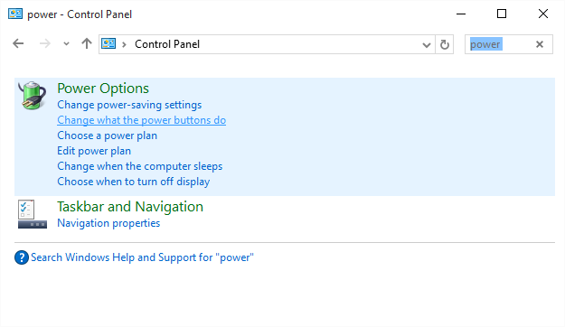

`2) Click the`**`Change settings that are currently unavailable`**`link near the top of the next window:`

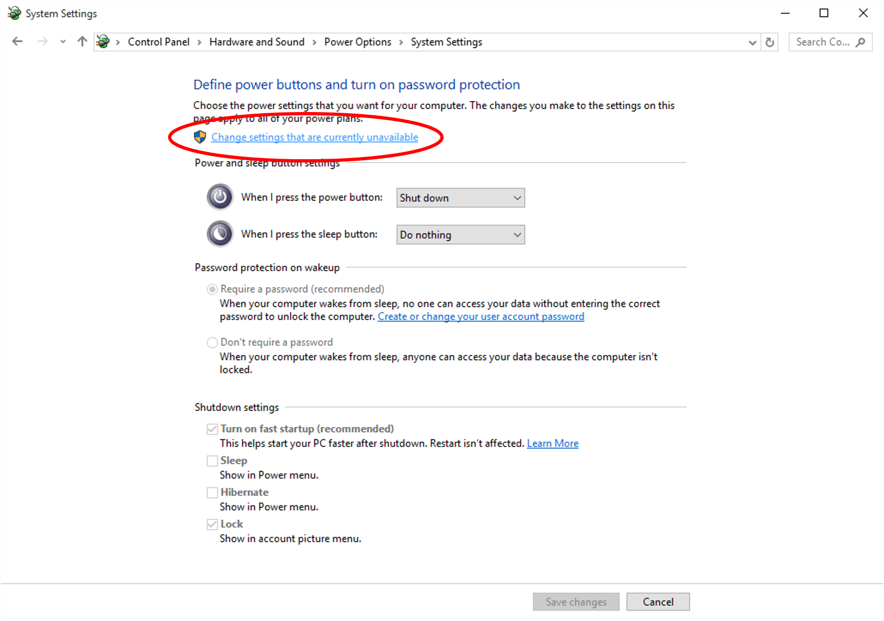

`3) Uncheck`**`Turn on fast startup`**`from under the`_`Shutdown settings`_`section:`

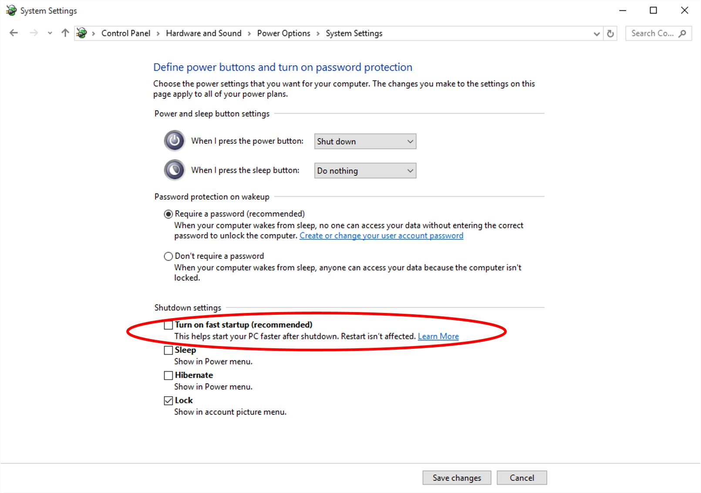\

### Disable Hiberfil.sys

Even with fast startup disabled, technically the system is still able to
"hibernate" as a user-controllable function. Hibernation suspends the
Windows OS to RAM so that on resume, the entire system state returns as
it was. The trade-off, however, is that a hidden file called
Hiberfil.sys will be created on the root of your C:\\ drive that can
take up a massive amount of space and generate lots of disk IO activity.
By disabling hibernation as a feature entirely, you can reclaim many GB
of space on your virtual disk and reduce overhead relating to disk IO
inside the VM.

`1) Open a Windows command prompt as an administrator and enter this command:`**`powercfg -h off`**

`2) Reboot your VM and the hiberfil.sys file should no longer remain (this step may not be necessary for certain versions of Windows).`

### Disable Windows Indexing

The Windows indexing service (aka Windows Search) can cause unnecessary
disk IO inside your VM. To improve overall VM performance, it is
recommended to disable this service from running in Windows.

`1) Open a`**`Run`**`window and type`_`services.msc`_`inside, then press`_`Enter`_`:`

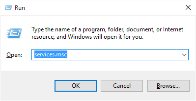

`2) Right-click the`**`Windows Search`**`service from the next window and then click`**`Stop`**`:`

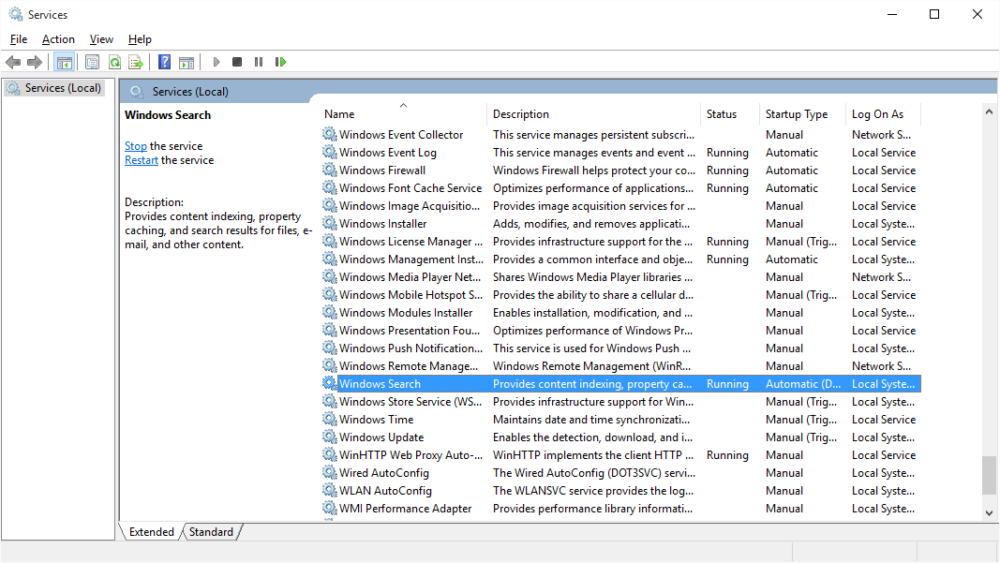

`3) Double-click the`**`Windows Search`**`item from the list and in the next window, change the`_`Startup type`_`to`**`Disabled`**`:`

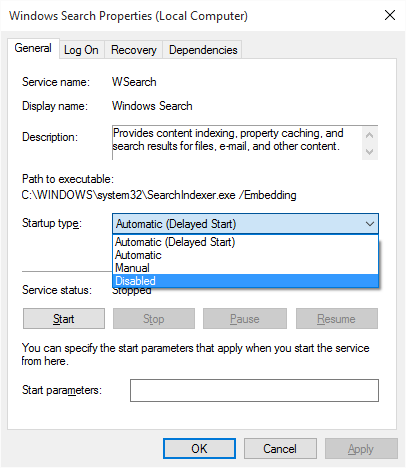

### Disable Automatic Disk Defragmenting

If the Windows disk defragmenter is set to automatically run on a
schedule, you should disable it. This is not necessary for VMs and can
cause unnecessary wear and tear on your physical storage devices.

`1) Use Windows Explorer to browse to where you can see the C:\ drive, then right-click on the device and select`**`Properties`**`:`

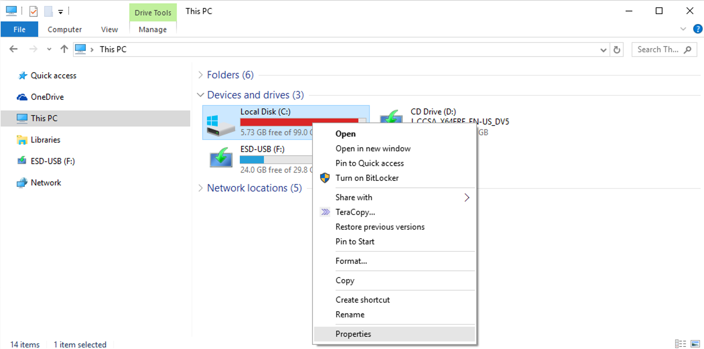

`2) Click on the`**`Tools`**`tab at the top, then click`**`Optimize`**`:`

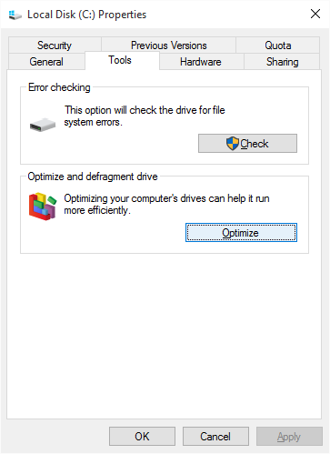

`3) Click on the`**`Change settings`**`button:`

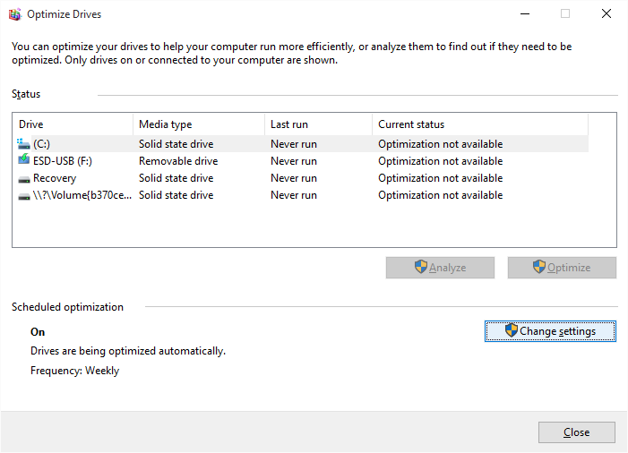

`4) Uncheck`**`Run on a schedule`**`from the next window:`

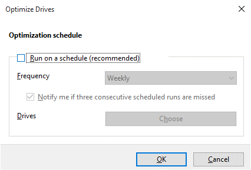\

### Enable High Performance Power Mode

Because Windows is a virtual machine, there is little to no benefit in
leveraging its power management features. In fact, these features can
make using VMs more difficult, as it requires another device to then
access the webGui to resume a VM that was suspended due to a period of
inactivity.

`1) Open up the`**`Control Panel`**`for Windows and in the top-right search box, type "power" to search for the power settings controls, then select`**`Choose a power plan`**`:`

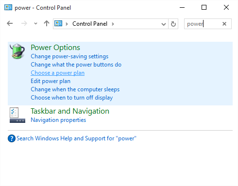

`2) Select`**`High performance`**`from the options available under`_`Preferred plans`_`:`

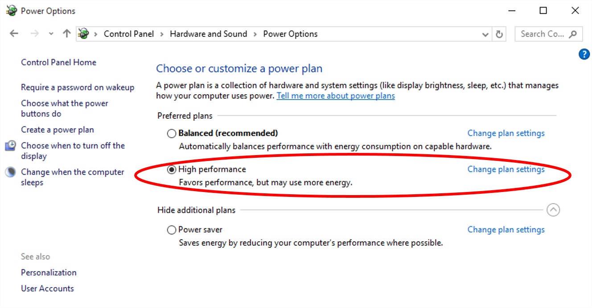\

### Enable Remote Desktop Access

_NOTE: YOUR USER ACCOUNT MUST HAVE A PASSWORD SET IN ORDER TO CONNECT TO
YOUR VM USING RDP._

If you wish to interact with your VM from another device, you have two
remote graphics protocols at your disposal with Unraid 6: VNC and RDP.
RDP offers performance improvements over VNC but requires you to enable
it from within the VM before you can use it. It also requires you to
have [a valid RDP
client](https://technet.microsoft.com/en-us/library/Dn473009.aspx)
installed on the device you wish to use to connect to your VM
(officially supported clients from Microsoft work on Android, iOS, Mac
OS X, and Windows). You will also need to be using Windows Professional
edition (the Home edition does not include this feature). To enable RDP
access to your VM, perform the following steps through VNC or locally
using GPU pass through:

`1) Open the`**`System`**`panel by right-clicking on the Windows start button in the lower-right corner of your desktop.`

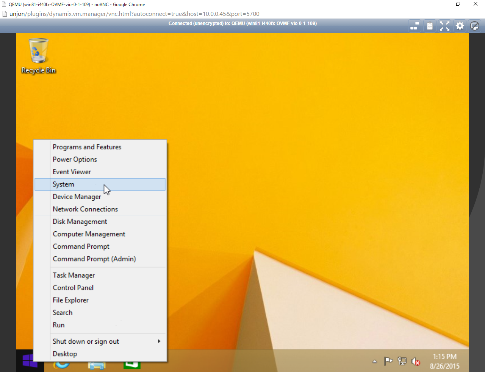

`2) Click on`**`Remote settings`**

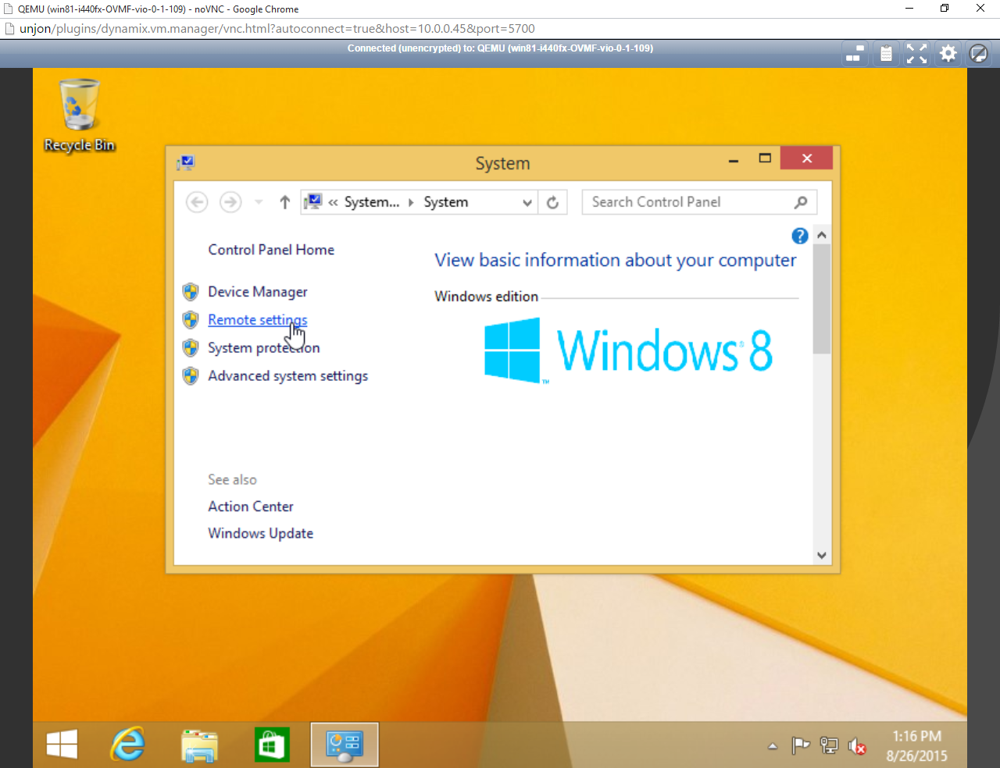

`3) Click on`**`Allow remote connections to this computer`**`and click`**`OK`**`.`

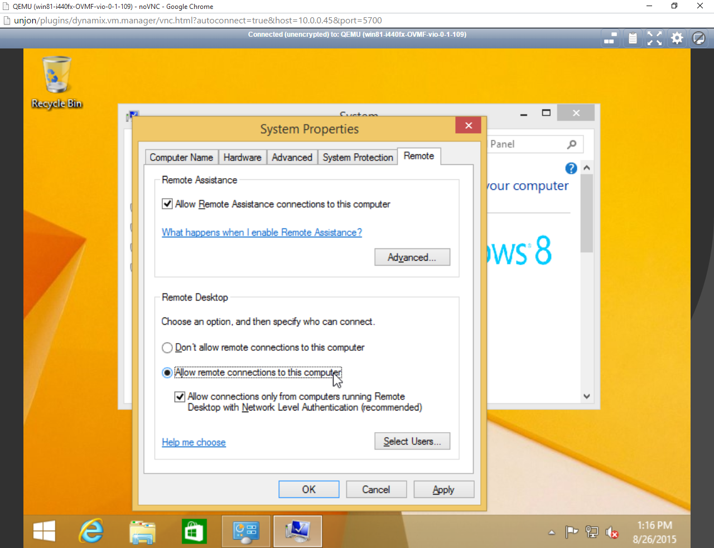

`4) You can now connect using a Microsoft RDP client, but you will need to connect to the IP address of the virtual machine,`_`not Unraid itself`_`.`

### Enable MSI for Interrupts to Fix HDMI Audio Support

If you are assigning a graphics device to your Windows guest that uses
an HDMI connection and you wish to push audio through that connection,
you _may_ need to perform a registry modification in Windows to ensure
the audio driver remains working properly (this is most prevalent with
NVIDIA devices). For a comprehensive explanation of MSI and VFIO
interrupts, you can visit Alex Williamson's
blog[1](http://vfio.blogspot.com/2014/09/vfio-interrupts-and-how-to-coax-windows.html).
Here's the procedure for doing this:

- Shut down your VM and make a copy of your virtual disk before
  proceeding (as a backup).
- Start your VM with the GPU device assigned.
- Access your server using SSH or telnet.
- For the device you wish to assign, locate its PCI address identifier
  (this can be found when selecting the device from within the VM
  creation tool)
- From the command line, type the following: `lspci -v -s 1:00.0`
  (replace 1:00.0 with your GPU device)
- Look for a line that looks like this:
  `Capabilities: [68] MSI: Enable+ Count=1/1 Maskable- 64bit+`

If the **Enable** setting is set to **+**, that means your device claims
it is MSI capable and it is enabled by the guest VM that is using it. If
you cannot find a line that mentions MSI as a capability, it means your
device does not support this. If the **Enable** setting is set to **-**,
this means your device claims it is MSI capable, but that the guest VM
is NOT using it. The procedure for enabling MSI support from Windows is
documented here: <http://forums.guru3d.com/showthread.php?t=378044>

## Upgrading a VM to Windows 10

If you have a Windows 7 or 8.1 virtual machine and wish to upgrade to
Windows 10, there are some special considerations. This guide will
assist you in making the upgrade process as painless as possible.

### Do NOT Use the Upgrade Assistant

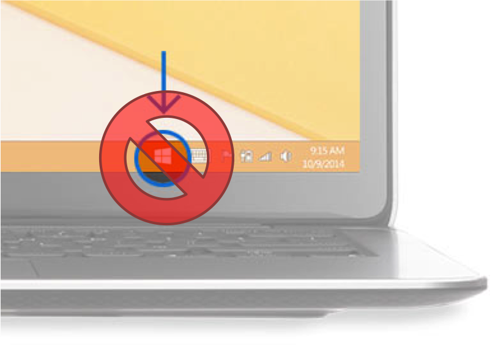Microsoft's
website suggests that if you want to upgrade to Windows 10, use the
upgrade assistant in the bottom right corner to perform your upgrade.
This is known to be buggy and potentially cause issues (even on
traditional Windows PCs). The preferred mechanism to upgrade is to
download the Windows 10 ISO directly and attach it to your virtual
machine, then use that to perform the upgrade itself.

### Upgrade VirtIO Drivers to 0.1.109 or later

If you used the 0.1.102 drivers for your Windows 7 or 8.1 VM, you will
want to upgrade these drivers to 0.1.109 or later before performing the
upgrade. The process to update the drivers is located
[here](#updating-virtio-drivers):

### Obtaining the Installation Media

The process for obtaining Windows 10 installation media for the purpose
of an upgrade is the same as it is for performing a new installation.
Visit [this page](http://aka.ms/softwaredownloadwin10_marketing) to
download the installation media. If given an option, make sure you
select **ISO**. Once the download is finished, make sure you copy the
ISO to the ISOs share on your server.

### Performing the Upgrade

With your VM powered off, edit the VM and perform the following steps:

1\. Reduce the number of **CPUs** assigned to only 1.
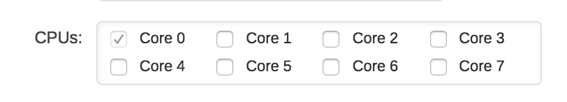

2\. Change the **OS Install ISO** field to point to the Windows 10
installation media you downloaded earlier.
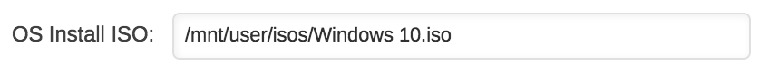

3\. Click **Update**.

4\. Start your VM.

5\. Browse to the installation media using File Explorer and launch the
setup wizard.

6\. Follow the on-screen prompts to complete the upgrade process.

7\. Once completed, you can shutdown and edit the VM, increasing the
number of CPUs assigned as desired.

## Upgrading a VM to Windows 11

If you have a Windows 10 VM that you want to upgrade to Windows 11,
there are a number of steps to ensure the upgrade process completes
successfully. First and foremost, perform the following steps:

- Create a backup of your Windows VM.
- Upgrade Unraid OS to release 6.10-rc2 or later.

The next step will be to add TPM support to your VM. To do this, perform
the following steps:

- Shut down your Windows 10 VM.
- Edit your Windows 10 VM.
- Change the BIOS type from OVMF to OVMF-TPM.
- Save the changes and start the VM.

With TPM support added, now you can perform the following steps from
within your Windows 10 VM:

- Download and run the [Windows 11 Installation
  Assistant](https://www.microsoft.com/en-us/software-download/windows11)
  and the [Windows 11 Health Check
  app](https://aka.ms/GetPCHealthCheckApp).
- Run the health check app to verify processor and, if applicable, GPU
  compatibility.
- Upgrade to Windows 11.

## Unraid as a VM

There are times when it can be useful to have another instance of Unraid
running as a VM hosted on an Unraid server.

The most likely time this will be of use is when you want to be able to
run an Unraid development/test environment but do not have the hardware
to run it separately to your main Unraid server. By running the Unraid
in a VM you can develop and test new Unraid plugins or docker containers
without risking destabilizing your main Unraid production server.
Alternatively, you may just want to run an Unraid release in the VM that
is different from that running in the host so you can check out any new
features. This can be useful if you want to test the functionality of
new versions before upgrading your main system, or if you need to
develop plugins that work across versions.

**Note:** Limetech does not officially support running Unraid in a VM,
so this should not be used for production data.

There is a [forum
thread](https://forums.unraid.net/topic/60106-guide-how-to-install-an-unraid-vm-on-an-unraid-host/)
about running Unraid in a VM and that is an appropriate place to ask
questions.

**Prerequisites**

- You will need a valid license key for the Unraid VM. Also, the VM's
  flash drive has to be a different manufacturer than the host's
  flash drive.
- Unraid 6.4.0 (or later) in the VM. If for any reason you want to run
  an earlier release then see the forum thread mentioned above for
  guidance on how to do this.

**Prepare the flash drive for the VM**

- On your Windows or Mac desktop, use the Unraid USB creator tool tool
  to create your flash drive (or see the manual instructions in the
  next post)
  - Note that the VM's flash drive has to be a different
    manufacturer than the host's flash drive.
  - If your main system is named "Tower", be sure to specify a
    different name for the VM. Perhaps "TowerVM".
  - Click the option to "Allow EFI boot"
  - Write the image to the VM's flash drive
- Make a few edits
  - Change the label of the flash drive from "UNRAID" to
    "UNRAID-VM"
  - Edit syslinux/syslinux.cfg on the flash drive and add
    unraidlabel=UNRAID-VM to the "append" line, like this:

`label Unraid OS`\
`menu default`\
`kernel /bzimage`\
`append unraidlabel=UNRAID-VM initrd=/bzroot`

- You may wish to make the same change to the "label Unraid OS GUI
  Mode" and "label Unraid OS Safe Mode" areas as well
- On the same flash drive, copy the newly updated
  syslinux/syslinux.cfg over the existing EFI/boot/syslinux.cfg
- Create a file called startup.nsh in the root of the flash drive
  which contains the single line below. This prevents Unraid from
  getting stuck at the EFI shell.

`\EFI\boot\bootx64.efi`

- Make note of the manufacturer of the flash drive while it is still
  accessible. You'll need it later.
- Insert the flash drive into your server and reboot. If the system
  tries to boot from the new "UNRAID-VM" flash drive, you'll need
  to adjust settings in the bios to get it to consistently boot from
  the original "UNRAID" flash drive instead. Once that is done, boot
  the host into Unraid.

**Setup the VM on the host**

- On the host system, go to _Settings-\>VM_ and make sure VMs are
  enabled. For more details see the [VM
  Management](vm-management.md) in the Unraid manual.
- Go to the VMs tab and click the **Add VM** button. This will display
  a list of standard templates.
- Select the Slackware option to load the template.
- If you downloaded additional VM icons click on the Slackware icon
  and change it to the Limetech Unraid icon
- Change the name to something relevant, like UNRAID-VM
- (Optional) Add any other useful information to the Description
  field. For example, you might like to put here the version of Unraid
  that the VM is running.
- Set the CPUs and RAM for the VM. Something like 2 CPUs and 3GB of
  RAM (initial and max should be the same) should be enough.
- Choose the highest level Q35 Machine type
- Leave the BIOS at OVMF and the USB Controller at "2.0 (EHCI)"
- Set up the disk configuration that you want the VM to use:
  - Typically you add a vdisk for a cache drive and at least one
    data drive. Parity is optional, depending on what kind of
    testing you want to do. You can create all the vdisks from this
    interface, just provide a size, set the type to RAW and the bus
    to SATA. Hit the plus sign to add more drives. Note that the
    vdisks have random names in the VM, it might help you identify
    which is which through their file sizes. i.e. make the parity
    slightly larger than the data drives, and make the cache drive
    different as well.
  - You can also pass through whole physical drives as long as they
    are not part of the cache or array.
- Leave the graphics/sound/network settings at their defaults.
- In the USB Devices area, put a checkmark next to the UNRAID-VM flash
  drive. Unfortunately, you can't see the label here so you'll have
  to identify it by manufacturer. If the VM's flash drive and the
  host's flash drive have the same manufacturer, the VM's drive will
  not be visible (which is why the license for the VM must use a URB
  drive that is from a different manufacturer to that used for the
  host).

Create and start the VM

- Optional) Remove the checkmark for automatically starting the VM
  after creation.
- Click the **Create** button
- Back on the VMs -\> Virtual Machines page you can click the Unraid
  icon and then choose "VNC Remote" to watch the VM boot. Note the
  IP address is displayed right before the login prompt.

**Configure the VM**

- Point a web browser at the IP address display when the VM is
  started. This will bring up the standard Unraid GUI for the instance
  of Unraid running in the VM
- You can now configure and manage the VM just like you would any
  other Unraid server but choose settings that are appropriate for
  this VM.
- Go to _Settings-\>Identification_ and make sure set the _Server
  Name_ is set to be different to the host. It can also be a good idea
  to set the _Description_ to something like "Unraid as guest"
- (Optional) Go to _Settings-\>Display Settings_ and choose a
  different Dynamix color theme to that used on the host. This will
  help with making it more obvious
- Since this is a test system, you'll probably want to go to
  _Settings-\>SMB Settings-\>Workgroup Settings_ and set Local Master
  to No.
- If you have a UPS on the host system (and you do, right?) go to
  Settings -\> UPS (on the VM) and set the UPS cable to "Ether", UPS
  type to "net" and Device to the IP address of your host. Configure
  the runtime settings so the VM turns off before the host, and set
  "Turn off UPS" to no. Then start the UPS daemon.
- Add the array devices and cache drive that were setup previously and
  start the array
- Add Community Applications plugin
- From the _Apps_ tab that is n/w available, add dockers and plugins
  as needed for testing.
- Note that you can update the Unraid VM just as you would a normal
  bare-metal Unraid system, by going to _Tools-\>Update OS_

**Troubleshooting**

- It has been noted that if you edit the VM settings for any reason
  that you can get an _Execution Error_ when next trying to start the
  VM indicating a problem with the USB flash drive containing the
  Unraid license that is going to be used by this VM. This can be
  fixed using the following steps:
  - Select the option to Udit the VM
  - switch to XML view (using the toggle at the top right)
  - Do to the bottom of the XML where just before the **memballoon**
    entry you will see a **hostdev** node defining the flash drive.
  - Remove this **hostdev** node and all its contents
  - Click the _Apply_ button to commit the change
  - Select the Edit option again and this time switch to Form View.
  - Make sure the USB flash drive containing the Unraid license key
    for the VM is selected
  - Click Apply to commit the change
  - The VM should now start without the Execution Error.

## OpenELEC / LibreELEC

OpenELEC and LibreELEC have been made available as pre-configured VM
templates. This enables users to quickly add the robust media player
application, Kodi, to their Unraid systems, and use a physical graphics
card to output to the display closest to their system.

**Prerequisites**

To make use of these templates, your system must adhere to the following
requirements:

- Your CPU/Motherboard must have support for HVM and IOMMU support
- A discrete (PCIe) graphics adapter (NVIDIA/AMD) is required (no
  on-board graphics supported)
  - Most GPUs work fine, but some may require additional tweaks to
    work properly
- At least 512MB free in RAM to assign to the VM
- At least 300MB of free disk space in a user share
- A connection to the Internet is required to download the virtual
  disk image template
- Virtual machines must be enabled (under **Settings** -\> **VM
  Manager**)
- A place to store the virtual disk image and application data must be
  available (e.g. a domains and appdata share).

**Downloading the VM**

- Navigate to the VMs tab
- Select **OpenELEC** or **LibreELEC** from the _Templates_ section
- Click inside the **Download Folder** field to select a place to
  store the virtual disk image
  - Your shares can be found under /mnt/user/ (e.g.
    /mnt/user/domains)
- Click **Download** to download the VM image template; progress will
  be displayed automatically.

**Configuring the VM**

When the download completes, additional fields will appear allowing you
to configure your VM.

- In the _Add VM_ section at the top, make sure to give your VM a
  **Name**
- Click inside the **Config Folder** field to provide a path to store
  your Kodi media library data
  - Your shares can be found under /mnt/user/ (e.g.
    /mnt/user/appdata/OpenELEC)
- Select how many **CPUs** you want assigned (minimum 1)
- Select a **Graphics Card** to use for video output
- Select a **Sound Card** for audio output
- Select any **USB Devices** you wish to use with the VM (such as a
  keyboard, mouse, or infrared receiver)
- Click **Create** to start your VM

**Updating the VM**

As new versions of Unraid OS are made available, new versions of the VM
template may also be made available. To obtain a new version:

- From the _VMs_ tab, click the icon of the VM you wish to upgrade and
  select **Edit**
- From the _Edit VM_ page, click the _Version_ drop-down and select
  the new version you wish to download
- Click the **Download** button and the new image version will
  download automatically
- When the download is complete, click **Update** at the bottom
- Start your VM from the _VMs_ tab

**Using Kodi** For new users of the ultimate customizable media player
application, you may want to review [the Kodi
wiki](http://kodi.wiki/view/Main_Page), and specifically see these
guides:

- [Quick start guide](http://kodi.wiki/view/Quick_start_guide)
- [Adding videos to the
  library](http://kodi.wiki/view/Adding_videos_to_the_library)
- [Official Kodi Remote for
  iOS](https://itunes.apple.com/us/app/unofficial-official-xbmc-remote/id520480364?ls=1&mt=8)
- [Kore: Official Remote for Kodi on
  Android](https://play.google.com/store/apps/details?id=org.xbmc.kore&hl=en)

**Questions? Need help or support?**

Additional support can be requested for this VM template within the
[OpenELEC VM Template
Support](https://forums.unraid.net/forum/index.php?topic=42473.0)
thread in the [VM
Templates](https://forums.unraid.net/forum/index.php?board=54.0)
message board.
