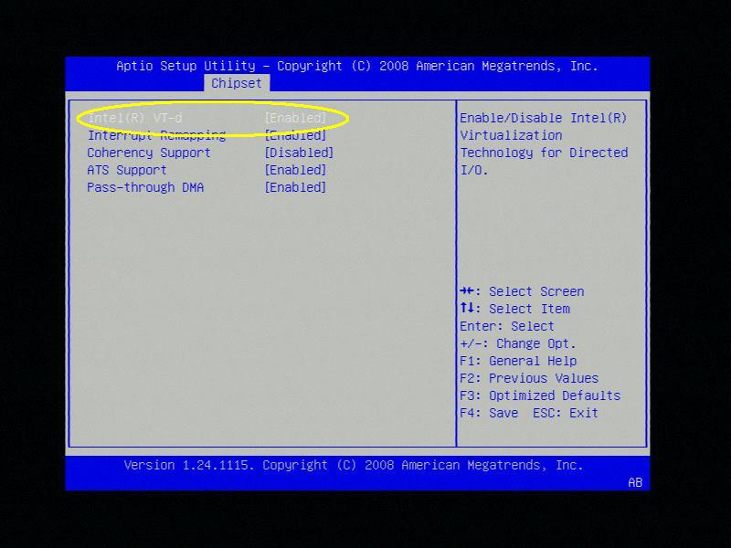
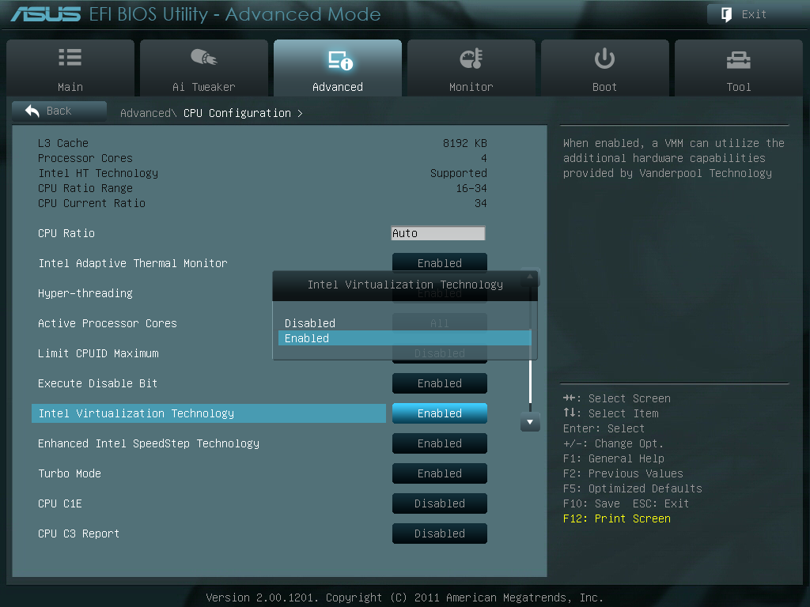

# VM management

## Overview

While [Docker Containers](../docker-management.md) are the preferred mechanism for running Linux-based applications such as media servers, backup software, and file sharing solutions, virtual machines add support for non-Linux workloads and the ability to utilize devices that the host cannot (think graphics pass through, USB pass through/assignment, etc). *Localized Virtualization* is our method of supporting VMs where all resources assigned to the guest are local to the host.

For information on what operating systems have been tested for use with Unraid Server OS, please see the [VM Support](vm-support.md) page.

## Prerequisites

To create virtual machines on Unraid, you will need HVM hardware support (Intel VT-x or AMD-V). To assign host-based PCI devices to those VMs, your hardware must also support IOMMU (Intel VT-d or AMD-Vi). Lastly, all virtualization features must be enabled in your motherboard BIOS (typically found in the CPU or System Agent sections). NOTE: Not all hardware that claims support for this has been proven to work effectively, so see the "tested hardware" section for known working component combinations. Virtual machines can also drive a need for much more RAM/CPU cores depending on the type. Here are some general recommendations on how much RAM should be allocated **per virtual machine**:

* Virtual servers (Windows, Arch, etc.): 256MB - 1GB, 1-2 CPU cores
* Virtual desktops (Windows, Ubuntu, etc.): 512MB - 8GB, 2-4 CPU cores
* Hybrid VMs (GPU assignment, gaming, etc.): 1GB - 12GB, 2-6 CPU cores

Keep in mind that memory usage for virtual machines only occurs when they are running, so it's just important to think about these
requirements in terms of peak concurrent usage on your system.

### Determining HVM/IOMMU Hardware Support

To determine if hardware has support for HVM or IOMMU, there are two primary methods available:

#### Online Research

* To check if your Intel processor has support for VT-x or VT-d, visit http://ark.intel.com/Search/Advanced.  On the left hand filter panel, you can filter by processors that have support for VT-x,  VT-d, or both.
* For guidance with AMD processors, there is not an equivalent to the ARK site, but [this Wikipedia article](http://en.wikipedia.org/wiki/List_of_IOMMU-supporting_hardware#AMD_based) may assist you.
* Motherboard support for virtualization is usually available as part of the product documentation or user manual.

#### Through the Unraid WebGUI

* When accessing your Unraid system through the web interface, you can determine if your system is virtualization compatible by selecting the **Info** button on the right side of the top menu bar.
  * **HVM Support** refers to Intel VT-x or AMD-V
    * *Not Available* means that your hardware is not HVM capable.
    * *Disabled* means that your hardware is HVM capable, but the settings in your motherboard BIOS are not enabled.
    * *Enabled* means that your hardware is both HVM capable and the appropriate settings in your motherboard BIOS are also enabled.
  * **IOMMU Support** refers to Intel VT-d or AMD-V
    * *Not Available* only displays if your system is not HVM capable.
    * *Disabled* means that either your hardware is not capable of IOMMU or the appropriate settings in your motherboard BIOS are not enabled.
    * *Enabled* means that your hardware is both IOMMU capable and the appropriate settings in your motherboard BIOS are also enabled.

### Assigning Graphics Devices

Unlike other PCI devices, graphics devices can be more difficult to pass through to a VM for control. With Unraid 6, we've implemented a number of tweaks to maximize success with graphics pass through for our users. Here are the currently known limitations associated with GPU pass through on Unraid 6:

* NVIDIA GTX-series GPUs should work fine as of the 600 series or newer, but not all models have been tested.
* AMD cards have had some issues depending on the make or model and which guest operating system is attached.
* Some devices may work better for pass through to specific guest operating systems.
* With OVMF-based virtual machines, if your GPU has UEFI support, it should work fine, but some users still report card-specific issues.

## System Preparation

Before you can get started with creating virtual machines, there are a few preparatory tasks that must be completed.

### Adjust BIOS Settings

In order to utilize all the virtualization features of Unraid 6, you must ensure your BIOS is configured properly for hardware-assisted virtualization as well as IO memory mapping (HVM / IOMMU support). In your BIOS settings, look for anything marked with **Virtualization**, **Intel VT-x**, **Intel VT-d**, **AMD-V**, or **AMD-Vi** and set it to **Enabled**.

Here are a few examples of where virtualization settings can be found from various motherboard BIOS screens.





### Configure a Network Bridge

There are two methods by which your virtual machines can get access to host-based networking: through a private NAT bridge managed by libvirt or through a public bridge managed by Unraid directly. The private bridge (`virbr0`) is automatically configured when libvirt starts. The public bridge (br0) can be created through the **Network Settings** page on the Unraid WebGUI.

The private bridge generates an internal DHCP server/address pool to create IPs for VMs automatically, but the VMs will be on a subnet that cannot be accessed by other devices or even other services on Unraid. This type of bridge is ideal if you want your VM to be completely isolated from all other network services except internet access and the host's network file sharing protocols. VM management can be performed through a VNC session provided by the browser.

The public bridge provides VMs with an IP address from your router, but internally bridges communications between VMs and each other, as well as the host. This type of bridge is ideal if you want your VMs to act just like another device on your network, where you manage its network access at the LAN-router instead of inside the VM. We persist MAC address settings for the virtual interfaces you create, ensuring the VMs should get the same IP address each time they connect, as long as your router-managed DHCP pool doesn't run out of addresses. So if you want to connect to your VM from another PC, laptop, tablet, or another type of device, you should use the public bridge. Enable public bridge in ***Network settings > Enable bridging***.

Whichever bridge you prefer can be defined as the **Default Network Bridge** on the **VM Settings** page. You may have to enable the advanced view using the toggle at the top right before this setting is visible.

### User Shares for Virtualization

By default, Unraid will create two user shares for use with virtualization on Unraid. One share to store your installation media files (ISOs) and another to store your virtual machines themselves (domains). If you don't already have a share you use for backups, you might consider adding one as well to use for backing up your virtual machines.

#### Recommendations for Share Configuration

* Virtual machines will perform best when their primary vDisk is stored on a cache-only share.
* While SSDs are not required for virtual machines to function, performance gains are substantial with their use.
* For your ISO library share (containing your installation media), cache usage is optional.

:::important

Do NOT store your active virtual machines on a share where the **Use Cache** setting is set to **Yes**. Doing so will cause your VMs to be moved to the array when the mover is invoked.

:::

### Setup Virtualization Preferences

Before you can get started creating virtual machines, we need to perform a few configuration steps:

* In the WebGUI, navigate to ***Settings > VM Manager***.
* For Windows VMs, you will need to download virtual drivers for storage, network, and memory.
  * Download the latest "stable" VirtIO Windows drivers ISO found here: https://github.com/virtio-win/virtio-win-pkg-scripts/blob/master/README.md.
  * Copy the VirtIO ISO file for the drivers to the ISO share folder.
  * Use the file picker for **VirtIO Windows Drivers ISO** to select the ISO file you copied.
  * You can override the default driver ISO on a per-VM basis (under **Advanced View**).
* Select **virbr0** (default) for a *private network bridge* or select a *public network bridge* that you created on the **Network Settings** page.
  * You can override the default network bridge on a per-VM basis, under **Advanced View**.
* Toggle **PCIe ACS Override** to **On** if you wish to assign multiple PCI devices to disparate virtual machines
  * The override breaks apart IOMMU groups so that individual devices can be assigned to different virtual machines
  * Without this setting enabled, you may not be able to pass through devices to multiple virtual machines simultaneously
  * WARNING: This setting is experimental! Take caution when using.
    [1](http://vfio.blogspot.com/2014/08/iommu-groups-inside-and-out.html)
* Select **Apply** when done to apply your settings

:::tip Troubleshooting

If Unraid reports the VM as stopped, after applying, check **/boot/config/domains.cfg**, you may need to set fields:

* `MEDIADIR="/mnt/user/system/"`
* `VIRTIOISO="/mnt/user/system"` (the share with virtio image)

For more information, you can See also [Forum help by Squid](https://forums.unraid.net/topic/70874-restoring-virtual-machines/?tab=comments#comment-650785)
:::

## Creating Your Own VMs

With the preparation steps completed, you can create your first VM by clicking **Add VM** from the **Virtual Machines** page.

### Basic VM Creation

The WebGUI will by default present the minimum number of fields required in order for you to create a VM.

* Set the **Template** type to **Custom**
* Give the VM a **Name** and a **Description**
* Toggle the **Autostart** setting if you want the VM to start with the array automatically
* Select the **Operating System** you wish to use, which will also adjust the icon used for the VM
* Select which **CPUs** you wish to assign the VM
  * You can select up to as many physical CPUs that are present on your host
* Specify how much **Initial Memory** you wish to assign the VM
  * See the documentation for the OS you are installing to determine how much RAM to allocate.
* Select an **OS Install ISO** for your installation media
* Specify the vDisks you wish to create (or select an existing vDisk)
  * The **Primary vDisk** is used to store your VM's operating system
  * **Additional vDisks** can be added by selecting the plus sign.
* Specify a **Graphics Card** to use to interact with the VM
  * If you are not assigning a physical graphics card, specify **VNC**.
  * If you are assigning a physical graphics card, select it from the list.
  * VNC can only be specified as the primary graphics display or it can't be assigned at all.
  * A password can be optionally specified for the VNC connection.
  * Not all graphics cards will work as a secondary display.
  * If you assign a physical graphics device, be sure to assign a USB keyboard and mouse as well.
  * Additional graphics devices can be assigned by selecting the plus sign.
* Assign a **Sound Card** if you're assigning a graphics card to get audio support in your VM.
  * Most GPUs have their own built-in sound card as a function of the graphics card for HDMI audio.
  * Additional sound cards can be assigned by selecting the plus sign.
* **USB Devices** can be assigned to the VM that are plugged into the host.
  * USB hot-plugging is not currently supported, so devices must be attached before the VM is started in order for USB pass through to function.
  * Some USB devices may not work properly when passed through to a guest (though most do work fine).
  * The Unraid USB flash device is not displayed here, to prevent accidental assignment.
* Click **Create VM** to create your virtual disks (if necessary), which will start automatically unless you unchecked the **Start VM after creation** checkbox.

### Advanced Options

If you wish to toggle other advanced settings for the VM, you can toggle from **Basic** to **Advanced View** (switch located on the **Template Settings** section bar from the **Add VM page).

* You can adjust the **CPU Mode** setting.
  * **Host Passthrough** will expose the guest to all the capabilities of the host CPU (this can significantly improve performance).
  * **Emulated** will use the QEMU emulated CPU and not expose the guest to all of the host processor's features.
* Specifying a **Max Memory** value will enable memory ballooning, allowing KVM to shrink/expand memory assignments dynamically as needed.
  * This feature does not apply to VMs where a physical PCI device has been assigned (GPU, sound, etc.).
* The **Machine** type presented to your VM can be toggled between QEMU's **i440fx** or **Q35** chipsets.
  * For Windows-based VMs: i440fx is the default setting and should only be changed if you are having difficulty passing through a PCI-based graphics card (this may prompt Windows to reactivate).
  * For Linux-based VMs: Q35 is the default setting and should not be changed if passing through a GPU.
* The **BIOS** can only be adjusted when adding a new VM (existing VMs cannot modify this setting).
  * SeaBIOS is a traditional VGA BIOS for creating most virtual machines.
  * OVMF utilizes a UEFI BIOS interface, eliminating the use of traditional VGA.
  * OVMF requires that the VM's operating system supports UEFI (Windows 8 or newer, most modern Linux distros) and if you wish to assign a physical graphics device, it too must support UEFI.
* If you specify Windows as the guest operating system, you can toggle the exposure of **Hyper-V** extensions to the VM.
* You can choose to override the default **VirtIO Drivers ISO** should you so desire.
* You can toggle the **vDisk Type** between RAW and QCOW2 (RAW is recommended for best performance)
* With Linux-based VMs, you can add multiple **VirtFS** mappings to your guest
  * For more information on VirtFS and the 9p file system, visit here: http://wiki.qemu.org/Documentation/9psetup
* If you desire, you can modify the **Network MAC** address for the virtual network interface of the VM as well as specify an alternate **Network Bridge**.
  * You can click the blue refresh symbol to auto-generate a new MAC address for the virtual network interface.
  * Additional virtual network interfaces can be assigned by selecting the plus sign.

## Expanding a vDisk

In the event that you need to increase the size of your virtual disk device, you can do so with the following procedure:

* Navigate to the VMs tab in the WebGUI.
* Make sure your VM is stopped.
* Click on the name of your VM to expand the view to show you the various disk devices attached to the VM.
* Click on the value in the capacity field for the vDisk to make it editable.
* Edit a value of how large you want the vDisk to be and press enter (e.g. for 100 gigabytes, enter 100G)
* You will now see the new capacity take affect.

After doing this, you can start your VM and the new storage will be available, though you will need to either create a new partition out of that space or extend an existing partition to make use of it. For instructions on how to expand your Windows partition, please see [this article](../../../legacy/Articles/expanding-windows-vm-vdisk-partitions.md).

## Troubleshooting Stuck at UEFI Shell

In the event you are stuck at the UEFI shell after booting your VM, you can enter a few commands to manually trigger the boot sequence:

```shell
fs0:
cd efi/boot
bootx64.efi
```

This will manually trigger your VM to boot.

## Assigning Graphics Devices to Virtual Machines (GPU Pass Through)

The ability to assign a GPU to a virtual machine for direct I/O control comes with some additional provisions:

1. Not all motherboard/GPU combinations will work for GPU assignment.
2. Integrated graphics devices (on-board GPUs) are not assignable to virtual machines at this time.
3. Additional community-tested configurations can be found in [this spreadsheet](https://docs.google.com/spreadsheets/d/1LnGpTrXalwGVNy0PWJDURhyxa3sgqkGXmvNCIvIMenk/edit#gid=0).
4. Lime Technology provides a list of validated and tested hardware combinations within the wiki.
5. You can also discuss hardware selection in the [Lime Technology community forums](http://lime-technology.com/forum/).

Additional information regarding virtual function I/O (VFIO) and GPU passthrough can be found in [the following F.A.Q from Alex Williamson](http://vfio.blogspot.com/2014/08/vfiovga-faq.html), the project's maintainer.

### Warning: Passing through a GPU to a SeaBIOS-based VM will disable console VGA access

If you rely upon a locally-attached monitor and keyboard to interact with the Unraid terminal directly, you will lose this ability once you create a SeaBIOS VM with a GPU assigned. This is due to a bug with VGA arbitration and cannot be solved. This does NOT affect your ability to access the console using a telnet or SSH session, but local console access directly will appear to be frozen (blinking cursor, but no visible response to keyboard input). It does not matter if you are using on-board graphics for the console compared to a discrete GPU for the pass through to a VM or not. With OVMF, however, VGA isn't utilized, therefore arbitration isn't needed and therefore your console graphics
will remain intact. Note that not all GPUs support OVMF as OVMF requires UEFI support on your GPU.

### Help! Failed to set iommu for container: Operation not permitted

If you are getting the above message when trying to assign a graphics device to a VM, it is most likely that your device is in an IOMMU group along with another active/in-use device on your system. Please see [this article](http://vfio.blogspot.com/2014/08/iommu-groups-inside-and-out.html) written by Alex Williamson on IOMMU groups if you wish to better understand this issue and how it impacts you. Under ***Settings > VM Manager*** you will find an option to toggle for PCIe ACS Override, which will forcibly break out each device into its own IOMMU group (following a reboot of the system). This setting is experimental, so use with caution.

Another possibility here is that your system doesn't support interrupt remapping, which is critical for VFIO and GPU pass through. There is a workaround for this, but you will not be protected against MSI-based interrupt injection attacks by guests ([more info about MSI injection attacks through VT-d](http://invisiblethingslab.com/resources/2011/Software%20Attacks%20on%20Intel%20VT-d.pdf)). If you completely trust your VM guests and the drivers inside them,
enabling this workaround should resolve the issue. The alternative is to purchase hardware that offers interrupt remapping support. To enable the workaround, you will need to modify your syslinux.cfg file, adding the bolded bit below:

```shell
label Unraid OS
menu default
kernel /bzimage
append vfio_iommu_type1.allow_unsafe_interrupts=1 initrd=/bzroot
```

### Help! I can start my VM with a GPU assigned but all I get is a black screen on my monitor!

If you aren't receiving an error message, but the display doesn't "light up" when your VM is started, it means that while the device is being assigned properly, you may have an issue with your motherboard or GPU preventing proper VGA arbitration from occurring. There are several things you can do to try to fix this:

1. Boot into your motherboard BIOS and make sure your primary graphics is NOT set to a card you wish to pass through (the best option is to set it to integrated graphics, aka iGPU; make sure it's not PCI or PCIe).
2. Ensure your motherboard BIOS and video card BIOS are up to date.
3. Try adjusting the **BIOS** under **Advanced View** when adding a new VM from SeaBIOS to OVMF (existing VMs cannot have this setting changed once created).
4. Try adjusting the **Machine Type** from *i440fx* to Q35 under **Advanced View** when editing or adding a VM.
5. As a last resort, you can attempt to manually provide the ROM file for your video card by editing the XML for your VM (see below procedure).

### Edit XML for VM to supply GPU ROM manually

1. From another PC, navigate to this webpage: http://www.techpowerup.com/vgabios/
2. Use the **Refine Search Parameters** section to locate your GPU from the database.
3. Download the appropriate ROM file for your video card and store the file on any user share in Unraid.
4. With your VM stopped, click the icon for your VM, then select **Edit XML** from the context menu.
5. Scroll to the bottom of the XML and locate this section (the `<address>` parts may look different for you than from the example below):

```xml
<hostdev mode='subsystem' type='pci' managed='yes'>
  <driver name='vfio'/>
  <source>
    <address domain='0x0000' bus='0x02' slot='0x00' function='0x0'/>
  </source>
  <address type='pci' domain='0x0000' bus='0x00' slot='0x05' function='0x0'/>
</hostdev>
```

6. After the `</source>` tag, add the following code:

```xml
<rom file='/mnt/user/sharename/foldername/rom.bin'/>
```

7. Change the path after /mnt/user/ to the actual user share / sub-folder path to your rom file.

Once done editing the XML, select **Update** and try starting your VM again to see if the GPU assignment works properly.
