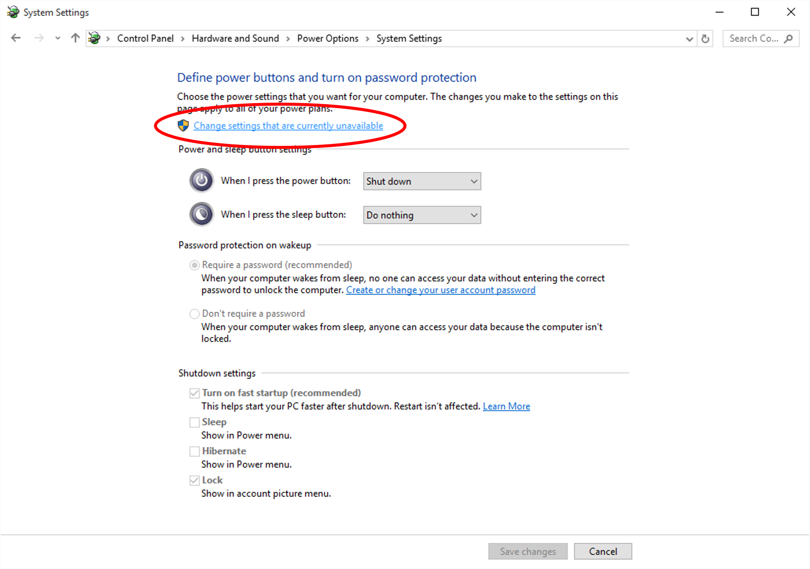
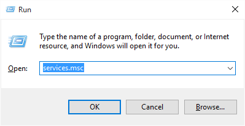
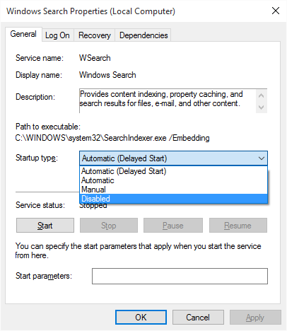
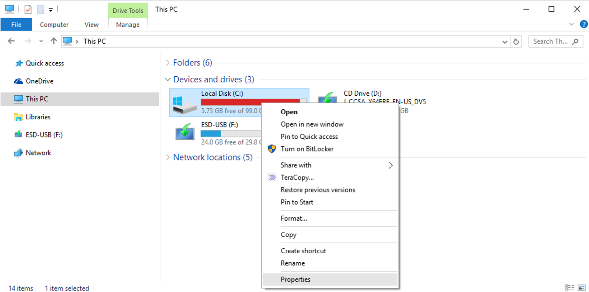
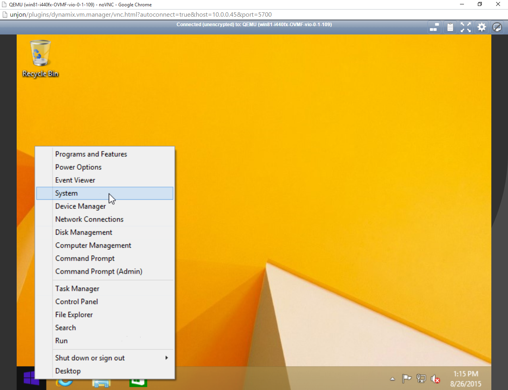
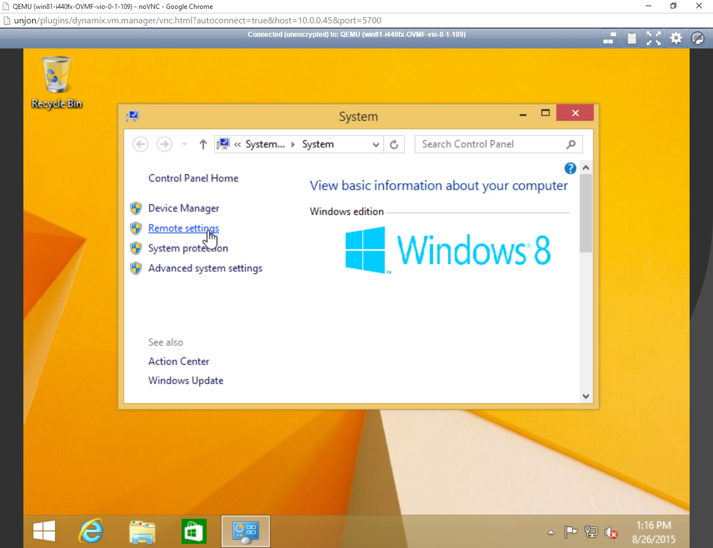

# VM support

Unraid currently supports the virtualization of nearly any 64-bit operating system. Not all OSes have been tested, but those that have are
listed on this page.

## Microsoft Windows as a VM

A few notes on virtualizing Windows on Unraid before you begin:

* Before activating your Windows license, we highly encourage thorough testing of your VM first.
* Changing the machine type between i440fx and Q35 under advanced mode will prompt Windows for reactivation of the license.
* Windows 7 and earlier OS variants may not work with host-based graphics assignment correctly. Use Windows 8.1 or newer for the best
  experience.
* If using OVMF, you must use Windows 8 or newer. UEFI is not directly supported by Windows 7 and therefore, OVMF will not work.

This list reflects the tested configurations with various OSes, QEMU machine types, and BIOSes:

| Windows OS | Machine type(s) | BIOS |
| :---------- | :--------------- | :---- |
| **Windows Desktop editions** | |
| Windows 7 | i440fx, Q35 | SeaBIOS |
| Windows 8.1 | i440fx, Q35 | SeaBIOS, OVMF |
| Windows 10 | i440fx, Q35 | SeaBIOS, OVMF |
| Windows 11 | i440fx, Q35 | OVMF TPM |
| **Windows Server editions** | |
| Windows Server 2008 R2 | i440fx, Q35 | SeaBIOS |
| Windows Server 2012 R2 | i440fx, Q35 | SeaBIOS |
| Windows Server 2012 R2 | i440fx | OVMF |
| Windows Server 2016 | i440fx, Q35 | OVMF |
| Windows Server 2019 | i440fx, Q35 | OVMF, OVMF TPM |
| Windows Server 2022 | i440fx, Q35 | OVMF, OVMF TPM |

### Using VirtIO drivers

Windows is different from Linux-based guests as it requires the user to load VirtIO drivers to recognize the virtual devices provided by QEMU/KVM in Windows. From time to time, the Fedora project will release new versions of the VirtIO drivers which may resolve bugs and improve overall performance. In some cases, driver updates may be required for upgrading your Windows OS from one version to another (e.g. Windows 7/8.1 to Windows 10).

To update your drivers, perform the following steps:

1. Download the latest [VirtIO drivers](https://github.com/virtio-win/virtio-win-pkg-scripts/blob/master/README.md) or, optionally, go to ***Settings > System Settings > VM Manager*** and select a **default Windows VirtIO driver ISO** from the dropdown. Select download.
1. Go to ***VMs***.
2. If the VM you want to change is running, stop it.
3. Edit your VM and change the VirtIO Drivers ISO path to specify the new drivers you downloaded in the previous step. The path defaults to your the ISOS share on the Unraid server.
4. Select **Update** at the bottom of the options to save the changes to your VM profile.
5. Start your VM.
6. Log in to Windows and open **Device Manager**
7. Locate each of the four VirtIO devices (Ethernet, SCSI Controller, Balloon, and Serial).
8. Right-click on each device and select **Update device drivers**
9. Select **Browse my computer for drivers** (Do not use Windows Update to locate new drivers.) and enter the drive letter for where the VirtIO drivers ISO is mounted. This will be typically mounted as drive D:\ or E:\ on your Windows VM. Windows will automatically search for and find the new drivers on that drive.

### Using Hibernation

Hibernation was originally designed as a more advanced form of Sleep for laptops. This allows to maintain a system's state without consuming power. The process involves dumping the RAM content of the system to local storage and then powering down the system. Then, when the system powers back on, instead of going through a normal Windows boot process, the system would simply restore the saved state from hibernation.

With VMs, hibernation is a useful way to save the state of a VM when you need to either power down or reboot the host. In order to make correct use of hibernation, you must first do two things.

#### Install the QEMU Guest Agent

To install the guest agent, perform the following steps:

1. Boot your VM up with the VirtIO drivers ISO mounted.
2. Open **Explorer** in Windows and navigate to the VirtIO Drivers media.
3. Open the `guest-agent` folder.
4. Open the `qemu-ga-x64.msi` file to install the guest agent.

There is no confirmation when complete, but a command box may appear briefly while it's installing.

#### Enable Hibernation in Windows

To enable hibernation support in Windows, perform the following steps:

1. Open up Windows Control Panel. You can simply type Control Panel in the Windows prompt.
2. Search for **Power Options**.
3. Select **Choose what the power buttons do**.
4. Select the elevated command **Change settings that are currently unavailable** to unlock the shutdown settings.
5. Check **Hibernate** option.
6. Select **Save changes**.

In the Windows **Power** menu, the option to **Hibernate** is now available.

### Performance Tuning

After the installation of a Windows VM, there are several things you can do to optimize your VM's performance and flexibility. None of these are required, but should you run into performance issues with your Windows VMs, following these settings may improve things for you.

#### Disable Fast Startup

Fast Startup is a feature introduced with Windows 8 that can improve boot times on physical PCs. However, as a VM, this can cause problems
when initializing hardware after shutdown (this can be especially true if you are assigning physical devices to virtual machines). It is for these reasons we encourage users to set their power management settings to *High-performance* mode.

1. Open the Windows **Control Panel** and in the top-right search box, type "power" to search for the power settings controls.
2. Select **Change what the power buttons do**:

3. Click the **Change settings that are currently unavailable** link near the top of the next window:

4. Uncheck **Turn on fast startup** from under the **Shutdown settings** section:


#### Disable Hiberfil.sys

Even with fast startup disabled, technically the system is still able to "hibernate" as a user-controllable function. Hibernation suspends the Windows OS to RAM so that on resume, the entire system state returns as it was. The trade-off, however, is that a hidden file called
Hiberfil.sys will be created on the root of your C:\\ drive that can take up a massive amount of space and generate lots of disk IO activity. By disabling hibernation as a feature entirely, you can reclaim many GB of space on your virtual disk and reduce overhead relating to disk IO inside the VM.

1. Open a Windows command prompt as an administrator and enter this command: `powercfg -h off`.
2. Reboot your VM and the `hiberfil.sys` file should no longer remain. This step may not be necessary for certain versions of Windows.

#### Disable Windows Indexing

The Windows indexing service (aka Windows Search) can cause unnecessary disk IO inside your VM. To improve overall VM performance, it is
recommended to disable this service from running in Windows.

1. Open a **Run** window and type `services.msc` inside, then press Enter:  

2. Right-click the **Windows Search** service from the next window and then select **Stop**:  

3. Double-click the **Windows Search** item from the list and in the next window, change the **Startup type** to *Disabled*:  


#### Disable Automatic Disk Defragmenting

If the Windows disk defragmenter is set to automatically run on a schedule, you should disable it. This is not necessary for VMs and can cause unnecessary wear and tear on your physical storage devices.

1.Open Windows Explorer and locate the C: drive. Right-click on the drive and select **Properties**.



2. Select the **Tools** tab, then **Optimize**.


3. Select **Change settings**.


4. Uncheck **Run on a schedule** from the next window.


#### Enable High Performance Power Mode

Because Windows is a virtual machine, there is little to no benefit in leveraging its power management features. In fact, these features can make using VMs more difficult, as it requires another device to then access the WebGUI to resume a VM that was suspended due to a period of inactivity.

1. Open the Windows **Control Panel**. In the top-right search box, type "power" to search for the power settings controls, then select`**`Choose a power plan`**`:`


`2) Select`**`High performance`**`from the options available under`_`Preferred plans`_`:`


#### Enable Remote Desktop Access

:::caution

Your user account **must** have a password set in order to connect to your VM using Microsoft's Remote Desktop Protocol (RDP).

:::

If you wish to interact with your VM from another device, you have two remote graphics protocols at your disposal with Unraid 6: VNC and RDP. RDP offers performance improvements over VNC but requires you to enable it from within the VM before you can use it. It also requires you to have [a valid RDP client](https://technet.microsoft.com/en-us/library/Dn473009.aspx) installed on the device you wish to use to connect to your VM (officially supported clients from Microsoft work on Android, iOS, Mac OS X, and Windows). You will also need to be using Windows Professional edition (the Home edition does not include this feature). To enable RDP access to your VM, perform the following steps through VNC or locally using GPU pass through:

`1) Open the`**`System`**`panel by right-clicking on the Windows start button in the lower-right corner of your desktop.`  

`2) Click on`**`Remote settings`**

`3) Click on`**`Allow remote connections to this computer`**`and click`**`OK`**`.`

`4) You can now connect using a Microsoft RDP client, but you will need to connect to the IP address of the virtual machine,`_`not Unraid itself`_`.`

### Enable MSI for Interrupts to Fix HDMI Audio Support

If you are assigning a graphics device to your Windows guest that uses an HDMI connection and you wish to push audio through that connection, you _may_ need to perform a registry modification in Windows to ensure the audio driver remains working properly (this is most prevalent with NVIDIA devices). For a comprehensive explanation of MSI and VFIO interrupts, you can visit [Alex Williamson's blog post](http://vfio.blogspot.com/2014/09/vfio-interrupts-and-how-to-coax-windows.html).

Here's the procedure for doing this:

1. Shut down your VM and make a copy of your virtual disk before proceeding (as a backup).
2. Start your VM with the GPU device assigned.
3. Access your server using SSH or telnet.
4. For the device you wish to assign, locate its PCI address identifier (this can be found when selecting the device from within the VM   creation tool)
5. From the command line, type the following: `lspci -v -s 1:00.0` (replace 1:00.0 with your GPU device)
6. Look for a line that looks like this: `Capabilities: [68] MSI: Enable+ Count=1/1 Maskable- 64bit+`

If the **Enable** setting is set to **+**, that means your device claims it is MSI capable and it is enabled by the guest VM that is using it. If you cannot find a line that mentions MSI as a capability, it means your device does not support this. If the **Enable** setting is set to **-**, this means your device claims it is MSI capable, but that the guest VM is NOT using it. The procedure for enabling MSI support from Windows is documented here: <http://forums.guru3d.com/showthread.php?t=378044>

### Upgrading a VM to Windows 10

If you have a Windows 7 or 8.1 virtual machine and wish to upgrade it to Windows 10, there are some special considerations. This guide will assist you in making the upgrade process as painless as possible.

:::caution Do **not** Use the Upgrade Assistant

Microsoft's website suggests that if you want to upgrade to Windows 10, use the upgrade assistant in the bottom right corner to perform your upgrade. This is known to be buggy and potentially cause issues (even on traditional Windows PCs). The preferred mechanism to upgrade is to download the Windows 10 ISO directly and attach it to your virtual machine, then use that to perform the upgrade itself.

:::

#### Upgrade VirtIO Drivers to 0.1.109 or later

If you used the 0.1.102 drivers for your Windows 7 or 8.1 VM, you will want to upgrade these drivers to 0.1.109 or later before performing the upgrade. The process to update the drivers is located [here](#updating-virtio-drivers):

#### Obtaining the Installation Media

The process for obtaining Windows 10 installation media for the purpose of an upgrade is the same as it is for performing a new installation. Visit [this page](http://aka.ms/softwaredownloadwin10_marketing) to download the installation media. If given an option, make sure you select **ISO**. Once the download is finished, make sure you copy the ISO to the ISOs share on your server.

#### Performing the Upgrade

With your VM powered off, edit the VM and perform the following steps:

1. Reduce the number of **CPUs** assigned to only 1.  

2. Change the **OS Install ISO** field to point to the Windows 10 installation media you downloaded earlier.  

3. Click **Update**.
4. Start your VM.
5. Browse to the installation media using File Explorer and launch the setup wizard.
6. Follow the on-screen prompts to complete the upgrade process.
7. Once completed, you can shutdown and edit the VM, increasing the number of CPUs assigned as desired.

### Upgrading a VM to Windows 11

If you have a Windows 10 VM that you want to upgrade to Windows 11, there are a number of steps to ensure the upgrade process completes successfully. First and foremost, perform the following steps:

* Create a backup of your Windows VM.
* Upgrade Unraid OS to release 6.10-rc2 or later.

The next step will be to add TPM support to your VM. To do this, perform the following steps:

1. Shut down your Windows 10 VM.
2. Edit your Windows 10 VM.
3. Change the BIOS type from *OVMF* to *OVMF-TPM*.
4. Save the changes and start the VM.

With TPM support added, you can now perform the following steps from within your Windows 10 VM:

1. Download and run the [Windows 11 Installation Assistant](https://www.microsoft.com/en-us/software-download/windows11)
  and the [Windows 11 Health Check app](https://aka.ms/GetPCHealthCheckApp).
2. Run the health check app to verify processor and, if applicable, GPU compatibility.
3. Upgrade to Windows 11.

## Unraid as a VM

There are times when it can be useful to have another instance of Unraid running as a VM hosted on an Unraid server.

The most likely time this will be of use is when you want to be able to run an Unraid development/test environment but do not have the hardware to run it separately to your main Unraid server. By running the Unraid in a VM you can develop and test new Unraid plugins or docker containers without risking destabilizing your main Unraid production server. Alternatively, you may just want to run an Unraid release in the VM that is different from that running in the host so you can check out any new features. This can be useful if you want to test the functionality of new versions before upgrading your main system, or if you need to develop plugins that work across versions.

:::note

Limetech does not officially support running Unraid in a VM, so this should not be used for production data.

:::

There is a [forum thread](https://forums.unraid.net/topic/60106-guide-how-to-install-an-unraid-vm-on-an-unraid-host/)
about running Unraid in a VM and that is an appropriate place to ask questions and get support from the community.

### Prerequisites

* You need a valid license key for the Unraid VM.
* You need a new flash device. The VM's flash device has to be of a different manufacturer than the host's flash device.
* Unraid 6.4.0 (or later) in the VM. If for any reason you want to run an earlier release then see the forum thread mentioned above for guidance on how to do this.

### Prepare the flash drive for the VM

1. On your Windows or Mac desktop, use the Unraid USB creator tool to create your flash drive (or see the manual instructions in the
  next post).
2. Note that the VM's flash device has to be a different manufacturer than the host's flash device.
3. If your main system is named "Tower", be sure to specify a different name for the VM. Perhaps "TowerVM".
    1. Select *Allow EFI boot*.
    2. Write the image to the VM's flash device.
4. Make a few edits:
    1. Change the label of the flash device from `UNRAID` to something different, for example `UNRAID-VM`.
    2. Edit `syslinux/syslinux.cfg` on the flash device and add `unraidlabel=UNRAID-VM` to the `append` line, like this:

```txt {4}
label Unraid OS
  menu default
  kernel /bzimage
  append unraidlabel=UNRAID-VM initrd=/bzroot
```

:::tip

You may wish to make the same change to the `label Unraid OS GUI Mode` and `label Unraid OS Safe Mode` sections of the file as well.

:::

5. On the same flash device, copy the newly updated `syslinux/syslinux.cfg` over the existing `EFI/boot/syslinux.cfg`.
6. Create a file called `startup.nsh` in the root of the flash device which contains the single line below. This prevents Unraid from getting stuck at the EFI shell.

`\EFI\boot\bootx64.efi`

* Make note of the manufacturer of the flash device while it is still accessible. You'll need it later.
* Insert the flash device into your server and reboot. If the system tries to boot from the new "UNRAID-VM" flash drive, you'll need
  to adjust settings in the bios to get it to consistently boot from the original "UNRAID" flash drive instead. Once that is done, boot the host into Unraid.

### Setup the VM on the host

1. On the host system, go to ***Settings > VM*** and make sure VMs are enabled. For more details see [VM Management](vm-management.md).
2. Go to the **VMs** tab and select the **Add VM** button. This will display a list of standard templates for different OSes.
3. Select the Slackware option to load the template.
4. If you downloaded additional VM icons click on the Slackware icon and change it to the Limetech Unraid icon.
5. Change the name to something relevant, like `UNRAID-VM`.
6. (Optional) Add any other useful information to the **Description** field. For example, you might like to put here the version of Unraid that the VM is running.
7. Set the CPUs and RAM for the VM. Two cores and 3 GB of RAM (initial and max can be the same) should be enough.
8. Choose the highest level Q35 Machine type.
9. Leave the BIOS at OVMF and the USB Controller at *2.0 (EHCI)*.
10. Set up the disk configuration that you want the VM to use:
    1. Typically you add a vDisk for a cache drive and at least one data drive. Parity is optional, depending on what kind of testing you want to do. You can create all the vDisks from this interface, just provide a size, set the type to RAW and the bus to SATA. Select the plus sign to add more virtual drives. Note that the vDisks have random names in the VM, it might help you identify which is which through their capacities. i.e. make the parity slightly larger than the data drives, and make the cache drive different as well.
    2. You can also pass-through whole physical drives as long as they are not part of the cache or array.
11. Leave the graphics, sound, and network settings at their default values.
12. In the USB Devices area, put a checkmark next to the `UNRAID-VM` flash device. Unfortunately, you can't see the label here so you'll have to identify it by manufacturer. If the VM's flash device and the host's flash device have the same manufacturer, the VM's drive will not be visible (which is why the license for the VM must use a USB drive that is from a different manufacturer to that used for the host).

### Create and start the VM

1. (Optional) Remove the checkmark for automatically starting the VM after creation.
2. Click the **Create** button.
3. Back on the **VMs** page you can click the Unraid icon and then choose *Start with console (VNC)* to watch the VM boot. Note the IP address is displayed right before the login prompt.

### Configure the VM

1. On a web browser, enter the IP address of the VM is started. This will bring up the standard Unraid GUI for the instance of Unraid running in the VM.
2. You can now configure and manage the VM just like you would any other Unraid server but choose settings that are appropriate for
  this VM.
  Go to ***Settings > Identification*** and make sure the **Server Name** is set to be different to the host. It can also be a good idea to set the **Description** to something like "Unraid as guest"
3. (Optional) Go to ***Settings > Display Settings*** and choose a different Dynamix color theme to that used on the host. This will help with making it more obvious.
4. Since this is a test system, you'll probably want to go to *Settings > SMB Settings > Workgroup Settings* and set **Local Master**
  to *No*.
5. If you have a UPS on the host system go to ***Settings > UPS*** (on the VM) and set: 
   * **UPS cable** to *Ether*
   * **UPS type** to *net*
   * **Device** to the IP address of your host
6. Configure the runtime settings so the VM turns off before the host, and set **Turn off UPS** to *No*. Then start the UPS daemon.
7. Add the array devices and cache drive that were setup previously and start the array
8. Add Community Applications plugin
9. From the **Apps** tab that is now available, add dockers and plugins as needed for testing.
10. Note that you can update the Unraid VM just as you would a normal bare-metal Unraid system, by going to ***Tools > Update OS***

### Troubleshooting

It has been noted that if you edit the VM settings for any reason that you can get an *Execution Error* when next trying to start the VM indicating a problem with the USB flash device containing the Unraid license that is going to be used by this VM. This can be
  fixed using the following steps:
  
  1. Select the option to edit the VM.
  2. Switch to **XML view** (using the toggle at the top-right).
  3. Go to the bottom of the XML where just before the **memballoon** entry you will see a **hostdev** node defining the flash device.
  4. Remove this **hostdev** node and all its contents.
  5. Select **Apply** to commit the change.
  6. **Edit** option again, but this time switch to Form View.
  7. Make sure the USB flash device containing the Unraid license key for the VM is selected.
  8. Click Apply to commit the change.
  9. The VM should now start without the execution error.

## OpenELEC / LibreELEC

OpenELEC and LibreELEC have been made available as pre-configured VM templates. This enables users to quickly add the robust media player application, Kodi, to their Unraid systems, and use a physical graphics card to output to the display closest to their system.

### Prerequisites

To make use of these templates, your system must follow these requirements:

* Your CPU/Motherboard must have support for HVM and IOMMU support
* A discrete (PCIe) graphics adapter (NVIDIA/AMD) is required (no on-board graphics supported).
    * Most GPUs work fine, but some may require additional tweaks to work properly.
* At least 512MB free in RAM to assign to the VM
* At least 300MB of free disk space in a user share
* A connection to the Internet is required to download the virtual disk image template
* Virtual machines must be enabled (under ***Settings > VM Manager***)
* A place to store the virtual disk image and application data must be available. For example, a `domains` and `appdata` share.

### Downloading the VM

1. Navigate to the VMs tab
2. Select **OpenELEC** or **LibreELEC** from the _Templates_ section
3. Select the **Download Folder** field to select a place to store the virtual disk image. Your shares can be found under `/mnt/user/` (e.g. `/mnt/user/domains`)
4. Click **Download** to download the VM image template; progress displays automatically.

### Configuring the VM

When the download completes, additional fields will appear allowing you to configure your VM.

1. In the **Add VM** section at the top, make sure to give your VM a **Name**.
2. Click inside the **Config Folder** field to provide a path to store your Kodi media library data. Your shares can be found under /mnt/user/ (e.g. `/mnt/user/appdata/OpenELEC`).
3. Select how many **CPUs** you want assigned (minimum 1).
4. Select a **Graphics Card** to use for video output.
5. Select a **Sound Card** for audio output.
6. Select any **USB Devices** you wish to use with the VM (such as a keyboard, mouse, or infrared receiver).
7. Click **Create** to start your VM

### Updating the VM

As new versions of Unraid OS are made available, new versions of the VM template may also be made available. To obtain a new version:

1. From the **VMs** tab, click the icon of the VM you wish to upgrade and select **Edit**.
2. From the **Edit VM** page, select the **Version** drop-down and select the new version you wish to download.
3. Select the **Download** button and the new image version will download automatically.
4. When the download is complete, click **Update** at the bottom.
5. Start your VM from the **VMs** tab.

### Using Kodi

For new users of the ultimate customizable media player application, you may want to review [the Kodi wiki](http://kodi.wiki/view/Main_Page), and specifically see these guides:

- [Quick start guide](http://kodi.wiki/view/Quick_start_guide)
- [Adding videos to the library](http://kodi.wiki/view/Adding_videos_to_the_library)
- [Official Kodi Remote for iOS](https://itunes.apple.com/us/app/unofficial-official-xbmc-remote/id520480364?ls=1&mt=8)
- [Kore: Official Remote for Kodi on Android](https://play.google.com/store/apps/details?id=org.xbmc.kore&hl=en)

#### Questions? Need help or support?

Additional support can be requested for this VM template within the [OpenELEC VM Template Support](https://forums.unraid.net/forum/index.php?topic=42473.0) thread in the [VM Templates](https://forums.unraid.net/forum/index.php?board=54.0) message board.
