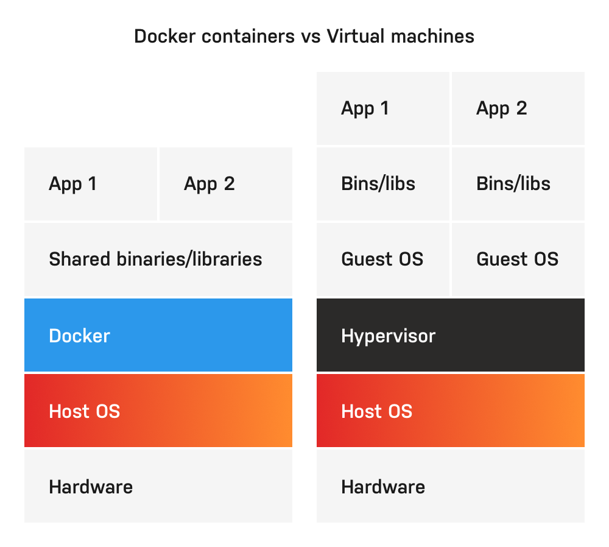
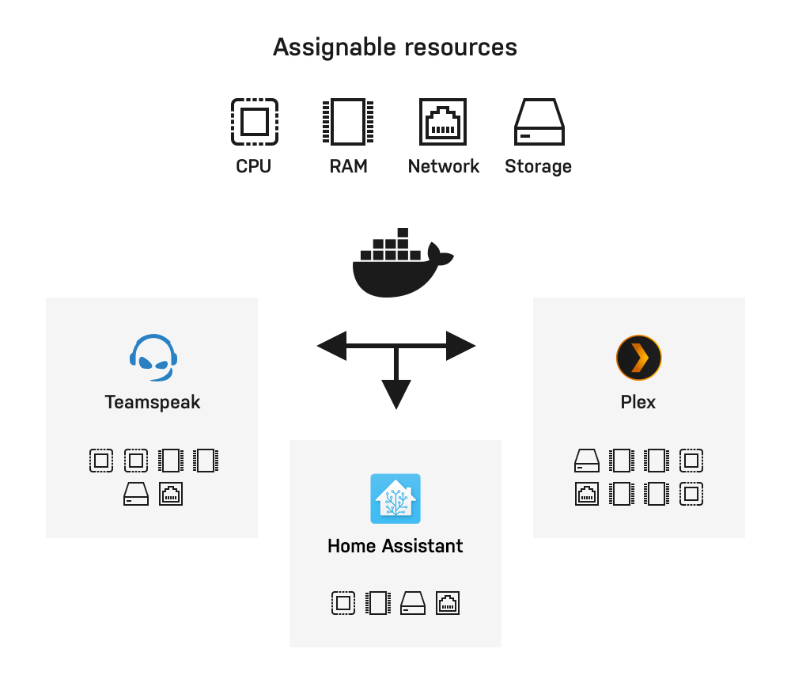

# Application Server

When it comes to application support, traditional NAS solutions come with three primary limitations:

* They cannot support applications written for other operating systems.
* They can be cumbersome to install and even more difficult to remove.
* They don't always "play nice" with other applications in the same OS.

Docker addresses these problems in a number of key ways:

* Allows for the use of any Linux operating system to empower a given application (no longer limited by the operating system of the host itself).
* Removes the "installation" process that applications have to go through by providing pre-installed images that ensure a consistent run-time experience for you and makes them easier to remove when you are done with them.
* Enables applications that would normally have issues with coexistence to operate in harmony in the same environment.

Docker is made up of three primary components: the Engine, the Hub, and Containers.

## The Engine

The Docker Engine represents the management component that is built into Unraid 6. Using the engine, we can control application access to vital system resources, interact with the Docker Hub, and isolate applications from conflicts.

From a storage perspective, the engine leverages the copy-on-write capabilities of the BTRFS filesystem combined with Docker images
provided through the hub. The images are essentially tar files with a  hierarchy so that other images which depend upon a common layer don't need to replicate storage for the layer they share. The shared layers are put in a read-only state, while changes made to them are reflected only in the instance for the application that changed it. In simpler terms, this means that applications can be efficient in their use of both system performance and storage capacity.

This differs from virtual machines where the entirety of the guest operating system is emulated. The overhead required to support a virtual machine is therefore much higher than the equivalent overhead for a container. Docker containers that feature common libraries and binaries do not replicate those shared resources and instead, leverage the efficiency of Linux and a copy-on-write filesystem to minimize the overhead.

## The Hub

One of biggest advantages Docker provides over both traditional Linux containers (LXCs) and virtual machines (VMs) is in its application repository: the Docker Hub. Many traditional Linux operating systems nowadays come with a component in their framework known as a _package manager_. The job of the package manager is to let people easily install applications written for a particular operating system from catalogs that are known as _repositories_. While package managers do their job fairly well, they come with all the limitations mentioned earlier. Linux containers and virtual machines, while competent at providing a way to control resources allocated to an application, still rely on traditional package managers for software retrieval and installation into their
run-time environments.

In contrast, the Docker Hub provides all the benefits without the limitations of a traditional package manager. Using the Docker engine, pre-built applications can be downloaded automatically and, thanks to the copy-on-write benefits we've already covered, the only data that is actually downloaded is data not already present on your system. The hub contains over 14,000 Dockerized apps, so finding what you're looking for shouldn't be a problem. In addition, thanks to some of our loyal community members, users can quickly add many of the most popular containers through the use of templates in Unraid 6. These forum members have taken it upon themselves to build and maintain these templates and the list of available templates continues to grow.

The Docker Hub can be accessed at <http://registry.hub.docker.com>.

## Containers

The cornerstone of Docker is in its ability to use Linux control groups, namespace isolation, and images to create isolated execution
environments in the form of Docker containers. Docker controls the resources allocated to the Containers and isolates them from conflicting with other applications on the same system. This provides all the benefits of traditional virtual machines, but with none of the overhead associated with emulating hardware, making containers ridiculously efficient and in some studies, barely distinguishable from bare-metal equivalents.

Docker works by allowing applications access to the system resources of the host operating system, such as CPU, memory, disk, and network, but isolates them into their own run-time environments. Unlike virtual machines, containers do not require hardware emulation, which eliminates overhead, hardware requirements, and provides near bare-metal performance.

