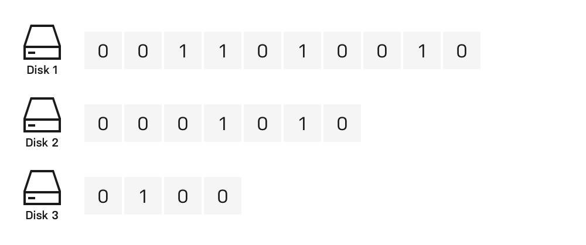
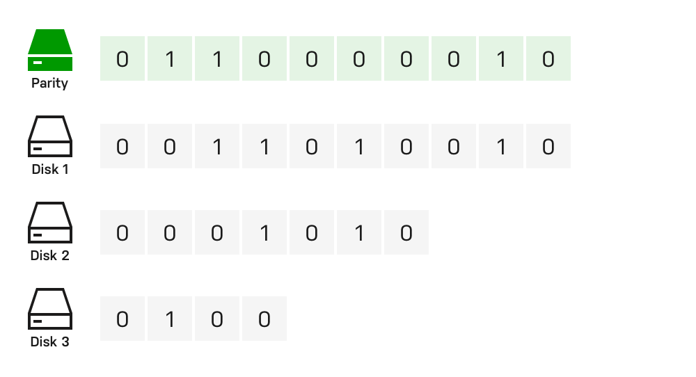
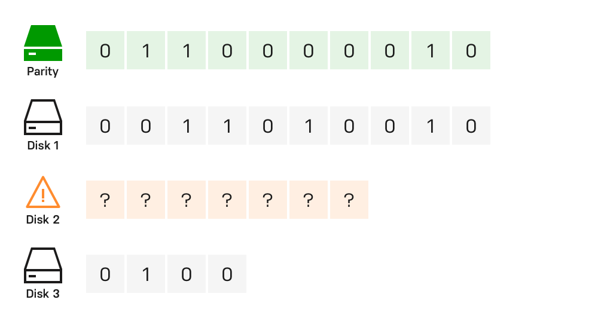
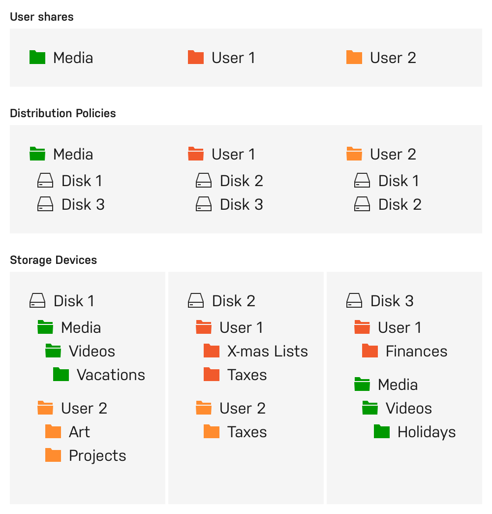
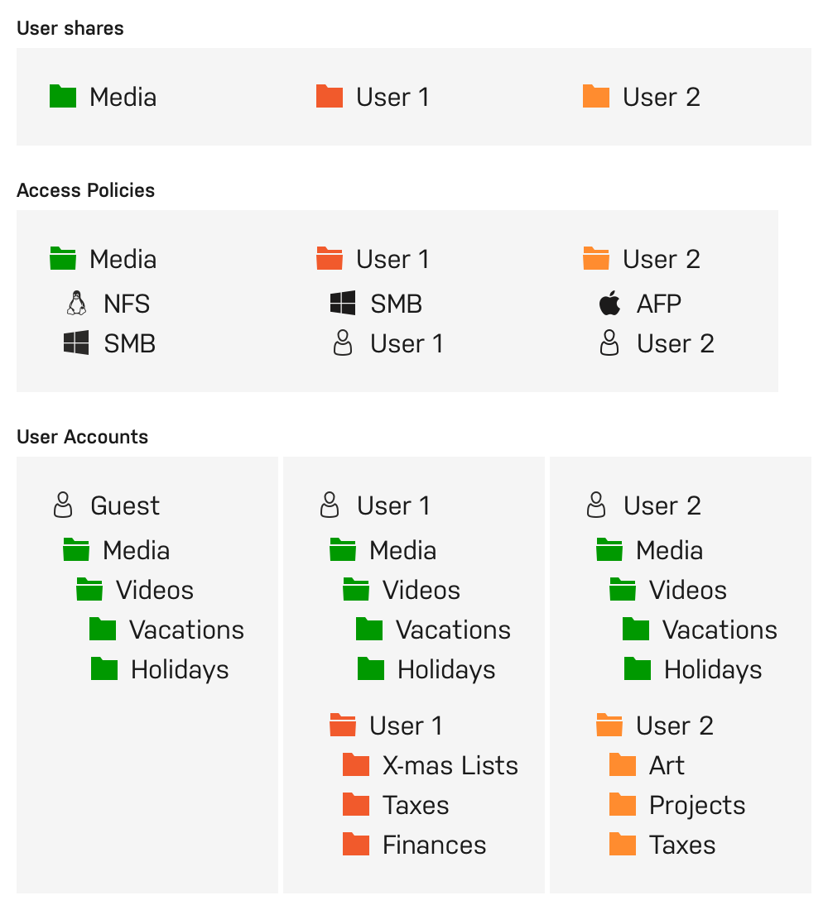
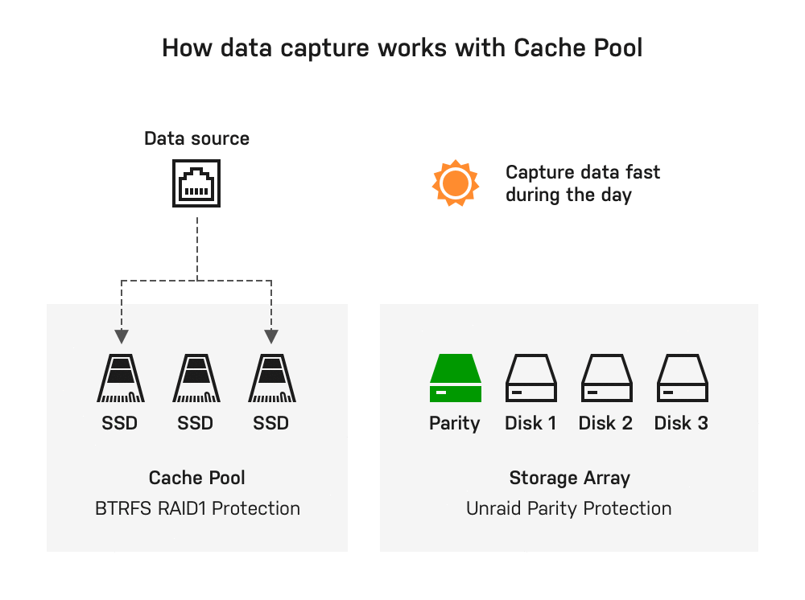

# Network-attached storage

At its core, Unraid is a hardware-agnostic solution that can turn almost any 64-bit capable system into a NAS. Unraid can manage an array of drives (connected via IDE, SATA, or SAS) that vary in size, speed, brand, and filesystem. In addition, by eliminating the use of traditional RAID-based technologies, it can scale on-demand by adding more drives without needing to rebalance existing data. Unraid's NAS functionality consists of: a disk array with parity protection, user shares, and an optional cache pool.

## Parity-protected array

The primary purpose of an Unraid array is to manage and protect the data of any group of drives (JBOD) by adding up to two dedicated parity drives. A parity drive provides a way to reconstruct all of the data from a failed drive onto a replacement. Amazing as it seems, a single parity drive can add protection for all of the others! In Unraid, parity is always maintained in real-time. You can find more detail on the access pattern to the drives in [Storage Management](../manual/storage-management.md), together with performance implications.

The contents of a hard drive can be thought of as a very long stream of bits, each of which can only be a zero or a one. If you sum the values of the nth bit on every drive and determine whether that sum is even or odd, then you can force the corresponding nth parity bit to also be even or odd (zero or one). If a data drive fails, that parity information can now be used to deduce the exact bit values of the failed drive, and perfectly rebuild it on a replacement drive. Here's an example:

In the picture above, we have three drives and each has a stream of bits that vary in count based on the device size. By themselves, these devices are unprotected and should any of them fail, data will be lost. To protect ourselves from failure, we must add a fourth disk to serve as parity. The parity disk must be of equal or greater size than the largest data disk. To calculate the value of each bit on the parity disk, we only need to know the sum total for each column. If the sum of a column is an even number, the parity bit should be a 0. If the sum of a column is an odd number, the parity bit should be a 1. Here's the same image as before, but with parity calculated per frame:

Now let's pretend that drive 2 in our example has suffered a failure and a new drive has been purchased to replace it:

To rebuild the data on the newly replaced disk, we use the same method as before, but instead of solving for the parity bit, we solve for the missing bit. For column 1, the sum would be 0, an even number, so the missing bit must be a 0 as well. For column 6, the sum would be 1, an odd number, so therefore the missing bit must also be a 1.

The ability to rebuild a disk using parity provides protection from data loss. Parity protection also provides fault-tolerance by allowing full usage of the system while keeping all data accessible, even when a drive has failed.

## User Shares

Unlike most RAID systems, Unraid saves data to individual drives. To simplify manageability, the root user can create shares that allow files written to them to be spread across multiple drives. Each share can be thought of as a top-level folder on a drive. When browsing through a share, all data from all drives that participate in that share will be displayed together. Users do not need to know which disk a file is on in order to access it under a share. Shares can be tuned to include/exclude specific disks and to use various methods for determining how files are allocated across those disks. In addition to controlling how data is distributed across drives, you can also control what network protocols the share is visible through as well as define user-level security
policy. When accessing your Unraid server over a network protocol, all shares exported through that protocol will be visible, but you can toggle protocols for both individual shares as well as at a global setting level. Should you have private data on your system that you wish to protect from anonymous access, user accounts can be created and policies defined to limit access to only trusted individuals.

## Cache

The cache drive feature of Unraid provides faster data intake. Generally speaking, by using a cache alongside an array of three or more drives, you can achieve up to 3x write performance. When data is written to a user share that has been configured to use the cache drive, all of that data is initially written directly to the dedicated cache drive. Because this drive is not a part of the array, the write speed is unimpeded by parity updates. Then, a scheduled mover process copies the data from the cache to the array at a time and frequency of your choosing (typically in the middle of the night). Once the mover completes, the space consumed previously on the cache drive is freed up.

With a single cache drive, data captured there is at risk, as a parity drive only protects the array, not the cache. However, you can build a cache with multiple drives both to increase your cache capacity as well as to add protection for that data. The grouping of multiple drives in a cache is referred to as building a cache pool. This Unraid cache pool is created through a unique twist on traditional RAID 1, using a BTRFS feature that provides both the data redundancy of RAID 1 plus the capacity expansion of RAID 0.

