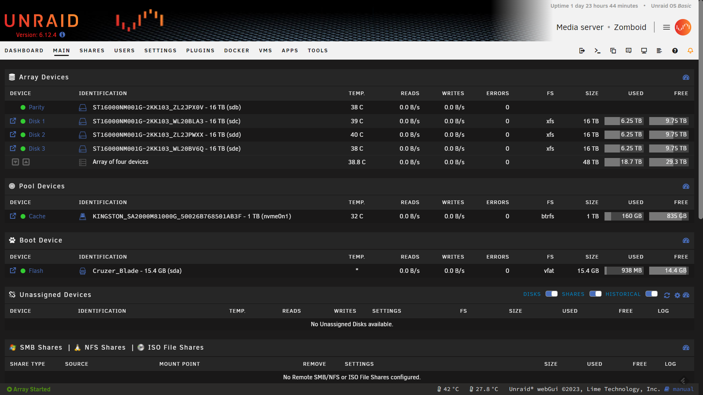
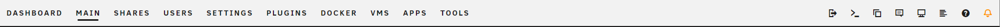
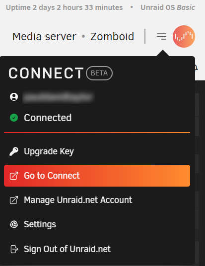
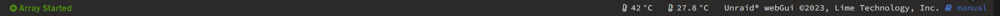

# UI Reference Guide

The main Unraid user interface, also known as the WebGUI, is the primary interface for the management and configuration of your Unraid server.

In Unraid 6.12.4 it looks like this:

The WebGUI is composed of different navigation elements that give you access to different aspects of the server management. These are:

* The navigation bar (and system shortcuts)
* Your account options
* The status bar

## Navigation bar

The horizontal navigation bar presents users with the Unraid system's major functional areas and gives you access to dedicated functionality to manage each one.

:::note

The navigation bar can be customized through the use of plugins, adding additional menus and options. These extensions are found in Community Applications.

:::

### Dashboard

The **Dashboard** tab provides realtime monitoring of all major Unraid components, both hardware and software, on your server. These elements present in a grid of tiles, with each tile representing a different aspect of Unraid management: System identification, motherboard, CPU, RAM, storage, network information, Containers, VMs, users, and shares.

:::tip

The Dashboard can be expanded through the use of the plugins found in Community Applications. You can also turn tiles on and off by selecting the padlock in navigation bar and turning tiles on and off.

:::

### Main

The **Main** screen gives you control over your Unraid storage and disk operations. From here you can set up, configure, and manage your array, cache pool(s), flash devices, ad-hoc storage management for USB and unassigned devices, and remote shares. The screen provides detailed information on each storage device, including: health, capacity, file systems, and overall operational status of any storage on the system.

At the bottom of the screen, the **Array Operation** section provides access to maintenance options that help keep your array operational and in good health.

### Shares

The **Shares** screen lets you manage the individual shares on your Unraid server.

The screen is split between [User Shares](../manual/shares/user-shares.md) and [Disk Shares](../manual/shares/disk-shares.md). Detailed information and management of each share can be accessed by selecting the share name.

### Users

The **Users** screen provides management of all user accounts on the Unraid server, as described in [User management](../manual/users/users.md).

### Settings

The **Settings** screen lets you to manage all the system settings on your Unraid server. These include:

* System Settings - configure system parameters and behavior for core components of Unraid.
* Network Services - configure different communication protocols as well as set up your [Wireguard VPN](../manual/security/vpn.md#wireguard).
* User Preferences - configure individual user preferences such as notifications or display settings.
* User Utilities - configure individual utilities that you have added through the use of plugins.

### Plugins

The **Plugins** screen displays all the plugins you have installed on your Unraid server. Plugins extend the functionality of Unraid and are covered in our [Community Applications documentation](../manual/applications.md#plugins).

### Docker

The **Docker** screen displays  all the containers you have installed from Community Applications. You can launch containers from this screen, as well as stop them. You can manage all aspects of each individual container's configuration, including their auto-start.

### VMs

:::note

If your Unraid server meets the [hardware virtualization requirements](../manual/vm/vm-management/#determining-hvmiommu-hardware-support), this option displays in the navigation bar. Otherwise, this option will not be visible.

:::

The **VMs** screen lets you manage VMs on your Unraid server. Any VMs you have created will display here, together with the VM's main attributes (CPU core assignments, vDisk allocation. graphics card), and you can edit the VM settings. You can read more about this in the [VM section of our documentation](../manual/vm/vm-management.md).

### Apps

The **Apps** screen, otherwise known as the Community Applications, is the official source for Unraid applications.

As the name implies, Community Applications provides community-sourced applications in the form of plugins and docker containers, that extend Unraid functionality beyond that of a mere NAS. You can read more about this in the [Community Applications section](../manual/applications.md#community-applications).

### Tools

The **Tools* screen provides a number of tools to manage Unraid OS, customization of the WebGUI visuals, and system updates.

### System shortcuts

On the right-hand side of the screen, the navigation bar displays shortcuts for a number of Unraid features, including:

* Logout - select this option to immediately log out of the Unraid server.
* Terminal - select this to open a terminal window.
* File manager - select this to open the built-in file manager in Unraid.
* Feedback - select this to submit feedback on the Unraid OS, report any issues, troubleshoot an issue, and leaving a free form comment for the development team.
* Info - A high-level summary of your server's main attributes.
* System logs - Provides a terminal window with a list of system events on Unraid OS.
* Help - select this to switch on context-specific help for the screen you are on.
* Notifications - any system notifications display here, categorized as: Alert, Warning, or Notice.

## Account options

In the top-right corner of the WebGUI, next to your server name, you can find a hamburger menu (three stacked horizontal lines). This menu provides options to manage your Unraid account and profile, including access to Unraid Connect, license key upgrades, and a logout option.

If Unraid is in trial mode, you can also redeem your license key from here and activate Unraid as a Basic, Plus, or Pro edition.

## Status bar

The status bar, at the bottom of the WebGUI, provides indicators on the current state of your array and the status of any ongoing operations such as Mover or parity checks. Some plugins also add functionality to the status bar by displaying key values like system temperatures and others.