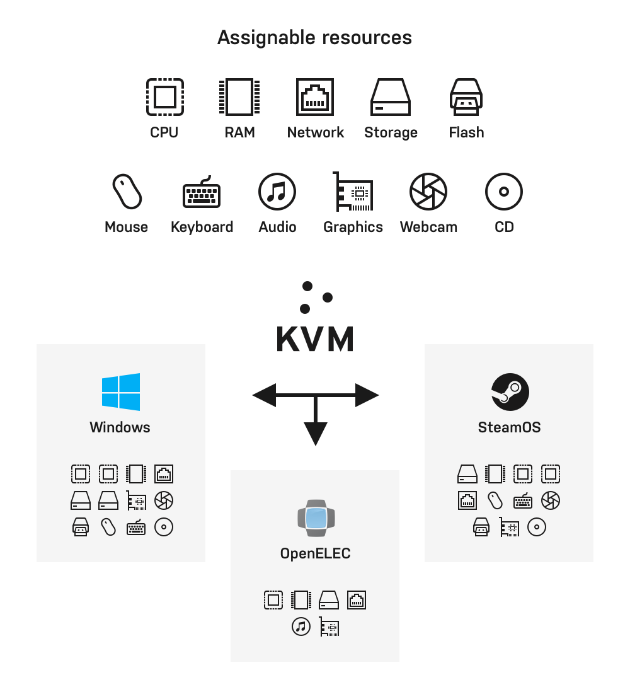

# Virtualization host

Unraid is designed to run as a virtualization host, leveraging a hypervisor to partition resources to virtualized guests in a secure and isolated manner. By supporting the use of virtual machines on Unraid, you can run an even wider array of applications in isolated environments and handle a variety of other tasks, beyond network-attached storage.

:::tip

To use the hardware virtualization feature in Unraid, you need a combination of CPU, chipset, a compatible BIOS, and device drivers, to support functionality. A full account of these requirements can be found [here](../manual/vm/vm-management.md). If your server does not meet these requirements, the VMS menu will be disabled in the Unraid WebGUI.

:::

## VM benefits

While [Docker containers](./application-server.md) are the preferred method for running Linux-based headless applications, virtual machines offer unique benefits:

* **Isolation** - hardware virtualization enables you to run multiple operating systems and applications in isolated virtual environments on a single Unraid server. Each VM operates independently, ensuring that if one VM fails or is compromised, it doesn't affect the others.
* **Consolidation** - you can consolidate multiple physical servers into a single Unraid machine, reducing hardware and maintenance costs. This is especially useful for manageability.
* **Resource allocation** - hardware virtualization on Unraid allows you to allocate specific CPU cores, memory, storage, and network resources to each VM. This ensures that critical workloads get the necessary resources without impacting other VMs.
* **Testing and development** - You can use VMs to create and test software in different environments without needing multiple physical machines. This accelerates the development and testing process.
* **Security** - VMs can be isolated from each other, enhancing security. If one VM is compromised, it's more challenging for an attacker or malware to move laterally to other VMs or the host system.
* **Legacy application support** - Hardware virtualization allows you to run legacy applications or operating systems that may not be compatible with newer hardware or software environments.
* **Resource isolation** - Each VM can have its own dedicated resources, ensuring that one VM's activities do not impact the performance of others. This is crucial for applications with strict performance requirements.
* **Resource overcommitment** - In some cases, you can overcommit resources, for example CPU and memory, to VMs. This allows more VMs to run on a physical host than the host's physical resources would typically support. This is done with the understanding that not all VMs will use their allocated resources simultaneously.

## Assignable devices

The Unraid implementation of KVM includes modern versions of QEMU, libvirt, VFIO\*, VirtIO, and VirtFS. It also supports Open Virtual Machine Firmware (OVMF), which enables UEFI support for virtual machines (adding SecureBoot support as well as simplified GPU passthrough support). This allows for a wide array of resources to be assigned to virtual machines ranging from the basics (storage, compute, network, and memory) to the advanced (full PCI / USB devices). We can emulate multiple machine types (i440fx and Q35), support CPU pinning, optimize for SSDs, and much more.

Best of all, these virtualization technologies prevent their use from impacting the reliability of the host operating system.

