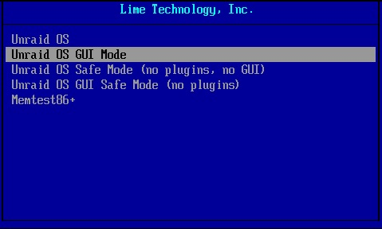

# Boot Issues

## Preparing the flash device

This is covered under the [Getting Started](../getting-started/getting-started.md) section of the documentation.

If for any reason you decide that you need to redo the flash device then it is a good idea to make sure you first backup the current flash device (or have a recent backup) as all user specific settings (including the license key) are held in the **config** folder on the flash device. Copying the **config** folder (and all its contents) back to the flash
drive after redoing it will preserve all current settings.

## Enabling UEFI boot

When you create the Unraid boot device, you are asked if you want UEFI mode boot support. However, it is always possible to enable UEFI mode booting at a later time, by renaming the folder on the flash device called `efi\~` to `efi` (i.e. removing the trailing `\~` character).

## Boot Process

Most of the time the Unraid boot process runs seamlessly and the user needs no awareness of the various stages involved. However, when things go wrong it can be useful to know how far the boot process managed to get as this will be of use in knowing what remedial action to take.

Resolving boot issues will typically need either a locally attached monitor and keyboard or, if the motherboard supports it, an IPMI connection to carry out equivalent functionality. This can then be used to set any required BIOS stings and to monitor the booting process.

The boot sequence for Unraid proceeds through a number of stages:

1. **BIOS boot**: This is the stage at which the motherboard BIOS recognizes the presence of the Unraid bootable flash device.
   * The way that the Unraid flash device is set as the default boot device is BIOS dependent so you may need to consult your motherboard's User Manual to determine the correct way to do this.
   * The Unraid flash device supports booting in Legacy mode (also sometimes known as CSM mode) for older BiOS's and UEFI for more recent ones. Many recent BIOS's support both modes.
   * If you want UEFI boot mode to be used then the EFI folder on the flash device must not have trailing tilde (\~) character.
2. **Syslinux loader**  
   
   * The entries that appear on the boot menu are specified by the `syslinux/syslinux.cfg` file on the flash device. Although in theory this file can be edited manually as it a text file it is recommended that it is done via the WebGUI by selecting the flash device on the **Main** tab and going to the **Syslinux configuration** section.
   * The Memtest86+ option only works if booting in Legacy mode. If booting in UEFI mode it will typically simply cause a reboot. If you want a version that will work in UEFI boot mode then you need to download it for yourself from either [www.memtest.org](https://www.memtest.org/) or [www.memtest86.com](https://www.memtest86.com/).
   * If the user does not select a specific option then after a timeout period the default option will be used. If Unraid is running in headless mode this is the option that will be run.
3. **Linux core**: This is the stage at which the Syslinux boot loader takes over from the BIOS and starts loading the files specified in the `syslinux.cfg` file.
   * This is when the core Linux system is loaded from the flash device and unpacked into RAM.
   * There will be messages on the console about the various bz\* types being loaded into RAM.
   * If there are any error messages displayed while loading these files then it normally indicates a problem with the flash device.
   * There will then be messages displayed as Linux starts up and detects the hardware environment.
4. **Flash dependent services**: At this stage, the flash device is mounted at `/boot` so that the process can continue.
   * If the mount of the flash fails it is still possible to get the login prompt displayed. However, this does not necessarily mean the whole boot process completed correctly.
   * If this stage of the boot process has not completed then typical symptoms are that the WebGUI and network are not started.
   * One way to see if this has happened is to login and use the `df` command. If the flash device was mounted successfully then you will see it as `/boot` in the resulting list of mount points.
     * The output should have something like following mount points:
     * `/dev/sdb1 15413232 826976 14586256 6% /boot`\
       `/dev/loop0 9344 9344 0 100% /lib/modules`\
       `/dev/loop1 7424 7424 0 100% /lib/firmware`
   * One reason the flash device may fail to mount is that it is not labelled as **UNRAID** (all capitals).
   * Additional drivers and firmware are now available on the above mount points.
   * Configuration information is read into RAM from the flash device.
   * Standard Linux services are started. Examples would be networking and (if enabled) WireGuard VPN.
5. **Plugins**
   * If the user has installed plugins then they are normally loaded at this stage.
   * If one of the Safe Boot options was selected from the Unraid Boot menu then the loading of plugins is suppressed.
6. **WebGUI**
   * The Unraid WebGUI is started.
   * The WebGUI is actually done via an entry in the `config/go` file on the flash device so it is possible for user-supplied commands to also be run from there either before starting the WebGUI or just after doing so.
7. **Array**
   If the user has set the array to be auto-mounted then the following will start. If array auto-start is not set then they happen when the user elects to start the array.
   * **Drives mounted**  
   Mount points will now be created in the form `/dev/diskX` and `/mnt/cache` (if you have a cache).
   * **File Share Services**  
   Shares will now become available on the network. At the Linux level the shares will now appear as paths like `/mnt/user/sharename`.
   * **Docker Containers**  
   If the user has enabled the docker services then the Docker containers will be started using the order on the Docker tab. The order of the containers and delays between starting the containers can be set on the Docker tab.
   * **VMs**  
   Any VMs the user has set to auto-start will now be started.

By this stage, the Unraid server will be fully operational.

## Boot failure

The following are some actions that can be taken to try and identify the cause of a boot failure:

1. If possible use a USB 2.0 port in preference to a USB 3.0 one as they seem to be more reliable for booting purposes. In addition USB 2.0 drives also seem less prone to failure than USB 3.0 ones. Many modern motherboards no longer have USB 2.0 ports directly exposed but there is normally a USB 2.0 header on the motherboard that can be used via an appropriate adapter.
   * USB 3.0 **does** work with no problems for many people
   * After initial load Unraid runs from RAM so gains no significant performance advantage from using USB 3.0.
   * USB 2.0 drives tend to run cooler than USB 3.0 ones which probably explains why they tend to last longer.
   * USB 2.0 drives are typically cheaper than USB 3.0 ones- so why pay more if not needed
2. Check that the BIOS on the Unraid server still has the flash device set as the boot device. It has been known to get reset for no obvious reason.
3. On a windows 10 PC or a Mac run a check on the flash device.
   * This will determine if something is wrong physically or logically with the flash device.
   * If you do not already have one make sure you have a copy of the config folder of the flash device as this contains all your current configuration information.
4. Download the zip version of the release from Limetech and extract all the bz\* type files over-writing those on the flash device.
   * This will determine if these files were not written correctly for some reason or are corrupt.
5. Rewrite the flash device with a clean copy of Unraid and copy across just the key file from your backup to the config folder
   * This can determine if the flash device itself is OK
   * Copy across the remaining contents of the config folder to the flash device
     * If this goes well you are back up and running with your previous configuration intact.
     * If this fails then try booting in Safe Mode. If this works then a plugin is causing problems
6. If the original flash device cannot be made to boot try a brand new flash device and clean copy of Unraid (with the default configurations).
   * This can determine if something is wrong with the server's hardware (motherboard, CPU, RAM, USB port, etc.)
7. Install a clean/new copy of Unraid on a new flash device and then copy the `config` folder over from the old one.
   * If this works then the license will need to be transferred to this new flash device.

## Lost root Passwords

See [Resetting your Unraid password](../manual/users/reset-password.md).

## Lost boot drive and do not know which are the parity drives

Occasionally users get the scenario where they have the following combination of circumstances:

* Unraid boot drive has failed.
* There is no recent backup of the boot drive that can be used to restore the drive configuration.
* There is uncertainty about which drives are the parity drives.

The issue is how to get the Unraid system operational again on a new boot drive without data loss. You can exploit the fact that Unraid will recognise any data disk previously used by Unraid as containing a valid file system compatible with Unraid, and that the parity drives do not contain a valid file system.

The basic approach is:

* Create a new Unraid boot drive.
* Boot the Unraid server off this new drive. At this point no drives will be assigned.
* Get the new drive licensed. This can be using either a trial license or by following the procedure for transferring an existing license
  to a new boot drive.
* Identify which drives are the parity drives. There are 2 ways to do this as shown below.
* Use ***Tools > New Config*** to reset the array. It is normally easiest to use the option to retain previous assignments but this is not mandatory.
* Return to the main tab and now that you know which are the array disks and which are the parity disk(s) correct the assignments to reflect this. You can (optionally) re-order the data drives at this point but be aware this will always invalidate parity2
* Start the array to commit the drive assignments. If you have used an approach that has not invalidated parity you can now tick the "Parity is Already Valid" checkbox to avoid rebuilding parity. If in doubt do **not** tick this checkbox.
* Make any corrections that assume a specific array drive order. For instance If you had any includes/excludes set for a User Share you may want to check them against the current  assignments and correct if needed.
* If you did not rebuild parity you may well want to run a parity check at this point to ensure that parity really was valid. If you used method 2) below to identify the parity drives then there **will** be at least a small number of parity errors so you should run a correcting check as soon as possible.

### Identifying the parity Drives

There are two slightly different approaches that can be used to identify the parity drives. If you get unexpected results then you should ask for help in the forums before proceeding.

#### Using the Unassigned Devices plugin

This approach uses a 3rd party plugin. It has the advantage that it will not automatically invalidate parity drives. The process is:

1. Install the **Unassigned Devices** plugin via the **Apps** tab if you have not already done so.
2. Mount all the disks read-only in turn. You need to use the Read-only mode to avoid any changes to the drive that will invalidate parity.
3. Any disk that will not mount should be a parity drive (although you cannot tell if it is parity1 or parity2 if you have dual parity).
4. While the drive is mounted you might want to look quickly at the contents if the order of the data drives matters to you to see if you can identify the order for the data drives

#### Using Unraid's built-in capability

This approach does not need to use a 3rd party plugin and will invalidate parity so that it need so be rebuilt.

The process is:

1. Assign **ALL** data drives to the array and start the array. Unraid will recognize any drives that have previously been used by Unraid and leave their contents intact
2. At this point any parity drives will show as **unmountable** since the parity drives contain no file system. You should have the same number of unmountable drives as you had parity drives and as long as this is the case make a note of their serial numbers. If this is not the case ask for help in the Unraid forums on the best way to proceed.
3. While the drives are mounted you might want to look quickly at the contents if the order of the data drives matters to you to see if you can identify the order for the data drives.

## Backing Up Boot Drive

Since the Unraid boot drive contains all user specific settings in the 'config' folder You should ideally always make a backup of the Unraid boot drive any time you make any significant configuration changes.

There are various ways of achieving this:

* From the Unraid WebGUI via ***Main > Boot > Device > Flash > Flash Backup***. This will create a zip file that you then download.
* By Installing [Unraid Connect](/connect/about.md), which provides for automated backups to cloud servers managed by Limetech.
* By plugging the flash device into a PC/Mac and copying the full contents to a local folder on the PC/Mac.

## Manually Upgrading (or Downgrading) an Unraid release

Follow the same process as laid out in the section below for handling bzimage checksum errors.

## Bzimage checksum error/failure reading flash device

Sometimes when booting you get a message displayed on a locally attached monitor indicating that something has gone wrong when trying to load the Unraid OS files into RAM from the flash device. There are two typical manifestations of this:

* An explicit message stating that a read error has occurred.
* A message stating that there is a checksum failure on a bz\* type file (most commonly bzimage). This most commonly happens after updating the Unraid OS (which is one time a lot of data is written to the flash device in one go), although it can happen at any time.

:::note

This procedure can also be used to upgrade or downgrade an Unraid release

:::

The normal recovery action is:

* Plug the flash device into a PC/Mac and make sure it is able to read the flash device (and let it repair any corruption it finds). If the flash device cannot be read then this indicates the flash device had probably failed and you need to follow the procedure for transferring your settings to a new flash device.
* (optional) Make a backup of the flash device. Although not strictly necessary at this point it is always a good idea to have an up-to-date backup of the flash device. All your settings are in the **config** folder on the flash device and this procedure leaves that unchanged.
* Download the zip file for the release. The last few Stable releases will have the download link on the Download page on the Unraid website. Every forum page will have a Download link at the top right to take you to that page. For beta/rc test releases you can normally get the link by asking in the ***Bug reports > Preleases*** section of the Unraid forums.
* Extract all the bz\* type files from the zip file and overwrite the corresponding files on the flash device.
* Extract the `changes.txt` file and overwrite the one on the flash to ensure you have one that corresponds to the bz\* type files you have just placed on the flash device. The system will work if you do not copy this file but it is good practice to keep it in sync with the release that is currently active.
* Tidily eject the flash device from the PC/Mac.
* Boot the Unraid server of the freshly written flash device.

If the above does not help then it is advisable to post in the Unraid forums stating what you have tried and what are your current symptoms.
