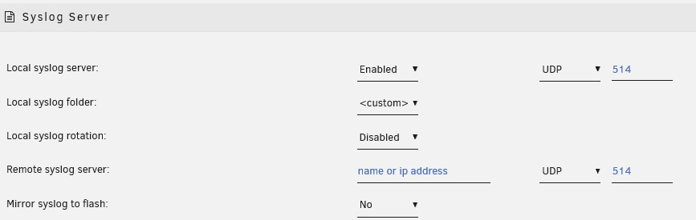

# Capturing Diagnostic Information

When you encounter any sort of problem it is always recommended that you attempt to capture as much information as possible to help with pinpointing the cause. If you want to ask questions in the forum such information will typically be requested as it will speed up the process of getting meaningful and accurate feedback.

## System Diagnostics

Unraid has a GUI option under **_Tools-\>Diagnostics_** to capture a lot of information about the state of your system that can be helpful when trying to diagnose any issues. Using this tool will result in a zip file being produced that can be downloaded and then attached to forum posts.

If the GUI cannot be accessed, then use SSH, telnet, or a keyboard/monitor attached to the server to login and type `diagnostics`.  This will save the diagnostics.zip file to the "logs" folder on your flash drive.

The Diagnostics should if at all possible cover the period when the problem occurred and be captured BEFORE you reboot (logs are reset on a reboot) so that the logs show what happened leading up to the problem occurring. The zip file produced can then be attached to a forum post when asking for help on a problem in the Unraid forums. It is preferred that you attach them to a new post if you have already started a thread on your issue so that other forum users are notified that there has been something added to the thread.

These system diagnostics include configuration information, state information, and key system logs. When creating the diagnostics from the GUI then details of the sort of information that will be included are listed. There is an option (set by default) to say that the diagnostics should be anonymized to try and avoid including any information that might be deemed sensitive.

:::note

All the files in the diagnostics are text files so a user is free to examine them to check for themselves exactly what information is present.

:::

In most cases it is preferable that the diagnostics are captured after the array has been started in Normal mode as this gives the maximum information about the state of your Unraid system, in particular if any drives are having any problems. There will be times, however, when this is not possible, or you will be advised to capture the diagnostics in a different state as a result of feedback in a forum thread. It is still better to have some level of diagnostics rather than nothing.

:::important

The diagnostics are a single zip file containing multiple files. If it seems to you that the diagnostics is a lot of files and folders, it is because your computer automatically opens zip files. Do not upload all those files individually to a forum post but instead find that single diagnostics zip file in your downloads and attach that single diagnostics zip file to your NEXT post in the relevant forum thread.

:::

### Anonymization of diagnostic data

It has been pointed out that the diagnostics are not completely anonymized if you have enabled _mover_ logging under _Settings-\>Mover Settings_ as the _syslog_ will give details of files that mover is operating on. This is a bit of a catch-22 scenario as when one has enabled mover logging it is normally to investigate a problem where as much detail as possible is captured so attempting to anonymize such information may well be counter-productive. Since mover logging is disabled by default and  recommended practice is to only have it enabled when investigating why mover is not giving the expected results this is probably acceptable.

## Persistent Logs (Syslog server)

The main system log is the **_syslog_** file and it is the contents of this file that is displayed when you click the  icon at the top right of the Unraid GUI. Note that when posting to the forums
extracted fragments of the syslog are rarely helpful as they do not show
what lead up to a problem occurring.

Normally the logs are only written to RAM so do not survive the system being rebooted. If you are investigating a system crash then as long as you are running Unraid 6.7.2 or later there is built-in syslog server support.

1. Go to _Settings-\>Network Services-\>Syslog Server_
2. You can click on the 'Help' icon on the Toolbar and get more information for all of the options.

* **Mirror to Flash**
This is the simplest to set up. You select 'Yes' from the dropdown box and click on the 'Apply' button and the syslog will be mirrored to the logs folder/directory of the flash drive and is appended to on a reboot. There is one principal disadvantage to this method. If the condition, that you are trying to troubleshoot, takes days to weeks to occur, it can do a lot of writes to the flash drive. Some folks are hesitant to use the flash drive in this manner as it may shorten the life of the flash drive.

The advantage of this approach is that it captures everything from the start of the boot process which can be important if trying to diagnose boot problems.

* **Remote Syslog Server**
This is used when you have another machine on your network that is acting as a syslog server. This can be another Unraid server. You can also use virtually any other computer. You find the necessary software by googling for the syslog server of that computer's operating system. After you have set up the computer/server, you fill in the computer/server name or the IP address. (I prefer to use the IP address as there is never any confusion about what it is.) Then click on the 'Apply' button and your syslog will be mirrored to the other computer.

The other computer has to be left on continuously until the problem occurs.
The events captured will only start with the point at which the syslog daemon is started during the boot process thus missing the very start of the boot process.

* **Local Syslog Server**
* Set this to **Enabled** to setup this Unraid server to act as a network syslog server. When this is enabled then some extra options are offered. The built-in Help gives guidance /n suitable settings.
* **Local syslog folder**: This will be a share on your server but chose it with care. Ideally, it will be a 'cache only' or a 'cache preferred' share. This will minimize the spinning up of disks due to the continuous writing of new lines to the syslog. A cache SSD drive would be the ideal choice here using a 'cache preferred' share. The syslog will be in the root of that folder/share.
* **Local syslog rotation**: These settings allow you to control how much space the syslog is allowed to use.
  * **Local syslog maximum file size**
  * **Local syslog number of files**

* If you click the 'Apply button at this point, you will have this server setup to serve as a Remote Syslog Server. It can now capture syslogs from several computers if the need should arise.

### **Logging to file local to Unraid server** Using a bit of trickery
  we can use the Unraid server with the problem as the Local syslog
  server. This is appropriate if you want to continue to keep a
  permanent copy of the syslog but the file will not be as easy to
  access if the Unraid system is crashing. It also has the advantage
  of avoiding lots of writes to the flash drive. To achieve this you
  now add the IP address of this server as the Remote syslog server
  (Remember the mention of trickery). So basically, you send data
  out-of-the-server and it comes-right-back-in.

:::note

The standard system diagnostics include the RAM copy of the `syslog` so there is no need to provide this separately. You will need to do so to provide the logs captured by the syslog server as these are not included in the standard system diagnostics.

:::

## Docker Containers and Virtual Machines

The standard system diagnostics do not contain much that will help with diagnosing issues with docker containers and VMs. These may have their own system logging feature and you must refer to their own documentation for information on how to access them.