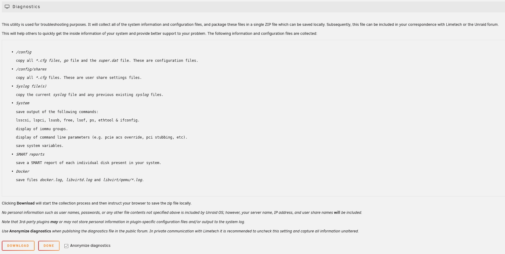

# Capturing diagnostic information

When you encounter any sort of problem it is always recommended that you attempt to capture as much information as possible to help with pinpointing the cause. If you want to ask questions in the forum such information will typically be requested as it will speed up the process of getting meaningful and accurate feedback.

## System diagnostics

Unraid has a GUI option under ***Tools > Diagnostics*** to capture detailed information about the state of your system. This can be helpful when trying to diagnose any issues. Using this tool will result in a zip file being produced that can be downloaded and then attached to forum posts.

If the WebGUI becomes unresponsive, then use SSH, telnet, or a keyboard/monitor attached to the server to login and type `diagnostics`.  This will save the `diagnostics.zip` file to the `/boot/logs` folder on your flash drive.

The Diagnostics should, if possible, cover the period when the problem occurred and be captured BEFORE you reboot (logs are reset on a reboot) so that the logs show what happened leading up to the problem occurring. You can then attach the diagnostics zip file to a forum post when asking for help on a problem in the Unraid forums. It is preferred that you attach them to a new post if you have already started a thread on your issue so that other forum users are notified that there has been something added to the thread.

These system diagnostics include configuration information, state information, and key system logs. When creating the diagnostics from the GUI then details of the sort of information that will be included are listed. There is an option (set by default) to say that the diagnostics should be anonymized to try and avoid including any information that might be deemed sensitive.

:::note

All the files in the diagnostics are text files so a user is free to examine them to check for themselves exactly what information is present.

:::

In most cases it is preferable that the diagnostics are captured after the array has been started in Normal mode as this gives the maximum information about the state of your Unraid system, in particular if any drives are having any problems. There will be times, however, when this is not possible, or you will be advised to capture the diagnostics in a different state as a result of feedback in a forum thread. It is still better to have some level of diagnostics rather than nothing.

:::important

The diagnostics are a single zip file containing multiple files. If it seems to you that the diagnostics is a lot of files and folders, it is because your computer automatically opens zip files. Do not upload all those files individually to a forum post but instead find that single diagnostics zip file in your downloads and attach that single diagnostics zip file to your NEXT post in the relevant forum thread.

:::

### Anonymization of diagnostic data

While diagnostic data is anonymized, if you enable mover logging under ***Settings > Scheduler > Mover Settings***, the syslog will give details of files that mover is operating on.

In this particular scenario, you have intentionally enabled mover logging to investigate a problem where it is beneficial to gather as much detail as possible, in order to resolve an issue.

However, since mover logging is disabled by default, and the recommended practice is to only enable it when investigating why it is not giving the expected results, this is understood to be the exception and not the rule to normal Unraid privacy practice.

## Persistent logs (Syslog server)

If you are investigating a system crash you can use the built-in syslog server support.

Logs are only written to RAM and are wiped when the system is rebooted. The main system log is the syslog file. The contents of this file display when you select the log  icon at the top-right of the navigation bar.

:::important

When posting to the Unraid forums, avoid posting fragments of the syslog, as these do not provide the full picture of what led up to a problem.

:::

### Enabling the syslog server

To configure and enable the Syslog server go to ***Settings > Syslog Server*** and set the **Local syslog server** to *enabled*.

:::tip

Use the Help icon on the system toolbar to get comprehensive guidance on all the options.

:::

You can configure the Syslog server operations in different ways:

* **Mirror to flash**. Select *Yes* from the dropdown to mirror the syslog file to the `/boot/logs` folder of the flash device. There is one main disadvantage to this method: If the condition you are trying to troubleshoot takes days to weeks to occur, it can cause a lot of writes to the flash device and may shorten its lifespan.

The advantage of this approach is that it captures everything from the start of the boot process which can be important if trying to diagnose boot problems.

* **Remote syslog server**  
This is used when you have another machine on your network that is acting as a syslog server. This can be another Unraid server. You can also use virtually any other computer. You find the necessary software by googling for the syslog server of that computer's operating system. After you have set up the computer/server, you fill in the computer/server name or the IP address. (I prefer to use the IP address as there is never any confusion about what it is.) Then click on the 'Apply' button and your syslog will be mirrored to the other computer.

The other computer has to be left on continuously until the problem occurs.
The events captured will only start with the point at which the syslog daemon is started during the boot process thus missing the very start of the boot process.

If you select **Apply** at this point, you will have this server setup to serve as a Remote Syslog Server. It can now capture syslogs from several computers if the need should arise.

* **Local Syslog Server**
   * Set this to **Enabled** to setup this Unraid server to act as a network syslog server. When this is enabled then some extra options are offered. The built-in Help gives guidance /n suitable settings.
   * **Local syslog folder**: This will be a share on your server but chose it with care. Ideally, it will be a 'cache only' or a 'cache preferred' share. This will minimize the spinning up of disks due to the continuous writing of new lines to the syslog. A cache SSD drive would be the ideal choice here using a 'cache preferred' share. The syslog will be in the root of that folder/share.
   * **Local syslog rotation**: These settings allow you to control how much space the syslog is allowed to use.
     * **Local syslog maximum file size**
     * **Local syslog number of files**

Select **Apply** to complete the server setup.

### Logging to file local to Unraid server Using a bit of trickery
we can use the Unraid server with the problem as the Local syslog server. This is appropriate if you want to continue to keep a permanent copy of the syslog but the file will not be as easy to access if the Unraid system is crashing. It also has the advantage of avoiding lots of writes to the flash drive. To achieve this you now add the IP address of this server as the Remote syslog server (Remember the mention of trickery). So basically, you send data out-of-the-server and it comes-right-back-in.

:::note

The standard system diagnostics include the RAM copy of the `syslog` so there is no need to provide this separately. You will need to do so to provide the logs captured by the syslog server as these are not included in the standard system diagnostics.

:::

## Docker containers and virtual machines

The standard system diagnostics do not contain much that will help with diagnosing issues with docker containers and VMs. These may have their own system logging feature and you must refer to their own documentation for information on how to access them.
