:::info[Last validated]

Last validated: September 2026 against Unraid OS 7.3.3, Crafty 4.11.0 and Minecraft Java Edition 26.3.

:::

This guide walks you through setting up a Minecraft Java server on Unraid, with Crafty handling the controls and backups. You'll then connect it through Tailscale so friends can join from outside the house.

There's [a video covering this on the Uncast channel](https://youtu.be/YFiJ3DsiF68). This guide is the written companion to that video, with the commands you can copy as you go.

## Install Crafty

You'll need a copy of Minecraft Java Edition on the computer you're playing from. Java runs on Windows, Mac and Linux. A console running Bedrock won't connect to this setup as it stands.

Search for Crafty in [Community Apps](/community-applications/) and install [binhex-crafty-4](https://ca.unraid.net/apps/binhex-crafty-4-1ju7q7m16i015a). There's also an official Crafty container. This guide uses Binhex's version.

For a first server, leave the template's default [Bridge networking](/unraid-os/using-unraid-to/run-docker-containers/managing-and-customizing-containers/) and ports as they are, unless another container already uses those ports. Click **Apply** to install it. Crafty's HTTPS web interface normally uses port 8443. Minecraft Java uses 25565. They're different services.

Once it's installed, open **WebUI** from the container's icon on the **Docker** tab. You might get a browser certificate warning. That's expected with Crafty's own certificate, but check you're opening your own server's address before choosing **Advanced** and continuing.

## Find the password and change it

Open the [Unraid terminal](/unraid-os/system-administration/advanced-tools/command-line-interface/) and run this.

```bash
cat /mnt/user/appdata/binhex-crafty-4/crafty/app/config/default-creds.txt
```

It shows the initial username and generated password. The username is admin. If you've chosen another appdata location, change the path to match.

Log into Crafty, then open **Panel Settings**. In the admin user's row, click the padlock icon to change the password. Enter your new password twice and click **OK**. A strong, unique password is recommended here, even if you're only opening Crafty at home.

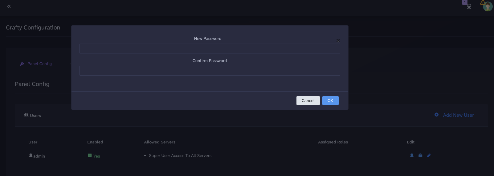

The credentials file is for the initial login. It won't tell you the new password after you've changed it.

## Create a Paper server

Open **Servers** and choose **Create New Server**. Crafty can manage several servers. This guide starts with one.

Choose **Minecraft-Java**.

Under **Server Type**, choose *Minecraft Servers*. Under **Server Select**, choose *Paper*.

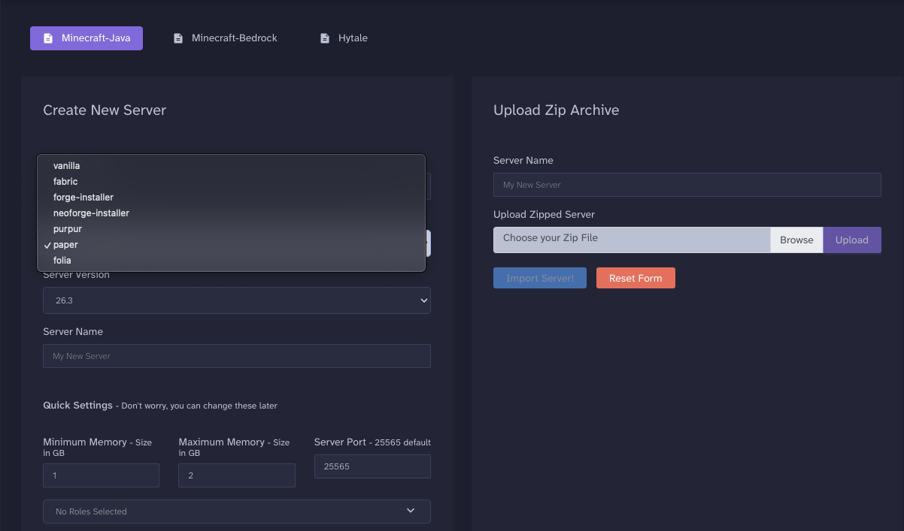

Paper runs a Java server with performance improvements and support for plugins. Players can still join using their ordinary Minecraft Java game. They don't need a special client for this setup.

Choose the same Minecraft version as the Java Edition client you will use to connect. Give the server a name and set the maximum memory. The video uses 4 GB. Leave enough RAM for Unraid and everything else you're running; a larger world or more players may need more.

Leave the game port at 25565 for your first server. If you run another server alongside it, give that one a different port and make sure the container's network settings allow connections to it.

Click **Build Server**. Once it appears under **Servers**, open it and click **Start** in the **Terminal** tab. Read and accept the Minecraft EULA if you agree, then wait for startup to finish.

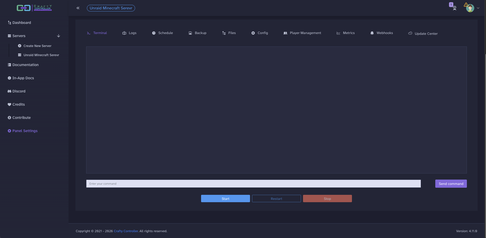

## Connect and add your player

Open Minecraft Java, choose **Multiplayer** and click **Add Server**. Give it a name you'll recognise.

With Binhex's default Bridge setup, enter your Unraid server's IP address in **Server Address**. Minecraft uses port 25565 automatically, so you don't need to type the port as well.

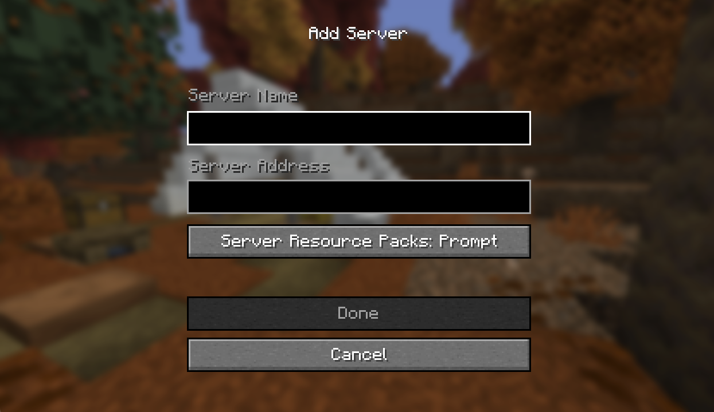

If you create another server using a different port, add its published port after the address. For example, a server using port 25566 would look like this.

```text
192.168.1.50:25566
```

Use your own address. Don't add HTTPS here, that's for the web interface.

If Minecraft says you aren't whitelisted, go back to the server's **Terminal** tab inside Crafty. Run this, replacing the example name with your Java player name.

```text
whitelist add YourMinecraftUsername
```

This goes into Crafty's **Terminal**, not the Unraid terminal. Try joining again. You don't need to restart the server.

Keeping the whitelist enabled lets you choose who can join a server shared with friends, even if someone else gets the connection address.

To remove a player from that list, use this.

```text
whitelist remove YourMinecraftUsername
```

The video also shows switching the whitelist off and back on. Turning it off lets any otherwise eligible player who can reach the server attempt to join.

```text
whitelist off
```

```text
whitelist on
```

## Automatic startup and player controls

Open the server's **Config** tab, scroll down and enable **Server Auto Start**. Save the change. This starts that Minecraft server when Crafty starts.

Enable [Autostart](/unraid-os/using-unraid-to/run-docker-containers/managing-and-customizing-containers/#advanced-container-startup) for the Crafty container on Unraid's **Docker** tab too, if you want it to come back when Docker starts. These are separate settings.

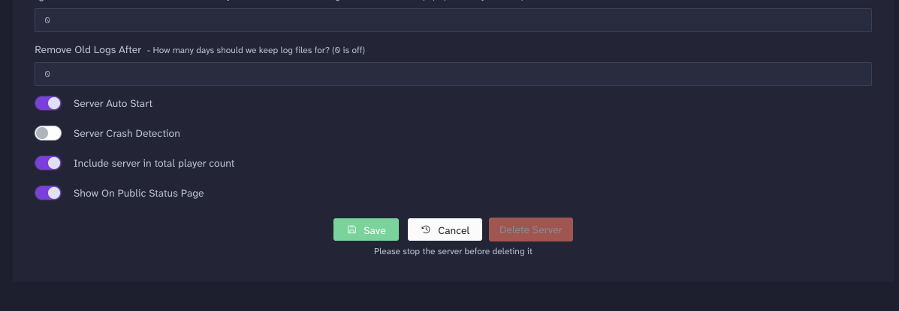

**Player Management** gives you **Kick**, **Ban**, **OP** and **De-OP** controls. **Kick** disconnects someone, but they can normally reconnect. **Ban** prevents them joining until you remove the ban.

**OP** means operator. It gives a player administrative commands, such as changing game modes or teleporting. It doesn't mean whitelisted, and ordinary players don't need it. **De-OP** removes those permissions.

## Back up the server

Open **Backup** and edit **Default Backup** using its pencil icon. Leave the storage location at its default unless you've deliberately set up somewhere else.

Seven is a suggested starting value for **Max Backups**. That keeps the seven most recent backups made under that policy and removes older ones. Zero means keep them all, so storage can keep growing.

Enable **Shutdown server for duration of backup**. Players will be disconnected while it runs. Crafty starts the Minecraft server again after the backup finishes. Your Unraid server stays running throughout. Crafty recommends this because files changing while they're being copied can produce an inconsistent backup. [Crafty's backup documentation](https://docs.craftycontrol.com/pages/user-guide/backup-manager/)

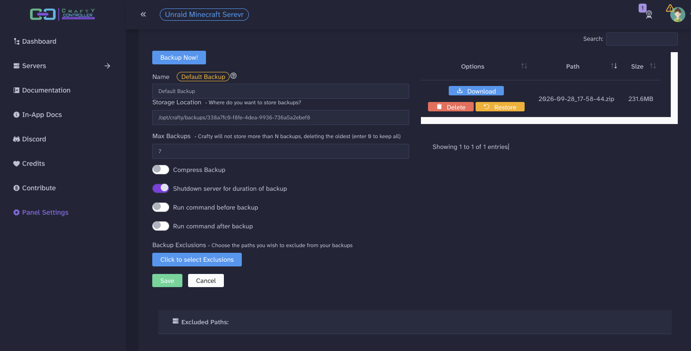

Save your settings, then click **Backup Now**. Wait for it to finish and check that a backup appears.

You can download a copy to your computer as well. This is recommended before changing worlds or making a major update, because a backup on the same storage as the original won't help if that storage fails.

Restoring a backup replaces the server files covered by it with that saved copy. Anything changed since the backup may be lost, so make sure you've chosen the right one.

## Schedule the backups

Open **Schedule** and click **Create New Schedule**. Give it a name such as Daily backup, choose *Basic* and select **Backup Server** as the action.

Choose the **Default Backup** policy you just edited. Set the interval to one day and choose a time when people aren't playing. Check the time zone Crafty shows before choosing the time.

Leave **Enabled** checked and **Delete after execution** unchecked, then save. That second option would remove the schedule after it runs.

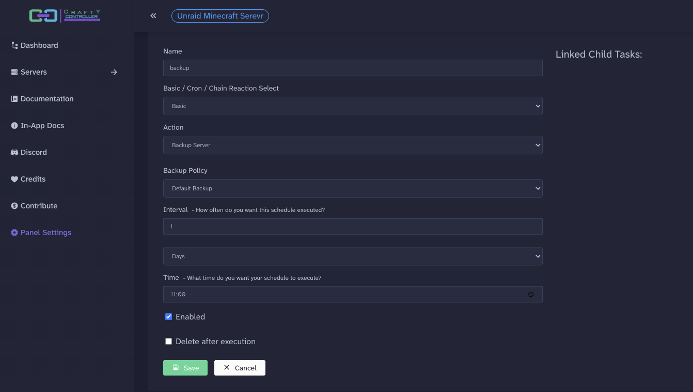

After saving, check that the schedule shows ON in the list.

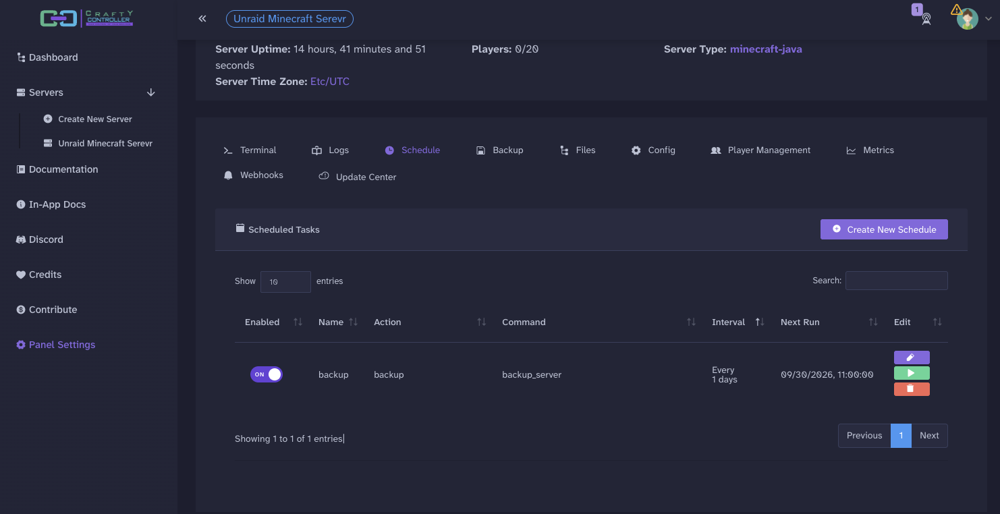

## Logs and updates

If the Minecraft server won't start, check **Logs** first. **Metrics** shows resource usage and player counts.

The dashboard's memory figure can include other things running on your Unraid server, so a high number there doesn't mean your Minecraft server is using all that RAM.

**Update Center** handles the Minecraft server software. Updating the Docker container updates Crafty separately, so don't assume a container update has also updated Paper.

Take a backup before updating the game server. Check any plugins support the version you're moving to and keep your Minecraft client compatible with the server.

## Optional: upload an existing world

You can keep playing in the world Minecraft generated, or upload another one through **Files**.

The video includes an optional [Unraid Harbour Adventure world](https://github.com/SpaceinvaderOne/youtube-video-downloads/tree/main/minecraft-with-crafty) to demonstrate importing a world. It's just a bit of fun, so expect rough edges. This demonstration world is shared as it is, with no planned maintenance or puzzle fixes.

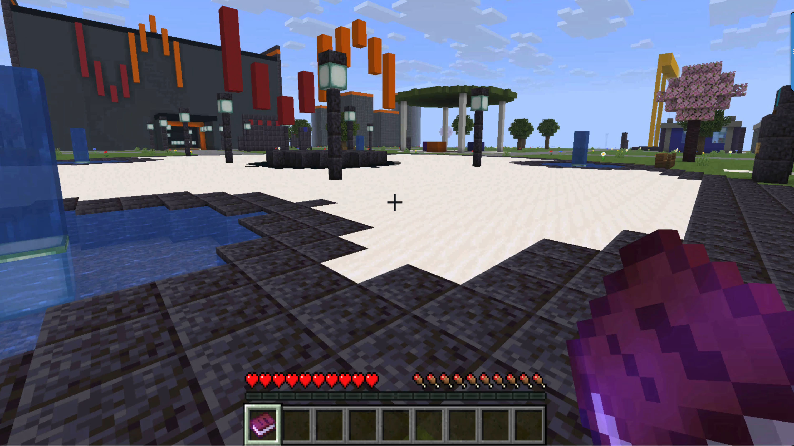

[Download the Harbour Adventure ZIP](https://github.com/SpaceinvaderOne/youtube-video-downloads/raw/refs/heads/main/minecraft-with-crafty/unraid-harbour-adventure.zip)

That particular world needs Minecraft Java Edition 26.3 and a matching server. The folder README includes its requirements and settings.

Back up your current world first, then follow these steps for the supplied ZIP.

1. Stop the Minecraft server inside Crafty and wait for it to finish.
2. Open **Files** and create a directory called `unraid-harbour-adventure`.
3. Open that directory and upload the ZIP inside it.
4. Use the ZIP's options menu and choose **Unzip**.
5. Check that `level.dat` is directly inside the new directory.
6. Return to the server's main folder and open `server.properties`.
7. Change the existing settings to the values below, save and start the Minecraft server.

```properties
level-name=unraid-harbour-adventure
gamemode=adventure
difficulty=peaceful
spawn-protection=0
```

Adventure mode lets players use buttons without breaking the scenery. Peaceful difficulty keeps hostile mobs out of the demonstration. Disabling spawn protection lets ordinary players use the puzzle buttons near spawn. These settings are for this optional demonstration world.

If you have already joined this server in another game mode, change your player to Adventure in Crafty's **Terminal**. Replace the example name with your Minecraft username.

```text
gamemode adventure YourMinecraftUsername
```

Crafty extracts this ZIP into the folder you're currently in. It doesn't add another enclosing world folder, which is why creating and opening the directory first matters.

This is a world import through **Files**. The **Upload Zip Archive** option under **Create New Server** is for importing a server archive, which is a different job.

Paper may pause to migrate world storage on the first start. Keep your backup and wait for startup to finish before joining. Your previous world folder can stay alongside the imported one; changing `level-name` selects which world loads.

## Let friends connect through Tailscale

This guide uses [Tailscale](/unraid-os/system-administration/secure-your-server/tailscale/) to let friends connect from outside your house. They'll need it on the computer they're playing from, along with their own account. You won't need router port forwarding for this route.

The video shows connecting through Unraid's Tailscale address first. That works when the Minecraft game port is reachable on the Unraid server. Giving Crafty its own Tailscale identity is recommended when sharing it with friends.

Check the container's **Network Type** before enabling this. Unraid's container Tailscale integration doesn't support Host networking. A dedicated LAN address on your custom network, such as `br0`, is an option; choose an unused address outside the router's automatic allocation range. Bridge networking is also supported, so a dedicated LAN IP isn't compulsory.

In Bridge mode with **Tailscale Userspace Networking** disabled, Unraid's documentation notes that the original **WebUI** address may no longer be available. You can access Crafty through Tailscale instead. A custom network such as `br0` supports both addresses.

1. Stop the Minecraft server inside Crafty.
2. Open Unraid's **Docker** tab and edit the Crafty container.
3. Enable **Use Tailscale** and enter a unique **Tailscale Hostname**, such as crafty.
4. Leave **Tailscale Userspace Networking** set to *Disabled*, as shown below.
5. Click **Apply**, then open the container log.
6. Follow the authentication link, sign in to your Tailscale account and click **Connect** to add the container to your tailnet.

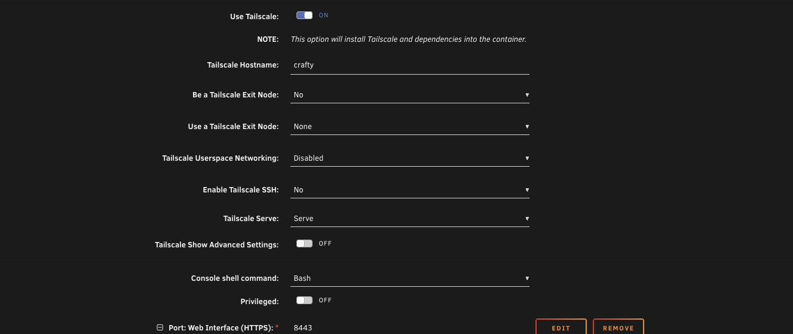

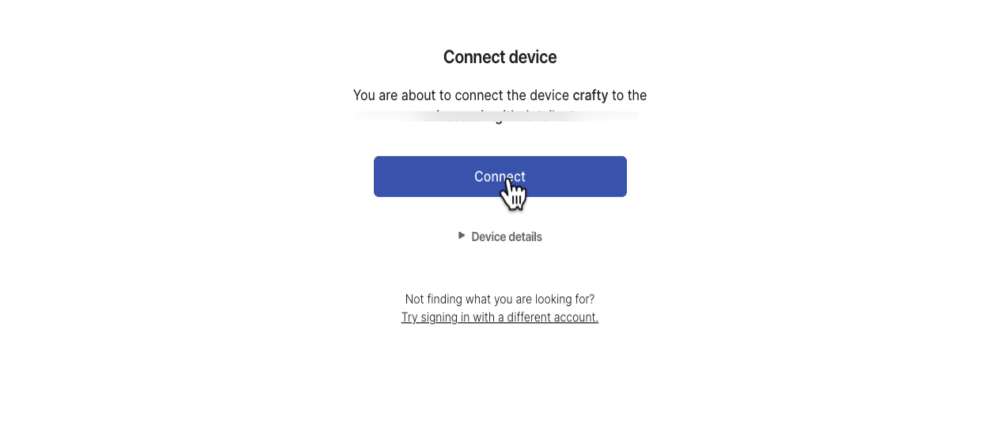

Once the container is connected, share it with your friend.

1. Open **Machines** in Tailscale's admin console and find the Crafty device.
2. Open its menu and choose **Share**. Send your friend the invitation by email or share link.
3. Ask your friend to accept the invitation and connect Tailscale on their computer.
4. Make sure the Minecraft server is running inside Crafty. **Start** it if necessary.
5. Your friend can then enter the container's Tailscale IP in Minecraft's **Add Server** screen. The default game port, 25565, does not need to be added. If you chose another port, append that game's port inside the container to the address.

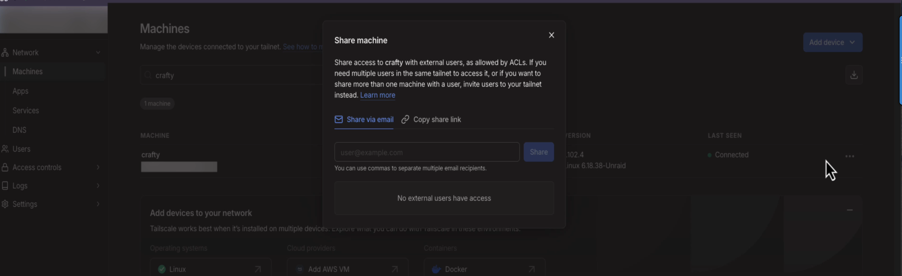

Serve is optional for opening Crafty's web interface through Tailscale. The Minecraft game connection goes directly to the Tailscale address and game port. It doesn't need Serve or Funnel.

Sharing the container doesn't automatically restrict friends to Minecraft. Crafty's web interface is in that same container, so use Tailscale access rules to allow friends only the game port if you want to keep the panel private. Keep the Minecraft whitelist enabled too. [Tailscale device sharing](https://tailscale.com/docs/features/sharing)

This covers Java players on computers. Bedrock players need additional setup, such as Geyser and Floodgate, and consoles need their own connection arrangements.

## Thanks to the people behind it

Thanks to [Binhex](https://forums.unraid.net/profile/11148-binhex) for making and maintaining the Crafty 4 container, and for helping resolve issues during preparation of the video.

And thanks to [the Crafty Controller team at Arcadia Technology](https://craftycontrol.com/) for building the application that makes all this possible. The container packages their work for Unraid, and this guide uses their server controls, file manager and backup tools throughout.

You've now got a Java server you can manage through Crafty, with scheduled backups and a way for friends to join remotely. You can carry on with the generated world or load one of your own.
