::::info[Last validated]

*Last validated: March 2026 against Unraid OS 7.2 and the containers available in Community Apps at that time.*

::::

This is the complete written guide covering everything you need to get Paperless NGX fully set up on Unraid. It's the written version of our recent video series on this. If you've already watched the videos, this will be a handy reference. If not, everything you need is here.

We'll start with the foundation, getting Paperless installed with a proper database backed system. Then we'll add office document support and email integration. Finally we'll bring in local AI for automatic tagging, classification, and vision OCR. By the end you'll have a fully AI powered document management system running entirely on your own hardware.

---

## Part 1 - The Foundation

In this section we're going to set up Paperless NGX with Postgres and Redis. By the time we're done, you'll have a fully working document archive that you can start using immediately. If your office looks anything like mine, a chaotic sea of receipts, bills and important letters that you'll probably never find again, then this is for you.

Think of Paperless as a digital brain for all your physical documents. You scan a document in, it reads the text, and suddenly your entire filing cabinet is searchable. That lost receipt you put somewhere thinking you'd remember where it is tomorrow. You'll actually be able to find it.

### Before we start

First thing we need to do is set up storage. Head to your [shares](/unraid-os/using-unraid-to/manage-storage/shares/) and create a new one called paperless. I don't bother with cache on this share. I'm quite happy for it to go straight to the array. You could enable cache if you want, there's no real reason not to, but I don't think it's necessary for this workflow. The benefit is that files are immediately protected by [parity](/unraid-os/using-unraid-to/manage-storage/array/overview/) the moment they land on the server, rather than sitting on the cache unprotected until the mover runs (unless you've got a mirrored [cache pool](/unraid-os/using-unraid-to/manage-storage/cache-pools/), but a lot of us don't). And the performance difference for dropping a few documents into a network share is basically unnoticeable anyway.

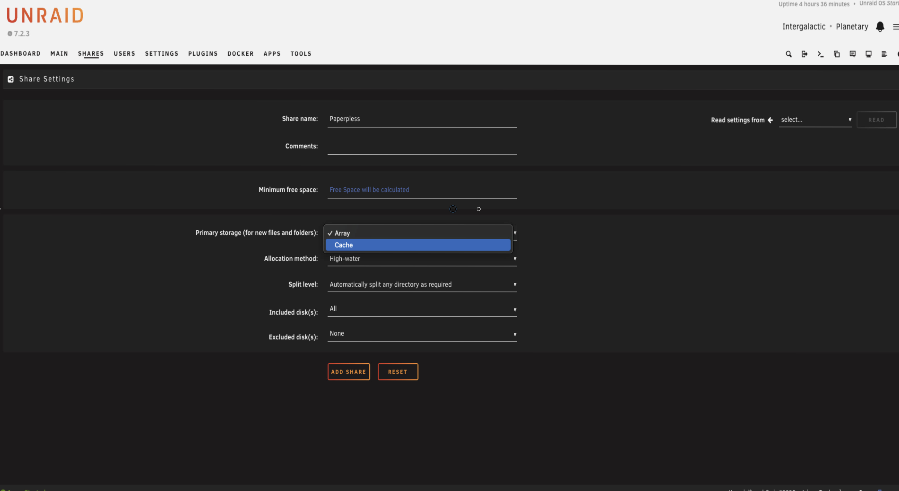

Once you've created it, scroll down to the SMB settings and export it as a share on your network. Set it to private and give yourself access for your laptop or workstation. If you've got a network scanner that's going to drop files into the consume folder, I'd recommend [creating a separate user](/unraid-os/system-administration/secure-your-server/user-management/) for it rather than using your own credentials.

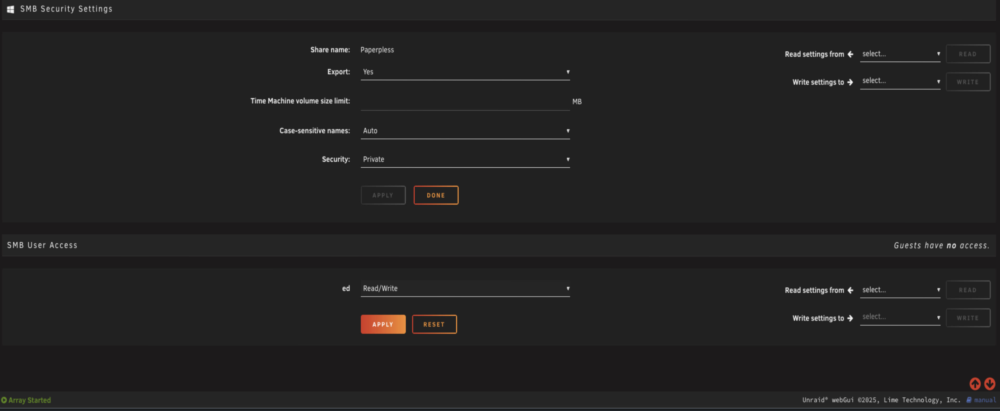

Now go into that share and create three folders. Consume, media, and export.

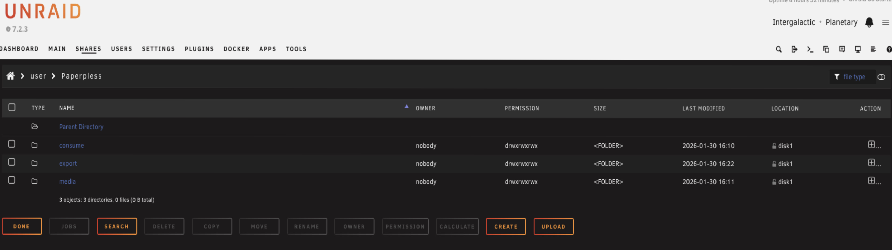

The consume folder is the clever bit. Because we've made this shareable on the network, you can map it directly on your desktop or even point your scanner straight to it. Instead of logging into Paperless every time you have a document, you just drag and drop a PDF from your computer or hit scan on the scanner and Paperless will automatically grab it and start processing it.

Quick tip. If you're a self hosted Nextcloud user, you can add the consume folder as external storage in Nextcloud. That means you can use the Nextcloud app on your phone to drop files directly into the consume folder on your Paperless server.

If you're running [Tailscale](/unraid-os/system-administration/secure-your-server/tailscale/) on your Unraid server, you can map the Samba share using your Tailscale IP. That means when you're travelling with your laptop, you can still drop files directly into the share as if you were at home.

### Security considerations for network scanners

If you're setting this up for home use, the folder structure above is fine. Your scanner user can have access to the paperless share and you're good to go.

But if you're setting this up in a small office or you're particularly security conscious, you can lock this down better. The problem with giving a scanner user access to the entire paperless share is that anyone who gets the login credentials out of the scanner (which is surprisingly easy on some models) can browse to the media folder where all your processed documents live.

Here's what I'd do instead. Create a completely separate share just for the consume folder.

Create a new share called paperless-consume. Set it to not use cache (same reasons as before). Export it as a share and give your scanner user access to only this share. Don't create any folders inside it, the share itself is the consume folder.

When we get to the Paperless installation later, you'll point the consumption path to this share instead of the consume folder inside the paperless share.

That way the scanner credentials can only access the consume folder, which is pretty safe anyway because Paperless moves files out of it straight away. But keeping it completely separate is the more secure way of doing it.

If you want to do this, create that paperless-consume share now before we move on to the installation steps.

### What you're actually installing

If you search for Paperless in [Community Apps](/unraid-os/using-unraid-to/run-docker-containers/community-applications/), you'll see quite a few different results. Here's what we're installing and why.

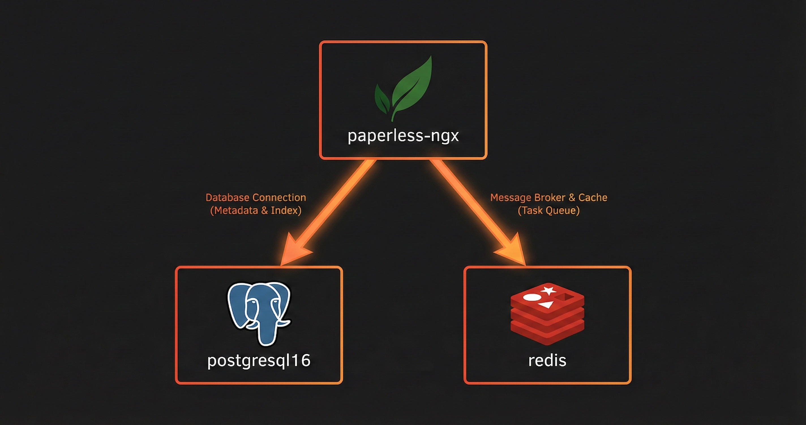

We need the Paperless NGX container itself, obviously. But for a proper setup we also need a dedicated database. We're using Postgres for that, along with a Redis container.

Paperless comes with a built in SQLite database, so you might be wondering why we're bothering with Postgres. The simple answer is performance and reliability. SQLite is fine when you're starting out with a handful of documents, but once you've got hundreds or thousands of documents being indexed and searched, Postgres handles it much better. It's also better at dealing with multiple things happening at the same time, like documents being uploaded while OCR is running while someone's doing a search. The Paperless team recommends Postgres for anything beyond basic testing, and since we're setting this up properly from the start, we're going with Postgres.

Redis is basically just a to do list for Paperless. When you do things like upload a document, Paperless doesn't stop everything to process it straight away. Instead, it puts it on the list so the background workers know there's work waiting. This is what allows Paperless to multitask. All the heavy work like reading documents, running OCR, applying tags, that happens in the background. It keeps the web interface fast and responsive so you can keep using it.

### Installing Postgres

We're going to install Postgres 16. It's the current version available in Community Apps and works well with Paperless.

Find the Postgres 16 container in Community Apps and install it.

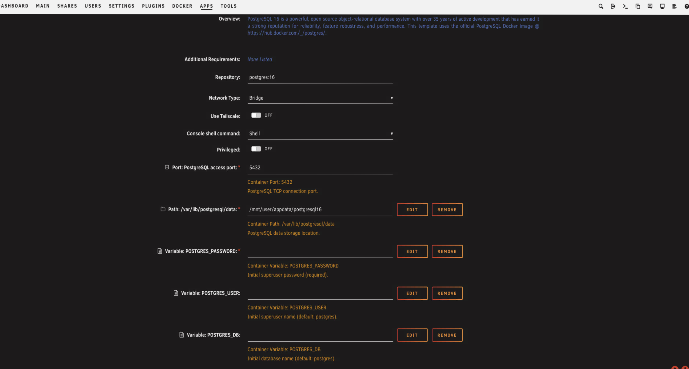

You'll need to fill in a few things.

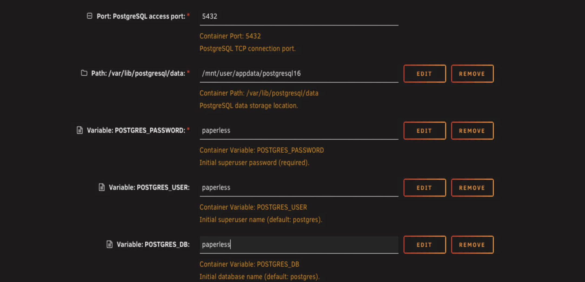

You can see in the screenshot I've used paperless for the username, password, and database name. Just for ease in this guide. But here's what you should actually do. The database name should be paperless, that just makes sense. The username can be paperless too, that's fine. But the password should be something stronger. Don't use paperless as your actual password.

Quick note. If you already have a Postgres container running for another app, you can create a new database inside that existing Postgres container. I personally prefer to install a separate Postgres container for each app though. That way they're completely isolated, and if I remove an app, I can remove its database container with it. If you want to run a second Postgres container, just change the port to something like 5433 when you install it to avoid conflicts.

Click **Apply** and let it pull down the container. Once it's running, set it to [auto start](/unraid-os/using-unraid-to/run-docker-containers/managing-and-customizing-containers/).

### Installing Redis

Back to the **Apps** tab. Search for Redis and install the Bitnami version in A75G's repository. This guide assumes you're securing Redis with a password rather than allowing empty passwords.

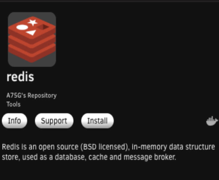

Once you've clicked install, you'll see the template.

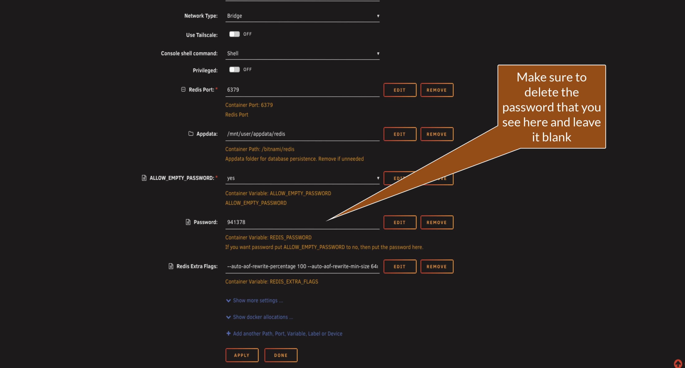

Set a strong Redis password in the template and ensure authentication is enabled. You'll use this password in the Paperless configuration later. Treat this like any other application password: store it securely and don't reuse it elsewhere.

The container won't start yet because we need to set permissions on the Redis folder. Open up the [Unraid terminal](/unraid-os/system-administration/advanced-tools/command-line-interface/) and run this command.

```bash
chown -R 1001:1001 /mnt/user/appdata/redis/
```

This sets the correct permissions for Redis to work. Hit enter. Now you should be able to start the Redis container. Set it to auto start as well.

### Installing Paperless NGX

Back to the **Apps** tab again. Search for Paperless and install the official version.

You'll notice it mentions it needs a Redis container. That's why we installed Redis and Postgres first. Paperless depends on them both, so we get them running before we set up Paperless itself.

First thing to do is map the paths we set up earlier.

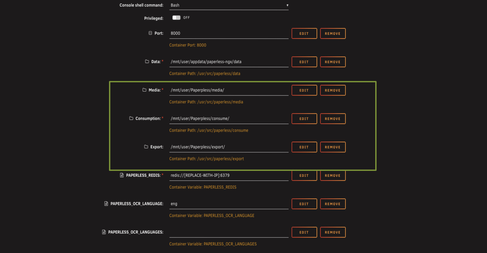

For the media folder, browse to the paperless share and select media. For the consumption folder, same thing, browse to paperless and select consume (or if you created a separate paperless-consume share for security, browse to that instead). For the export folder, paperless and export.

Now scroll down to the Redis URL.

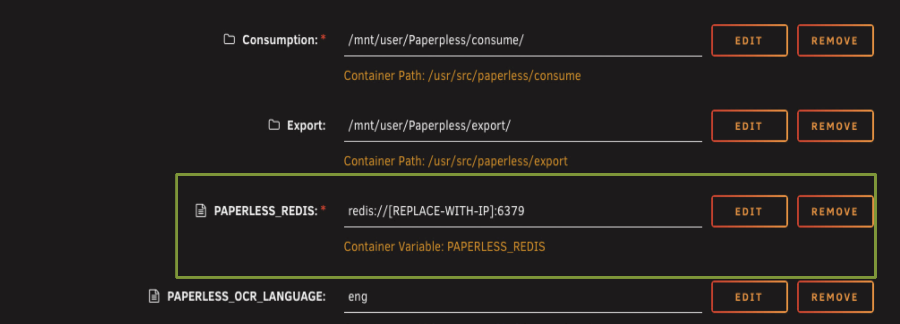

This is the IP address of where Redis is running, which is the same IP address as your Unraid server. If you're not sure what it is, go to [Settings, Network Settings](/unraid-os/getting-started/set-up-unraid/customize-unraid-settings/), and click the little info button on your network interface. You'll see your Unraid server's IP address there.

The format looks like this: `redis://:your-redis-password@192.168.1.50:6379`

That's `redis://` followed by `:your-redis-password@`, then your Unraid server's IP address, then `:6379` for the Redis port.

Quick note. Your Unraid server needs a [static IP address](/unraid-os/getting-started/set-up-unraid/customize-unraid-settings/) for this to work. You can set that in Unraid itself under Settings, Network Settings, or you can reserve the IP address in your router's DHCP settings. If the IP address changes, Paperless won't be able to find Redis and everything will break.

Keep scrolling down. Set the paperless OCR language to whatever language you need. I'll leave mine as English. Leave the file format as is. Set your time zone.

### Adding additional variables

Here's where it gets important. If we just click **Apply** now, we're only going to use the built in SQLite database. We want to use Postgres. So we need to add a few variables.

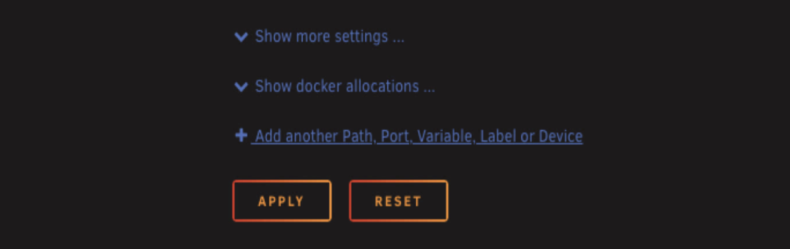

Click add another path, port, variable, label, or device. We're adding a variable.

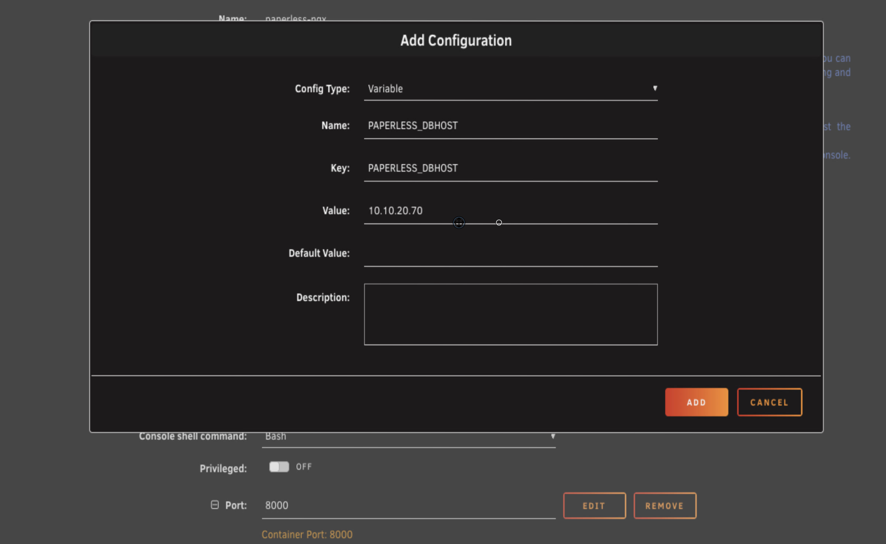

For the name, call it PAPERLESS_DBHOST. The key is the same. The value is the IP address of your Unraid server.

We need to add 8 variables in total. Here's what we need to add.

| Type | Key | Example Value | Description |
|------|-----|---------------|-------------|
| Variable | PAPERLESS_DBHOST | 192.168.1.50 | IP address of your Unraid server |
| Variable | PAPERLESS_DBPORT | 5432 | Postgres port (only change if you have another Postgres instance) |
| Variable | PAPERLESS_DBNAME | paperless | Database name you set in Postgres |
| Variable | PAPERLESS_DBUSER | paperless | Database user you set in Postgres |
| Variable | PAPERLESS_DBPASS | your-secure-password | Database password you set in Postgres |
| Variable | PAPERLESS_TIKA_ENABLED | 0 | Disable Tika for now (set to 1 later in this guide) |
| Variable | PAPERLESS_TIKA_GOTENBERG_ENDPOINT | http://192.168.1.50:3000 | Gotenberg endpoint (used later in this guide) |
| Variable | PAPERLESS_TIKA_ENDPOINT | http://192.168.1.50:9998 | Tika endpoint (used later in this guide) |

Make sure the database name, user, and password match exactly what you set when you installed the Postgres container earlier.

The PAPERLESS_DBPORT is 5432 by default. If you changed the port to something like 5433 when you installed Postgres (because you already had another Postgres container), put that port number here instead.

The last three variables are for Office document support using Gotenberg and Tika. That's covered in part two of this guide. The PAPERLESS_TIKA_ENABLED variable controls Office document support. Even though it's just called Tika in the variable name, it actually enables both Tika and Gotenberg working together. Setting it to 0 means Paperless won't use either of them. When we install both containers in part two, we'll change it to 1 to enable the whole Office document processing feature.

If you're planning to follow the rest of this guide, put these variables in now with your Unraid server's IP address. It'll save you coming back to edit the template later. If you're just setting up the basic Paperless system, you can skip these three entirely.

We're adding the variables now but not actually installing those containers yet. I like to test the basic setup first before adding more complexity.

Here's what the template should look like with all 8 variables added - the database variables and the Tika/Gotenberg ones.

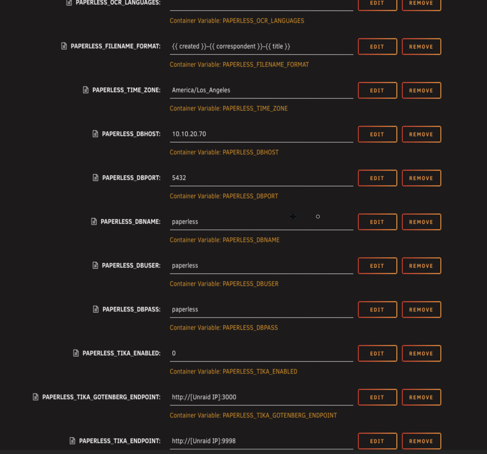

### Double check everything

Always best to just have a look through everything before clicking **Apply**.

You should have your three bind mounts for media, consume, and export. Your Redis container specified. Language and time zone set. Database host, port, database name, username, and password filled in. Paperless Tika disabled for now. The two endpoints for Gotenberg and Tika ready for part two if you're adding them.

Click **Apply** and let it pull down the container.

### Checking the logs

Once all three containers are running, set the Paperless container to auto start as well.

Now I always like to click on the logs just to check that everything looks fine. This is especially important with containers that have a lot of dependencies like this one.

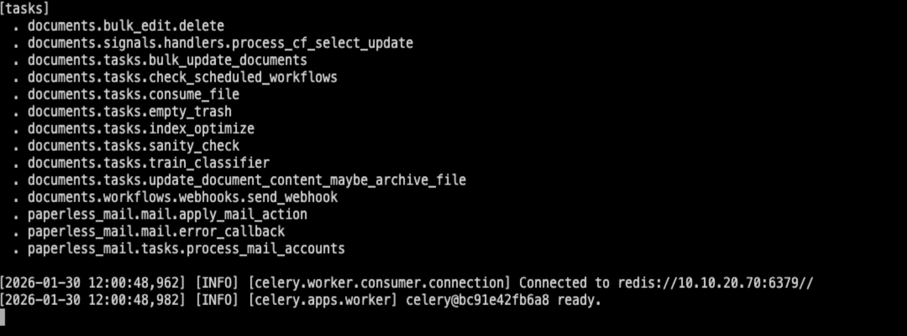

If everything is working properly, you'll see Paperless connecting to Redis and Postgres, and the worker processes starting up. If you see logs like this, everything's working.

If something is wrong, you'll see the error right here in the logs. The logs will tell you exactly what's going on. If everything looks good, you can close them and open up the Paperless web UI.

### Setting up your account

The first time you open Paperless, it'll give you the option to sign up.

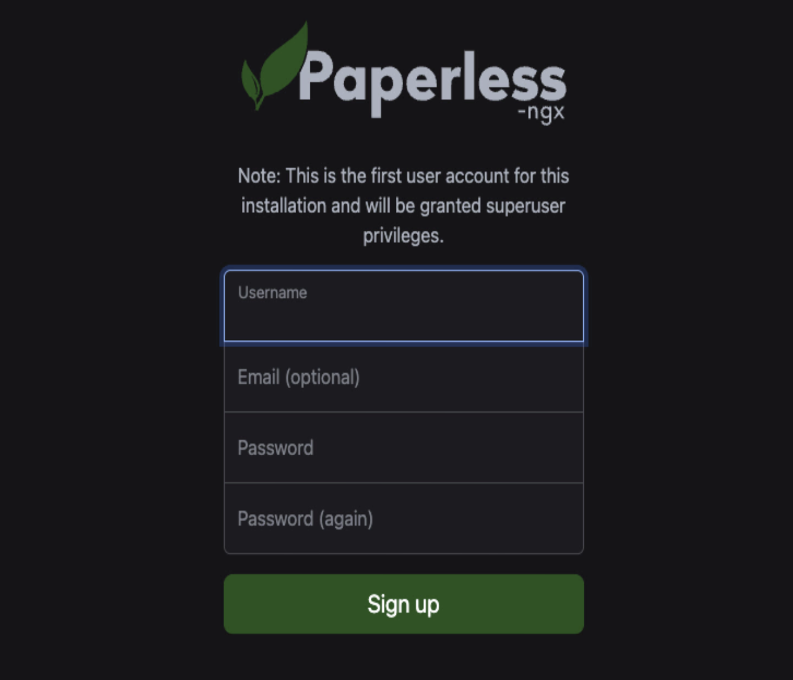

You need to create an account. Put in a username and password. The email address is optional, you can leave it blank if you want.

If you're planning to expose Paperless to the internet through a reverse proxy so you can access it from anywhere, make sure you use a strong password here. This is the account protecting all your documents, so don't use something weak.

Click sign up.

That's it. Paperless is all set up and running.

### Testing it out

You're now on the dashboard.

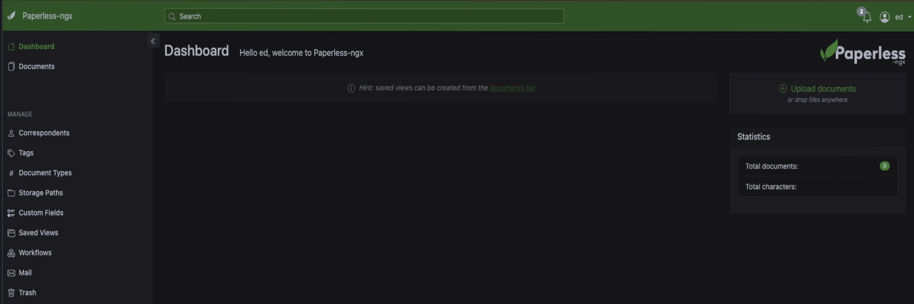

There are two ways to get documents into Paperless. You can either put them in the consume folder, or you can upload them or drag and drop them straight into the web UI.

Try dragging a PDF into the web UI. You'll see it upload, and once it's done, click to open the document. In the screenshot below I've used a motherboard manual as an example. You'll see the document viewer with all the details on the side. Click the content tab and you'll see all the text that Paperless extracted from the document using OCR.

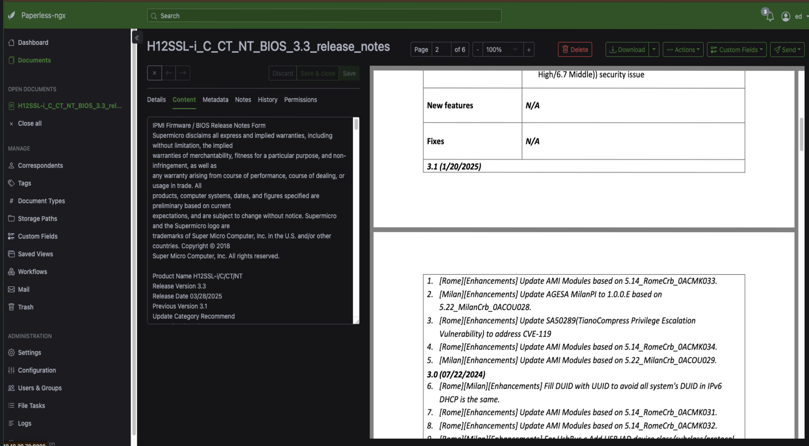

There's also metadata you can edit, notes you can add, document history, and if you set up multiple users, permissions settings.

Go back to the dashboard and you'll see your document count has gone up. You can click the documents tab on the left to see everything that's been uploaded to the server.

Now test the consume folder method.

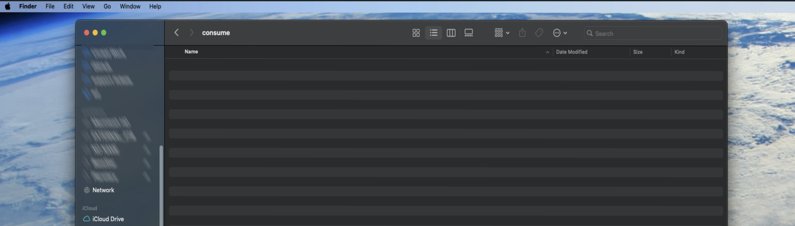

Go to your PC where you've mapped the network share. Open the consume folder and drop a document in. You'll see it disappear almost instantly. That's Paperless automatically picking it up and moving it into the system for processing.

Remember when we talked about scanner security earlier? This is why the consume folder is relatively safe even if someone gets access to it. Nothing stays here. Files are processed and moved out within seconds, so even if your scanner credentials get compromised, there's nothing sitting in this folder to browse through.

Go back to Paperless in your browser. There it is. Another document just appeared. Open it up and you'll see Paperless has picked up and read the content perfectly.

### Troubleshooting

If you run into problems, here are the most common issues and how to fix them.

#### Redis authentication error

If you forgot to delete the password field in the Redis container template, you'll see this error in the Paperless logs.

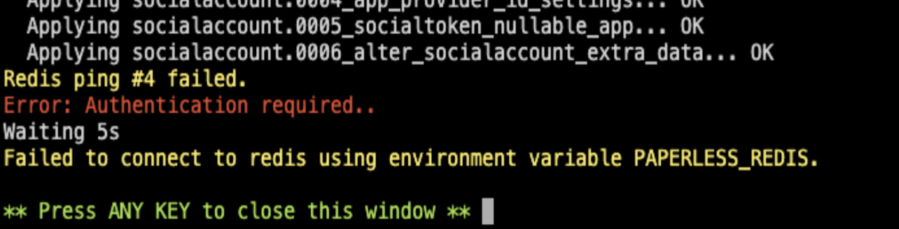

The error will say something like "Redis ping failed. Error: Authentication required" and "Failed to connect to redis using environment variable PAPERLESS_REDIS."

To fix this, go back to the Redis container, edit it, delete the password so the field is completely blank, and apply. Then restart the Paperless container. That should clear the error.

#### Postgres connection errors

If you see errors about Paperless not being able to connect to Postgres, double check that the PAPERLESS_DBHOST variable has the correct IP address of your Unraid server, that the PAPERLESS_DBNAME, PAPERLESS_DBUSER, and PAPERLESS_DBPASS variables match exactly what you set in the Postgres container, and that the Postgres container is actually running. The logs will tell you exactly which part of the connection is failing.

#### Starting fresh after mistakes

If you've made mistakes with the Postgres credentials or other settings and want to start fresh, delete the app data for the containers and start again.

First, stop the container you want to reset. Then go to your app data folder (usually `/mnt/user/appdata/`) and delete the folders for the containers you're resetting. For example, if you messed up the Postgres settings, stop the Postgres container, then delete the `postgres16` folder. Now edit the container template with the correct settings and apply. The container will start fresh with clean data.

This applies to any of the three containers. If you're trying to fix something by changing the template but the container keeps using old incorrect data, delete the app data folder for that container first.

---

## Part 2 - Office Documents, Tags, and Email

In part one we got the core of Paperless up and running with Postgres and Redis. It works, but right now it's basically just a manual place to dump PDFs. In this section we're going to take things further. We'll set up the extra containers that let Paperless handle office documents like Word files and spreadsheets, get automatic tagging working so you don't have to organise everything by hand, and hook up your email so Paperless can pull in attachments on its own.

### Adding office document support

Paperless is great with PDFs out of the box, but it doesn't know how to read a Word document or an Excel file. For that we need two extra containers, Gotenberg and Apache Tika.

Gotenberg handles the conversion side of things. When you upload a Word document, Gotenberg converts it to a PDF so you can preview it in the Paperless web UI. Tika handles text extraction. It's much better at digging out the text from complex files than Paperless's built in OCR, so your search results will be more accurate.

Here's what the stack looks like once we've added them. You can see Gotenberg and Tika sitting alongside the Postgres and Redis containers we set up in part one, all feeding into Paperless.

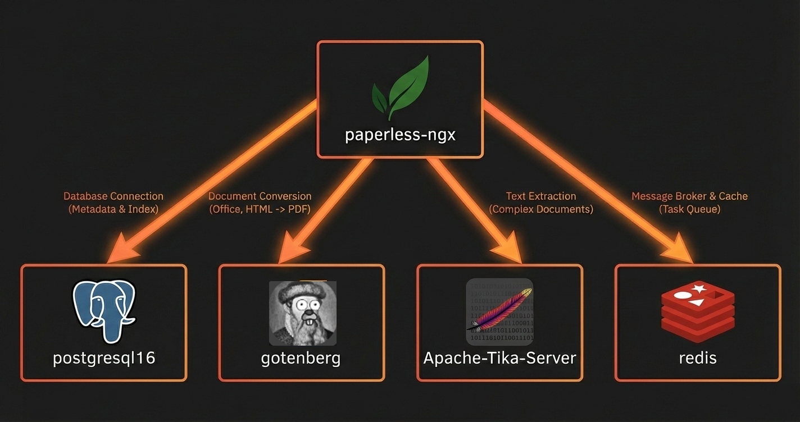

#### Installing Gotenberg

Go to the **Apps** tab and search for paperless. You'll see Gotenberg listed in the results.

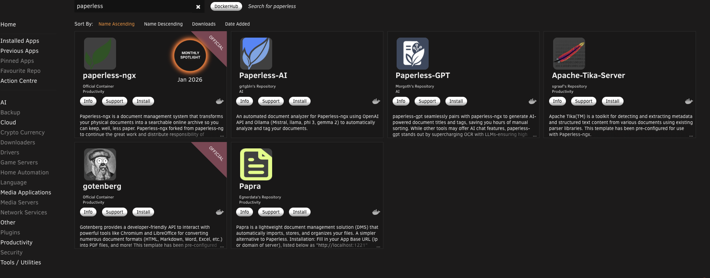

Click on it and you'll notice there's nothing to set up. This container is stateless, meaning it doesn't store any data of its own. There's no appdata path to worry about. Just click **Apply** and let it pull down the image.

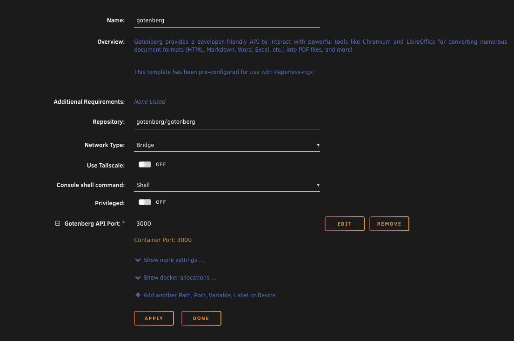

#### Installing Apache Tika

Go back to the **Apps** tab and search for paperless again. You'll see Apache Tika Server in the results. Click on it and you'll find it's stateless as well, no appdata needed.

When you click apply though, you're going to hit a problem. The repository in the template is private and you can't pull from it.

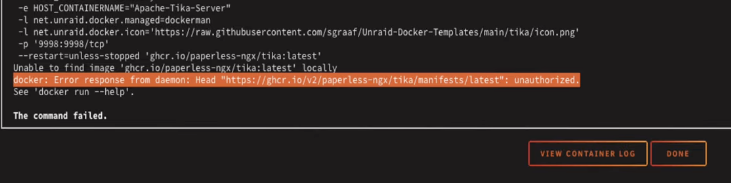

This is easy to fix. Click the back button in your browser to get back to the template. On the repository line, delete what's there and replace it with this.

```
apache/tika:latest
```

That's the official Apache Tika image from Docker Hub. Click **Apply** again and this time it'll pull down fine.

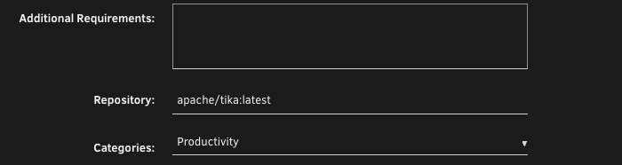

Once both are installed, you should see them running alongside the rest of your Paperless stack on the **Docker** tab.

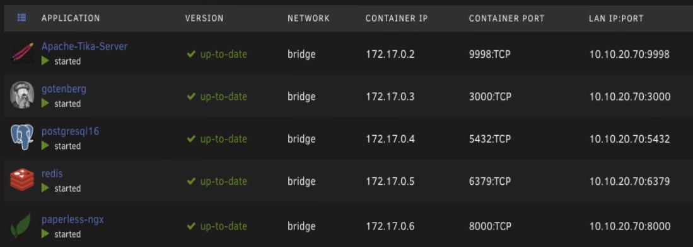

#### Enabling Gotenberg and Tika in Paperless

There's nothing in the Paperless web UI to switch these on. You have to do it through the container's environment variables. If you followed part one, you'll have already added these variables to the Paperless template. If you haven't, go back and check part one for how to set them up.

Edit the Paperless container template and scroll down to the bottom. You'll see three variables for Gotenberg and Tika.

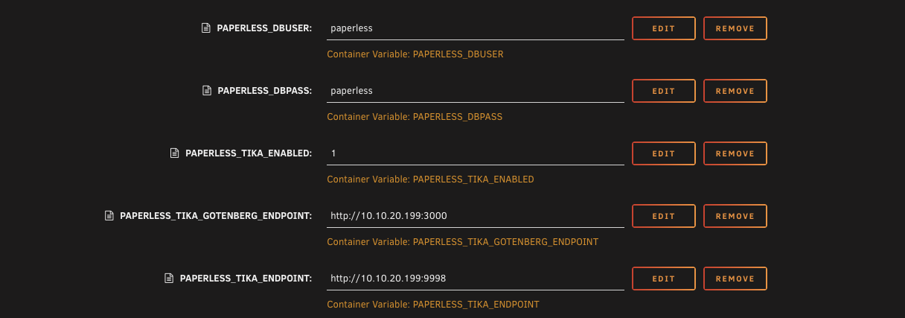

The first one is a toggle. It's set to 0 by default, which means off. Change it to 1 to turn on office document support.

The second one is the Gotenberg URL. Put in your Unraid server's IP address followed by the port, which is 3000. So it'll look something like this.

```
http://192.168.1.50:3000
```

The third one is the Tika URL. Same idea, your server's IP, but this time the port is 9998.

```
http://192.168.1.50:9998
```

Click **Apply** and give the container a moment to restart. Check the log at this point to make sure everything started up clean. If you see no errors in there, you're good.

### Testing office document support

Let's make sure everything is actually working. Open up the Paperless web UI and upload a Word document. Just drag and drop it onto the page.

Once it's finished processing, you'll see it in your documents list.

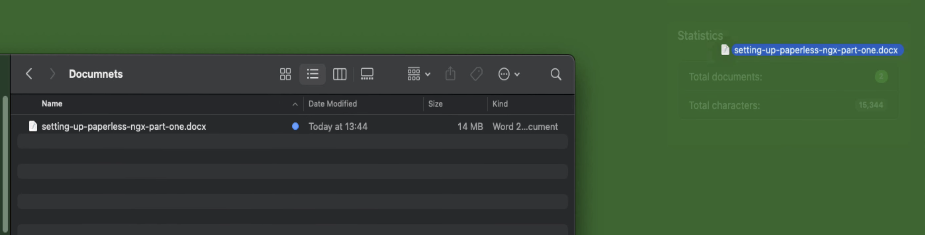

Click on it to open it up and you can see the content is readable, the text has been extracted properly. If you do a search for a word you know is in the document, Paperless will find it.

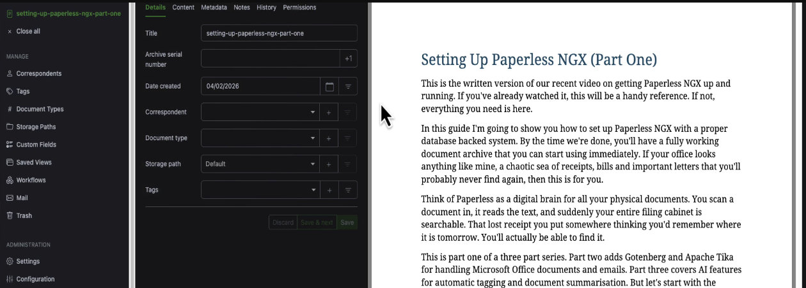

Here's how Paperless handles your files behind the scenes. If you go to your Unraid shares and browse into your paperless share, you'll find a media folder with two important subfolders: originals and archive.

In the originals folder, your files are kept exactly as you uploaded them. That Word document is still a .docx file. Paperless doesn't touch it.

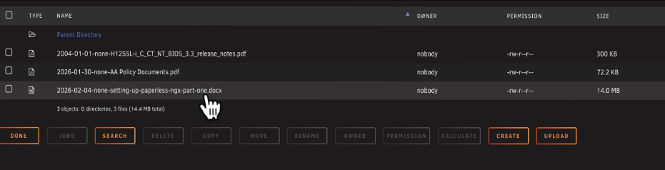

In the archive folder, Gotenberg has converted it to a PDF, which is what you see when you preview the document in the web UI.

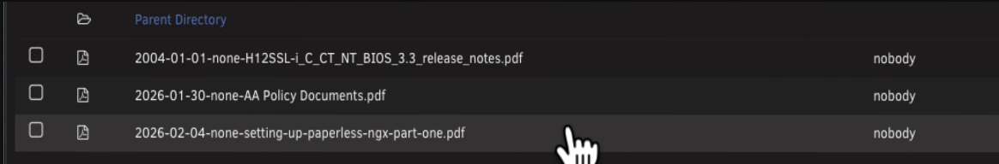

The text extraction from Tika happens the first time you upload a document. It's a one off process. That means any documents you uploaded in part one before Tika was installed are stuck with the basic OCR extraction. Only new uploads get the benefit of Tika's better text extraction.

If you want to go back and reprocess your existing documents with Tika, you can do that. Go to the [Docker tab](/unraid-os/using-unraid-to/run-docker-containers/managing-and-customizing-containers/) in Unraid, click the Paperless container icon, and select **Console**. Then run this to redo the text extraction.

```bash
python3 manage.py document_index reindex
```

If you also want Gotenberg to regenerate the PDF previews in the archive folder, run this as well.

```bash
python3 manage.py document_archiver --all
```

Both of these can take a while if you've got a lot of documents, and they'll keep your CPU busy while they run. But it's a one time thing and it means everything in your library gets the benefit of Tika and Gotenberg, not just new uploads.

If you want to search for a specific word within a document's content view, the Paperless search bar finds the document itself but doesn't highlight words on the page. For that, just use your browser's built in search. Ctrl+F on Windows, Command+F on Mac.

### Setting up tags

Tags are how you organise documents in Paperless. You can apply them manually, but the real power is getting Paperless to tag things automatically based on the content of the document.

#### Creating a tag with automatic matching

In the sidebar on the left, under Manage, click on Tags. It'll be empty to start with.

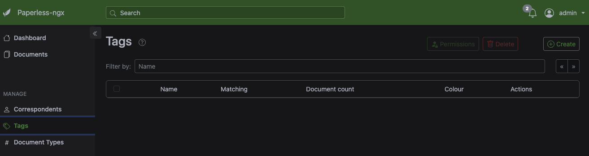

Click the green **Create** button in the top right. Give your tag a name. I'm going to create one called server and pick a colour for it. Something like Unraid orange feels right.

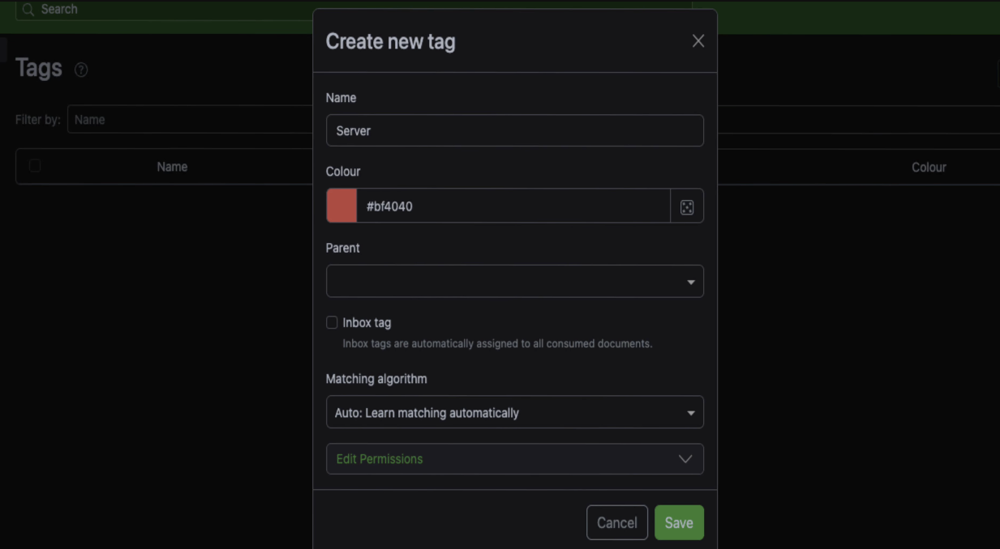

The matching algorithm is the important bit here. By default it's set to auto, which means learn matching automatically. The problem is, for that to work, Paperless needs a decent amount of training data. We're talking maybe 20 or 30 documents that you've already manually tagged. Right now the server has no idea what your tag server actually means because it's got nothing to learn from.

So instead, change the matching algorithm to any. This lets you specify a word, and if that word appears anywhere in the document, Paperless will apply the tag. There's also an all option if you want to be more specific. With all, you put in multiple words and the document has to contain every one of them to get tagged. For example, you could put in unraid and server, and only documents containing both words would get the tag.

For this example, I'm going with any and putting in the word unraid. Leave case insensitive ticked, because you want it to match regardless of capitalisation. Click Save.

#### Why existing documents don't get tagged

Here's something that catches people out. You've created the tag and you know you've got a document with the word unraid in it, but the tag shows a document count of zero.

That's because Paperless doesn't go back and re-examine documents that have already been uploaded. It applies tags at the point of upload. Anything that was already in the system before the tag existed won't be checked.

You can force it though. Open the Paperless container console from the Docker tab and run this.

```bash
python3 manage.py document_retagger
```

That'll go through every document in your library and apply any matching tags. It's handy when you've just created a bunch of new tags and don't want to go through everything by hand.

You can also tag existing documents manually. Go to the document, and at the bottom you'll see a tags section. Paperless will even suggest tags it thinks are relevant. Click on the suggested server tag, hit Save, and the document is tagged.

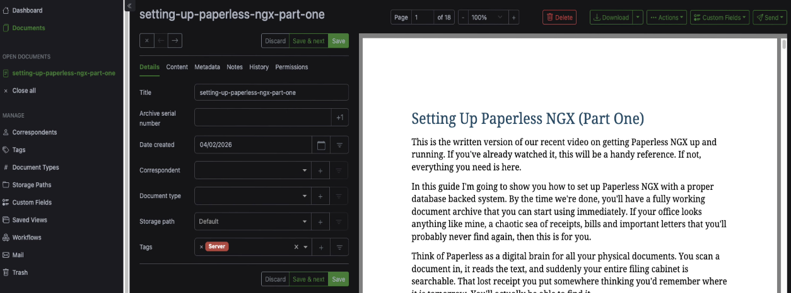

#### Automatic tagging on new uploads

The tag will work automatically from now on for anything new that comes in. If you upload another document that contains the word unraid, Paperless will tag it with server without you doing anything.

To test it, upload a PDF that you know has the word unraid in it. Go back to the tags section and you'll see the document count has gone up. That one was tagged automatically.

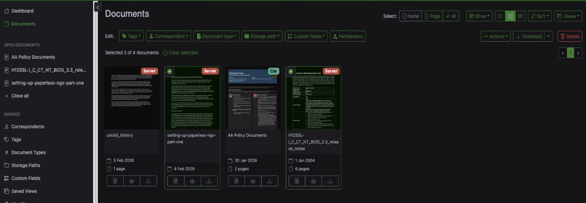

Your documents get a little colour coded badge showing their tags, which makes it easy to see at a glance what's what.

#### Creating tags from a document

You don't always have to go to the tags management page to create a tag. You can do it directly from a document as well.

Open up a document, click the plus button next to the tags field, and type in a new tag name. I've got a document here from a car breakdown recovery company, so I'll create a tag called car. Set the matching algorithm to whatever you want and save it. The tag gets created and applied in one step.

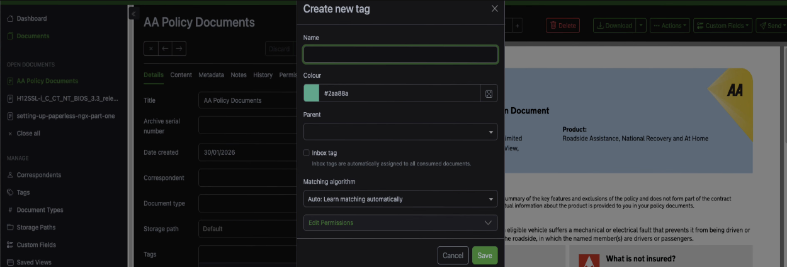

#### Parent and child tags

You can nest tags for more detail. Say you've got a document tagged as server but it's specifically a motherboard manual. You can create a new tag called motherboard and set its parent to server.

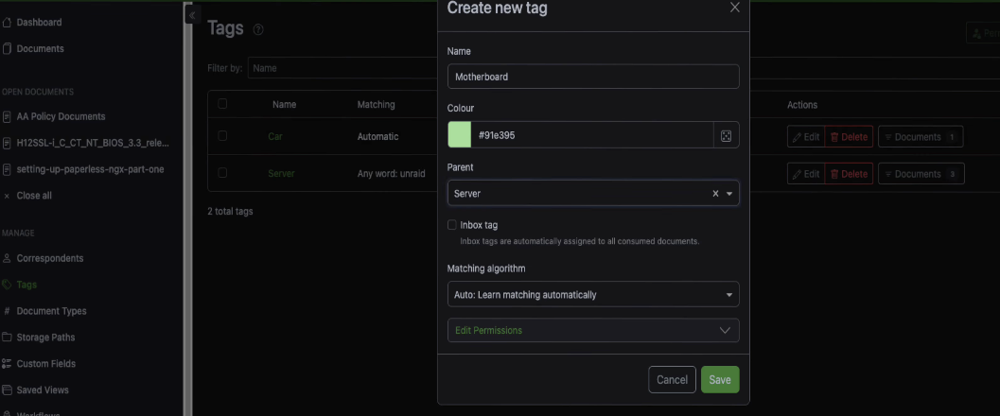

Go back to the document and add the motherboard tag alongside the server tag. The document now has two tags, giving you a broad category and a specific one. You can see both badges on the document in the list view.

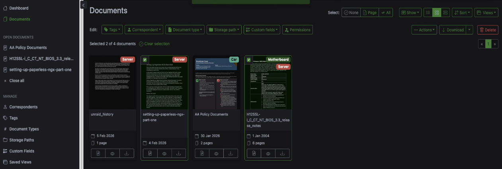

#### Switching algorithms later

Once you've built up enough tagged documents, maybe 20 or 30, you can go back and change the matching algorithm to auto. At that point Paperless will have enough training data to start learning what your tags mean and it should do a better job than simple word matching. But while you're setting things up, word matching is the way to go so things get tagged from the start.

### Connecting your email

This is where it gets properly useful. You can connect an email account to Paperless and set up rules so that when specific emails arrive, Paperless grabs the attachments and imports them automatically. Bills, invoices, receipts, anything that comes in as an email attachment can file itself.

#### Adding an email account

In the sidebar, go to **Mail** and then **Mail Accounts**. Click **Create** to add a new account.

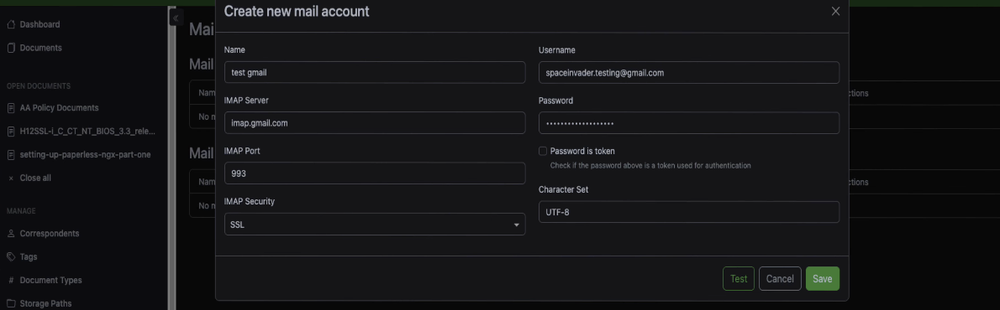

Fill in your email address as the username and set the IMAP server. For Gmail, that's imap.gmail.com on port 993.

For the password, if you're using Gmail, you need to use an app password here, not your normal login password. Gmail requires this for third party apps connecting over IMAP. If you're not sure how to set one up, there are guides for that, it only takes a minute.

Click Test and you should see a message saying it's successfully connected to the mail server. Save the account.

#### Creating a mail rule

Go to **Mail Rules** and click **Create**. Give your rule a name. I'll call mine test rule.

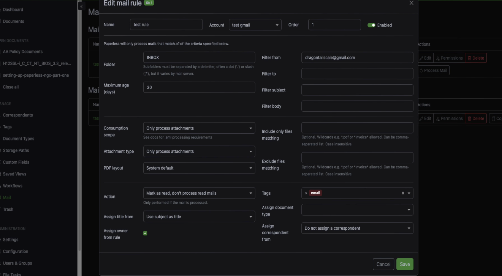

Here's what to fill in.

1. Account, select the email account you just set up
2. Order, set it to 1 since this is your first rule
3. Folder, set it to inbox
4. Maximum age, set this to something like 30 days so it doesn't try to process your entire email history
5. Action, set it to process attachments only
6. Filter from, put in the email address you want to watch for

So for example, if your energy company always sends bills from billing@energycompany.com, put that address in the from filter. Paperless will only grab attachments from emails sent by that address.

You can also assign a tag to anything that comes in through this rule. I'd recommend creating an email tag first, then coming back to the rule and selecting it. That way everything imported via email gets tagged automatically and you can easily see what came in through email versus what you uploaded manually.

#### Testing email integration

Send an email with an attachment to the account you set up. Go back to the Paperless web UI. The email fetching runs on a schedule, but if you don't want to wait, there's a button to **Process mail immediately**.

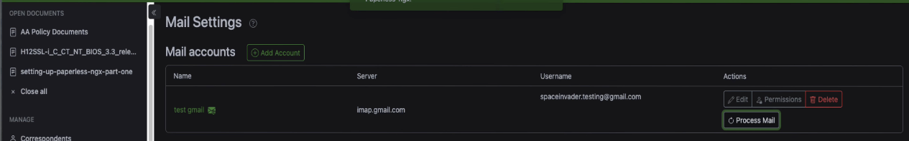

You'll see a notification at the top of the page as it processes the attachment. Once it's done, go to your documents and there it is, imported and tagged. If the document contained a word that matches one of your other tags, it'll pick that up too. So you might see an email tag and a server tag on the same document, one from the mail rule and one from the word matching.

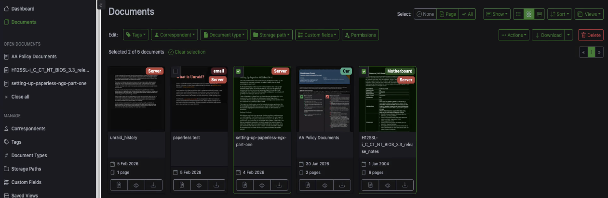

---

## Part 3 - Local AI

In this section we're bringing local AI into the stack. Once everything's set up, your Paperless server will automatically read through your documents, apply tags, assign document types, and come up with titles on its own. If you've got scanned pages or handwritten notes that regular OCR can't handle, we're also setting up vision based OCR so an AI model can actually look at the page and extract the text properly. There's even a chat feature that lets you ask questions about your documents and get answers pulled straight from them.

### What we're setting up

We're putting in two containers that bolt AI features onto Paperless, and they've each got a distinct role.

Paperless AI is the one doing the heavy lifting. It reads the text in your documents and handles tagging, document types, correspondents, and titles. It's also got a RAG chat feature so you can ask questions across your entire collection.

Paperless GPT is only here for one thing, vision OCR. When you've got a scanned letter or a photo of a receipt that regular OCR can't handle, Paperless GPT sends the actual image to a vision model that can see and read the page. We're turning off all of its other features because that's Paperless AI's job. One tool per job, no stepping on each other's toes.

Both containers talk to Ollama, which is where the AI models actually run on your hardware.

Here's the full picture of what we're building. Paperless AI and Paperless GPT sit on top of the stack we've already got from parts one and two, with Ollama providing the AI models they both use.

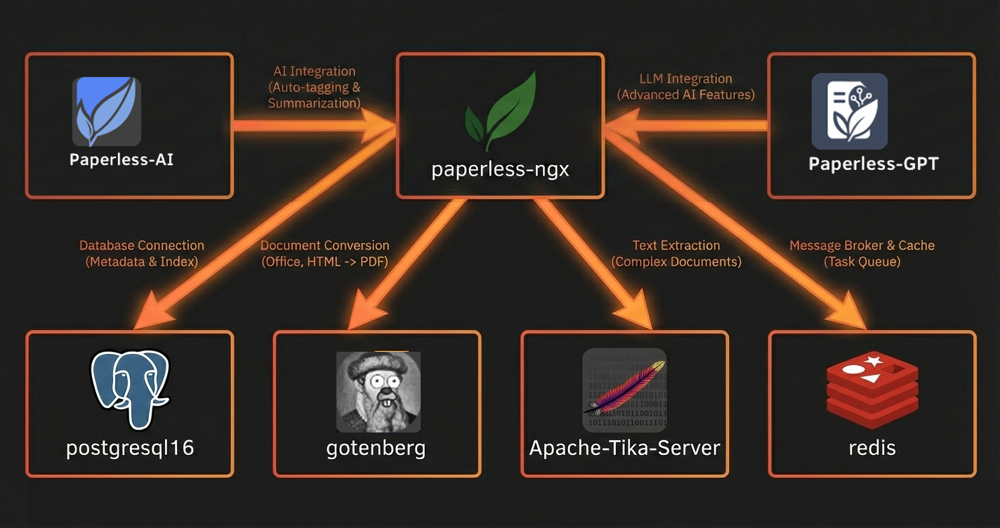

### Hardware requirements

You'll need a GPU for this. You could technically run it on a CPU, but it'd be painfully slow. We're talking minutes per document rather than seconds, so I really wouldn't go down that road.

As a minimum you'll want something with around 12 gigs of VRAM. The most affordable way to get there right now is with an RTX 3060. Just make sure it's the 12GB version, because there are some 8GB models floating around and that would be cutting it tight. If you've already got something more powerful like a 3090, a 4060 Ti 16GB, or a 5070 Ti, that's even better. More VRAM means you can run bigger and smarter local AI models.

Paperless AI and Paperless GPT both support connecting to cloud AI services like OpenAI's API. I wouldn't recommend it though. The API costs can add up, and more importantly, think about what's flowing through your Paperless server. Bank statements, medical records, tax returns, credit card bills, maybe documents with API keys or passwords in them. I wouldn't want any of that leaving my network and heading off to someone else's servers. Everything in this guide runs entirely on your own hardware. Nothing goes out over the internet.

### Installing the Nvidia driver

First thing we need is the Nvidia driver on the server with your GPU. Head to the **Apps** tab, search for Nvidia, and install the driver.

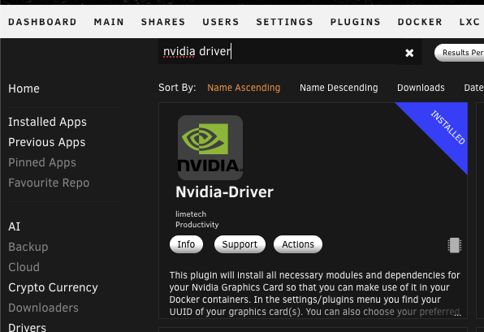

Once it's finished downloading, click done. If you go into Settings you'll see a Nvidia driver page. Click on it and your GPU should show up in the list.

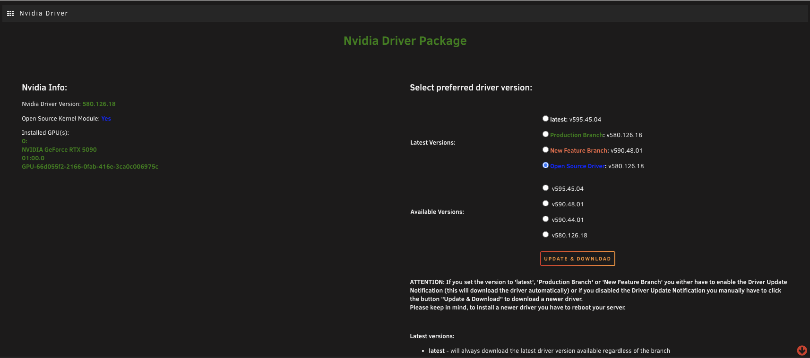

If you've got a 50 series GPU, you'll need the open source driver. The standard latest driver doesn't work with 5000 series cards. Hit update and download to grab the correct one. (This applies regardless of whether you're using the card for AI work or for gaming with something like Steam Headless.) It'll take a while to download and you'll need to reboot the server once it's done.

### Setting up Ollama

After rebooting, we need two containers. (One thing worth knowing here, if you're running Paperless on a different server from your GPU (which is what I'm doing), these containers go on the GPU server.) Later when we set up Paperless AI and Paperless GPT, we'll point them across to this server's IP address. If everything lives on the same box, it's even simpler.

Head to the **Apps** tab and search for Ollama. Install the container.

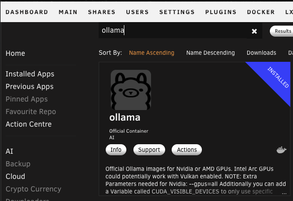

It'll mention that it needs the Nvidia plugin, which we've already got installed. There's nothing to fill in here, just hit apply and let it pull down.

### Installing Open WebUI

The next container is Open WebUI. This gives us a web interface for managing AI models on Ollama and chatting with them. Search for Open WebUI in the **Apps** tab and install it.

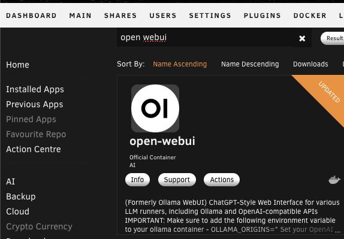

The only thing you need to fill in is the Ollama IP, which is the IP address of the Unraid server that's running Ollama.

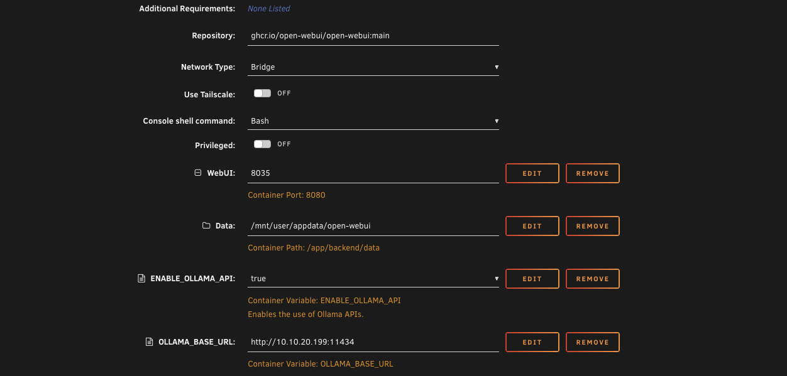

Hit apply and let it pull down.

Once both containers are running, open the Open WebUI web interface and set up an account.

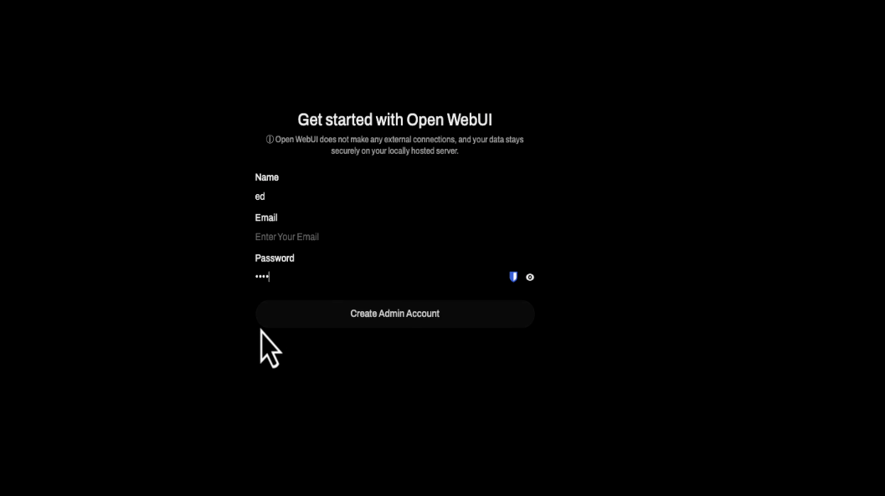

### Downloading the AI models

At the top of Open WebUI you'll see a field that says select a model. We haven't got any models yet, so we need to grab two that I've found work best with Paperless.

First is Qwen 3 14B. Type it into the model field and click to pull it from Ollama. It's roughly 9 gigs and it's a seriously capable general purpose model. It's smart enough to read through your documents and figure out the correct tags and document types without getting things muddled up. Well, without getting muddled up too often anyway. It fits comfortably in 12 to 16 gigs of VRAM.

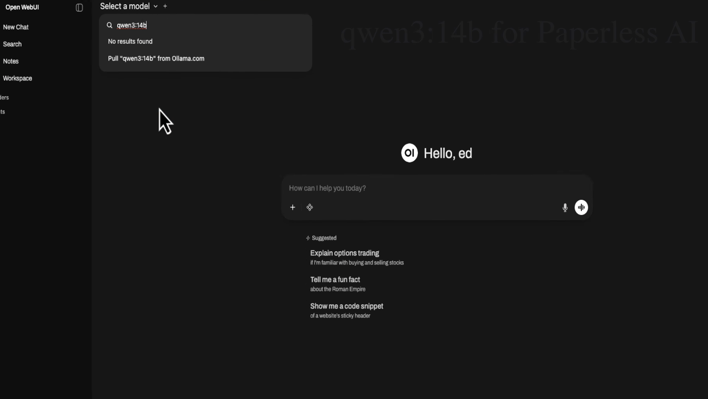

Second is the vision model. Type in minicpm-v and pull that from Ollama as well. This one's smaller, roughly 5 gigs. It's the model that'll look at scanned documents and photos and read the text out of them. I did try Qwen 2.5 VL 7B as well, which plenty of people recommend, but I ran into a bug on the newer versions of Ollama where it kept crashing on certain documents. MiniCPM-V has been rock solid for me. The Qwen vision model might be worth revisiting in the future, but at the time of writing this guide the current version of Ollama doesn't seem to get along with it.

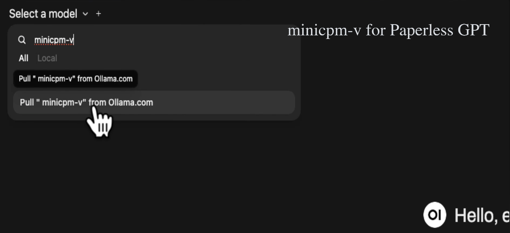

Even though I'm running these on a GPU with 16 gigs, a 12GB card like the RTX 3060 will handle them fine. The Qwen 3 model takes up about 9 gigs and MiniCPM-V sits at around 5. Ollama only loads one model into memory at a time by default, so you don't need them both fitting in VRAM simultaneously.

### Installing Paperless AI

With Ollama and the models sorted, let's move over to the server running Paperless. Head to the **Apps** tab, search for Paperless, and install Paperless AI.

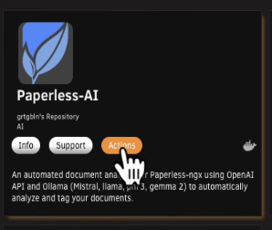

You might get a warning about a port conflict. Port 3000 is likely already taken by Gotenberg from part two. Switch the Paperless AI port to 3030 to get around that.

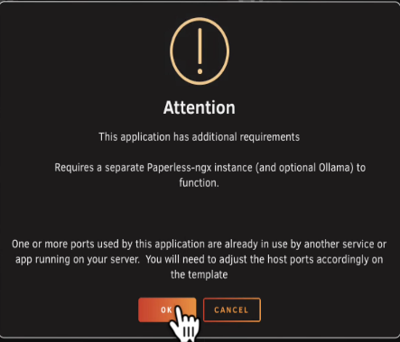

Change it in the template so the host port is 3030 instead of 3000.

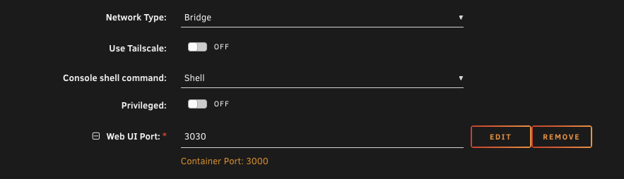

There's nothing else to fill in, so hit apply and let it pull down. This is a fairly hefty container, around 4 gigs. That goes into your [Docker vdisk](/unraid-os/using-unraid-to/run-docker-containers/overview/) rather than your appdata, so bear that in mind if your Docker image is tight on space.

### Setting up Paperless AI

Open the Paperless AI web interface and you'll land on a setup wizard that takes you through everything.

Hit start, create a username and password, and it'll ask for the Paperless address. Remove the localhost part and put in the IP address of your Paperless server instead.

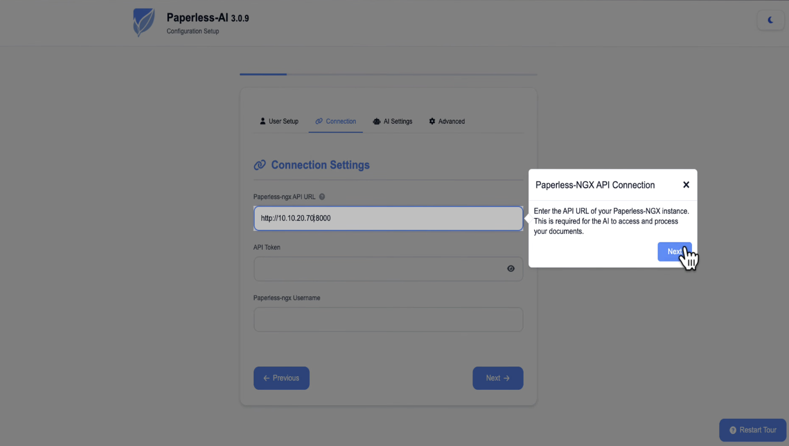

It needs an API token. Go over to the Paperless web interface, open Settings, and in the top right corner you'll see Open Django Admin.

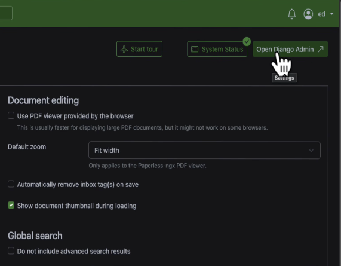

Click on that, find Authorisation Tokens, hit Add, pick your user from the dropdown, and click Save. Copy the key that gets generated.

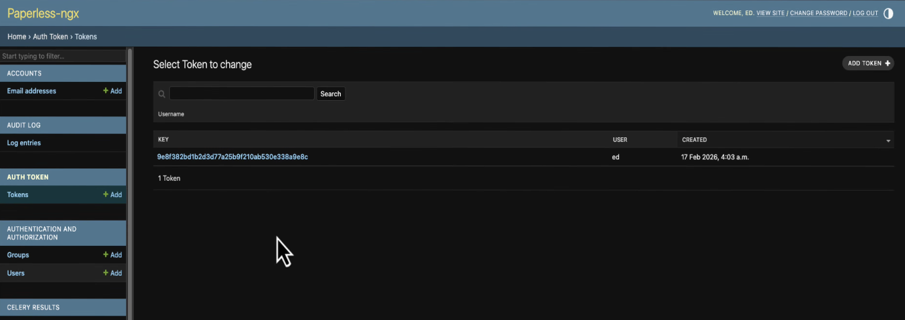

Go back to Paperless AI and paste the token in. Fill in your Paperless username as well.

Switch the AI provider from OpenAI/ChatGPT to Ollama. It'll ask for the Ollama API URL. The host part is the IP address of whichever server is running Ollama, and the port is 11434 (that's the default Ollama port). If Ollama is on the same machine as Paperless, that'll be your Unraid server's IP. If it's running on a separate GPU server like mine, use that server's IP instead.

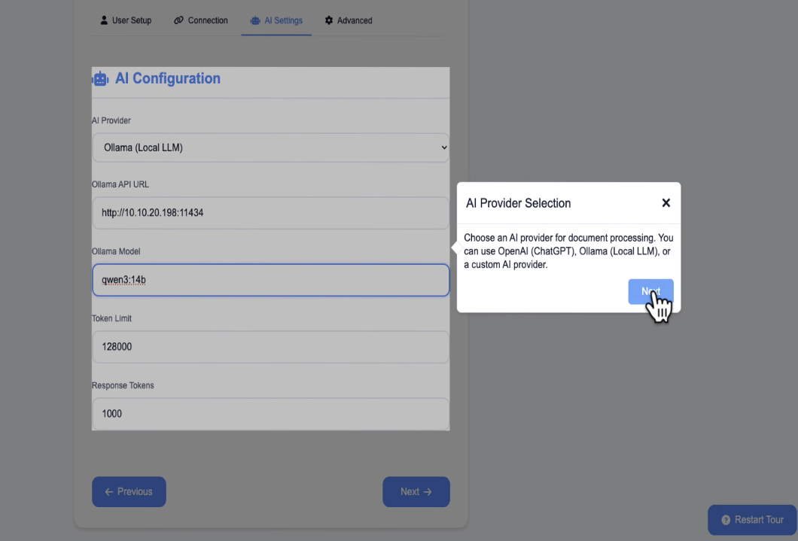

For the model, pick Qwen 3 14B (the one we pulled earlier). Leave the token limit and response tokens at their defaults and click next.

The next setting asks whether the AI should stick to your existing Paperless tags or make up its own. If you choose yes, it'll only select from tags and correspondents you've already created. That keeps everything neat and avoids duplicates, but anything that doesn't match an existing tag simply won't get tagged. If you choose no, the AI will come up with its own tags based on what it reads in each document. That's brilliant for getting up and running quickly, but you might want to tidy things up afterwards. I'm going with no because I want the AI to create tags on its own.

The scan interval determines how often it automatically checks for new documents. The default is every 30 minutes, which works fine.

For process only specific pre-tagged documents, leave that set to no. Set add AI tag to documents to yes. That puts a marker on anything the AI has processed, so you can easily tell what's been done.

Leave automatic processing switched on. On the next page, turn on all four classification options (tags assignment, document type classification, correspondent detection, and title generation). Leave everything else at the defaults.

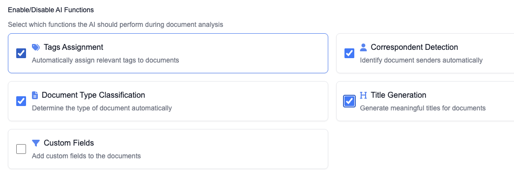

The system AI prompt comes with a really good default, so I'm leaving it as it is. Click next, then finish. Before you hit save, take a look at the example prompt. It's well put together and should handle most documents nicely. Click save configuration.

It'll drop you back to the login page. Before logging in, I'd suggest going back to the **Docker** tab and restarting the Paperless AI container. This helps avoid a problem that can sometimes crop up with the RAG search feature if you don't restart after the initial setup.

### Testing Paperless AI

Log into Paperless AI and you'll see the dashboard. If it's already completed a scan, you'll see a count of documents that have been processed.

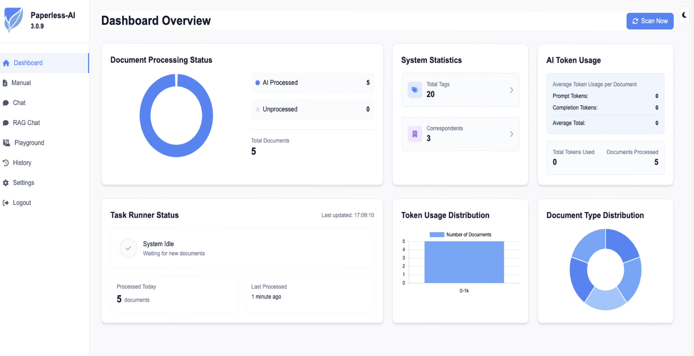

Head over to your Paperless web interface and check your documents. You should see a load of new tags that the AI has applied based on each document's content. If you can remember what the tags looked like before, there should be noticeably more now.

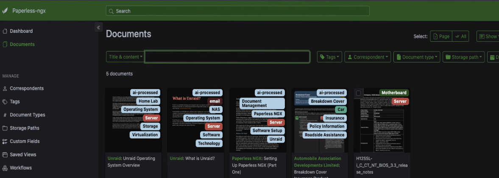

Back in Paperless AI, open the chat feature. You can have a conversation about individual documents. Pick one and ask it something. The AI reads through the document and gives you an answer based on what it finds in there.

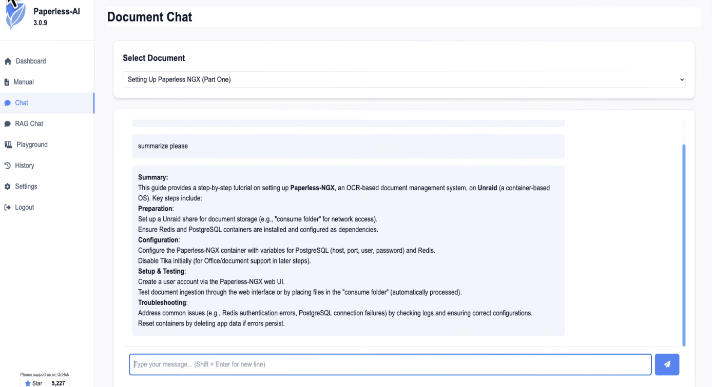

There's also the RAG chat. This builds an index across all of your documents so you can ask questions that span everything. Click start indexing and let it finish. Once it's ready, you can ask things like "what's the telephone number for my breakdown service?" and it'll track down the answer from whichever document it's in. Really handy when you've got hundreds of documents and can't remember which one has the detail you're after.

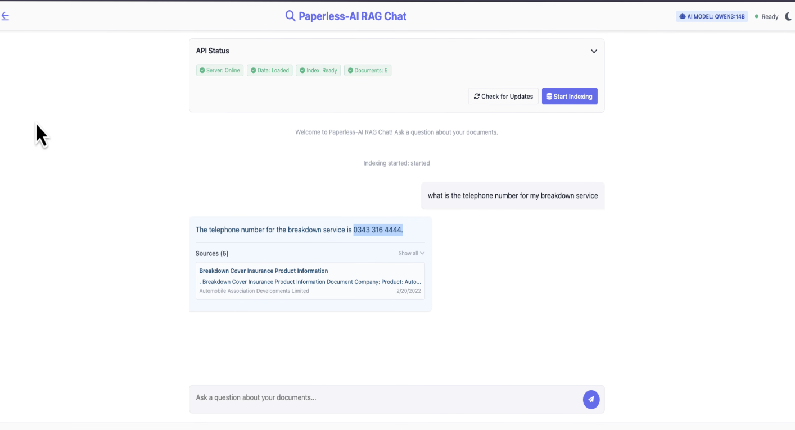

### Installing Paperless GPT

Paperless AI handles everything text based really well, but it can only work with what the OCR gives it. If the original OCR extraction is poor, which it often is with scanned letters, photos, or handwritten notes, then the tags and titles won't be great either. That's where Paperless GPT comes in. It uses a vision model to look at the actual page and pull the text out properly, which gives Paperless AI much better content to work with.

Head to the **Apps** tab, search for Paperless, and install Paperless GPT.

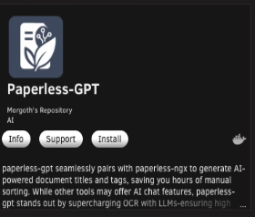

The template might look a bit daunting because there are a lot of fields, but most of them we don't need to touch.

The Paperless base URL is the IP address of your Paperless server along with the port. Mine looks like http://10.10.20.70:8000 but yours will be whatever address your Paperless server is on.

For the API token, use the same one we grabbed from the Django admin earlier. If you can't remember it, go back to Settings, Django admin, Authorisation Tokens, and it'll be there.

Leave the public URL blank since we're not using one. Leave the manual tag and auto tag fields at their defaults.

Set the LLM provider to Ollama and the LLM model to Qwen 3 14B. Scroll down and put in the Ollama host with the IP of your GPU server.

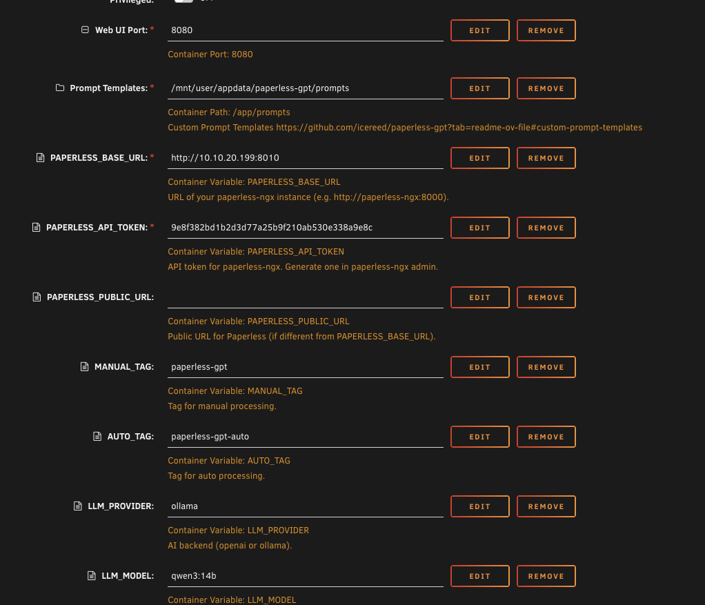

For the OCR provider, leave it on LLM. For the vision provider, switch it from OpenAI to Ollama. Set the vision model to MiniCPM-V.

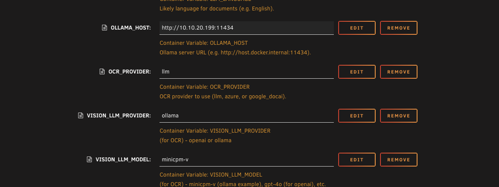

Leave the auto OCR tag at its default. That's the tag which triggers automatic OCR processing.

Here's the bit that matters. We only want Paperless GPT handling OCR, nothing else. So set auto generate titles to false, auto generate tags to false, auto generate correspondents to false, and auto generate date to false. All of that is Paperless AI's territory.

The OCR page limit is fine sitting at five. If you'd prefer unlimited pages, set it to zero. For the token limit, put in 1000.

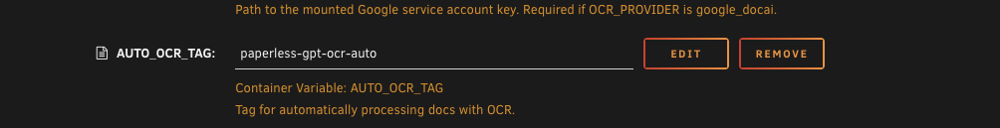

Hit apply and pull down the container. This one's much smaller than Paperless AI, so it won't take long.

### Testing vision OCR

Let's give it a go. Upload something that regular OCR would have trouble with. I'm using a photo of an energy drink can as a test.

Open the Paperless GPT web interface. Click on OCR and enter the document ID. You can find this in the Paperless URL when you've got a document open. It's the number that comes after /documents/ in the address bar.

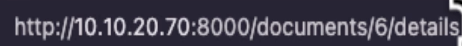

Hit submit OCR job. It might take a few moments to process. Once it's finished, you'll see the extracted text. Compare it against what the regular OCR managed to get. It should be noticeably better, particularly for scanned images, photos, and anything that isn't a clean digital document.

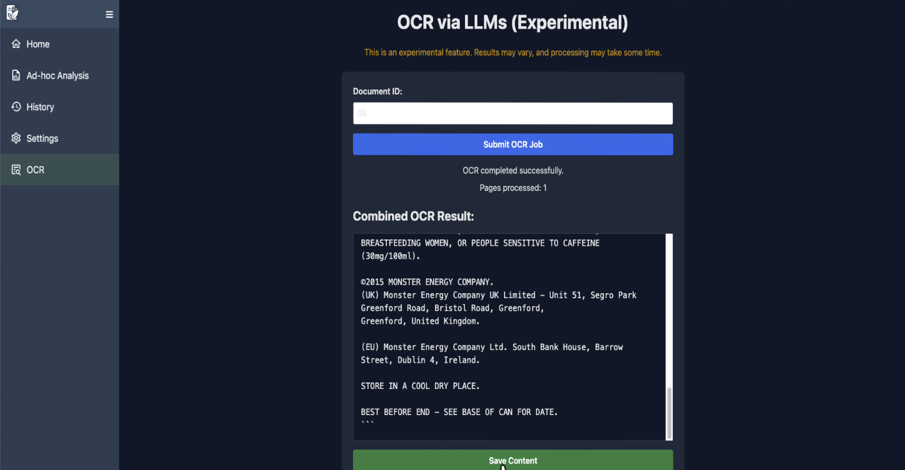

Click save content to push the improved text back into Paperless. If you head back to Paperless and look at the document's content tab, you'll see it's been replaced with the much better extraction.

And because the content is better now, Paperless AI can give you more accurate answers about that document too. You could open Paperless AI, go into the chat, select that document, and ask it questions based on the improved content.

### Automatic vision OCR

Running OCR manually through the web interface works fine, but it's not realistic for every document. Let's get it set up so it all happens automatically.

There are a couple of ways to kick off automatic OCR. If you set up email rules earlier, you could create a rule that applies the OCR auto tag to attachments from certain senders, and Paperless GPT would pick them up and process them automatically. But the approach I prefer is creating a subfolder inside the consume folder.

Go to your Unraid shares and open the Paperless share. Inside the consume folder, create a new subfolder and give it the same name as the OCR auto tag from the Paperless GPT template.

```
paperless-gpt-ocr-auto
```

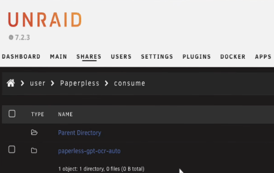

The way it works is that anything dropped into this subfolder gets automatically tagged with the subfolder's name, and that tag tells Paperless GPT to run vision OCR on it.

To make this work, we need two environment variables added to the Paperless container. Go to the **Docker** tab, edit the Paperless container template, and add these.

The first one.

| Type | Key | Value |
|------|-----|-------|
| Variable | PAPERLESS_CONSUMER_RECURSIVE | true |

This tells Paperless to look inside subfolders within the consume directory, rather than only watching the consume folder itself.

The second one.

| Type | Key | Value |
|------|-----|-------|
| Variable | PAPERLESS_CONSUMER_SUBDIRS_AS_TAGS | true |

This tells Paperless to automatically tag each document with the name of whichever subfolder it was sitting in when it got consumed.

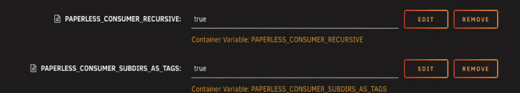

Hit apply to save those changes.

Give it a test. Grab a photo of something, or take a screenshot, and drop it into the paperless-gpt-ocr-auto subfolder via your network share. Paperless will pick up the file, tag it with the subfolder name, and Paperless GPT will grab it and run vision OCR on it automatically.

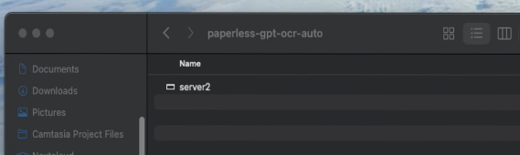

After Paperless GPT has finished processing the document, it strips off its own tag so it doesn't try to process the same thing twice. Go back to Paperless and check the document. The content should be properly extracted by the vision model, and if you then kick off a scan from Paperless AI, it'll tag and classify the document using that improved content.

This workflow takes care of the whole chain. Drop a scanned document or photo into the subfolder over the network. Paperless consumes it, Paperless GPT runs the vision OCR, and then Paperless AI tags and classifies it. Handwritten notes, photos of receipts, screenshots, they all get dealt with properly.

### If something isn't working

Most of the issues people run into with this setup come down to IP addresses and ports, especially if Ollama is running on a different server to Paperless.

If Paperless AI can't connect during the setup wizard, double check you've put the right IP in the right field. The Paperless address is the IP of whichever server Paperless is running on. The Ollama URL is the IP of whichever server has the GPU and Ollama on it. If they're on the same box, both IPs will be the same. If they're on different servers, they won't be, and it's easy to mix them up.

If the Ollama port isn't responding, make sure the Ollama container is actually running. Go to the **Docker** tab on the GPU server and check. The default port is 11434 and you shouldn't need to change it unless something else is already using that port.

If Paperless AI installs but the web interface won't load, check for a port conflict. We already changed the port from 3000 to 3030 because Gotenberg uses 3000. If you've got another container on 3030, you'll need to pick a different port.

If the model doesn't appear in the dropdown when setting up Paperless AI or Paperless GPT, go back to Open WebUI and check that the model actually finished pulling. Sometimes a pull can fail partway through, especially on larger models. If it's stuck or incomplete, pull it again.

If the API token gets rejected, go back to the Paperless web interface, open Settings, then Django Admin, then Authorisation Tokens, and check the token is still there. Copy it fresh and paste it in again. Make sure there are no extra spaces before or after it.

If vision OCR comes back with poor results or empty text, check that MiniCPM-V is set as the vision model in the Paperless GPT template, not as the LLM model. The LLM model should be Qwen 3 14B. Also check the Ollama host IP is correct in the Paperless GPT template, the same way you'd check it for Paperless AI.

---

## You're done

That's the whole Paperless setup wrapped up. You've gone from a blank Unraid share to a fully AI powered document management system. Paperless handles the storage and web interface, Postgres and Redis keep everything running quickly, Gotenberg and Tika deal with office documents, Paperless AI reads through everything and organises it with tags and document types, and Paperless GPT uses vision OCR for anything that isn't a clean digital document. All of it running locally on your own hardware with nothing leaving your network.

If Paperless AI gets a document wrong and applies the wrong tag, just correct it manually. The more documents it processes over time, the better the results get. And if you ever need to track down something buried in your collection, that's what the RAG chat is there for.
