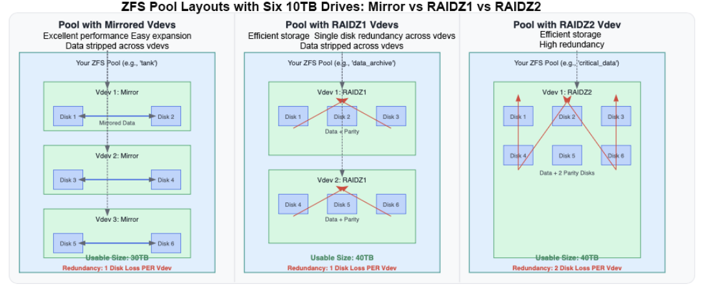
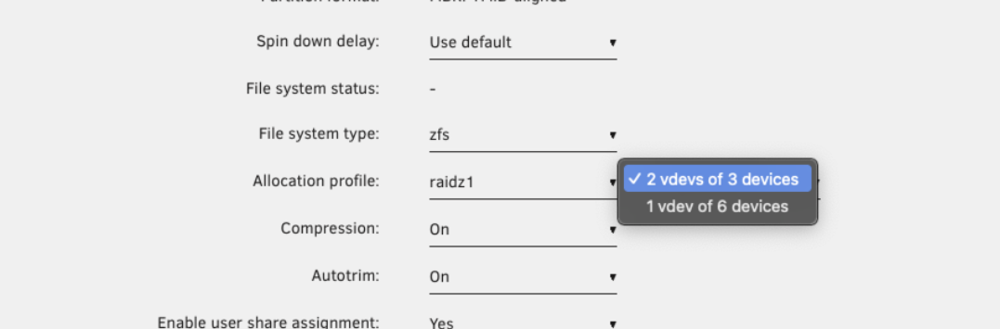
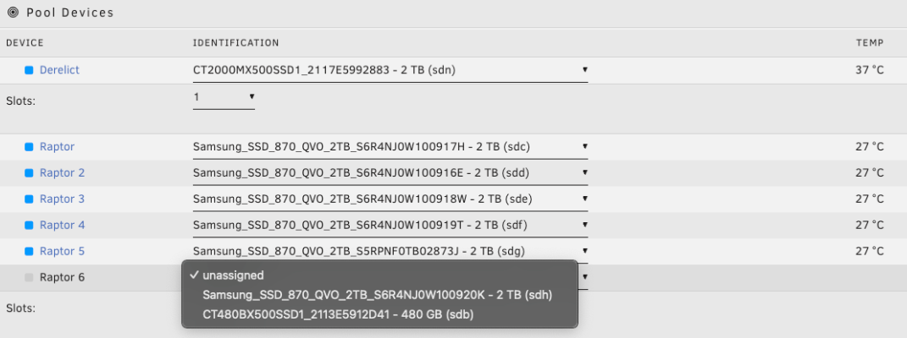
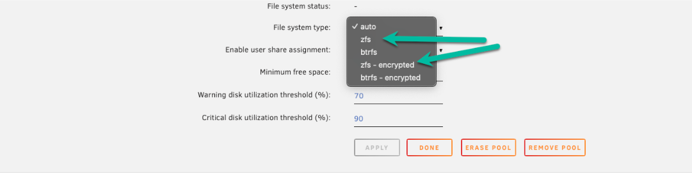
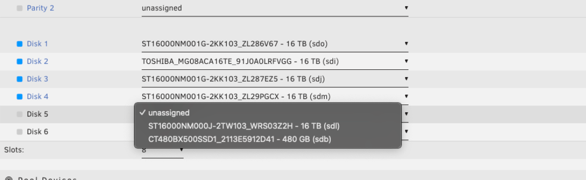
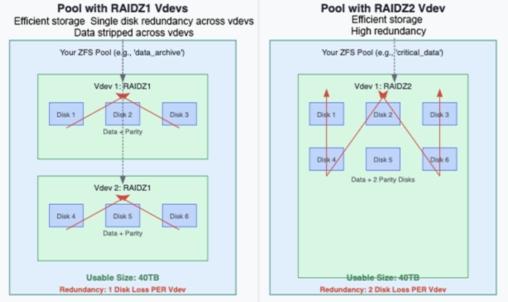
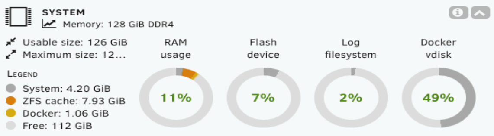
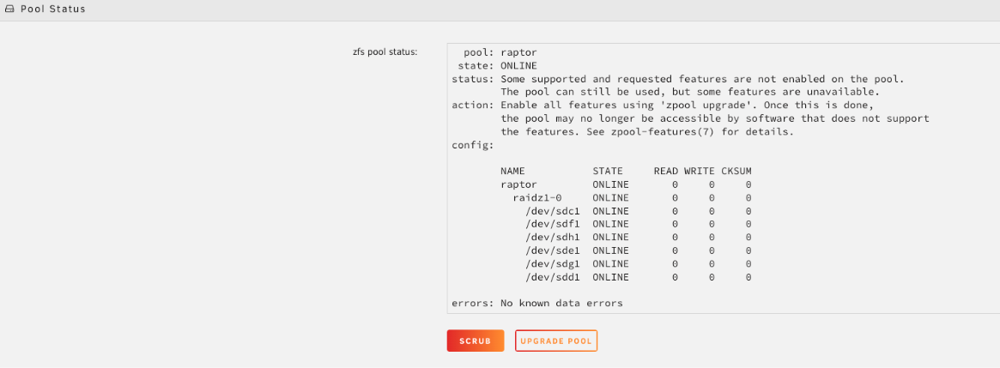

import Tabs from '@theme/Tabs';
import TabItem from '@theme/TabItem';

# ZFS-Speicher

:::important[Special Hinweis]

%%ZFS|zfs%% bietet erweiterte Datenintegrität, flexible Speicherlösungen und hohe Leistung für Ihr Unraid-System. Dieser Leitfaden erklärt die Kernkonzepte von %%ZFS|zfs%% und führt Sie durch die Verwaltung von %%ZFS|zfs%%-Pools direkt über das Unraid %%WebGUI|web-gui%%. Egal, ob Sie neuen %%ZFS|zfs%%-Speicher einrichten oder einen bestehenden Pool integrieren, hier finden Sie die Schritte und den Kontext, die Sie benötigen, um sicher zu starten.

:::

%%ZFS|zfs%% bietet erweiterte Datenintegrität, flexible Speicherlösungen und hohe Leistung für Ihr Unraid-System. Dieser Leitfaden erklärt die Kernkonzepte von %%ZFS|zfs%% und führt Sie durch die Verwaltung von %%ZFS|zfs%%-Pools direkt über das Unraid %%WebGUI|web-gui%%. Egal, ob Sie neuen %%ZFS|zfs%%-Speicher einrichten oder einen bestehenden Pool integrieren, hier finden Sie die Schritte und den Kontext, die Sie benötigen, um sicher zu starten.

---

## Warum ZFS?

ZFS ist ein modernes Dateisystem und Volume-Manager, der Ihre Daten schützt, Korruption verhindert und die Speicherverwaltung vereinfacht.

Mit ZFS erhalten Sie:

- Automatische Datenintegritätschecks und Selbstheilung
- Eingebaute RAID-Unterstützung (Spiegelungen, RAIDZ)
- %%Snapshots|snapshot%% und Klone für einfache Backups und Rollbacks
- ZFS send/receive für effiziente Replikation
- Kompression in Echtzeit

Unraid unterstützt %%ZFS|zfs%% für jeden Speicherpool. Sie können einen neuen %%ZFS|zfs%%-Pool erstellen, einen Pool aus einem anderen System importieren oder Unraids einzigartiges hybrides %%ZFS|zfs%%-Setup verwenden: Fügen Sie eine %%ZFS|zfs%%-formatierte Festplatte direkt zum Unraid-%%array|array%% hinzu (nicht zu einem Pool) und kombinieren Sie %%ZFS|zfs%%-Funktionen mit Unraids %%parity|parity%%-Schutz.

:::info[Beispiel]

Sie können %%ZFS|zfs%%-%%snapshots|snapshot%% und Replikation auf einer einzelnen Festplatte als Backup-Ziel verwenden oder einen schnellen SSD-%%ZFS|zfs%%-Pool auf eine %%ZFS|zfs%%-Festplatte im durch Unraid-%%parity|parity%% geschützten %%array|array%% replizieren und so beide Ansätze kombinieren.

:::

:::note

The hybrid %%ZFS|zfs%%-in-array approach is helpful for specific backup or replication scenarios but is not a replacement for a full %%ZFS|zfs%% pool. %%ZFS|zfs%% disks in the %%array|array%% are managed individually; you do not get the combined performance, redundancy, or self-healing of a true multi-disk %%ZFS|zfs%% pool. For full %%ZFS|zfs%% functionality, always use dedicated %%ZFS|zfs%% pools.

:::

### Pools, Vdevs und Redundanz

Ein %%ZFS|zfs%%-Pool (genannt „zpool“) besteht aus einem oder mehreren vdevs (virtuelle Geräte). Jedes vdev ist eine Gruppe physischer Festplatten mit einem eigenen Redundanzlevel. %%ZFS|zfs%% schreibt Daten über vdevs, aber jedes vdev ist für seine Ausfallsicherheit verantwortlich.

:::caution

Redundanz gilt immer pro vdev. Wenn ein vdev ausfällt, fällt der gesamte Pool aus, auch wenn andere vdevs gesund sind. Planen Sie Ihre vdevs sorgfältig!

:::

---

## Erstellen eines ZFS-Pools

So erstellen Sie einen ZFS-Pool über das WebGUI:

1. Stoppen Sie das %%array|array%%.
2. **Pool hinzufügen** klicken.

3. Wählen Sie einen Namen für Ihren Pool (zum Beispiel `raptor`).
4. Stellen Sie die Anzahl der Slots auf die Anzahl der Festplatten ein, die Sie in Ihren primären Daten-Vdev(s) haben möchten.

:::note

Diese anfängliche Steckplatzanzahl gilt nur für Daten-vdevs. Unterstützungs-vdevs (wie Protokoll- oder Cache-Laufwerke) können nach der Erstellung des Pools separat hinzugefügt werden.

:::

5. Weisen Sie dem Pool Festplatten zu (die Reihenfolge spielt keine Rolle).

6. Klicken Sie auf den Pool-Namen (z.B. `raptor`), um den Konfigurationsbildschirm zu öffnen.
7. Stellen Sie den Dateisystemtyp auf `zfs` oder `zfs-verschlüsselt` (für LUKS-Verschlüsselung) ein.

8. Wählen Sie Ihr Zuordnungsprofil - dies bestimmt die Redundanz und Leistung Ihres Pools.

:::tip

So fügen Sie eine %%ZFS|zfs%%-Festplatte zum %%array|array%% hinzu:

:::

9. Aktivieren Sie die Komprimierung, wenn gewünscht (empfohlen für die meisten Workloads).
10. Klicken Sie auf **Erledigt**, dann starten Sie das %%array|array%%.

---

## Eine ZFS-Disk ins Array integrieren (Hybrid-Setup)

Sie können Ihrem Unraid-%%array|array%% eine eigenständige %%ZFS|zfs%%-Festplatte hinzufügen (nicht als %%ZFS|zfs%%-Pool), um %%ZFS|zfs%%-Funktionen mit Unraids %%parity|parity%%-Schutz zu kombinieren.

:::info[Was das ermöglicht]

- **Parity-Schutz:** Die ZFS-Festplatte ist durch die %%array|array%%-%%parity|parity%% von Unraid geschützt, wodurch Ihre Daten vor einzelnen (oder mehreren, abhängig von Ihren %%parity drives|parity-drives%%) Festplattenausfällen gesichert sind.

- **Datenintegrität:** %%ZFS|zfs%% bietet Integritätsprüfungen auf Blockebene (Prüfsummen). Während eine einzelne Festplatte nicht zur Selbstheilung von Bitrot fähig ist, erkennt %%ZFS|zfs%% Korruption und warnt Sie, sodass Sie vor einem schleichenden Datenverlust aus einem Backup wiederherstellen können.

- **%%ZFS|zfs%%-Funktionen:** Sie können %%ZFS|zfs%%-%%snapshots|snapshot%% und Replikation auf dieser Festplatte nutzen. Dadurch eignet sie sich ideal für Backup-Ziele, bestimmte Datensätze oder Szenarien, in denen Sie %%ZFS|zfs%%-Funktionen neben klassischem Unraid-Speicher verwenden möchten.

:::

So fügen Sie dem %%array|array%% eine %%ZFS|zfs%%-Festplatte hinzu:

1. Gehen Sie zum **Main**-Tab im %%WebGUI|web-gui%%.
2. Stoppen Sie das %%array|array%%.
3. Klicken Sie auf einen leeren Slot unter **Array Devices**.
4. Wählen Sie die Festplatte aus, die Sie hinzufügen möchten.

5. Wählen Sie unter **Dateisystem** `zfs` oder `zfs-verschlüsselt`.

6. Klicken Sie auf **Übernehmen**.
7. Starten Sie das %%array|array%% und lassen Sie die Festplatte bei Bedarf formatieren.

---

## Wahl eines Zuordnungsprofils

Wenn Sie einen %%ZFS|zfs%%-Pool einrichten, bestimmt Ihr Zuweisungs-Profil, wie Ihre Daten geschützt werden, wie Ihr Pool performt und wie Sie ihn erweitern können. Hier ist ein einfacher Vergleich, der Ihnen hilft zu entscheiden, welches Profil am besten zu Ihren Anforderungen passt:

| Profil  | Redundanz                    | Leistung                                                                          | Erweiterung                      | Speichereffizienz | Typischer Anwendungsfall                   | Empfohlene Anzahl von Festplatten pro vdev     |
| ------- | ---------------------------- | --------------------------------------------------------------------------------- | -------------------------------- | ----------------- | ------------------------------------------ | ---------------------------------------------- |
| Stripe  | Keine                        | Schnell, aber riskant                                                             | Hinzufügen von mehr Festplatten  | 100%              | Temporärer/zwischengespeicherter Speicher  | beliebige Anzahl                               |
| Spiegel | 1:1 (%%RAID 1\|raid1%%-Stil) | Hervorragend für zufällige I/O                                                    | Hinzufügen von mehr Spiegelungen | 50%               | Hohe Leistung, einfache Erweiterung        | 2 Festplatten (können mehr Spiegel hinzufügen) |
| RAIDZ1  | 1 Festplatte pro Vdev        | Schnell für große Dateien. Nicht ideal für kleine oder zufällige Schreibvorgänge. | Neue Vdevs hinzufügen            | Hoch              | Allgemeine Nutzung, 1-Festplatten-Toleranz | 3-6 Festplatten (max. 8)                       |
| RAIDZ2  | 2 Festplatten pro Vdev       | Wie Z1, aber leicht langsamere Schreibvorgänge (zusätzliche Parität)              | Neue Vdevs hinzufügen            | Mäßig             | Wichtige Daten, 2-Festplatten-Toleranz     | 6-12 Festplatten (max. 14)                     |
| RAIDZ3  | 3 Festplatten pro Vdev       | Wie Z2, mit mehr Schreibaufwand (für maximale Sicherheit)                         | Neue Vdevs hinzufügen            | Niedriger         | Mission-kritisch, 3-Festplatten-Toleranz   | 10-16 Festplatten (max. 20)                    |

:::tip[Optimizing Festplattenzahlen]

Dies bietet zwei wesentliche Vorteile:

**Beispiele für optimierte Konfigurationen:**

- **RAIDZ1**: 3, 5 oder 9 Festplatten (Datenträger = 2, 4 oder 8)
- **RAIDZ2**: 4, 6 oder 10 Festplatten (Datenträger = 2, 4 oder 8)
- **RAIDZ3**: 5, 9 oder 17 Festplatten (Datenträger = 2, 6 oder 14)

Beachten Sie, dass diese Optimierungen optional sind – die oben genannten Empfehlungen sollten für die meisten Anwendungsfälle gut funktionieren.

:::

:::important[How to choose]

- Verwenden Sie **Mirror**, wenn Sie die beste Leistung und einfache, flexible Erweiterung wünschen und es Ihnen nichts ausmacht, mehr Speicherplatz für Redundanz zu nutzen.
- Wählen Sie **RAIDZ1/2/3**, wenn Sie den nutzbaren Speicher maximieren und große Dateien speichern möchten, beachten Sie jedoch, dass die Erweiterung weniger flexibel ist und die Leistung bei zufälligem Schreiben geringer ist.
- **Stripe** ist nur für nicht-kritische, temporäre Daten geeignet – bei Ausfall einer Festplatte verlieren Sie alles.

:::

---

## Topologie und Erweiterung

Wie Sie Festplatten in Vdevs gruppieren, beeinflusst sowohl die Datensicherheit als auch die Geschwindigkeit.

- Wenn Sie alle Laufwerke in ein großes RAIDZ2-vdev einfügen, können Sie zwei beliebige Laufwerke verlieren, ohne Daten zu verlieren. Eine Erweiterung bedeutet jedoch das Hinzufügen eines weiteren vollständigen vdevs.
- Sie gewinnen eine bessere parallele Leistung, wenn Sie Laufwerke in mehrere kleinere RAIDZ1-vdevs aufteilen. Seien Sie vorsichtig; wenn zwei Laufwerke im selben vdev ausfallen, verlieren Sie den gesamten Pool.
- ZFS streift Daten über Vdevs, nicht einzelne Festplatten, daher können mehr Vdevs bei Workloads mit vielen kleinen Dateien oder zufälligen I/O zu besseren Leistungen führen.
- Das Erweitern eines ZFS-Pools bedeutet in der Regel das Hinzufügen eines neuen Vdevs mit demselben Layout, nicht nur einer einzelnen Festplatte.

:::tip

Planen Sie das Layout Ihres Pools, um Ihren Anforderungen und zukünftigem Wachstum gerecht zu werden. Im Gegensatz zum Unraid %%array|array%% können Sie mit dem %%WebGUI|web-gui%% keine einzelne Festplatte zu einem vorhandenen vdev hinzufügen.

:::

---

## Kompression und RAM

Wenn Sie einen %%ZFS|zfs%%-Pool in Unraid importieren, müssen Sie alle Laufwerke Ihres ursprünglichen Pools, einschließlich der für Unterstützungs-vdevs genutzten Laufwerke, den Pool-Slots zuweisen. Unraid erkennt die Rolle jedes Laufwerks (Daten, Log, Cache, Special oder Dedup) automatisch, sobald das %%array|array%% gestartet ist. Sie müssen nicht manuell festlegen, welches Laufwerk welche Aufgabe hat.

ZFS-Kompression arbeitet transparent – sie funktioniert im Hintergrund und schrumpft Daten, bevor sie die Festplatte erreicht.

Dies bietet zwei wesentliche Vorteile:

- **Reduzierte Festplattennutzung:** Weniger Speicherplatz wird genutzt.
- **Verbesserte Leistung:** Weniger Daten zu schreiben und zu lesen kann zu schnelleren Vorgängen führen, besonders bei modernen CPUs.

:::tip

Wenn Sie einen %%ZFS|zfs%%-Pool in Unraid importieren, müssen Sie jedem Pool-Slot jedes Laufwerk aus dem ursprünglichen Pool zuweisen, einschließlich der Laufwerke, die für unterstützende vdevs verwendet wurden. Unraid erkennt die Rolle jedes Laufwerks (Daten, Log, Cache, Spezial oder Dedup) automatisch, sobald das %%array|array%% gestartet wird. Sie müssen nicht manuell angeben, welches Laufwerk welchen Zweck erfüllt.

:::

  
<strong>Der ZFS RAM-Mythos</strong> - Klicken, um ein-/auszuklappen

  Vielleicht sind Sie auf die veraltete Empfehlung gestoßen: „%%ZFS|zfs%% benötigt 1 GB RAM pro 1 TB Speicher.“ Dies ist für die meisten Benutzer nicht mehr zutreffend. %%ZFS|zfs%% nutzt RAM für seinen Adaptive Replacement Cache (ARC), der häufig abgerufene Lesevorgänge beschleunigt.

  Unraid beschränkt %%ZFS|zfs%% automatisch auf die Nutzung eines angemessenen Teils des RAM Ihres Systems (in der Regel 1/8 des gesamten RAM). Dies ermöglicht, dass %%ZFS|zfs%% gut performt, ohne Docker-Container, %%VMs|vm%% oder das Unraid-Betriebssystem zu beeinträchtigen.

  

  

:::info

%%ZFS|zfs%% skaliert gut mit verfügbarem Speicher. Mehr RAM kann die Cache-Leistung verbessern, aber %%ZFS|zfs%% funktioniert zuverlässig mit bescheidenen Hardwarevoraussetzungen. Lassen Sie sich durch alte Empfehlungen nicht davon abhalten, %%ZFS|zfs%% auf Unraid zu verwenden.

:::

---

## Importieren von auf anderen Systemen erstellten ZFS-Pools

Unraid kann mit minimalem Aufwand ZFS-Pools importieren, die auf anderen Plattformen erstellt wurden.

  
<strong>So importieren Sie einen ZFS-Pool</strong> - Klicken, um ein-/auszuklappen

  1. **Array stoppen:** Stellen Sie sicher, dass Ihr Unraid-%%array|array%% angehalten ist.
  2. **Neuen Pool hinzufügen:** Klicken Sie auf **Pool hinzufügen**.
  3. **Alle Laufwerke zuweisen:**
     - Stellen Sie **Anzahl der Daten-Slots** auf die Gesamtzahl der Laufwerke in Ihrem ZFS-Pool ein (einschließlich Daten-Vdevs und Support-Vdevs).
     - Weisen Sie jedem Laufwerk den richtigen Slot zu.
     - *Beispiel:* Für einen Pool mit einem 4-Laufwerke gespiegelt vdev und einem 2-Laufwerke L2ARC vdev, setzen Sie 6 Slots und weisen Sie allen sechs Laufwerken zu.
  4. **Stellen Sie Dateisystem auf "Auto":** Klicken Sie auf den Pool-Namen (z.B. `raptor`) und stellen Sie **Dateisystem** auf **Auto**.
  5. **Abschließen und Array starten:** Klicken Sie auf **Erledigt**, dann starten Sie das %%array|array%%.

  :::info[Automatische Erkennung]
  Unraid erkennt und importiert den %%ZFS|zfs%%-Pool automatisch. Unterstützungs-vdevs (wie Log, Cache/L2ARC, Special/Dedup) werden unter **Subpools** im %%WebGUI|web-gui%% aufgelistet. Es ist nicht erforderlich, Subpools nach dem Start des Imports separat hinzuzufügen. Unraid importiert sie automatisch zusammen mit den Hauptdatenträgern, wenn alle erforderlichen Laufwerke zugewiesen sind.
  :::

  Es wird dringend empfohlen, nach dem Import einen %%scrub|scrub%% durchzuführen, um die Datenintegrität zu überprüfen.

  - Klicken Sie auf den Poolnamen (z.B. `raptor`), um seine Konfiguration zu öffnen.
  - Unter **Poolstatus** den Status überprüfen und auf **Scrub** klicken.

  

  

---

## Unterstützende vdevs (Unterpools)

Unraid bezeichnet %%ZFS|zfs%%-Unterstützungs-vdevs als Subpools. Die meisten Benutzer benötigen diese **nicht**, aber fortgeschrittene Benutzer könnten ihnen begegnen:

| Unterstützender vdev (Unterpool) | Beschreibung                                                                                                                                                                                       | Details / Beispiele                                                                                                                  |
| -------------------------------- | -------------------------------------------------------------------------------------------------------------------------------------------------------------------------------------------------- | ------------------------------------------------------------------------------------------------------------------------------------ |
| Spezial-vdev                     | Speichert Metadaten und kleine Dateien                                                                                                                                                              | Der Pool wird unlesbar, wenn dieser vdev verloren geht.                                                                               |
| Dedup vdev                       | Aktiviert Deduplikation                                                                                                                                                                             | Erfordert sehr viel RAM und ist für die meisten Benutzer riskant. Vermeiden Sie dies, sofern Sie keine Expertenanforderung haben.     |
| Log vdev (SLOG)                  | Verbessert die Leistung synchroner Schreibvorgänge                                                                                                                                                  | Optional. Nur für bestimmte Arbeitslasten von Vorteil.                                                                                |
| Cache vdev (L2ARC)               | Stellt einen SSD-basierten Lesecache bereit                                                                                                                                                         | Optional. Kann die Lesegeschwindigkeit bei großen Working Sets verbessern.                                                            |
| Ersatz vdev                      | In Unraid nicht unterstützt (ab 7.1.2)                                                                                                                                                             |                                                                                                                                      |

:::caution

Die meisten Unraid-Benutzer sollten Unterstützungs-vdevs/Subpools vermeiden, es sei denn, Sie haben spezifische und gut verstandene Anforderungen. Sie sind für spezialisierte Arbeitslasten ausgelegt und können bei missbräuchlicher Verwendung Komplexität oder Risiko einführen.

:::

---

## Kritische unterstützende vdev-Laufwerke beim Import nicht zugewiesen

Wenn Sie einen %%ZFS|zfs%%-Pool in Unraid importieren, müssen Sie jedem Pool-Slot jedes Laufwerk aus dem ursprünglichen Pool zuweisen, einschließlich der Laufwerke, die für unterstützende vdevs verwendet wurden. Unraid erkennt die Rolle jedes Laufwerks (Daten, Log, Cache, Spezial oder Dedup) automatisch, sobald das %%array|array%% gestartet wird. Sie müssen nicht manuell angeben, welches Laufwerk welchen Zweck erfüllt.

Weisen Sie beim Importieren in Unraid immer alle physischen Laufwerke aus Ihrem ursprünglichen %%ZFS|zfs%%-Pool zu, einschließlich aller Unterstützungs-vdevs. Dies gewährleistet eine reibungslose Erkennung und Integration. Für neue in Unraid erstellte Pools sind Unterstützungs-vdevs optional und für die meisten Benutzer in der Regel nicht erforderlich.

| vdev-Typ                     | Wenn das Laufwerk beim Import fehlt                                        | Ergebnis                                                                                                                                                     |
| ---------------------------- | -------------------------------------------------------------------------- | ------------------------------------------------------------------------------------------------------------------------------------------------------------ |
| Spezial-vdev oder Dedup vdev | Pool wird nicht importiert oder ist unbenutzbar                            | Diese vdevs speichern kritische Metadaten oder Deduplikationstabellen. Ohne sie kann %%ZFS\|zfs%% den Pool nicht sicher einhängen.                           |
| Log (SLOG) vdev              | Pool wird importiert, aber die Synchronisierungs-Schreibleistung nimmt ab. | Der Pool bleibt zugänglich, aber Sie könnten eine langsamere Leistung für Arbeitslasten bemerken, die auf Synchronisierungs-Schreibvorgänge angewiesen sind. |
| Cache (L2ARC) vdev           | Pool wird importiert, aber der Lese-Cache geht verloren                    | Der Pool funktioniert normal, aber Sie verlieren die Leistungssteigerung durch den L2ARC-Cache. Es gehen keine Daten verloren.                               |

:::tip

Weisen Sie beim Importieren in Unraid immer alle physischen Laufwerke aus Ihrem ursprünglichen %%ZFS|zfs%%-Pool zu, einschließlich aller Unterstützungs-vdevs. Dies gewährleistet eine reibungslose Erkennung und Integration. Für neue in Unraid erstellte Pools sind Unterstützungs-vdevs optional und für die meisten Benutzer in der Regel nicht erforderlich.

:::

---

## Speicher erweitern

%%ZFS|zfs%% ist mächtig, aber es ist wichtig zu verstehen, wie seine Speichererweiterung funktioniert - besonders wenn Sie zukünftiges Wachstum planen.

Historisch gesehen haben %%ZFS|zfs%%-vdevs eine feste Breite. Sie können kein Laufwerk zu einem bestehenden RAIDZ-vdev hinzufügen, um es größer zu machen.

Bevor Sie Ihren Pool aufbauen, überlegen Sie, wie viel Speicher Sie benötigen werden - nicht nur heute, sondern auch in der Zukunft. %%ZFS|zfs%% belohnt gutes Planen, insbesondere wenn Sie störende Erweiterungen später vermeiden möchten.

- **Hinzufügen eines neuen vdevs:** Erweitern Sie Ihren Pool durch Hinzufügen eines neuen vdevs (wie einer neuen Spiegelung oder einer RAIDZ-Gruppe). Dies erhöht die Kapazität, aber Sie müssen Laufwerke in Sätzen hinzufügen, die der Konfiguration des vdevs entsprechen.
- **Austausch von Laufwerken durch größere:** Ersetzen Sie jedes Laufwerk in einem vdev, eines nach dem anderen, durch eine größere Festplatte. Siehe [Laufwerk Ersatz](../../using-unraid-to/manage-storage/array/replacing-disks-in-array.mdx#replacing-faileddisabled-disks) für detaillierte Verfahren. Nachdem alle Laufwerke ersetzt sind und der Pool sich auflöst, erhöht sich die Kapazität des vdev.
- **Erstellen eines neuen Pools:** Das Starten eines neuen %%ZFS|zfs%% Pools hält Dinge für verschiedene Datentypen oder Arbeitslasten organisiert und unabhängig.

:::tip[Planning ahead]

Bevor Sie Ihren Pool aufbauen, überlegen Sie, wie viel Speicher Sie benötigen werden - nicht nur heute, sondern auch in der Zukunft. %%ZFS|zfs%% belohnt gutes Planen, insbesondere wenn Sie störende Erweiterungen später vermeiden möchten.

:::

---

## Die Verwendung von ZFS-Pools auf einem vorhandenen Unraid-Server

Wenn Sie ein traditionelles Unraid %%array|array%% laufen haben und %%ZFS|zfs%% Pools hinzufügen möchten, finden Sie hier einige effektive Möglichkeiten, sie zu integrieren:

| Anwendungsfall                                         | Beschreibung                                                                                                                                                                                            | Details / Beispiele                                                                                                                  |
| ------------------------------------------------------ | ------------------------------------------------------------------------------------------------------------------------------------------------------------------------------------------------------- | ------------------------------------------------------------------------------------------------------------------------------------ |
| Schneller SSD/NVMe-Pool für App-Daten & Docker         | Speichern Sie den appdata-Share für schnelle, reaktionsfähige Container und Datenbanken. Dies unterstützt %%snapshot\|snapshot%%s für einfache Rollbacks und kann auch %%VM\|vm%%s für hohe I/O hosten. | Viele Benutzer wählen einen 2-Laufwerk-%%ZFS\|zfs%%-Mirror für diesen Zweck. Es ist einfach zu erweitern und bietet starke Leistung. |
| ZFS-Pool für wichtige Daten                            | Verwenden Sie einen %%ZFS\|zfs%%-Mirror oder RAIDZ2-Pool für unersetzliche Dateien wie Fotos, Steuerunterlagen und %%user share\|user-share%%-Daten. %%ZFS\|zfs%% prüft auf Beschädigungen und kann sich bei Redundanz selbst heilen. | Dieses Setup schützt kritische Daten mit automatischen Integritätsüberprüfungen und Selbstheilungsmöglichkeiten.                     |
| Tägliches Backup oder Replikationsziel                 | Verwenden Sie eine %%ZFS\|zfs%%-Festplatte (auch innerhalb des Unraid-%%array\|array%%) als Replikationsziel. Sie können andere Pools lokal oder von einem anderen Unraid-Server replizieren.             | Nutzen Sie `zfs send/receive` oder Tools wie Syncoid für schnelle und zuverlässige Backups und Wiederherstellungen.                  |
| %%Snapshot\|snapshot%%-basierte Wiederherstellungspool | Behalten Sie punktuelle %%snapshot\|snapshot%%s kritischer Daten oder Container bei. %%snapshot\|snapshot%%s können automatisch geplant und sind platzsparend.                                          | Diese Funktion ermöglicht eine schnelle Wiederherstellung nach versehentlichen Löschungen oder Fehleinstellungen.                    |

## Vermeidung häufiger ZFS-Fehler

%%ZFS|zfs%% ist ein leistungsstarkes Dateisystem, jedoch gibt es einige häufige Fallstricke, die seine Vorteile untergraben können. Es ist wichtig, die folgenden Punkte zu beachten, bevor Sie Ihren Pool konfigurieren, um eine reibungslosere Erfahrung zu gewährleisten:

- **Laufwerksgrößen-Mismatch in RAIDZ:** %%ZFS|zfs%% behandelt alle Festplatten in einem RAIDZ-vdev als die Größe der kleinsten. Um die beste Effizienz zu gewährleisten, verwenden Sie immer gleich große Laufwerke innerhalb jedes vdevs.

- **Erweiterung von RAIDZ-vdevs über das %%WebGUI|web-gui%%:** Während Unraid Version 7.1.x und neuer die Erweiterung von RAIDZ über die Befehlszeile unterstützt, ist diese Funktion im %%WebGUI|web-gui%% noch nicht verfügbar. Zurzeit erweitern Sie über die CLI oder fügen neue vdevs über die GUI hinzu.

- **%%ZFS|zfs%%-Festplatte vs. vollständiger zpool:** Eine einzelne %%ZFS|zfs%%-formatierte Festplatte im Unraid-%%array|array%% bietet nicht die Redundanz oder Funktionen eines dedizierten %%ZFS|zfs%%-Pools. Verwenden Sie eigenständige Pools, um erweiterte Funktionen zu nutzen.

- **Deduplikation ohne ausreichenden RAM:** Deduplikation erfordert beträchtlichen Speicher, und die Aktivierung ohne ausreichenden RAM kann die Leistung erheblich beeinträchtigen. Aktivieren Sie die Deduplikation nur, wenn Sie die Anforderungen vollständig verstehen.

- **Vdev-Redundanz ist lokal:** Die Redundanz in %%ZFS|zfs%% ist lokal für jedes vdev und nicht über den Pool verteilt. Stellen Sie sicher, dass Sie Ihre vdev-Layout so planen, dass das gewünschte Maß an Widerstandsfähigkeit erreicht wird.
