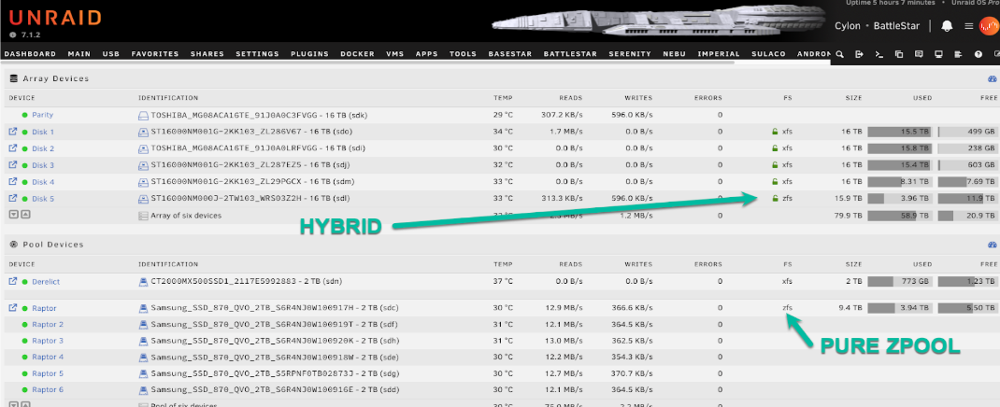
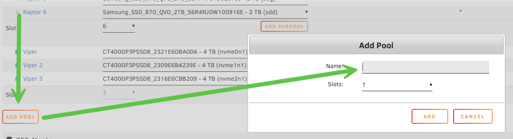
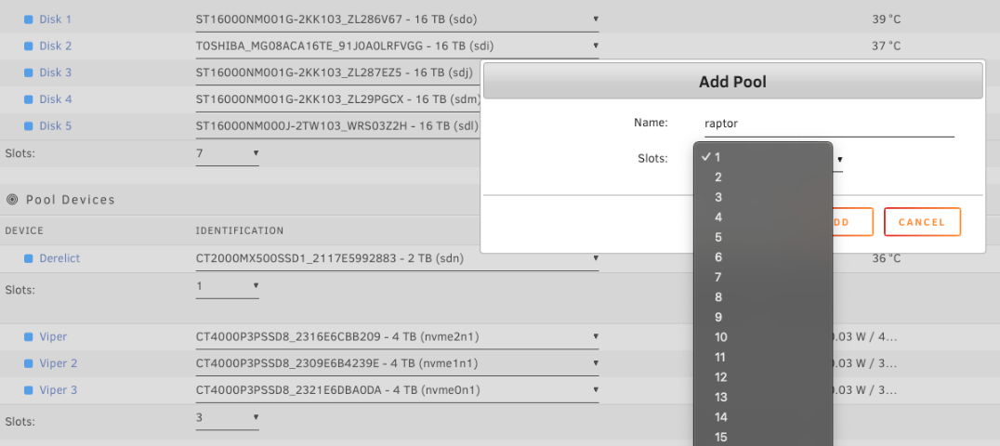
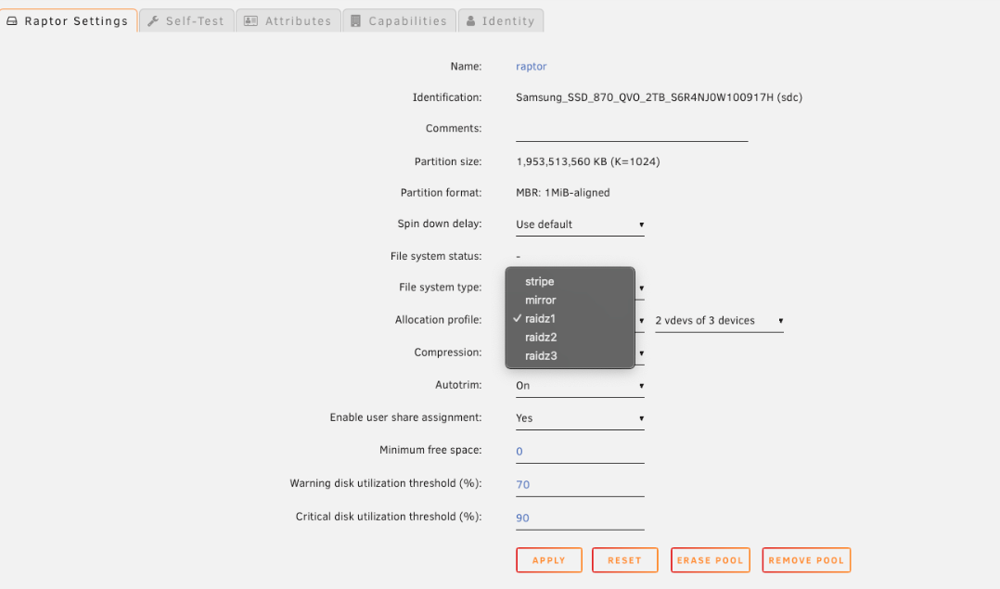
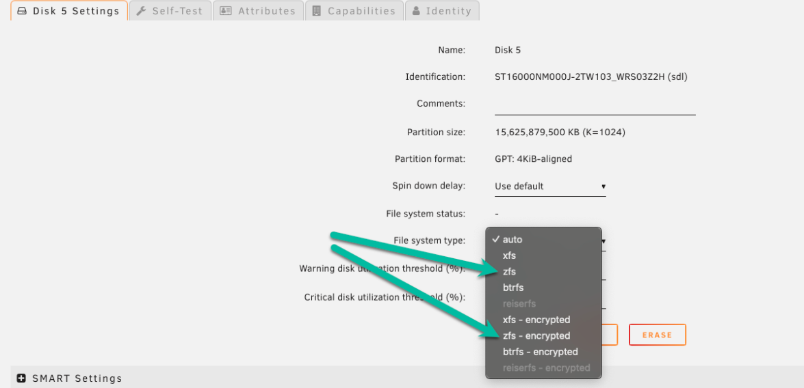
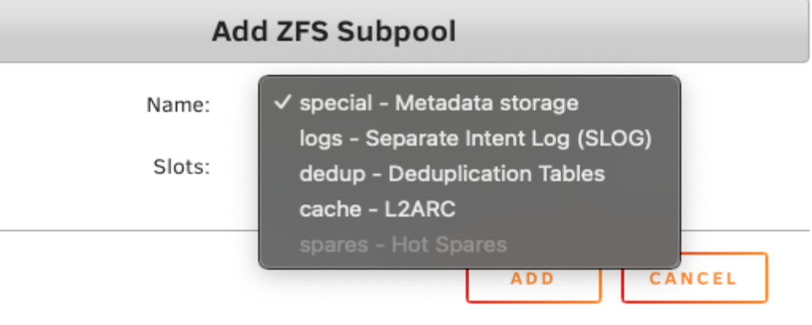

import Tabs from '@theme/Tabs';
import TabItem from '@theme/TabItem';

# ZFSストレージ

:::important[Special ありがとうございます]

この %%ZFS|zfs%% ストレージのドキュメントは、Ed Rawlings（[Spaceinvader One](https://www.youtube.com/c/SpaceinvaderOne)）の専門知識と案内をもとに作成されたものです。彼のチュートリアルと洞察は、数え切れないほどの Unraid ユーザーが高度なストレージ技術を習得する助けとなってきました。Unraid コミュニティへの継続的な貢献に感謝します。

:::

%%ZFS|zfs%% は、データ整合性、柔軟なストレージ構成、高いパフォーマンスを Unraid システムにもたらします。このガイドでは %%ZFS|zfs%% の基本概念を説明し、Unraid の %%WebGUI|web-gui%% から %%ZFS|zfs%% プールを直接管理する方法を案内します。新しく %%ZFS|zfs%% ストレージをセットアップする場合でも、既存のプールを取り込む場合でも、自信を持って始めるために必要な手順と背景知識が得られます。

---

## なぜ ZFS なのか？

%%ZFS|zfs%% は、データを保護し、破損を防ぎ、ストレージ管理を簡素化するよう設計された、最新のファイルシステム兼ボリュームマネージャーです。

%%ZFS|zfs%% では、次の利点があります:

- 自動データ整合性チェックと自己修復
- 標準搭載の %%RAID|raid%% サポート（ミラー、RAIDZ）
- 簡単なバックアップとロールバックのための %%Snapshots|snapshot%% とクローン
- 効率的なレプリケーションのための %%ZFS|zfs%% send/receive
- オン・ザ・フライの圧縮

Unraid supports %%ZFS|zfs%% for any storage pool. You can create a new %%ZFS|zfs%% pool, import one from another system, or use Unraid’s unique hybrid %%ZFS|zfs%% setup: add a %%ZFS|zfs%%-formatted disk directly to the Unraid %%array|array%% (not a pool) and combine %%ZFS|zfs%% features with Unraid’s %%parity|parity%% protection.

:::info\[Example]

%%ZFS|zfs%% の %%snapshots|snapshot%% とレプリケーションを 1 台のディスク上でバックアップ先として使うことも、または高速な SSD %%ZFS|zfs%% プールを Unraid の %%parity|parity%% で保護された %%array|array%% 上の %%ZFS|zfs%% ディスクへレプリケートすることもできます。両方の長所を活かせます。

:::

  

:::note

ハイブリッドな %%ZFS|zfs%%-in-array 方式は、特定のバックアップやレプリケーションの用途には有用ですが、完全な %%ZFS|zfs%% プールの代わりにはなりません。%%array|array%% 内の %%ZFS|zfs%% ディスクは個別に管理されるため、真の複数ディスク構成の %%ZFS|zfs%% プールが持つ統合されたパフォーマンス、冗長性、自己修復は得られません。%%ZFS|zfs%% の完全な機能を使うには、必ず専用の %%ZFS|zfs%% プールを使用してください。

:::

### プール、vdev、冗長性

%%ZFS|zfs%% プール（「zpool」と呼ばれます）は、1 つ以上の vdev（仮想デバイス）で構成されます。各 vdev は独自の冗長性レベルを持つ物理ディスクの समूहです。%%ZFS|zfs%% は vdev 間にデータを書き込みますが、障害耐性は各 vdev が担います。

:::caution

冗長性は常に vdev 単位です。どれか 1 つの vdev が故障すると、他の vdev が正常でもプール全体が失われます。vdev の構成は慎重に計画してください！

:::

  

---

## ZFS プールの作成

%%WebGUI|web-gui%% で %%ZFS|zfs%% プールを作成するには:

1. %%array|array%% を停止します。
2. **Poolを追加** をクリックします。

  

3. プールの名前を決めます（例: `raptor`）。
4. プライマリデータ vdev のディスク数に合わせてスロット数を設定します。

:::note

この初期スロット数はデータ vdev のみを対象としています。サポート vdev（log や cache ドライブなど）は、プール作成後に別途追加できます。

:::

  

5. ディスクをプールに割り当てます（ディスクの順序は関係ありません）。

  

6. プール名（例: `raptor`）をクリックして、設定画面を開きます。
7. ファイルシステムの種類を `zfs` または `zfs-encrypted`（LUKS 暗号化用）に設定します。

  

8. アロケーションプロファイルを選択します。これによってプールの冗長性とパフォーマンスが決まります。

:::tip

確定する前に、アロケーションプロファイルとトポロジーの項目を確認し、最適な選択を行ってください。

:::

  

  

9. 必要に応じて圧縮を有効にします（ほとんどのワークロードで推奨）。
10. **Done** をクリックしてから、%%array|array%% を開始します。

---

## アレイに ZFS ディスクを追加する（ハイブリッド構成）

スタンドアロンの %%ZFS|zfs%% ディスクを Unraid の %%array|array%%（%%ZFS|zfs%% プールではありません）に追加して、%%ZFS|zfs%% の機能と Unraid の %%parity|parity%% 保護を組み合わせることができます。

:::info[What これにより有効になります]

- **Parity protection:** ZFS ディスクは Unraid の %%array|array%% の %%parity|parity%% によって保護され、1 台（または、%%parity drives|parity-drives%% に応じて複数台）のディスク障害からデータを安全に守ります。

- **Data integrity:** %%ZFS|zfs%% はブロック単位の整合性チェック（チェックサム）を提供します。単一ディスクではビット腐敗を自己修復できませんが、%%ZFS|zfs%% は破損を検出して通知するため、静かにデータが失われる前にバックアップから復元できます。

- **%%ZFS|zfs%% features:** このディスクでは %%ZFS|zfs%% の %%snapshots|snapshot%% とレプリケーションを利用でき、バックアップ先、特定のデータセット、または従来の Unraid ストレージと併用して %%ZFS|zfs%% 機能を使いたい場合に最適です。

:::

%%ZFS|zfs%% ディスクを %%array|array%% に追加するには:

1. %%WebGUI|web-gui%% の **Main** タブに移動します。
2. %%array|array%% を停止します。
3. **Array Devices** の下にある空きスロットをクリックします。
4. 追加したいディスクを選択します。

  

5. **File system** で `zfs` または `zfs-encrypted` を選択します。

  

6. **Apply** をクリックします。
7. %%array|array%% を開始し、必要であればディスクをフォーマットします。

---

## アロケーションプロファイルの選択

%%ZFS|zfs%% プールをセットアップすると、アロケーションプロファイルによってデータの保護方法、プールの性能、拡張方法が決まります。どのプロファイルが要件に合うかを判断するため、簡単な比較を以下に示します。

  

| プロファイル | 冗長性                       | パフォーマンス                                      | 拡張           | 容量効率 | 一般的な用途                 | vdevごとの推奨ドライブ数       |
| ------ | ------------------------- | -------------------------------------------- | ------------ | ---- | ---------------------- | -------------------- |
| Stripe | なし                        | 高速だが危険                                       | ディスクを追加      | 100% | 一時的なデータ／スクラッチストレージ     | 任意の数                 |
| ミラー    | 1:1（%%RAID 1\|raid1%% 形式） | ランダム I/O に最適                                 | ミラーを追加       | 50%  | 高性能、拡張しやすい             | 2台のドライブ（さらにミラーを追加可能） |
| RAIDZ1 | vdev あたり 1 台のディスク         | 大きなファイルに高速。小さな書き込みやランダム書き込みには不向き。            | 新しい vdev を追加 | 高    | 一般用途、1 ディスク故障耐性        | 3～6台のドライブ（最大8台）      |
| RAIDZ2 | vdev あたり 2 台のディスク         | Z1 に似ていますが、書き込みオーバーヘッドが少し大きくなります（追加のパリティのため） | 新しい vdev を追加 | 中程度  | 重要なデータ、2 ディスク故障耐性      | 6～12台のドライブ（最大14台）    |
| RAIDZ3 | vdev あたり 3 台のディスク         | Z2 に似ていますが、書き込みオーバーヘッドがさらに増えます（最大限の安全性のため）   | 新しい vdev を追加 | 低    | ミッションクリティカル、3 ディスク故障耐性 | 10～16台のドライブ（最大20台）   |

:::tip[Optimizing ドライブ数]

上の表に示した推奨ドライブ数は、ほとんどのユーザーに適しています。さらに性能を高めたい場合は、データディスク数（総ディスク数からパリティディスク数を引いた数）が **2の累乗**（例: 2、4、8、16）になる構成を選ぶことで、これらの範囲内で最適化できます。これにより、データストライプの配置が正しくそろい、無駄な空き容量や不均一な I/O を防げます。

**最適化された構成の例:**

- **RAIDZ1**: 3、5、または9台のドライブ（データディスク = 2、4、または8）
- **RAIDZ2**: 4、6、または10台のドライブ（データディスク = 2、4、または8）
- **RAIDZ3**: 5、9、または17台のドライブ（データディスク = 2、6、または14）

これらの最適化は任意です。上記の推奨は、ほとんどの用途で問題なく機能するはずです。

:::

:::important[How を選ぶ]

- 最高のパフォーマンスと、簡単で柔軟な拡張を重視し、冗長性のためにより多くのディスク容量を使ってもよいなら、**Mirror** を使用してください。
- 使用可能容量を最大化して大きなファイルを保存したいなら **RAIDZ1/2/3** を選びましょう。ただし、拡張の柔軟性は低く、ランダム書き込み性能も低めです。
- **Stripe** は、重要でない一時データにのみ適しています。いずれか 1 台でもディスクが故障すると、すべて失われます。

:::

---

## トポロジーと拡張

ディスクを vdev にどうまとめるかは、データ保護と速度の両方に影響します。

  

- すべてのディスクを大きな RAIDZ2 vdev にまとめれば、2 台までのディスク障害であればデータを失わずに済みます。ただし、拡張するには別の完全な vdev を追加する必要があります。
- 複数の小さな RAIDZ1 vdev に分けると、並列性能は向上します。ただし注意が必要です。同じ vdev 内で 2 台のディスクが故障すると、プール全体を失います。
- %%ZFS|zfs%% は個々のディスクではなく vdev 間でデータをストライプするため、vdev が多いほど、小さなファイルが多いワークロードやランダム I/O でより高いパフォーマンスを発揮することがあります。
- %%ZFS|zfs%% プールの拡張は、通常、単一ディスクを追加するのではなく、同じ構成の新しい vdev を追加することを意味します。

:::tip

将来の拡張も見据えて、プールのレイアウトを計画してください。Unraid の %%array|array%% とは異なり、%%WebGUI|web-gui%% から既存の vdev に 1 台のディスクを追加することはできません。

:::

---

## 圧縮と RAM

%%ZFS|zfs%% は、Unraid のストレージ効率とパフォーマンスを大幅に向上させる高度な機能を備えています。よく話題になるのは、圧縮とメモリ要件です。

%%ZFS|zfs%% の圧縮は透過的です。バックグラウンドで動作し、ディスクに到達する前にデータを圧縮します。

これには 2 つの大きな利点があります:

- **ディスク使用量の削減:** 消費するストレージ容量が少なくなります。
- **パフォーマンスの向上:** 書き込み・読み込みするデータ量が減るため、特に最新 CPU では処理が高速になることがあります。

  

:::tip

ほとんどの Unraid %%ZFS|zfs%% プールでは %%ZFS|zfs%% 圧縮を有効にしてください。安全で効率が良く、互換性や安定性への影響もほとんどありません。

:::

  
<strong>ZFS の RAM 神話</strong> - クリックして展開/折りたたみ

  古い情報として、「%%ZFS|zfs%% にはストレージ 1 TB あたり 1 GB の RAM が必要」という話を見聞きしたかもしれません。これは現在のほとんどのユーザーには当てはまりません。%%ZFS|zfs%% は RAM を Adaptive Replacement Cache（ARC）に利用し、頻繁にアクセスされる読み取りを高速化します。

  Unraid は、%%ZFS|zfs%% がシステム RAM の適切な割合（通常は総 RAM の 1/8）だけを使うよう自動的に制限します。これにより、Docker コンテナ、%%VMs|vm%%、または Unraid OS に影響を与えることなく、%%ZFS|zfs%% を高い性能で動作させることができます。

  

    
  

:::info

%%ZFS|zfs%% は利用可能なメモリに応じてよくスケールします。RAM が多いほどキャッシュ性能は向上しますが、%%ZFS|zfs%% は少ないハードウェアでも安定して動作します。古い推奨事項に惑わされて、Unraid で %%ZFS|zfs%% を使うのをためらう必要はありません。

:::

---

## 他のシステムで作成された ZFS プールのインポート

Unraid は、他のプラットフォームで作成された %%ZFS|zfs%% プールを最小限の手間でインポートできます。

  
<strong>ZFS プールをインポートする方法</strong> - クリックして展開/折りたたみ

  1. **Array を停止:** Unraid の %%array|array%% が停止していることを確認します。
  2. **新しいプールを追加:** **Add Pool** をクリックします。
  3. **すべてのドライブを割り当てる:**
     - **Number of Data Slots** を、%%ZFS|zfs%% プール内の総ドライブ数（データ vdev とサポート vdev を含む）に設定します。
     - 各ドライブを正しいスロットに割り当てます。
     - *例:* 4 台構成のミラー vdev と 2 台構成の L2ARC vdev を持つプールでは、6 スロットに設定して 6 台すべてのドライブを割り当てます。
  4. **ファイルシステムを「Auto」に設定:** プール名（例: `raptor`）をクリックし、**File System** を **Auto** に設定します。
  5. **完了して array を開始:** **Done** をクリックしてから、%%array|array%% を開始します。

  :::info[自動検出]
  Unraid は %%ZFS|zfs%% プールを自動的に検出してインポートします。サポート vdev（log、cache/L2ARC、special/dedup など）は、%%WebGUI|web-gui%% の **Subpools** に表示されます。インポートを開始した後で、サブプールを別途追加する必要はありません。必要なドライブがすべて割り当てられていれば、Unraid がメインのデータディスクと一緒に自動で取り込みます。
  :::

  インポート後は、データ整合性を確認するために %%scrub|scrub%% を実行することを強く推奨します。

  - プール名（例: `raptor`）をクリックして、設定を開きます。
  - **Pool Status** で状態を確認し、**Scrub** をクリックします。

  

    
  

---

## サポート vdev（サブプール）

Unraid では、%%ZFS|zfs%% のサポート vdev をサブプールと呼びます。ほとんどのユーザーには**不要**ですが、高度なユーザーはこれらに遭遇することがあります:

  

| サポート vdev（サブプール）  | 目的                             | リスク/注意点                                           |
| ----------------- | ------------------------------ | ------------------------------------------------- |
| Special vdev      | メタデータと小さなファイルを保存               | 失われるとプールは読み取れなくなります。                              |
| Dedup vdev        | 重複排除を有効化                       | 大量の RAM を必要とし、ほとんどのユーザーには危険です。専門的な用途がない限り避けてください。 |
| Log vdev（SLOG）    | 同期書き込み性能を改善                    | オプション。特定のワークロードでのみ有効です。                           |
| Cache vdev（L2ARC） | SSD ベースの読み取りキャッシュを提供           | オプション。大きな作業セットでは読み取り速度を改善できます。                    |
| Spare vdev        | Unraid ではサポートされていません（7.1.2 時点） |                                                   |

:::caution

ほとんどの Unraid ユーザーは、特定の目的を十分理解している場合を除き、サポート vdev／サブプールを避けるべきです。これらは特殊なワークロード向けに設計されており、誤用すると複雑さやリスクを招くことがあります。

:::

---

## インポート時に割り当てられなかった重要なサポート vdev ドライブ

%%ZFS|zfs%% プールを Unraid にインポートする際は、サポート vdev に使用されていたものも含め、元のプールのすべてのドライブをプールのスロットに割り当てる必要があります。%%array|array%% が開始されると、Unraid は各ドライブの役割（data、log、cache、special、dedup）を自動的に認識します。どのドライブが何の役割かを手動で指定する必要はありません。

インポート時にサポート vdev の一部だったドライブを割り当て忘れた場合、結果はその vdev の機能によって異なります:

| vdev の種類                    | インポート時にドライブが欠けている場合            | 結果                                                                           |
| --------------------------- | ------------------------------ | ---------------------------------------------------------------------------- |
| Special vdev または dedup vdev | プールはインポートされないか、使用できなくなります      | これらの vdev は重要なメタデータまたは重複排除テーブルを保存します。これらがないと、%%ZFS\|zfs%% は安全にプールをマウントできません。 |
| Log（SLOG）vdev               | プールはインポートされますが、同期書き込み性能は低下します。 | プール自体は引き続き利用できますが、同期書き込みに依存するワークロードでは性能低下が見られる場合があります。                       |
| Cache（L2ARC）vdev            | プールはインポートされますが、読み取りキャッシュは失われます | プールは通常どおり動作しますが、L2ARC キャッシュによる性能向上は失われます。データは失われません。                         |

:::tip

Unraid にインポートする際は、元の %%ZFS|zfs%% プールのすべての物理ドライブ（すべてのサポート vdev を含む）を必ず割り当ててください。これにより、検出と統合がスムーズになります。Unraid で新しく作成するプールでは、サポート vdev は任意であり、通常はほとんどのユーザーに必要ありません。

:::

---

## ストレージの拡張

%%ZFS|zfs%% は強力ですが、そのストレージ拡張の仕組みを理解しておくことが重要です。特に将来の増設を見据えている場合はなおさらです。

従来、%%ZFS|zfs%% の vdev は固定幅です。既存の RAIDZ vdev にディスクを 1 台追加して大きくすることはできません。

プールを拡張する方法には次のようなものがあります:

- **新しい vdev を追加する:** 別の vdev（新しいミラーや RAIDZ グループなど）を追加してプールを拡張します。これにより容量は増えますが、vdev の構成に合った単位でディスクを追加する必要があります。
- **より大容量のドライブに交換する:** vdev 内の各ドライブを、1台ずつより大きいディスクに交換します。詳細な手順は[ドライブ交換](../../using-unraid-to/manage-storage/array/replacing-disks-in-array.mdx#replacing-faileddisabled-disks)を参照してください。すべてのドライブを交換してプールが再計算されると、vdev の容量が増加します。
- **新しいプールを作成する:** 新しい %%ZFS|zfs%% プールを用意すると、異なるデータ種別やワークロードを整理して独立して管理できます。

:::tip[Planning 先を見据えて]

プールを構築する前に、今だけでなく将来に必要になるストレージ容量を考えてください。%%ZFS|zfs%% は、特に後から大掛かりなアップグレードを避けたい場合に、綿密な計画に応えてくれます。

:::

---

## 既存の Unraid サーバーで ZFS プールを使う

従来の Unraid %%array|array%% を運用していて %%ZFS|zfs%% プールを追加したい場合、統合するための効果的な方法をいくつか紹介します:

| ユースケース                                     | 説明                                                                                                                                                                          | 詳細 / 例                                                           |
| ------------------------------------------ | --------------------------------------------------------------------------------------------------------------------------------------------------------------------------- | ---------------------------------------------------------------- |
| appdata と Docker 用の高速 SSD/NVMe プール         | Store the appdata share for fast, responsive containers and databases. This supports %%snapshot\|snapshot%%s for easy rollbacks and can also host %%VM\|vm%%s for high I/O. | 多くのユーザーはこれに 2 台構成の %%ZFS\|zfs%% ミラーを選びます。拡張しやすく、優れた性能を発揮します。     |
| 重要なデータ用の %%ZFS\|zfs%% プール                  | 写真、税務記録、%%user share\|user-share%% データのような代替のきかないファイルには、%%ZFS\|zfs%% ミラーまたは RAIDZ2 プールを使用します。%%ZFS\|zfs%% は破損を検出し、冗長性によって自己修復します。                                           | この構成は、自動整合性チェックと自己修復機能で重要なデータを保護します。                             |
| 日次バックアップまたはレプリケーション先                       | %%ZFS\|zfs%% ディスク（Unraid の %%array\|array%% 内でも可）をレプリケーション先として使用します。別のプールや他の Unraid サーバーからローカルにレプリケートできます。                                                                  | `zfs send/receive` や Syncoid などのツールを使って、高速で信頼性の高いバックアップと復元を行えます。 |
| %%Snapshot\|snapshot%%-based recovery pool | Keep point-in-time %%snapshot\|snapshot%%s of critical data or containers. %%snapshot\|snapshot%%s can be auto-scheduled and are space-efficient.                           | この機能により、誤削除や設定ミスからすばやく復旧できます。                                    |

## よくある ZFS のミスを避ける

%%ZFS|zfs%% は強力なファイルシステムですが、その利点を損なう一般的な落とし穴がいくつかあります。より快適に使うため、プールを構成する前に次の点を押さえておくことが重要です:

- **RAIDZ におけるドライブ容量の不一致:** %%ZFS|zfs%% は、RAIDZ vdev 内のすべてのディスクを最小容量のディスクに合わせて扱います。最も効率よく使うには、各 vdev 内で同じ容量のドライブを必ず使用してください。

- **%%WebGUI|web-gui%% での RAIDZ vdev の拡張:** Unraid 7.1.x 以降ではコマンドライン経由で RAIDZ の拡張がサポートされていますが、この機能はまだ %%WebGUI|web-gui%% では利用できません。現時点では CLI で拡張するか、GUI で新しい vdev を追加してください。

- **%%ZFS|zfs%% disk vs. full zpool:** A single %%ZFS|zfs%%-formatted disk in the Unraid %%array|array%% does not offer the redundancy or features of a dedicated %%ZFS|zfs%% pool. To leverage advanced functionality, use standalone pools.

- **十分な RAM がない状態での重複排除:** 重複排除には大量のメモリが必要で、十分な RAM がないまま有効にするとパフォーマンスに深刻な影響を与える可能性があります。要件を十分理解している場合にのみ重複排除を有効にしてください。

- **vdev の冗長性はローカル:** %%ZFS|zfs%% の冗長性は各 vdev 内に限定され、プール全体で共有されるわけではありません。必要な耐障害性を得られるよう、vdev のレイアウトを計画してください。
