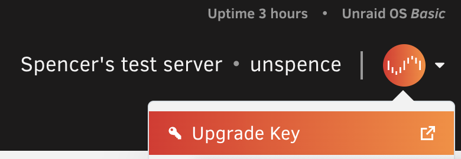

# 许可

## 我永久拥有我的软件许可吗？

当您购买Unraid OS许可时，您将永久拥有该软件的副本。但根据您购买的许可证类型，可能需要付费获得更新。

## 如何购买Unraid？

有两个方法可以购买Unraid：

1. 如果您已经开始试用，您可以从Unraid内的右上角下拉菜单购买许可和升级。
2. 您可以通过上方的"立即购买"按钮购买Unraid许可"激活码"，并[稍后激活](https://docs.unraid.net/unraid-os/faq/licensing-faq/#how-to-redeem-a-license-activation-code)您的许可。激活码不会过期。
激活码仅可用于一台服务器（跟随引导设备）。所有交易不接受退款申请，因此请在购买前充分试用，我们提供30天的免费试用！

## 如何兑换许可激活码

首先，通过[我们的网站](https://unraid.net/pricing)购买激活码。您的唯一激活码将列在您的购买收据上。

接下来，按照我们的[入门指南](../getting-started/getting-started.md)设置Unraid服务器。

一旦您的服务器启动并运行：

登录到您的Unraid服务器的WebGUI。（默认情况下，Mac上为`http://tower`或`http://tower.local`）
对于Unraid 6.10及更新版本，从WebGUI右上角登录您的Unraid.net账户（或创建一个），然后选择"兑换激活码"并输入激活码以激活您的许可。对于Unraid 6.9及更早版本，在WebGUI中导航到工具 -> 注册页面，然后单击"购买密钥"。
选择您通过激活码购买的相应许可，并在"您的激活码"框中输入激活码以完成激活过程。您的激活码将通过电子邮件发送给您，并附有安装说明！注意：激活码仅可使用一次，用于生成您的Unraid许可密钥文件。
如果您在上述过程中有任何问题或疑问，还有一个视频教程：[激活码兑换教程](https://www.loom.com/share/3ceb40440240474aaa80a0b7e3e69cb2)

## 如何升级我的Unraid许可？

如果您想要或需要将您的许可升级到更高级别，可以通过OS WebGUI中的工具 → 注册页面或通过页面右上角进行升级。

**Unraid Starter**允许最多连接 _6个存储设备1_。

**Unraid Unleashed**允许连接 _无限2个存储设备1_。

**Unraid Lifetime**允许连接 _无限2个存储设备1_。

Starter和Unleashed的年度延期费用：$36
关于年度延期费用的详细信息请参考[下文](#unraid-os是一项订阅服务吗)

许可升级价格如下：

* Starter → Unleashed：_$69 USD_
* Starter → Lifetime：_$209 USD_
* Unleashed → Lifetime：_$149 USD_
* Basic → Unleashed：_$49 USD_
* Plus → Unleashed：_$19 USD_
* Basic → Plus：_$59 USD_
* Basic → Pro：_$99 USD_
* Plus → Pro：_$69 USD_

1 <b>连接的存储设备</b>指的是在启动阵列之前允许连接到服务器的存储设备总数，不包括USB闪存启动设备。基于许可类型，软件中_没有其他限制_。
价格可能会_随时_发生变化。

2 <b>无限设备</b>请参见[下文](#无限对于连接的存储设备意味着什么)

## Unraid OS是一项订阅服务吗？

不是——我们也不喜欢强制订阅。一旦您购买了许可，您就拥有它。
您购买Starter或Unleashed包含一年免费更新，而Lifetime许可包含终身更新。
一年后，可选的$36许可延期费用将让您获得额外一年的OS更新。
不想付费？没问题。您仍然拥有您的许可，只是会停留在当前版本的Unraid，除非或直到您再次支付延期费用。

## 如果我不延长我的Starter或Unleashed许可会发生什么？

当您购买Starter或Unleashed许可时，您会自动获得一年的Unraid OS更新。
如果您选择不延长，您仍然拥有当前版本的软件副本，但您的更新资格会发生变化。详情请参阅下一个常见问题。

## 如果我不延长我的Starter或Unleashed许可，我还能收到安全更新吗？

如果您的许可延期失效（即您不支付年费），您可以下载与失效时可用的相同次要OS版本内的补丁版本。

我们的版本命名约定为：`<主要>.<次要>.<补丁>`。

例如：当您的延期失效时，您的系统有资格使用Unraid 7.1.0。您有资格获得Unraid 7.1.x系列的剩余补丁版本。
一旦Unraid 7.2.0发布，7.1.x补丁版本将只包含安全补丁。一旦Unraid 7.3发布，版本7.1.0将结束生命周期，将不会有更多的7.1.x更新。

## 什么是预发布版本？

测试版和发布候选版(RC)是预发布版本，可能包含错误或意外行为。您的反馈有助于我们识别问题、实施修复并改进Unraid OS。

重要指南：

* 仅在非生产系统上安装预发布版本
* 预发布版本是临时的，不适合长期使用
* 预发布版本的支持将在稳定版本发布时结束

许可要求：

* 您的许可必须在发布日期有资格获得OS更新才能更新到稳定版本
* 如果您的许可在稳定版发布前过期您可以：
  * 延长您的许可以接收稳定版本
  * 回滚到您的许可支持的稳定版本

您的Unraid许可在过期后仍然有效——许可证过期只会影响您获取新版本。

## 如果我选择在以后延长我的Starter或Unleashed许可会怎样？

没问题—只需支付延期费用并重新加入（按当时的延期价格）。

## "无限"对于连接的存储设备意味着什么？

Unraid Pro、Unleashed和Lifetime许可支持奇偶校验保护阵列中最多30个存储设备（28个数据和2个奇偶校验）和最多35个命名池，每个[缓存池](/unraid-os/release-notes/6.9.0.md#multiple-pools)最多60个存储设备。
其他存储设备仍然可以直接被其它Unraid功能使用，如[虚拟机](../manual/vm/vm-management.md)或未分配设备插件。

## 如果我的U盘损坏会怎样？我需要重新购买许可吗？

如果您的USB闪存启动设备损坏，您可以随时[将您的许可转移](/unraid-os/manual/changing-the-flash-device/)到新的USB闪存设备，您每12个月可以转移一次许可。

如果您需要在12个月内再次进行许可转移，[您需要联系我们](https://unraid.net/contact)，我们将手动转移您的许可。请在[您的支持工单](https://unraid.net/contact)中提供旧的和新的USB GUID。

**重要提示：**请确保您定期备份您的USB设备！
我们建议使用[Unraid Connect](/connect/flash-backup.md)进行备份。

## 如何手动将我的许可密钥文件安装到我的USB驱动器？

首先，确保您通过主界面 → 引导设备 → Flash -> U盘(Flash)备份对您的USB驱动器进行了最近的备份。

要手动安装许可密钥，首先将密钥文件（.key文件）保存到另一台PC/Mac。

接下来：

1. 关闭服务器，移除USB驱动器并将其插入刚才保存密钥文件的计算机中。
2. 打开USB驱动器目录，并将.key文件拖放到/config目录中。请确保这是唯一存在的.key文件（删除任何其他.key文件）。
3. 最后，安全弹出/移除闪存，将其重新插入您的服务器中并重启服务器。

或者，如果您的服务器正在运行，且您的闪存共享在网络上可见，请在网络下导航到闪存共享，并将注册密钥文件拖到config目录中。接下来，使用WebGUI，**停止**阵列，然后再次**启动**阵列。

## 我在注册我的U盘时遇到错误："####-####-####-#############"已经注册给另一个用户。我该怎么办？

您尝试用于Unraid OS的U盘没有唯一ID，因此不符合注册资格。请尝试更换另一个U盘。下列品牌的U盘通常是可用的：Lexar、Samsung、Kingston或PNY。

## 如何确定我拥有什么类型的许可？

很简单！在工具 → 注册页面，您可以查看您当前的密钥类型和注册信息。

## Unraid OS试用

### Unraid试用版如何工作？

试用许可持续30天，提供Unraid Pro许可的全部功能，没有连接存储设备限制。

要开始，您必须准备好一个高质量的USB驱动器并下载我们的USB创建工具。然后，按照我们的入门指南，几分钟内即可启动并运行。试用许可在服务器启动时需要互联网连接进行验证。

### 我可以将我的试用密钥转移到新的闪存设备吗？

不可以。试用注册仅在启动试用的USB闪存设备上有效。如果您希望购买许可，您可以将您的试用配置转移到新的闪存设备，然后购买注册密钥，但在不购买的情况下，您不能继续在新的USB闪存设备上使用试用配置。

### 如何延长我的Unraid试用期？

您知道可以延长Unraid的[30天免费试用期](https://unraid.net/download)吗？硬件可能不适合、东西可能会坏掉、生活中有各种情况发生。我们理解这一点。

若您的原始试用在页面左上角显示"已过期"，而您想要继续试用Unraid请先停止阵列，然后前往**注册**页面。此时会出现一个按钮，您可以选择它来获得15天的延期。您总共可以延期两次。

:::important

如果您希望保留配置，则不能更换Unraid试用版的USB闪存设备。

::: 

## 我是代表客户购买许可的经销商/OEM：我该如何做？

您需要[通过Unraid WebGUI购买许可](#how-do-i-purchase-unraid)或者您可以[通过网站购买激活码](https://unraid.net/pricing)。

在结账时，您将看到三个选项：

* 个人
* 企业/组织
* OEM

选择"OEM"，输入您的购买详情，然后在客户部分输入您客户的姓名和电子邮件地址。购买将由您完成，但许可密钥将关联到您的客户并发送给他们。完成结账后还将提供发票下载链接。

对于10个或更多许可的批量OEM/经销商定价，[请联系我们](https://unraid.net/contact)！ 