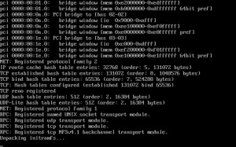

# 高级 BIOS 配置

正确配置主板 BIOS（以及存储控制器）是确保 Unraid 系统稳定运行的重要步骤。基本指导原则如下：

* 必须将 USB 闪存设备设为首选启动设备（大多数主板支持此功能）
* 存储控制器应支持 AHCI 和 SATA 连接，并配置为标准 HBA 模式（非 RAID 模式）
* 若硬件支持虚拟化技术或您需要创建虚拟机，请启用 BIOS 中所有虚拟化支持选项（Intel VT-x / AMD-V）
* 若硬件支持 IOMMU 或您需要为虚拟机分配物理 PCI 设备（显卡、媒体控制器、USB 控制器等），请启用 BIOS 中的 IOMMU 支持
* 优先使用主板 I/O 面板上的 USB 接口（机箱后部的 USB 接口），避免使用机箱前置 USB 接口

若完成 BIOS 配置后仍无法正常启动 Unraid，请尝试以下操作：

* 按以下顺序设置启动优先级：Forced-FDD → USB-HDD → USB-ZIP
* 尝试禁用 USB 2.0/3.0 支持（将默认使用 USB 1.1）
* 尝试启用或禁用快速启动功能
* 尝试启用或禁用 USB 键盘支持

若仍无法启动系统，请在我们的[通用支持论坛](https://forums.unraid.net/forum/index.php?board=71.0)发帖求助。

:::important

许多主板在启动设备选择时最多仅支持 12 块硬盘。这对 Unraid OS 通常不是问题。但若 BIOS 将闪存设备识别为硬盘，当您安装第 12 块"真实"硬盘后可能无法从闪存设备启动。为避免此问题，请尽量在 BIOS 中将闪存设备设置为可移动存储设备。

:::