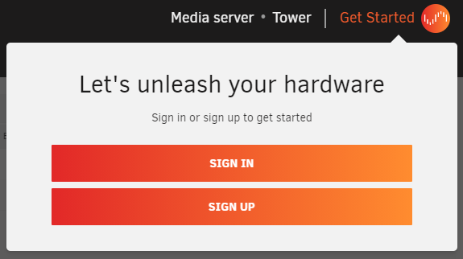

# 快速安装指南

## 使用Unraid OS创建可启动介质

1. 将优质的USB闪存设备插入Mac或PC
2. 下载[USB闪存创建工具](https://unraid.net/download)，将Unraid OS安装至USB设备，或使用[手动安装方法](./manual-install-method.md)
3. 将USB设备从PC拔出并插入服务器
4. 进入服务器BIOS设置并进行以下调整：
    * 配置系统从USB设备启动
    * 启用硬件虚拟化相关功能（包括IOMMU）  
      更多BIOS配置细节请参考[高级BIOS配置指南](./advanced-bios-config.md)
5. 保存BIOS设置并退出以启动Unraid OS

## 配置Unraid OS

系统启动后，可通过基于浏览器的管理界面（WebGUI）完成配置。

### 连接WebGUI管理界面

两种连接方式：
* 以图形界面模式启动Unraid并使用默认账号登录（用户名为`root`，默认无密码）
* 在电脑浏览器地址栏输入`http://tower.local`

:::important

Unraid服务器启动后即可通过局域网访问。您也可以在浏览器直接输入服务器IP地址访问。  
若在USB创建工具中设置了不同主机名，请将`tower`替换为您设置的主机名。

:::

### 设置root密码

首次登录WebGUI会强制要求设置高强度root密码  

建议密码满足：至少8个字符，包含字母、数字和符号，不要使用弱密码。推荐使用密码管理器生成。

:::tip

忘记密码？[重置指南](../manual/users/reset-password.md)  
修改密码？[账户管理指南](../manual/users/manage-user.md#modify-a-user-account)

:::

### 注册与安装许可证

设置密码后需登录Unraid.net获取许可证：

1. 点击WebGUI右上角**Get Started**区域的**Sign in**或**Sign up**  
   
2. 登录后系统将自动下载安装试用密钥  
     
   您的Unraid帐户将自动关联许可证管理（获取试用/购买/恢复/更换/升级密钥）。

:::important

Unraid 6.9及更早版本需通过***Tools > Registration***注册试用/购买密钥

:::

### 分配存储设备至阵列与缓存池

通过WebGUI的***主页面***标签页分配设备：  

设备类型说明：
* **阵列设备**：
    - 奇偶校验盘：提供数据冗余保护（最多2个）
    - 数据盘：存储用户文件
* **缓存池设备**：高速缓存设备（建议SSD），用于临时存储加速读写
* **启动设备**：存放Unraid系统的USB闪存盘

分配建议：
* 奇偶校验盘应选择最大容量硬盘（未来添加数据盘时不可超过校验盘容量）
* 阵列中SSD支持尚处实验阶段（建议仅将固态硬盘用于缓存池）
* 单设备缓存池无数据保护，建议使用多设备组成RAID缓存池
* SSD缓存池特别适合应用/虚拟机加速

:::important

阵列设备数量不得超过[许可证](https://unraid.net/pricing)授权限制

:::

### 启动阵列与格式化设备

完成分配后点击**磁盘阵列操作**区域的**启动**启动阵列。

新设备需格式化后方可使用：
* 默认使用XFS文件系统（缓存池自动使用BTRFS）
* 勾选**Format**确认提示后执行格式化
* 后台将执行奇偶校验同步（同步期间阵列处于无保护状态，建议等待同步完成再写入数据）

### 停止阵列/关机/重启

在***主页面***的**磁盘阵列操作**区域选择对应操作按钮。

### 通过Unraid Connect管理服务器

[Unraid Connect](../connect/index.md)插件（通过应用市场安装）提供：
* 统一管理多台服务器的[控制面板](https://connect.myunraid.net/)
* 使用Unraid.net账号进行安全云端管理
* 隐私政策详见[隐私条款](../connect/privacy.md)

### 获取帮助

安装遇到问题？查看[安装常见问题解答](../faq/installation.md)！